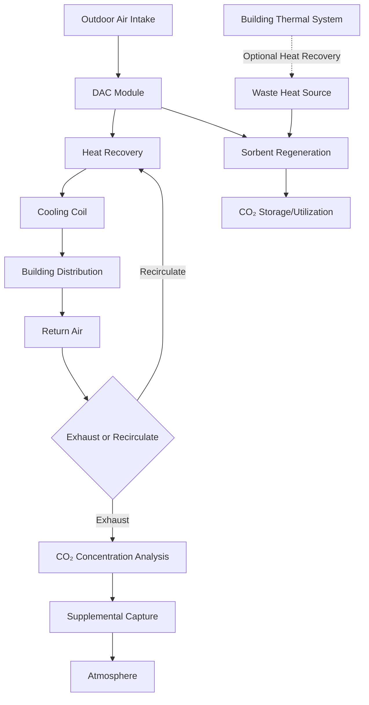

# Carbon Sequestration in HVAC Systems

Carbon sequestration technologies integrated with HVAC systems represent an emerging approach to achieve net-negative carbon emissions in buildings. These systems actively remove CO₂ from the atmosphere or capture it from building exhaust streams, converting atmospheric carbon into stable forms for long-term storage.

## Direct Air Capture Integration

Direct air capture (DAC) systems can be integrated with building HVAC equipment to remove CO₂ directly from ventilation air streams. The fundamental mass transfer equation governing CO₂ absorption is:

$$N_{CO_2} = k_L a (C_{bulk} - C_{interface})$$

Where:
- $N_{CO_2}$ = CO₂ mass transfer rate (kg/m³·s)
- $k_L$ = liquid-phase mass transfer coefficient (m/s)
- $a$ = interfacial area per unit volume (m²/m³)
- $C_{bulk}$ = bulk CO₂ concentration (kg/m³)
- $C_{interface}$ = interfacial CO₂ concentration (kg/m³)

### Absorption Technologies

| Technology | Capture Efficiency | Energy Penalty | Regeneration Temperature | Chemical Stability |
|------------|-------------------|----------------|-------------------------|-------------------|
| Amine scrubbing | 85-95% | 2.5-4.0 GJ/tCO₂ | 120-150°C | Moderate (degradation) |
| Solid sorbent | 75-90% | 1.8-3.2 GJ/tCO₂ | 80-120°C | High |
| Membrane separation | 60-85% | 1.2-2.8 GJ/tCO₂ | N/A | Very high |
| Cryogenic separation | 90-98% | 2.0-3.5 GJ/tCO₂ | -100 to -50°C | N/A |

The energy required for DAC scales with atmospheric CO₂ concentration according to thermodynamic limits:

$$W_{min} = RT \ln\left(\frac{P_{pure}}{P_{atm}}\right)$$

Where:
- $W_{min}$ = minimum separation work (kJ/mol)
- $R$ = universal gas constant (8.314 J/mol·K)
- $T$ = absolute temperature (K)
- $P_{pure}$ = pure CO₂ pressure (Pa)
- $P_{atm}$ = atmospheric CO₂ partial pressure (Pa)

At 420 ppm atmospheric CO₂, the theoretical minimum energy is approximately 20 kJ/mol (250 kJ/kg CO₂). Practical systems require 1,500-2,500 kJ/kg due to thermodynamic inefficiencies.

## HVAC System Integration Strategies

### Integration Points

**Supply Air Path**: DAC modules positioned upstream of cooling coils reduce CO₂ concentration in ventilation air from 420 ppm to 200-300 ppm. This approach provides continuous sequestration proportional to ventilation rate:

$$\dot{m}_{CO_2} = \dot{V} \cdot \rho \cdot (C_{in} - C_{out})$$

Where:
- $\dot{m}_{CO_2}$ = CO₂ capture rate (kg/s)
- $\dot{V}$ = ventilation rate (m³/s)
- $\rho$ = air density (kg/m³)
- $C_{in}$ = inlet CO₂ concentration (kg/kg)
- $C_{out}$ = outlet CO₂ concentration (kg/kg)

**Exhaust Air Path**: Capturing CO₂ from exhaust air streams offers higher concentrations (800-1,200 ppm in occupied spaces) reducing separation energy by 40-60% compared to outdoor air capture.

**Dedicated Systems**: Standalone sequestration units operate independently from HVAC, using building waste heat for sorbent regeneration. These systems decouple sequestration from ventilation requirements.

## Mineralization and Material Sequestration

Building materials incorporating captured CO₂ provide permanent sequestration through mineralization reactions. Concrete carbonation follows:

$$Ca(OH)_2 + CO_2 \rightarrow CaCO_3 + H_2O$$

This reaction sequesters 0.79 kg CO₂ per kg Ca(OH)₂, storing carbon in stable calcium carbonate form with million-year permanence.

### Carbon-Curing Concrete

| Parameter | Conventional Concrete | Carbon-Cured Concrete | Improvement |
|-----------|----------------------|----------------------|-------------|
| Curing time | 28 days | 24 hours | 96% reduction |
| Compressive strength | Baseline | +10 to +20% | Enhanced |
| CO₂ uptake | 0.05 kg/kg | 0.15-0.25 kg/kg | 3-5× increase |
| Embodied carbon | 0.15 kg CO₂/kg | 0.05-0.08 kg CO₂/kg | 50-65% reduction |

## Performance Metrics and Assessment

ASHRAE Standard 228-2023 establishes protocols for quantifying building-integrated carbon sequestration. Key metrics include:

**Net Carbon Capture Rate**:

$$NCR = \dot{m}_{captured} - \dot{m}_{operational} - \dot{m}_{embodied}$$

Where:
- $NCR$ = net carbon reduction (kg CO₂/year)
- $\dot{m}_{captured}$ = annual CO₂ captured (kg/year)
- $\dot{m}_{operational}$ = operational emissions from sequestration energy (kg/year)
- $\dot{m}_{embodied}$ = annualized embodied carbon (kg/year)

**Carbon Capture Efficiency**:

$$\eta_c = \frac{\text{CO₂ captured}}{\text{CO₂ emitted for capture energy}} \times 100\%$$

Viable building-integrated systems require $\eta_c > 300\%$ to justify energy investment. Systems powered by on-site renewable energy or utilizing waste heat achieve $\eta_c$ values of 500-800%.

## System Energy Considerations

Regeneration of chemical sorbents dominates energy consumption. Heat integration with building systems reduces parasitic loads:

- **Absorption chillers**: Waste heat from generator (85-95°C) regenerates low-temperature sorbents
- **CHP systems**: Exhaust heat (120-180°C) drives medium-temperature regeneration
- **Heat pump condensers**: Rejected heat (40-55°C) pre-heats regeneration air streams
- **Solar thermal**: Concentrated solar provides 150-250°C for high-efficiency regeneration

Temperature-swing adsorption efficiency is:

$$\eta_{TSA} = \frac{q_{ads} - q_{des}}{Q_{heating} + W_{compression}}$$

Where:
- $q_{ads}$ = heat of adsorption (kJ/kg)
- $q_{des}$ = heat of desorption (kJ/kg)
- $Q_{heating}$ = regeneration heating energy (kJ/kg)
- $W_{compression}$ = compression work (kJ/kg)

## Implementation Framework

**Design Phase**:
1. Quantify building carbon emissions (operational and embodied)
2. Assess available waste heat sources and temperatures
3. Size capture system for target sequestration rate
4. Integrate with HVAC control sequences
5. Evaluate storage or utilization pathways for captured CO₂

**Operational Phase**:
1. Monitor capture rates and energy consumption
2. Optimize regeneration cycles based on heat availability
3. Verify sequestration through third-party protocols
4. Adjust operation for grid carbon intensity variations

**Economic Analysis**:
Life-cycle cost analysis must account for carbon credit revenue, avoided emissions costs, and energy penalties. Current capture costs range from $150-400 per tonne CO₂ for building-integrated systems, compared to $600-1,000 for industrial DAC facilities. Integration with existing HVAC infrastructure reduces capital costs by 35-50%.

Building-integrated carbon sequestration transitions HVAC systems from carbon-neutral to carbon-negative operation, supporting aggressive decarbonization targets aligned with ASHRAE's 2030 commitment and net-zero building standards.
