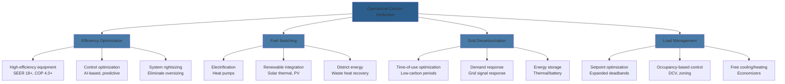
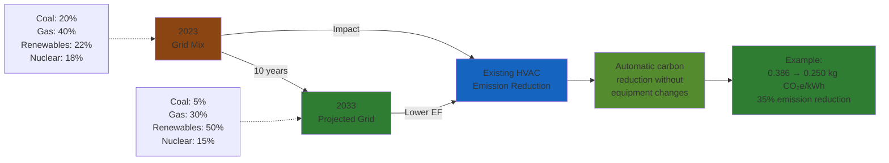

Operational carbon represents the greenhouse gas emissions produced during the use phase of HVAC systems throughout their lifetime. Unlike embodied carbon (emissions from manufacturing and installation), operational carbon accounts for 70-85% of total lifecycle emissions in most commercial buildings, making it the primary target for decarbonization efforts.

## Carbon Emission Calculation Methodology

### Fundamental Calculation Formula

The operational carbon emissions from HVAC systems are calculated using:

$$CO_2e = E \times EF \times t$$

Where:
- **CO₂e** = Carbon dioxide equivalent emissions (kg CO₂e)
- **E** = Energy consumption rate (kW)
- **EF** = Emission factor (kg CO₂e/kWh)
- **t** = Operating time (hours)

### Fuel-Specific Emission Factors

Different energy sources produce vastly different carbon intensities:

| Energy Source | Emission Factor (kg CO₂e/kWh) | Typical Application |
|---------------|-------------------------------|---------------------|
| Natural Gas (combustion) | 0.184 | Furnaces, boilers |
| Electricity (US grid avg) | 0.386 | Heat pumps, chillers |
| Electricity (coal-heavy grid) | 0.820 | Regional variation |
| Electricity (renewable grid) | 0.020-0.050 | Clean energy regions |
| District Steam | 0.140-0.220 | Urban commercial |
| Fuel Oil #2 | 0.252 | Emergency backup |

**Note:** Emission factors vary significantly by region, grid mix, and time of day. Real-time carbon intensity data provides more accurate calculations than annual averages.

### Total System Carbon Calculation

For a complete HVAC system:

$$CO_{2e,total} = \sum_{i=1}^{n} (E_i \times EF_i \times t_i \times \eta_i^{-1})$$

Where:
- **i** = Individual system component (chiller, boiler, AHU, pumps, fans)
- **η** = System efficiency (COP for cooling, AFUE for heating)

## Operational Carbon Reduction Strategies

## Electrification and Heat Pump Deployment

### Carbon Impact of Fuel Switching

The carbon benefit of replacing gas heating with electric heat pumps depends on grid carbon intensity:

$$\Delta CO_2e = Q \times \left(\frac{EF_{gas}}{\eta_{gas}} - \frac{EF_{elec}}{COP_{HP}}\right)$$

Where:
- **Q** = Heating load (kWh thermal)
- **EF_gas** = 0.184 kg CO₂e/kWh
- **η_gas** = Gas furnace efficiency (0.80-0.96)
- **EF_elec** = Grid emission factor (variable)
- **COP_HP** = Heat pump coefficient of performance (2.5-4.5)

### Breakeven Grid Carbon Intensity

Heat pumps reduce carbon emissions when:

$$EF_{elec} < \frac{EF_{gas} \times COP_{HP}}{\eta_{gas}}$$

For a heat pump with COP = 3.0 and gas furnace at 95% AFUE:

$$EF_{elec} < \frac{0.184 \times 3.0}{0.95} = 0.581 \text{ kg CO}_2\text{e/kWh}$$

This threshold is met in most US grid regions and continues improving as renewable energy penetration increases.

## Grid Decarbonization Impact

### Time-of-Use Carbon Optimization

Grid carbon intensity varies hourly based on dispatch order. Shifting HVAC loads to low-carbon periods reduces emissions:

**Typical Daily Carbon Intensity Pattern (Gas/Coal Grid):**

| Time Period | Carbon Intensity | Strategy |
|-------------|------------------|----------|
| 00:00-06:00 | 0.320 kg/kWh | Precool/preheat with storage |
| 06:00-10:00 | 0.450 kg/kWh | Moderate loads |
| 10:00-18:00 | 0.520 kg/kWh | Minimize loads, use storage |
| 18:00-22:00 | 0.480 kg/kWh | Shift non-critical loads |
| 22:00-24:00 | 0.360 kg/kWh | Charge thermal storage |

## Measurement and Verification

### Continuous Carbon Accounting

Modern HVAC controls integrate real-time carbon tracking:

1. **Energy metering:** Submetered HVAC systems (chillers, boilers, AHUs)
2. **Emission factor integration:** API connection to grid carbon intensity data
3. **Real-time calculation:** Continuous CO₂e computation
4. **Optimization feedback:** Control adjustments based on carbon impact

### Annual Carbon Reporting

$$CO_{2e,annual} = \sum_{month=1}^{12} \left(E_{month} \times EF_{month}\right)$$

Track year-over-year reductions against baseline. Typical reduction targets:
- **2030:** 50% reduction from 2020 baseline
- **2040:** 80% reduction from 2020 baseline
- **2050:** Net-zero operational carbon

## Technology-Specific Reduction Potential

| Technology Upgrade | Carbon Reduction | Implementation Notes |
|--------------------|------------------|----------------------|
| Replace 80% AFUE gas furnace with heat pump (COP 3.5) | 40-60% | Grid-dependent |
| Upgrade chiller from 0.8 kW/ton to 0.5 kW/ton | 37.5% | Direct reduction |
| Implement optimal start/stop controls | 10-15% | No equipment change |
| Add economizer to 100% OA capable unit | 20-30% | Climate-dependent |
| Variable speed drives on pumps/fans | 25-40% | Part-load dominant |
| Demand-controlled ventilation (DCV) | 15-25% | Occupancy variation |

## Decarbonization Pathway Design

A systematic approach to operational carbon elimination:

1. **Baseline quantification:** Establish current emissions with fuel-specific breakdown
2. **Efficiency maximization:** Optimize existing systems before fuel switching
3. **Strategic electrification:** Convert gas loads to electric heat pumps
4. **Renewable integration:** On-site solar PV or renewable energy procurement
5. **Grid-interactive controls:** Time-shift loads to low-carbon periods
6. **Residual offset:** Carbon offsets for remaining unavoidable emissions

The most cost-effective pathway combines efficiency improvements (lowest cost per ton CO₂e reduced) with strategic electrification timed to grid decarbonization trends. In regions with clean electricity grids, immediate electrification provides maximum carbon benefit. In coal-heavy regions, efficiency improvements and delayed electrification may optimize both carbon and cost outcomes.

## Conclusion

Operational carbon reduction in HVAC systems requires quantitative analysis of energy consumption, emission factors, and system efficiency. The combination of equipment efficiency improvements, strategic electrification, and grid decarbonization creates a pathway to net-zero operational carbon by 2050. Real-time carbon accounting and grid-interactive controls enable automated optimization, while continuous measurement ensures accountability toward reduction targets.
