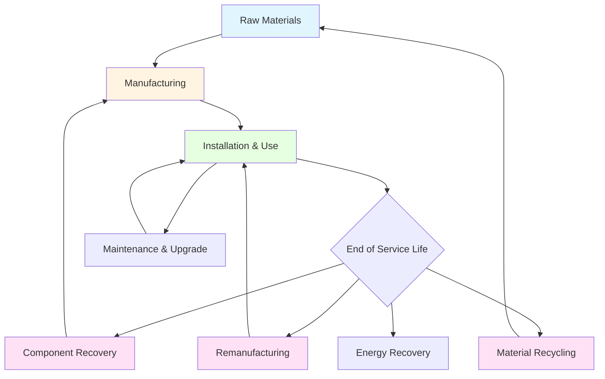

Circular economy principles applied to HVAC systems minimize resource consumption and waste generation through closed-loop material flows, extending equipment lifecycles, and designing for disassembly and reuse. This contrasts with traditional linear models where equipment is manufactured, used, and discarded.

## Circular Economy Framework for HVAC

The circular economy model for HVAC systems consists of three primary loops:

**Technical Loop Components:**
- Material recovery and recycling of metals, refrigerants, and polymers
- Component remanufacturing and refurbishment
- Equipment life extension through modular design
- Energy recovery from decommissioned systems

**Biological Loop Integration:**
- Bio-based insulation materials that biodegrade safely
- Natural refrigerants with zero environmental persistence
- Compostable filtration media

**Service Model Transformation:**
- Equipment-as-a-service rather than equipment ownership
- Performance-based contracts incentivizing longevity
- Manufacturer responsibility for end-of-life recovery

## Material Recovery and Recycling Rates

HVAC equipment contains substantial recoverable materials with varying economic value and environmental impact.

| Material Category | Typical Content (% mass) | Recovery Rate | Environmental Value |
|------------------|--------------------------|---------------|---------------------|
| Copper | 15-25% | 95-98% | High - energy savings |
| Aluminum | 8-15% | 90-95% | High - 95% energy reduction |
| Steel | 40-55% | 85-92% | Medium - abundant resource |
| Compressor Oil | 2-4% | 70-85% | Medium - rerefining potential |
| Refrigerants | 1-3% | 60-80% | Critical - GWP reduction |
| Polymers | 5-10% | 20-40% | Low - contamination issues |
| Electronics | 3-8% | 40-60% | High - rare earth elements |

## Refrigerant Recovery and Lifecycle Management

Refrigerant recovery represents a critical circular economy element due to high global warming potential and regulatory requirements under EPA Section 608 and international Montreal Protocol obligations.

**Recovery Efficiency Calculation:**

The refrigerant recovery factor quantifies circularity:

$$R_f = \frac{m_{recovered}}{m_{original}} \times 100\%$$

where $m_{recovered}$ is the mass of refrigerant extracted and $m_{original}$ is the initial system charge.

**Reclamation Quality Standards:**

ASHRAE Standard 34 and AHRI Standard 700 define purity requirements for reclaimed refrigerants:

$$P_{reclaimed} \geq 99.5\% \text{ (by mass)}$$

Reclaimed refrigerant meeting these specifications performs identically to virgin refrigerant while reducing embodied carbon by 85-92%.

## Design for Disassembly Principles

Circular economy implementation requires intentional design decisions that facilitate material recovery:

**Mechanical Fasteners vs. Permanent Joints:**
- Bolted connections: 100% reversible, enables component reuse
- Welded joints: requires cutting, destroys structural integrity
- Adhesive bonds: chemical separation required, material contamination

**Modular Component Architecture:**

Equipment designed with standardized, interchangeable modules extends service life through selective replacement rather than complete system disposal.

$$L_{system} = L_{base} + \sum_{i=1}^{n} \Delta L_i$$

where $L_{system}$ is total system lifespan, $L_{base}$ is the base structure life, and $\Delta L_i$ represents life extension from each module replacement.

**Material Identification Standards:**

ISO 11469 specifies marking requirements for plastic components exceeding 25 grams, enabling automated sorting during recycling.

## Remanufacturing vs. New Equipment Analysis

Remanufacturing recovers 85-95% of component value while consuming 15-30% of the energy required for new equipment production.

| Performance Metric | Remanufactured | New Equipment |
|-------------------|----------------|---------------|
| Energy consumption (production) | 15-30% | 100% |
| Material waste | 5-10% | 8-15% |
| Performance guarantee | 95-100% rated | 100% rated |
| Cost | 50-70% | 100% |
| Lead time | 2-4 weeks | 8-16 weeks |
| Warranty period | 1-3 years | 3-10 years |
| Embodied carbon | 200-400 kg CO₂e | 1200-1800 kg CO₂e |

## Component Life Extension Strategies

**Compressor Refurbishment:**

Compressor rebuilding recovers the most energy-intensive component. The process includes:
1. Disassembly and cleaning
2. Bearing replacement (primary wear component)
3. Motor winding inspection and rewinding if necessary
4. Valve plate resurfacing
5. Reassembly with new seals
6. Performance testing to OEM specifications

Refurbished compressors achieve 95-98% of original efficiency at 40-60% of replacement cost.

**Heat Exchanger Restoration:**

Coil cleaning and fin straightening restore 90-95% of original heat transfer capacity. The thermal performance recovery factor:

$$\eta_{restored} = \frac{UA_{cleaned}}{UA_{new}} = \frac{1}{1 + R_{fouling,residual}/R_{total}}$$

where $UA$ is overall heat transfer coefficient and $R_{fouling,residual}$ is remaining fouling resistance after cleaning.

## Economic Analysis of Circular Models

**Total Cost of Ownership Comparison:**

$$TCO_{circular} = C_{initial} + \sum_{t=1}^{L} \frac{C_{operation,t} + C_{maintenance,t} - V_{recovery}}{(1+r)^t}$$

where $V_{recovery}$ is the recovered value at end-of-life, typically 15-30% of initial cost for HVAC equipment.

**Material Value Recovery:**

A typical 10-ton rooftop unit contains approximately $800-1,200 in recoverable materials:
- Copper: $400-600
- Aluminum: $150-250
- Steel: $80-120
- Compressor core: $100-150
- Refrigerant: $50-100

## Implementation Barriers and Solutions

**Technical Barriers:**
- Proprietary component designs limiting third-party service
- Mixed materials requiring complex separation
- Contamination from lubricants and coatings

**Economic Barriers:**
- Low virgin material costs reducing recycling incentives
- Labor costs for disassembly exceeding material value
- Limited reverse logistics infrastructure

**Regulatory Solutions:**
- Extended producer responsibility mandates
- Deposit-refund systems for refrigerants and compressors
- Recycled content requirements in procurement specifications
- Tax incentives for remanufactured equipment

## Future Circular Economy Technologies

**Digital Product Passports:**

RFID tags and blockchain tracking enable complete material history documentation, facilitating recovery and reuse. Each component carries embedded data on:
- Material composition and grades
- Manufacturing date and location
- Service history and remaining useful life
- Optimal disassembly procedures
- Recycling facility compatibility

**Advanced Material Separation:**

AI-enabled robotic disassembly systems achieve 95%+ material purity through optical sorting and automated component extraction, improving economics of recycling operations.

**Performance-Based Procurement:**

Equipment-as-a-service models align manufacturer incentives with durability and recyclability, creating economic drivers for circular design principles.

The transition to circular economy models in HVAC systems reduces environmental impact while creating economic value through material recovery, component reuse, and extended equipment lifecycles.
