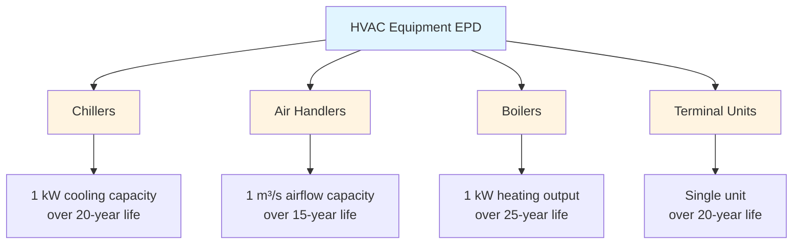
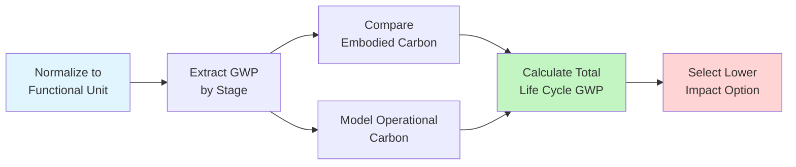

Environmental Product Declarations (EPDs) provide standardized, third-party verified information about the environmental impact of HVAC equipment throughout its life cycle. These ISO 14025-compliant documents quantify environmental burdens including embodied carbon, resource depletion, and ecosystem impacts, enabling evidence-based equipment selection for sustainable building projects.

## Life Cycle Assessment Framework

EPDs rely on Life Cycle Assessment (LCA) methodology to quantify environmental impacts across five distinct phases:

**Life Cycle Stages:**
- **A1-A3 (Product Stage):** Raw material extraction, transportation to manufacturing, and production
- **A4-A5 (Construction Stage):** Transportation to site and installation
- **B1-B7 (Use Stage):** Operation, maintenance, repair, replacement, and refurbishment
- **C1-C4 (End-of-Life Stage):** Deconstruction, transport, waste processing, and disposal
- **D (Beyond Life Cycle):** Recovery, recycling, and reuse benefits

The total environmental impact $E_{total}$ combines contributions from all stages:

$$E_{total} = \sum_{i=A1}^{A3} E_i + \sum_{j=A4}^{A5} E_j + \sum_{k=B1}^{B7} E_k + \sum_{l=C1}^{C4} E_l + E_D$$

For HVAC equipment, stages B6 (operational energy) and B7 (operational water) dominate total environmental impact, typically representing 80-95% of life cycle burdens.

## Carbon Footprint Quantification

EPDs report Global Warming Potential (GWP) in kg CO₂-equivalent per declared unit. For a chiller operating over its design life:

$$GWP_{total} = GWP_{embodied} + GWP_{operational} + GWP_{refrigerant}$$

Where operational emissions depend on efficiency and grid carbon intensity:

$$GWP_{operational} = \frac{Q_{cooling} \cdot t_{operation} \cdot I_{carbon}}{COP \cdot \eta_{plant}}$$

**Variables:**
- $Q_{cooling}$ = Cooling capacity (kW)
- $t_{operation}$ = Operating hours over life cycle (h)
- $I_{carbon}$ = Grid carbon intensity (kg CO₂/kWh)
- $COP$ = Coefficient of Performance (dimensionless)
- $\eta_{plant}$ = Plant efficiency factor (dimensionless)

Refrigerant leakage contributes additional warming potential:

$$GWP_{refrigerant} = m_{charge} \cdot L_{annual} \cdot t_{service} \cdot GWP_{ref}$$

Where $m_{charge}$ is refrigerant charge mass (kg), $L_{annual}$ is annual leakage rate (%), $t_{service}$ is service life (years), and $GWP_{ref}$ is refrigerant-specific warming potential.

## Environmental Impact Categories

EPDs evaluate multiple impact categories beyond climate change:

| Impact Category | Unit | HVAC Relevance |
|-----------------|------|----------------|
| Global Warming Potential | kg CO₂-eq | Operational energy, refrigerant emissions |
| Ozone Depletion Potential | kg CFC-11-eq | Refrigerant releases, insulation blowing agents |
| Acidification Potential | kg SO₂-eq | Manufacturing processes, energy generation |
| Eutrophication Potential | kg PO₄-eq | Water contamination from production |
| Photochemical Ozone Creation | kg C₂H₄-eq | VOC emissions from manufacturing |
| Abiotic Depletion (Elements) | kg Sb-eq | Copper, aluminum, rare earth extraction |
| Abiotic Depletion (Fossil) | MJ | Energy consumption across life cycle |
| Water Depletion | m³ | Manufacturing water use, operational cooling |

## Product Category Rules for HVAC

Product Category Rules (PCRs) establish calculation methodologies and reporting requirements specific to HVAC equipment types. Key PCR documents include:

**UN CPC-Based PCRs:**
- **Chillers and Heat Pumps:** EN 15804+A2, ISO 21930
- **Air Handling Units:** PCR 2019:14 Construction Products
- **Boilers and Furnaces:** PCR 2012:01 Building Products
- **Terminal Units:** EN 17213 HVAC Products

Functional unit definitions vary by equipment type:

## Operational Energy Modeling

ASHRAE Standard 205 provides standardized performance rating data representation, enabling accurate operational energy calculation for EPDs. The annual energy consumption:

$$E_{annual} = \int_0^{8760} \frac{Q_{load}(t)}{COP(t, T_{outdoor}, PLR)} dt$$

Where $COP(t, T_{outdoor}, PLR)$ represents time-variant efficiency as a function of outdoor temperature and part-load ratio. Standard 205 representation tables enable precise integration across actual load profiles rather than single-point ratings.

For variable refrigerant flow (VRF) systems, simultaneous heating and cooling operation requires energy recovery modeling:

$$E_{VRF} = E_{cooling} + E_{heating} - E_{recovery} + E_{auxiliary}$$

Recovery effectiveness depends on refrigerant piping network configuration and control algorithms.

## Material Inventory and Manufacturing

EPD material inventories quantify mass and composition of primary components:

| Component | Primary Material | Typical Mass Fraction | Carbon Intensity |
|-----------|------------------|----------------------|------------------|
| Heat Exchangers | Copper, Aluminum | 30-45% | 3.5-8.0 kg CO₂/kg |
| Compressors | Steel, Copper | 20-35% | 2.0-3.5 kg CO₂/kg |
| Casings | Steel, Galvanized | 15-25% | 1.8-2.4 kg CO₂/kg |
| Insulation | Polyurethane, Fiberglass | 5-10% | 3.0-4.5 kg CO₂/kg |
| Refrigerant | HFC, HFO, Natural | 1-3% | 0.2-2.1 kg CO₂/kg |
| Electronics | PCB, Semiconductors | 2-5% | 15-50 kg CO₂/kg |

Manufacturing energy intensity varies by equipment complexity. Scroll compressor production requires approximately 45-65 MJ/kg finished product, while centrifugal chiller assembly consumes 25-35 MJ/kg due to simpler assembly processes relative to product mass.

## Third-Party Verification Requirements

ISO 14025 mandates independent third-party verification of EPD data and methodology. Verification scope includes:

1. **PCR Compliance:** Confirmation that declared unit, system boundaries, and impact categories align with applicable Product Category Rules
2. **Data Quality Assessment:** Evaluation of primary data sources, secondary database selections, and allocation procedures
3. **Calculation Verification:** Independent recalculation of environmental indicators from inventory data
4. **Transparency Review:** Assessment of assumptions, limitations, and uncertainty disclosures

Program operators (UL Environment, EPD International, IBU) maintain verification protocols and reviewer qualifications. ASHRAE Standard 203 references EPD verification as documentation for equipment embodied carbon disclosure.

## EPD Application in Green Building Rating Systems

Green building certification programs incorporate EPD usage:

**LEED v4.1 Requirements:**
- **MR Credit EPD:** 1-2 points for products with industry-wide or product-specific EPDs
- **MR Credit Sourcing:** EPDs demonstrate responsible extraction and manufacturing
- **Minimum Thresholds:** 20+ permanently installed products with EPDs

**BREEAM International:**
- **Mat 01 LCA:** EPDs contribute to building-level life cycle assessment
- **Mat 03 Responsible Sourcing:** Verified environmental declarations earn credits

The environmental value $V_{env}$ of equipment selection based on EPD comparison:

$$V_{env} = \frac{GWP_{baseline} - GWP_{selected}}{GWP_{baseline}} \cdot 100\%$$

Selecting a chiller with 15% lower life cycle GWP versus baseline represents quantifiable environmental improvement supporting certification documentation.

## Comparative Assessment Methodology

EPDs enable direct equipment comparison when based on identical PCRs and functional units. For air-cooled chiller selection:

When comparing equipment with different service lives, equivalent annual environmental impact provides normalized comparison:

$$E_{annual,eq} = \frac{E_{total} \cdot r}{1 - (1 + r)^{-n}}$$

Where $r$ represents environmental discount rate (typically 0-3%) and $n$ is service life in years.

## Future Developments and Digital EPDs

Digital EPD formats enable automated building information modeling (BIM) integration. IFC4.3 schema extensions support EPD data attachment to building element objects, facilitating whole-building life cycle assessment during design.

Machine-readable EPD formats (JSON-LD, XML) enable computational processing of environmental data for optimization algorithms. Building energy modeling software increasingly incorporates EPD databases, calculating combined operational and embodied carbon during system selection.

ASHRAE's ongoing research project RP-1868 develops standardized EPD generation methodologies specific to HVAC equipment categories, improving consistency and comparability across manufacturers and product types.
