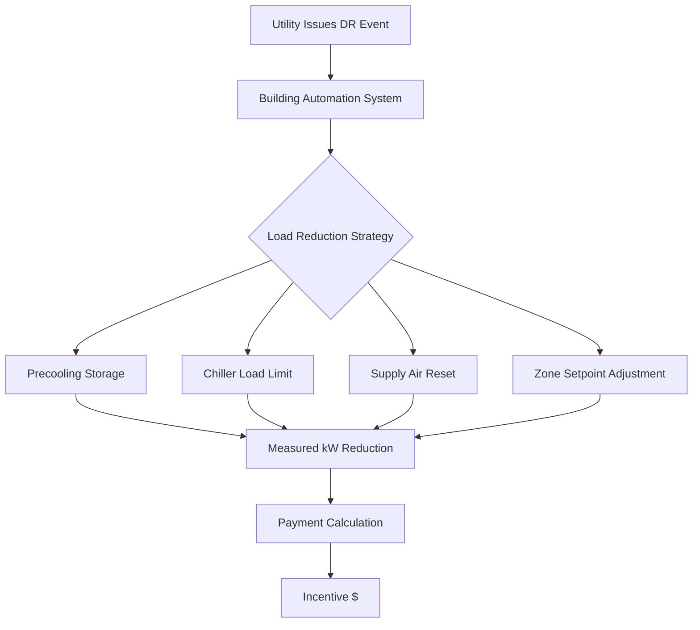

Government incentive programs substantially reduce the first-cost barrier for high-efficiency HVAC equipment and systems, accelerating market transformation toward lower-energy building operations. These programs operate through multiple mechanisms including direct rebates, tax credits, accelerated depreciation schedules, performance-based incentives, and low-interest financing structures.

## Federal Tax Credit Mechanisms

The Investment Tax Credit (ITC) for commercial HVAC systems provides percentage-based credits for qualifying energy-efficient equipment. The economic value derives from the time value of money relationship:

$$PV_{credit} = \frac{C_{equipment} \times r_{credit}}{(1 + i)^n}$$

where $C_{equipment}$ represents installed equipment cost, $r_{credit}$ is the applicable credit rate (typically 0.10 to 0.30), $i$ is the discount rate, and $n$ is the tax year delay. For immediate credit application, $n = 0$ and the present value equals the nominal credit amount.

### Section 179D Commercial Building Deduction

The Energy Efficient Commercial Buildings Tax Deduction (179D) rewards projects achieving energy cost reductions relative to ASHRAE Standard 90.1 baseline performance. The deduction structure follows a tiered approach:

| Energy Cost Reduction | Maximum Deduction | HVAC Component Value |
|----------------------|-------------------|----------------------|
| ≥25% whole building | $5.00/ft² | $0.60-1.70/ft² |
| ≥20% HVAC only | $1.70/ft² | $1.70/ft² |
| ≥15% HVAC only | $0.60/ft² | $0.60/ft² |

The deduction reduces taxable income rather than tax liability directly. For a taxpayer in the marginal tax bracket $t_m$, the after-tax savings become:

$$S_{179D} = D_{max} \times A_{floor} \times t_m$$

where $D_{max}$ is the deduction rate per square foot and $A_{floor}$ is the conditioned floor area.

## Utility Demand Response Programs

Demand response (DR) programs compensate building owners for reducing peak electrical demand during critical grid conditions. HVAC systems represent the largest controllable electrical load in most commercial buildings, making them prime DR assets.

The incentive payment structure typically follows:

$$I_{DR} = \sum_{e=1}^{N_e} (kW_{baseline,e} - kW_{actual,e}) \times r_{payment} \times t_{event}$$

where $N_e$ is the number of events per season, $kW_{baseline}$ represents the customer baseline load, $kW_{actual}$ is measured demand during the event, $r_{payment}$ is the payment rate ($/kWh), and $t_{event}$ is event duration.

## Performance-Based Incentive Structures

Performance-based programs tie incentive payments to measured energy savings rather than equipment specifications alone. The measurement and verification (M&V) approach follows ASHRAE Guideline 14 or International Performance Measurement and Verification Protocol (IPMVP) procedures.

The normalized annual energy savings calculation adjusts for weather variations:

$$E_{saved,norm} = E_{baseline,norm} - E_{actual,norm}$$

where normalized energy is determined through regression analysis:

$$E_{norm} = a_0 + a_1 \times HDD_{65} + a_2 \times CDD_{65}$$

The coefficients $a_0$, $a_1$, and $a_2$ are established during the baseline period. Heating degree days (HDD) and cooling degree days (CDD) use 65°F as the standard base temperature per ASHRAE practice.

## Accelerated Depreciation Benefits

Modified Accelerated Cost Recovery System (MACRS) allows shortened depreciation schedules for qualifying HVAC equipment. Standard HVAC systems follow a 39-year depreciation for real property, but qualifying improvements may use 5-, 7-, or 15-year schedules.

The present value of depreciation tax shields under MACRS follows:

$$PV_{depreciation} = C_{equipment} \times t_m \times \sum_{j=1}^{N} \frac{d_j}{(1+i)^j}$$

where $d_j$ represents the MACRS depreciation factor for year $j$, and $N$ is the recovery period. For 5-year property, the factors are [0.20, 0.32, 0.192, 0.1152, 0.1152, 0.0576] reflecting double-declining balance with half-year convention.

## State and Local Rebate Programs

Regional programs vary significantly in structure and funding levels. Common approaches include:

**Capacity-Based Rebates**: Payment per ton of cooling capacity for equipment exceeding minimum efficiency thresholds. Typical structure: $\$/ton = f(EER, IPLV)$ where both full-load efficiency (EER) and part-load performance (IPLV) determine payment levels.

**Energy-Savings-Based Rebates**: Payment calculated from projected annual energy reduction:

$$R_{energy} = \Delta E_{annual} \times r_{incentive} \times \min\left(1, \frac{C_{cap}}{C_{project}}\right)$$

where $\Delta E_{annual}$ is projected annual energy savings (kWh/yr), $r_{incentive}$ is the incentive rate ($/kWh), and the minimum function caps incentives at a percentage of project cost $C_{cap}/C_{project}$.

## Combined Incentive Optimization

Multiple incentive programs can be layered when regulations permit. The optimal combination maximizes net present value (NPV):

$$NPV = -C_{incremental} + \sum I_k + PV_{energy\,savings} + PV_{tax\,benefits}$$

where $C_{incremental}$ represents the cost premium for high-efficiency equipment over code-minimum, $\sum I_k$ is the sum of applicable rebates and incentives, and the present value terms account for ongoing operational savings and tax effects.

## Comparison of Incentive Program Types

| Program Type | Payment Timing | Verification Requirement | Risk Level | Typical Value |
|-------------|----------------|-------------------------|------------|---------------|
| Equipment Rebate | Post-installation | Spec sheet + invoice | Low | $50-500/ton |
| Performance-Based | Annual/ongoing | M&V per ASHRAE 14 | Medium | $0.05-0.15/kWh saved |
| Tax Credit (ITC) | Tax year | Professional certification | Low | 10-30% of cost |
| Section 179D | Tax year | Energy model + PE cert | Medium | $0.60-5.00/ft² |
| Demand Response | Per event | Real-time metering | Low | $50-200/kW-year |
| MACRS Bonus | Tax year | Asset classification | Low | PV of depreciation |

## Compliance and Documentation Requirements

Program participation requires substantial documentation including:

- Detailed equipment specifications and certifications (AHRI ratings)
- Professional engineer certification of projected performance
- Installation verification and commissioning reports per ASHRAE Guideline 1.1
- Ongoing monitoring data for performance-based programs
- Tax basis documentation for depreciation schedules

Pre-approval procedures vary by program but typically require submission of design documentation before equipment procurement to ensure eligibility.

## Program Economic Impact

Government incentives reduce the simple payback period for high-efficiency HVAC investments:

$$SPP_{with\,incentive} = \frac{C_{incremental} - I_{total}}{S_{annual}}$$

compared to the baseline:

$$SPP_{baseline} = \frac{C_{incremental}}{S_{annual}}$$

where $I_{total}$ represents total incentive value and $S_{annual}$ is annual operating cost savings. Incentives reducing 30-50% of incremental costs can transform economically marginal projects into favorable investments.

The effectiveness of incentive programs in driving market transformation depends on incentive levels exceeding the market discount rate hurdle and addressing both economic and informational barriers to technology adoption.
