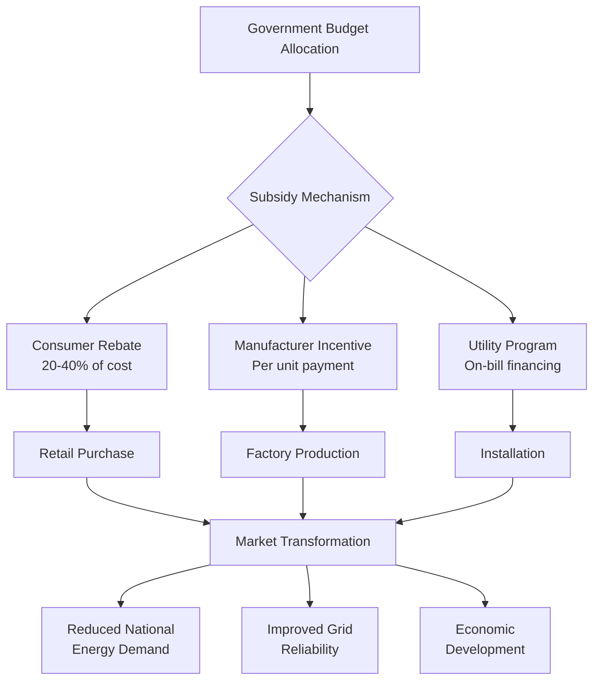

## Overview

Developing countries implement specialized incentive programs to accelerate efficient HVAC adoption while addressing unique constraints including limited capital access, informal construction sectors, and rapid urbanization. These programs leverage international climate finance, concessional lending, and market transformation strategies to reduce first costs and build local technical capacity.

The energy savings potential in developing markets exceeds 40-60% of baseline consumption due to minimal efficiency standards and reliance on inefficient equipment. Programs target residential cooling, commercial buildings, and cold chain infrastructure critical for economic development.

## Program Categories

### Carbon Finance Mechanisms

International carbon credit systems provide revenue streams for HVAC efficiency projects through verified emission reductions.

**Clean Development Mechanism (CDM):**
Projects generate Certified Emission Reductions (CERs) based on demonstrated energy savings:

$$
\text{CERs} = \frac{(E_{\text{baseline}} - E_{\text{project}}) \times \text{EF}_{\text{grid}} \times t}{1000}
$$

Where:
- $E_{\text{baseline}}$ = baseline energy consumption (kWh/year)
- $E_{\text{project}}$ = project energy consumption (kWh/year)
- $\text{EF}_{\text{grid}}$ = grid emission factor (kg CO₂/kWh)
- $t$ = crediting period (years)

**Voluntary Carbon Markets:**
Private sector buyers purchase verified carbon units (VCUs) at market rates ranging from $5-50 per tonne CO₂e, providing supplementary project financing for high-efficiency chillers, building retrofits, and district cooling systems.

### Concessional Financing

Development banks and bilateral agencies offer below-market loans for efficiency investments.

| Institution | Interest Rate | Term | Grace Period | Application |
|-------------|--------------|------|--------------|-------------|
| World Bank IBRD | 1.5-3.0% | 15-20 years | 3-5 years | Large infrastructure |
| Asian Development Bank | 1.0-2.5% | 20-25 years | 3-5 years | Regional projects |
| Green Climate Fund | 0-2.0% | 20-40 years | 5-10 years | Climate mitigation |
| KfW Development Bank | 0.75-1.5% | 20-30 years | 5-10 years | Technical cooperation |

**Effective Cost of Capital:**

The present value of energy savings determines project viability under concessional terms:

$$
\text{NPV} = \sum_{t=1}^{n} \frac{S_t - C_t}{(1 + r)^t} - I_0
$$

Where:
- $S_t$ = annual energy savings (currency)
- $C_t$ = annual operating costs (currency)
- $r$ = discount rate (concessional rate 1-3%)
- $I_0$ = initial investment
- $n$ = project lifetime (years)

Concessional rates reduce payback periods from 8-12 years to 3-5 years for commercial chiller replacements.

### Direct Subsidy Programs

Governments subsidize efficient equipment to reduce upfront cost barriers.

**India UJALA Program:**
Distributed 370 million LED bulbs and extended to super-efficient air conditioners with 40% capital subsidy for units achieving EER ≥ 3.5 W/W (ISEER ≥ 4.5). Program reduced peak demand by 9,000 MW.

**Mexico FIDE Program:**
Provides subsidies covering 30-50% of equipment cost for commercial chillers exceeding minimum efficiency by 20%. Requires third-party verification of performance through ASHRAE Standard 90.1 testing protocols.

### Technical Assistance Programs

Capacity building addresses knowledge gaps limiting efficient HVAC deployment.

**Components:**
- **Design Training:** ASHRAE Fundamentals application for tropical climates
- **Installation Standards:** Refrigerant handling, ductwork sealing, system commissioning
- **Certification Programs:** Technician licensing tied to efficiency metrics
- **Demonstration Projects:** Public buildings showcasing best practices

**UNEP United for Efficiency (U4E):**
Provides model regulations, test procedures, and policy guidance for minimum energy performance standards (MEPS) development. Over 60 countries adopted U4E frameworks for room air conditioners.

## Funding Structures

### Results-Based Financing

Programs disburse payments upon verified performance rather than upfront subsidies.

**Structure:**

1. **Baseline Assessment:** Pre-intervention energy audit per ASHRAE Level II protocol
2. **Installation:** Equipment deployment with independent verification
3. **Monitoring Period:** 12-24 months of metered consumption data
4. **Payment Calculation:**

$$
P = (E_{\text{saved}} \times C_{\text{energy}} \times f) - C_{\text{admin}}
$$

Where:
- $P$ = payment to implementer
- $E_{\text{saved}}$ = verified energy savings (kWh)
- $C_{\text{energy}}$ = energy cost (currency/kWh)
- $f$ = sharing factor (0.5-0.8)
- $C_{\text{admin}}$ = administrative costs

This approach transfers performance risk to implementers and ensures actual savings.

### Blended Finance

Combines concessional public funds with commercial capital to improve project economics.

**Capital Stack Example:**
- Grant funding: 20% (equipment subsidy)
- Concessional loan: 30% (2% interest, 15 years)
- Commercial debt: 30% (8% interest, 10 years)
- Equity: 20% (15% IRR target)

Weighted average cost of capital: 6.5% versus 12% for pure commercial financing.

## Sector-Specific Applications

### Residential Cooling

Rapid growth in household air conditioner ownership (15-30% annual increases in Southeast Asia) drives program focus.

**Bangladesh Energy Efficiency Program:**
- Minimum EER 2.9 W/W for room AC
- 30% rebate for units ≥ 3.3 W/W
- Utility on-bill repayment over 36 months
- Achieved 180,000 unit sales in 2 years

### Cold Chain Development

Agricultural economies require efficient refrigeration infrastructure.

**India Agriculture Infrastructure Fund:**
- $10 billion allocation for cold storage, ripening chambers, and pack houses
- 3% interest rate for projects using ammonia or CO₂ refrigeration
- Insulation requirements: U-value ≤ 0.25 W/m²·K per ASHRAE Guideline 36
- COP minimums: 4.0 for cold storage, 3.5 for transport refrigeration

### Commercial Buildings

Programs target hotels, hospitals, and retail spaces with high cooling loads.

**Philippines Green Building Incentives:**
- Tax credits: 20% of green certification costs
- Income tax holiday: 4-6 years for LEED Gold+ buildings
- Duty exemption: Imported high-efficiency equipment
- Fast-track permitting for projects exceeding ASHRAE 90.1 by 30%

## Implementation Challenges

**Informal Sector Penetration:**
60-80% of construction occurs outside regulated channels in many markets. Programs must engage informal installers through training and certification rather than enforcement.

**Grid Unreliability:**
Voltage fluctuations and power outages reduce equipment lifespan. Incentives should include voltage stabilizers and surge protection as eligible costs.

**Local Manufacturing Capacity:**
High import duties on efficient equipment (15-35% in many countries) offset subsidy benefits. Programs increasingly condition incentives on local content requirements.

**Monitoring and Verification:**
Limited metering infrastructure complicates energy savings verification. Statistical sampling and deemed savings approaches per IPMVP protocols provide cost-effective alternatives to universal metering.

## Related Topics

- [International Efficiency Metrics](/international-perspectives/international-efficiency-metrics/cooling-efficiency-global/)
- [Net Zero Energy Buildings](/sustainability-emerging-tech-economics/sustainability-green-building/net-zero-energy-buildings/)
- [Economic Analysis Methods](/sustainability-emerging-tech-economics/economic-analysis-hvac/lifecycle-cost-analysis/)
- [Green Building Rating Systems](/sustainability-emerging-tech-economics/sustainability-green-building/green-building-rating-systems/leed-certification/)
