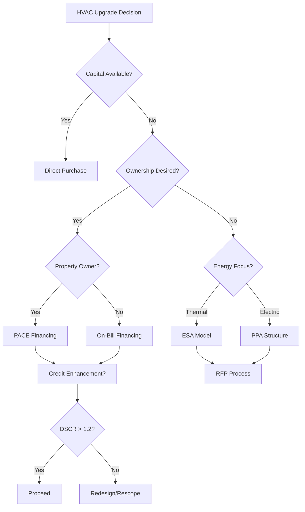

## Overview

Financing mechanisms transform capital-intensive HVAC upgrades into cash-flow positive investments by aligning payment structures with energy savings. These financial instruments address the primary barrier to efficiency deployment: upfront capital requirements that often exceed $50-150/ft² for comprehensive mechanical system retrofits.

The fundamental value proposition relies on the relationship between debt service and energy cost reduction:

$$
NPV_{project} = \sum_{t=1}^{n} \frac{(S_t - P_t - O_t)}{(1+r)^t} - C_0
$$

Where:
- $NPV_{project}$ = Net present value of the financing structure ($)
- $S_t$ = Energy savings in year t ($/year)
- $P_t$ = Financing payment in year t ($/year)
- $O_t$ = Incremental O&M costs in year t ($/year)
- $r$ = Discount rate (decimal)
- $C_0$ = Initial capital investment ($)
- $n$ = Financing term (years)

## Property Assessed Clean Energy (PACE)

PACE financing attaches repayment obligations to property tax assessments rather than personal credit, creating transferable liens that survive ownership changes.

### Mechanism Structure

The assessment-based model enables long-term financing (15-25 years) that matches equipment service life. Payment obligations follow the property, addressing the split incentive problem where building owners hesitate to invest in improvements when tenants receive energy savings benefits.

Qualifying HVAC improvements typically include:
- Central plant replacements (chillers, boilers, cooling towers)
- Rooftop unit upgrades to high-efficiency models
- Building automation and controls systems
- Economizer installations and airside modifications

### Cash Flow Analysis

PACE structures target debt service coverage ratios (DSCR) of 1.10-1.25:

$$
DSCR = \frac{NOI + E_{savings}}{D_s}
$$

Where:
- $DSCR$ = Debt service coverage ratio (dimensionless)
- $NOI$ = Net operating income before improvement ($/year)
- $E_{savings}$ = Annual energy cost reduction ($/year)
- $D_s$ = Annual debt service payment ($/year)

For a chiller replacement costing $500,000 with annual savings of $75,000, 20-year financing at 6% interest yields:

$$
D_s = C_0 \times \frac{r(1+r)^n}{(1+r)^n-1} = 500{,}000 \times \frac{0.06(1.06)^{20}}{(1.06)^{20}-1} = \$43{,}648/\text{year}
$$

This produces DSCR = $75,000 / $43,648 = 1.72, indicating strong project viability.

## Energy Service Agreements (ESAs)

ESAs transfer ownership of HVAC equipment to third-party providers who sell thermal energy services rather than hardware. The customer pays for heating/cooling output ($/ton-hour or $/MBtu) while the provider owns, operates, and maintains all mechanical equipment.

### Thermodynamic Pricing Models

ESA pricing reflects delivered thermal energy adjusted for system efficiency:

$$
C_{thermal} = \frac{C_{energy} \times Q_{delivered}}{COP_{seasonal}}
$$

Where:
- $C_{thermal}$ = Cost per unit thermal energy delivered ($/MBtu)
- $C_{energy}$ = Energy commodity cost ($/kWh or $/therm)
- $Q_{delivered}$ = Thermal energy delivered to zones (MBtu)
- $COP_{seasonal}$ = Seasonal coefficient of performance (dimensionless)

Providers profit by installing high-efficiency equipment (COP 4.0-5.5) while charging rates based on baseline performance (COP 3.0-3.5), capturing the efficiency margin.

### Risk Allocation Matrix

| Risk Category | Traditional Ownership | ESA Model |
|--------------|----------------------|-----------|
| Equipment failure | Building owner | Service provider |
| Performance degradation | Building owner | Service provider |
| Technology obsolescence | Building owner | Service provider |
| Energy price volatility | Building owner | Shared/hedged |
| Maintenance cost escalation | Building owner | Service provider |

## Power Purchase Agreements (PPAs)

PPAs apply primarily to generation assets (CHP, solar thermal, geothermal heat pumps with ground source) where customers purchase energy output at fixed $/kWh rates below utility tariffs.

### Economic Structure

The PPA rate must satisfy:

$$
PPA_{rate} < T_{utility} - \frac{C_{transmission} + C_{distribution}}{E_{annual}}
$$

Where:
- $PPA_{rate}$ = Contracted energy price ($/kWh)
- $T_{utility}$ = Retail utility tariff ($/kWh)
- $C_{transmission}$ = Avoided transmission costs ($)
- $C_{distribution}$ = Avoided distribution costs ($)
- $E_{annual}$ = Annual energy production (kWh/year)

For geothermal heat pump systems, the effective PPA rate reflects both heating and cooling energy displacement. A 200-ton ground source heat pump producing 2,000,000 kWh-equivalent annually priced at $0.08/kWh generates $160,000/year in revenue for the developer.

## On-Bill Financing (OBF)

OBF integrates loan repayments into utility bills, leveraging utilities' existing billing infrastructure and collection mechanisms. This approach achieves 95-98% repayment rates compared to 75-85% for conventional equipment loans.

### Tariffed On-Bill (TOB) Programs

Utilities recover costs through tariff riders that function as non-bypassable charges. The mechanism creates senior obligations that remain with the meter regardless of occupancy changes.

Payment structures satisfy the "bill neutrality" constraint:

$$
\Delta B_{monthly} = S_{monthly} - P_{monthly} \geq 0
$$

Where:
- $\Delta B_{monthly}$ = Net monthly bill change ($)
- $S_{monthly}$ = Monthly energy savings ($)
- $P_{monthly}$ = Monthly financing payment ($)

## Comparative Financial Metrics

| Mechanism | Term (years) | Interest Rate | Credit Requirement | Transferability |
|-----------|-------------|---------------|-------------------|-----------------|
| PACE | 15-25 | 5.5-7.5% | Property-based | Full transfer |
| ESA | 10-20 | Implicit 4-8% | Minimal | Service continues |
| PPA | 15-25 | Implicit 5-9% | Creditworthiness | Assignable |
| OBF | 5-15 | 0-6% | Moderate | Meter-based |
| Commercial loan | 5-10 | 6-10% | Strong credit | Non-transferable |

## Implementation Decision Framework

## ASHRAE Standards Considerations

ASHRAE Standard 100-2018 (Energy Efficiency in Existing Buildings) establishes energy audit protocols that inform financing feasibility analysis. Level II audits (detailed energy surveys) provide accuracy within ±20% for savings predictions, meeting underwriting requirements for most programs.

For measurement and verification, ASHRAE Guideline 14-2014 specifies acceptable calibration tolerances:
- Monthly calibration: CV(RMSE) ≤ 15%, NMBE ≤ ±5%
- Hourly calibration: CV(RMSE) ≤ 30%, NMBE ≤ ±10%

These thresholds govern performance verification in ESA and PPA contracts, protecting both providers and customers from savings disputes.

## Practical Application

Selection of financing mechanism depends on organizational constraints:

**PACE suits**: Property owners with long-term hold periods, seeking to improve asset value while preserving capital for core business operations.

**ESAs suit**: Organizations seeking operational expense treatment, lacking maintenance capabilities, or requiring guaranteed performance.

**PPAs suit**: Projects with significant generation components where energy production can be metered separately from facility consumption.

**OBF suits**: Smaller projects ($25,000-250,000) where administrative simplicity and high repayment rates justify utility program participation.

The optimal structure minimizes weighted average cost of capital while aligning payment obligations with measurable energy performance.
