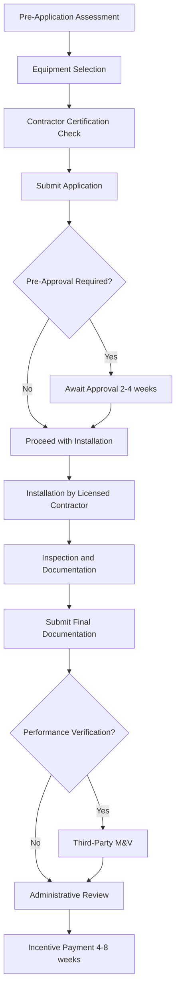

Regional government incentive programs provide targeted financial support for HVAC system upgrades based on local climate conditions, energy infrastructure, and policy priorities. These programs operate at state, provincial, county, and municipal levels, offering rebates, tax credits, low-interest financing, and performance-based incentives that complement federal initiatives.

## Program Structure and Administration

Regional HVAC incentive programs exhibit three primary organizational models:

**State Energy Offices** administer centralized programs with uniform requirements across jurisdictions. These offices establish baseline efficiency thresholds, typically 15-25% above federal minimums, and coordinate funding distribution through designated contractors or direct consumer applications.

**Public Utility Commissions** oversee programs funded through system benefits charges, which add $0.001-0.005 per kWh to electricity rates. The revenue funds energy efficiency initiatives including HVAC upgrades, with annual budgets ranging from $5-50 million depending on service territory population.

**Municipal Building Departments** implement local ordinances requiring efficiency improvements during renovation or equipment replacement. These programs integrate with permitting processes, making incentive participation mandatory for permit approval in progressive jurisdictions.

## Incentive Calculation Methodologies

Regional programs calculate incentives using capacity-based, efficiency-based, or performance-based formulas.

### Capacity-Based Incentives

Simple rebates scale linearly with equipment capacity:

$$I_{\text{cap}} = C \times Q$$

where $I_{\text{cap}}$ is the incentive amount ($), $C$ is the per-ton incentive rate ($/ton), and $Q$ is equipment capacity (tons). Typical values range from $150-400 per ton for air conditioning and $200-600 per ton for heat pumps.

### Efficiency-Based Incentives

Tiered structures reward higher efficiency levels:

$$I_{\text{eff}} = I_{\text{base}} + \Delta I \times (E_{\text{actual}} - E_{\text{min}})$$

where $I_{\text{base}}$ is the base incentive ($), $\Delta I$ is the incremental incentive per efficiency point ($/unit), $E_{\text{actual}}$ is installed equipment efficiency, and $E_{\text{min}}$ is the minimum qualifying efficiency.

### Performance-Based Incentives

Advanced programs measure actual energy savings:

$$I_{\text{perf}} = \frac{\$}{\text{kWh}} \times (E_{\text{baseline}} - E_{\text{measured}}) \times \text{years}$$

where performance verification occurs through sub-metering or whole-building analysis over 12-24 month baseline periods.

## Regional Climate Adaptation

Programs calibrate incentive levels to address regional climate challenges and energy profiles.

| Climate Zone | Priority Technology | Typical Incentive | Performance Metric |
|--------------|-------------------|-------------------|-------------------|
| Hot-Humid | High-SEER AC, dehumidification | $300-500/ton | SEER ≥16, latent capacity |
| Hot-Dry | Evaporative cooling, high-EER | $200-400/ton | EER ≥13, water efficiency |
| Cold | Cold-climate heat pumps | $500-1200/ton | HSPF ≥10, COP at 5°F |
| Mixed-Humid | Dual-fuel systems, ERV | $400-700/system | Integrated efficiency |
| Marine | Heat recovery, economizers | $250-600/unit | Free cooling hours |

Cold climate regions prioritize heating performance, offering enhanced incentives for equipment maintaining ≥70% heating capacity at 5°F outdoor temperature per ASHRAE Standard 116. Hot climate programs emphasize sensible heat ratio (SHR) control, rewarding systems maintaining 0.65-0.75 SHR across operating ranges.

## Commercial Program Structures

Commercial and industrial programs employ more sophisticated incentive mechanisms than residential programs.

### Custom Incentive Calculation

Engineering analysis determines project-specific savings:

$$I_{\text{custom}} = \min(P \times \Delta E_{\text{annual}} \times C_{\text{energy}}, \text{Cap})$$

where $P$ is the incentive percentage (typically 0.30-0.50), $\Delta E_{\text{annual}}$ is verified annual energy savings (kWh or therms), $C_{\text{energy}}$ is avoided energy cost ($/kWh), and Cap is the maximum incentive (often 50% of project cost).

### Demand Response Integration

Peak demand reduction incentives supplement energy savings:

$$I_{\text{DR}} = \frac{\$}{\text{kW}} \times \Delta D_{\text{peak}} \times N_{\text{events}}$$

where $\Delta D_{\text{peak}}$ is controllable load reduction (kW) and $N_{\text{events}}$ is the annual event count (50-100 hours typical). Commercial chillers with thermal storage receive $300-800/kW of shiftable load.

## Application Process Flow

## Funding Mechanisms and Sustainability

Regional programs derive funding from multiple sources that affect long-term stability:

**Ratepayer Surcharges** provide consistent funding but face political pressure during rate increase debates. Programs funded through public benefit charges show 85-95% year-over-year budget stability.

**Carbon Pricing Revenue** in cap-and-trade or carbon tax jurisdictions allocates 10-40% of proceeds to building efficiency. These funds exhibit higher volatility, correlating with carbon credit market prices and regulatory adjustments.

**General Revenue Allocations** fluctuate with legislative budget cycles, creating 30-60% annual variability. Multi-year authorizations improve program continuity.

## Incentive Stacking and Limitations

Most regional programs allow combining (stacking) incentives with federal tax credits subject to total cost caps:

$$I_{\text{total}} \leq k \times C_{\text{project}}$$

where $k$ ranges from 0.50-0.75 depending on project type and jurisdiction. Programs explicitly prohibit receiving multiple incentives for the same efficiency improvement from different regional sources.

## Compliance and Verification Requirements

Regional programs mandate specific documentation levels based on incentive amounts:

- **Tier 1 ($0-2,500)**: Equipment nameplate data, invoice, installation photos
- **Tier 2 ($2,500-10,000)**: Above plus commissioning report, airflow measurements
- **Tier 3 ($10,000-50,000)**: Above plus engineering calculations, energy model
- **Tier 4 (>$50,000)**: Above plus third-party M&V per ASHRAE Guideline 14

Verification employs statistical methods ensuring 90% confidence and 10% precision for savings claims exceeding $25,000 annual value.

## Contractor Network Requirements

Programs maintain qualified contractor lists requiring:

- State/provincial HVAC license with minimum 3-year standing
- Liability insurance coverage ≥$1,000,000 general aggregate
- Completion of program-specific training (8-16 hours)
- Quality installation verification on 5-15% of jobs
- Customer satisfaction scores ≥4.0/5.0 averaged annually

These requirements reduce installation defects from industry baseline rates of 60-70% to program averages of 15-25%, per field studies validating delivered efficiency.

## Performance Outcomes

Regional programs demonstrate measurable impact on equipment efficiency adoption. States with comprehensive incentive programs show 25-40% higher average installed SEER ratings compared to states with minimal programs. Commercial participation rates correlate strongly with incentive levels, increasing from 8-12% baseline to 35-55% when incentives cover 30-50% of incremental costs for high-efficiency equipment.

Programs incorporating contractor training and quality verification achieve 85-95% of theoretical energy savings, compared to 50-70% for incentive-only programs lacking installation oversight.