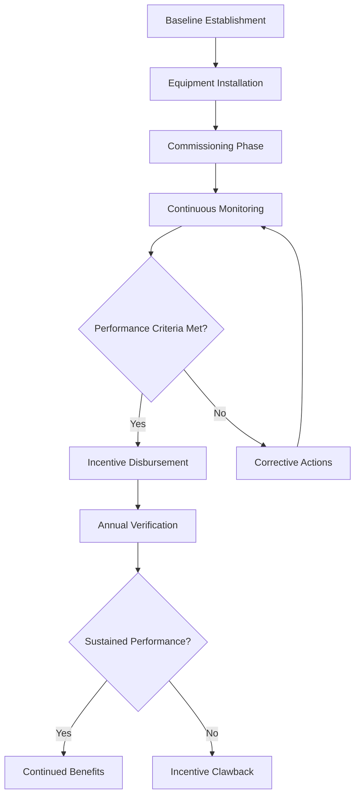

## Overview of Asia-Pacific HVAC Incentive Landscape

Asia-Pacific governments employ diverse financial mechanisms to accelerate HVAC efficiency adoption, ranging from direct capital subsidies to performance-based payments. These programs address the region's rapid urbanization and increasing cooling demand, which exceeded 1,800 TWh annually as of 2024. Understanding the thermodynamic and economic frameworks underlying these incentives enables optimal project structuring.

## Major Regional Incentive Categories

### Energy Efficiency Certificate Trading Systems

Several Asia-Pacific jurisdictions implement certificate-based mechanisms where HVAC efficiency improvements generate tradable credits. The energy savings quantification follows standardized measurement protocols:

$$
E_{saved} = \int_{t_1}^{t_2} (P_{baseline} - P_{actual}) \, dt
$$

where $E_{saved}$ represents verified energy savings (kWh), $P_{baseline}$ is baseline power consumption (kW), and $P_{actual}$ is measured consumption after HVAC upgrades.

Certificate value calculations incorporate:

$$
V_{cert} = E_{saved} \times CF \times P_{market}
$$

where $V_{cert}$ is certificate value, $CF$ is the conversion factor (typically 1 certificate per MWh saved), and $P_{market}$ is market clearing price.

### Capital Subsidy Programs

Direct capital subsidies reduce initial investment barriers for high-efficiency equipment. Subsidy structures typically follow tiered approaches based on coefficient of performance (COP) or seasonal energy efficiency ratio (SEER):

| Equipment Type | Min. Efficiency | Subsidy Rate | Max. Subsidy |
|---------------|----------------|--------------|--------------|
| Air-cooled chillers | COP ≥ 3.2 | 15-25% | $50,000 |
| Water-cooled chillers | COP ≥ 5.5 | 20-30% | $150,000 |
| VRF systems | SEER ≥ 16 | 10-20% | $30,000 |
| Heat pumps | COP ≥ 4.0 | 15-25% | $40,000 |

The economic optimization considers subsidy timing and thermal performance:

$$
NPV = \sum_{n=1}^{N} \frac{S_n}{(1+r)^n} + S_{initial} - C_{total}
$$

where $NPV$ is net present value, $S_n$ is annual energy savings, $r$ is discount rate, $S_{initial}$ is upfront subsidy, and $C_{total}$ is total project cost.

## Country-Specific Program Structures

### Singapore's Energy Efficiency Grant

Singapore offers performance-based grants covering up to 50% of qualifying costs for chiller plant upgrades. Eligibility requires:

- Minimum 10% energy intensity reduction
- Compliance with SS 564 energy efficiency standard
- Third-party measurement and verification (M&V)

The grant calculation incorporates cooling load density and operating hours:

$$
G_{max} = Q_{cooling} \times h_{annual} \times (COP_{new}^{-1} - COP_{existing}^{-1}) \times C_{energy} \times M \times 0.5
$$

where $G_{max}$ is maximum grant, $Q_{cooling}$ is design cooling capacity (kW), $h_{annual}$ is annual operating hours, and $M$ is grant multiplier (typically 3-5 years).

### Japan's Advanced Energy-Saving Equipment Subsidy

Japan's Ministry of Economy, Trade and Industry (METI) provides subsidies for HVAC systems exceeding Top Runner standards by 15% or more. The program emphasizes variable refrigerant flow (VRF) technology and heat recovery systems.

Heat recovery effectiveness requirements follow:

$$
\epsilon_{HR} = \frac{Q_{recovered}}{Q_{available}} = \frac{h_2 - h_1}{h_3 - h_1} \geq 0.65
$$

where $\epsilon_{HR}$ is heat recovery effectiveness, $h_1$ is supply air enthalpy, $h_2$ is return air enthalpy, and $h_3$ is exhaust air enthalpy.

### Australia's Equipment Energy Efficiency Program

Australia mandates minimum energy performance standards (MEPS) coupled with state-level certificate schemes. New South Wales and Victoria operate energy savings certificate (ESC) programs where HVAC upgrades generate certificates based on deemed savings.

Certificate generation for air conditioning follows:

$$
ESC = \frac{P_{rated} \times h_{equivalent}}{EER_{baseline}} - \frac{P_{rated} \times h_{equivalent}}{EER_{actual}} \times \frac{1}{3.6}
$$

where $P_{rated}$ is rated cooling capacity (kW), $h_{equivalent}$ is equivalent full-load hours, and energy efficiency ratio (EER) values determine baseline versus actual consumption.

### South Korea's Green Building Certification Incentives

South Korea links HVAC efficiency to Green Standard for Energy and Environmental Design (G-SEED) certification levels. Financial benefits include:

- Floor area ratio bonuses (up to 15%)
- Property tax reductions (15-30% for 5 years)
- Expedited permitting processes

The HVAC contribution to G-SEED scoring requires:

$$
Score_{HVAC} = w_1 \times f(COP) + w_2 \times f(Controls) + w_3 \times f(Renewables)
$$

where weighting factors $w_1, w_2, w_3$ total 100% and functions $f$ convert technical parameters to normalized scores.

## Performance Verification Methodologies

Asia-Pacific programs increasingly require International Performance Measurement and Verification Protocol (IPMVP) compliance. Option B (retrofit isolation) remains most common for HVAC projects, measuring energy use at equipment boundaries.

The uncertainty analysis for savings determination follows:

$$
U_{total} = \sqrt{U_{baseline}^2 + U_{reporting}^2 + U_{sampling}^2}
$$

where $U_{total}$ represents total uncertainty, with individual components for baseline establishment, reporting period measurements, and sampling error typically maintained below 20% at 90% confidence.

## Technology-Specific Incentive Optimization

### Variable Speed Drive Integration

Many programs provide enhanced incentives for chiller plants incorporating variable speed drives (VSD) on compressors and auxiliary equipment. The part-load efficiency gain justifies higher subsidies:

$$
kW/ton_{avg} = \frac{\sum_{i=1}^{8760} P_i}{\sum_{i=1}^{8760} Q_i} \times 12
$$

where hourly power consumption $P_i$ and cooling output $Q_i$ determine integrated part load value (IPLV) used for incentive tier assignment.

### Thermal Energy Storage Systems

Programs supporting thermal energy storage (TES) recognize load-shifting benefits beyond efficiency improvements. Incentive calculations include demand charge reductions:

$$
Savings_{annual} = E_{shifted} \times (C_{peak} - C_{off-peak}) + P_{demand} \times C_{demand} \times 12
$$

where $E_{shifted}$ is energy moved from peak to off-peak periods, $P_{demand}$ is demand reduction (kW), and $C$ terms represent electricity rate components.

## Application Strategy and Documentation Requirements

Successful incentive capture requires comprehensive technical documentation:

- ASHRAE Level II energy audits (minimum) for projects exceeding $100,000
- Computational fluid dynamics (CFD) analysis for complex air distribution modifications
- Psychrometric calculations demonstrating moisture control performance
- Refrigerant leak detection system specifications per ASHRAE Standard 15

Economic analysis must demonstrate incremental cost-effectiveness:

$$
SIR = \frac{PV_{savings}}{C_{incremental}} \geq Threshold_{program}
$$

where savings-to-investment ratio (SIR) thresholds typically range from 1.0 to 1.5 depending on jurisdiction and technology category.

## Conclusion

Asia-Pacific HVAC incentive programs provide substantial financial support for efficiency upgrades when projects align with program technical requirements and verification protocols. The diversity of mechanisms—from tradable certificates to direct subsidies—enables customized approaches based on project scale, technology selection, and regional regulatory frameworks. Optimal incentive capture requires early-stage program analysis integrated with thermodynamic system design to maximize both energy performance and economic returns.
