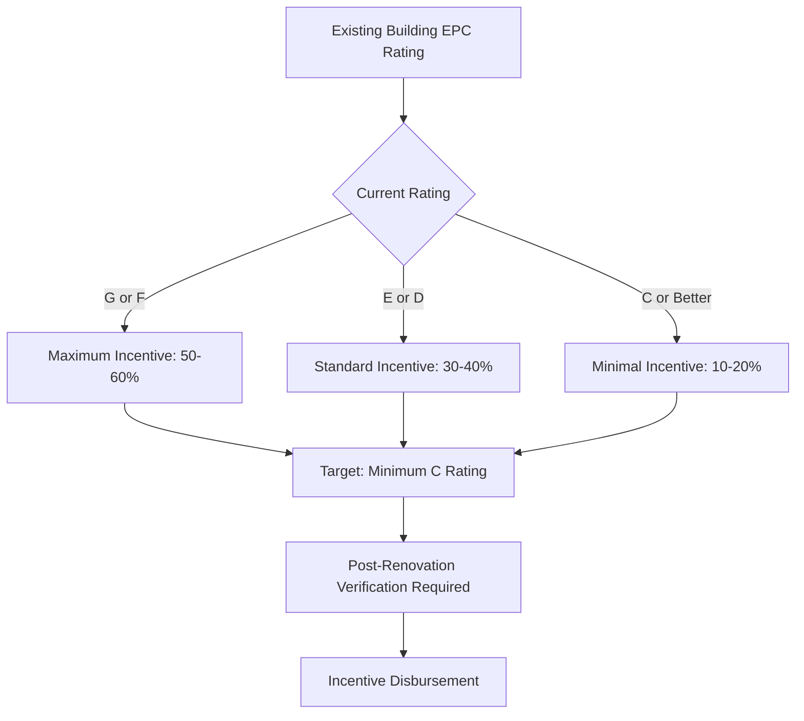

## Overview of European HVAC Incentive Framework

European HVAC incentive programs operate within a comprehensive regulatory and financial framework driven by aggressive climate targets. The European Union's commitment to climate neutrality by 2050 establishes building sector emissions reduction as critical, with HVAC systems representing 40-50% of building energy consumption. Member states implement incentives through direct subsidies, tax credits, preferential loans, and regulatory mandates under the Energy Performance of Buildings Directive (EPBD).

The incentive structure prioritizes heat pump deployment, fossil fuel heating phase-out, and integration of renewable energy sources. Financial support mechanisms vary significantly across member states but share common objectives of reducing primary energy consumption, eliminating high-GWP refrigerants, and achieving near-zero energy building (NZEB) standards.

## Heat Pump Deployment Incentives

Heat pump subsidies constitute the largest category of European HVAC incentives, reflecting policy emphasis on electrification of heating and cooling. Member states provide capital grants covering 20-60% of installation costs depending on system efficiency and renewable energy integration.

### Subsidy Calculation Methodology

Heat pump incentive levels correlate directly with Seasonal Coefficient of Performance (SCOP) and capacity. The subsidy value $S$ typically follows:

$$S = C_{base} + k \cdot Q_{rated} \cdot (SCOP - SCOP_{min})$$

Where:
- $C_{base}$ = Base subsidy (€2,000-€5,000)
- $k$ = Performance multiplier (€100-€300 per kW)
- $Q_{rated}$ = Rated heating capacity (kW)
- $SCOP$ = Seasonal coefficient of performance
- $SCOP_{min}$ = Minimum qualifying SCOP (typically 3.5-4.0)

Enhanced subsidies apply for ground-source heat pumps, which achieve higher SCOP values (4.5-5.5) compared to air-source systems (3.0-4.5) due to stable ground temperatures. The thermodynamic advantage stems from reduced lift between source and sink temperatures:

$$COP_{Carnot} = \frac{T_{cond}}{T_{cond} - T_{evap}}$$

Where temperatures are in Kelvin. Ground-source systems maintain $T_{evap}$ at 5-10°C even during winter, compared to -10 to 0°C for air-source systems, directly improving theoretical and actual COP.

## National Program Comparison

| Country | Heat Pump Subsidy | Solar Thermal Support | Natural Gas Ban | NZEB Standard | EPC Requirement |
|---------|------------------|----------------------|-----------------|---------------|-----------------|
| Germany | Up to €40,000 (35-50%) | €2,000-€3,500 | New builds 2024 | Yes | Mandatory sale/rent |
| France | €4,000-€11,000 | €2,000-€4,000 | New builds 2022 | Yes | Mandatory sale/rent |
| Netherlands | €2,000-€7,500 | €1,500-€3,000 | All by 2026 | Yes | Mandatory sale/rent |
| Italy | 65% tax credit | 65% tax credit | No nationwide ban | Yes | Mandatory sale/rent |
| UK | £5,000-£7,500 | £300-£600 | New builds 2025 | Yes | Mandatory sale/rent |
| Sweden | Tax reduction 30% | Included in renovation | No nationwide ban | Yes | Mandatory sale/rent |

## Renewable Energy Integration Requirements

European incentive programs increasingly mandate renewable energy integration to qualify for maximum support levels. This reflects the Energy Performance of Buildings Directive requirement that all new buildings be nearly zero-energy buildings (NZEB), defined as having very high energy performance with majority energy supply from renewables.

### Combined System Incentives

Systems integrating multiple renewable technologies receive enhanced subsidies. A typical configuration combines:

1. **Air-to-water heat pump** for base heating/cooling load
2. **Solar thermal collectors** for domestic hot water preheating
3. **Photovoltaic array** offsetting compressor electrical consumption

The combined system primary energy ratio (PER) calculation determines incentive level:

$$PER = \frac{Q_{delivered}}{Q_{primary}} = \frac{Q_{delivered}}{\frac{E_{grid}}{f_{grid}} + \frac{E_{fuel}}{f_{fuel}}}$$

Where:
- $Q_{delivered}$ = Useful heating/cooling delivered (kWh/year)
- $E_{grid}$ = Grid electricity consumed (kWh/year)
- $E_{fuel}$ = Fossil fuel consumed (kWh/year)
- $f_{grid}$ = Grid electricity primary energy factor (2.0-2.5)
- $f_{fuel}$ = Fuel primary energy factor (1.1 for natural gas)

NZEB standards require PER ≥ 0.8, achievable with high-efficiency heat pumps (SCOP > 4.5) and substantial renewable contribution.

## Energy Performance Certificate Incentive Linkage

Energy Performance Certificates (EPCs) establish mandatory building energy labeling across the EU, with ratings from A (most efficient) to G (least efficient). Many incentive programs tier support based on EPC improvement:

The EPC calculation methodology follows EN 15217 and EN 15603 standards, computing annual primary energy consumption per square meter. HVAC system replacement provides the largest single improvement opportunity, with high-efficiency heat pumps reducing primary energy consumption by 50-70% compared to conventional boilers.

## Fossil Fuel Heating Phase-Out Programs

Multiple European countries implement direct fossil fuel heating bans coupled with replacement incentives. These programs accelerate building stock decarbonization by mandating technology transition while providing financial support.

### German BEG Program (Bundesförderung für effiziente Gebäude)

Germany's comprehensive building efficiency subsidy program offers:

- **35% subsidy** for heat pump replacement of functional fossil systems
- **45% subsidy** for replacement of oil heating systems
- **50% subsidy** when combined with individual renovation roadmap
- **Additional 5%** for natural refrigerant heat pumps (propane, CO₂)

The program explicitly favors low-GWP refrigerants, aligning with F-gas Regulation phase-down requirements reducing HFC availability. Natural refrigerant systems face no future regulatory risk, justifying enhanced subsidy levels.

### French MaPrimeRénov Program

France restructured incentives in 2020 to accelerate residential renovations:

- **Income-tiered subsidies**: €3,000-€11,000 for heat pumps based on household income
- **Mandatory fossil fuel exit**: Oil and gas boiler replacement prioritized
- **Performance requirements**: Minimum SCOP 3.9 for air-source, 4.5 for ground-source
- **Integration bonus**: Additional €1,000 for solar thermal or PV integration

The income-based structure ensures equitable access while maintaining high performance standards. Lower-income households receive up to €11,000 for air-to-water heat pump installation, covering 80-90% of typical costs.

## District Heating and CHP Incentives

Beyond individual building systems, European programs support district heating networks and combined heat and power (CHP) installations. These technologies achieve superior system-level efficiency through waste heat recovery and reduced distribution losses.

### CHP Efficiency Criteria

CHP incentives require demonstration of primary energy savings compared to separate heat and power generation. The Primary Energy Saving (PES) calculation:

$$PES = \left(1 - \frac{1}{\frac{\eta_{CHP,heat}}{\eta_{ref,heat}} + \frac{\eta_{CHP,elec}}{\eta_{ref,elec}}}\right) \times 100\%$$

Where:
- $\eta_{CHP,heat}$ = CHP thermal efficiency
- $\eta_{CHP,elec}$ = CHP electrical efficiency
- $\eta_{ref,heat}$ = Reference boiler efficiency (0.90)
- $\eta_{ref,elec}$ = Reference grid efficiency (0.52 including generation and transmission)

Qualifying systems must achieve PES ≥ 10%, with enhanced subsidies for PES ≥ 15%. Modern natural gas CHP systems achieve $\eta_{CHP,heat}$ = 0.50-0.55 and $\eta_{CHP,elec}$ = 0.35-0.40, yielding PES of 15-25%.

## Commercial Building Acceleration Programs

Commercial building HVAC incentives emphasize whole-building approaches and advanced controls to maximize energy savings. Programs typically require ASHRAE Level 2 energy audits demonstrating projected savings before approving incentives.

### Variable Refrigerant Flow (VRF) Support

VRF systems receive substantial subsidies in renovation projects due to superior part-load efficiency and heat recovery capabilities. Incentive levels reflect energy cost reduction potential:

$$\text{Annual Savings} = \sum_{i=1}^{8760} \left(Q_{i} \times \left(\frac{1}{COP_{conventional,i}} - \frac{1}{COP_{VRF,i}}\right) \times C_{elec}\right)$$

Where:
- $Q_{i}$ = Hourly heating/cooling load (kW)
- $COP_{conventional,i}$ = Conventional system hourly COP
- $COP_{VRF,i}$ = VRF system hourly COP
- $C_{elec}$ = Electricity cost (€/kWh)

VRF systems maintain COP above 3.0 at part-load conditions (20-50% capacity) where conventional systems degrade to COP 2.0-2.5, producing 30-40% annual energy savings in typical commercial applications.

## Implementation Strategies and Application Processes

Successful incentive capture requires understanding application procedures, technical documentation requirements, and compliance verification processes. Most programs follow similar structures:

1. **Pre-installation approval**: Application submitted with energy audit and system specifications
2. **Technical review**: Verification of efficiency criteria and capacity sizing
3. **Installation by certified contractors**: Quality assurance through installer certification
4. **Performance verification**: Post-installation testing and commissioning documentation
5. **Incentive disbursement**: Payment after submission of invoices and verification reports

ASHRAE Standard 211 energy audit protocols provide accepted methodologies for commercial building assessments, while residential programs typically accept simplified calculation tools based on EN 15316 heating and cooling system standards.

## Future Program Evolution

European HVAC incentive programs continue evolving toward more aggressive targets. Anticipated developments include:

- **Mandatory heat pump installation** in major renovations (EPBD revision)
- **Natural refrigerant requirements** for all subsidized systems by 2030
- **Grid-interactive controls** incentivized for demand flexibility
- **Embodied carbon requirements** for refrigerants and equipment manufacturing
- **Performance-based incentives** with post-installation monitoring verification

These trends reflect recognition that achieving 2050 climate neutrality requires near-complete building stock transformation within 25 years, necessitating sustained financial support combined with progressive regulatory requirements.
