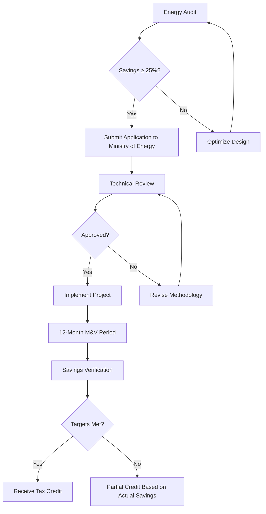
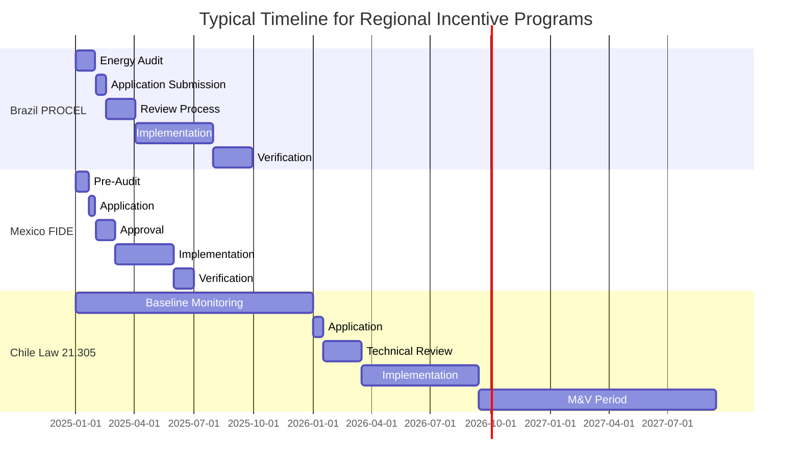

## Regional Policy Framework

Latin American countries have implemented diverse incentive structures for HVAC efficiency improvements, driven by urbanization pressures, climate commitments under the Paris Agreement, and energy security concerns. Programs vary significantly by country but share common objectives: reducing peak electrical demand, improving building energy performance, and transitioning to low-GWP refrigerants.

The effectiveness of incentive programs depends on standardized measurement protocols. Most Latin American programs reference adapted versions of ASHRAE Standard 90.1 or ISO 50001 energy management frameworks, with country-specific modifications for tropical and subtropical climates.

## Brazil Energy Efficiency Programs

### PROCEL Building Label (Etiqueta PBE Edifica)

Brazil's voluntary labeling program evaluates commercial buildings on a scale from A (most efficient) to E, with HVAC systems comprising 40-50% of the total score in tropical climates. Buildings achieving A-level ratings qualify for:

- Federal tax reduction up to 15% on IPTU (property tax)
- Accelerated depreciation schedules for energy-efficient equipment
- Preferential financing through BNDES (National Development Bank) at 2-4% below market rates

**Technical requirements for HVAC contributions:**

| Rating Level | Minimum COP | Maximum EER (Btu/Wh) | Duct Leakage (CFM25/100 ft²) |
|--------------|-------------|----------------------|-------------------------------|
| A            | 3.5         | 14.0                 | < 4.0                         |
| B            | 3.2         | 12.5                 | < 6.0                         |
| C            | 2.9         | 11.0                 | < 8.0                         |

The energy performance calculation follows:

$$
\text{EPI} = \frac{E_{\text{annual}}}{A_{\text{conditioned}}} \times \text{CF}_{\text{climate}}
$$

Where EPI is the Energy Performance Index (kWh/m²·year), $E_{\text{annual}}$ represents total annual energy consumption, $A_{\text{conditioned}}$ is conditioned floor area, and $\text{CF}_{\text{climate}}$ is the climate correction factor (0.85-1.15 depending on cooling degree days).

### INMETRO Efficiency Standards

The National Institute of Metrology (INMETRO) maintains mandatory minimum efficiency standards for air conditioning equipment. Units exceeding requirements by 20% qualify for state-level rebates averaging R$200-800 per ton of cooling capacity.

## Mexico HVAC Incentive Structure

### FIDE (Fideicomiso para el Ahorro de Energía Eléctrica)

FIDE administers Mexico's primary energy efficiency fund, offering direct subsidies for commercial and industrial HVAC upgrades:

**Commercial building incentives:**
- Up to 30% capital cost reimbursement for variable refrigerant flow (VRF) systems
- 25% subsidy for high-efficiency chillers (kW/ton < 0.60)
- Free energy audits for facilities exceeding 200 tons cooling capacity

**Calculation methodology for chiller incentives:**

$$
\text{Incentive} = (\text{Baseline kW/ton} - \text{Actual kW/ton}) \times \text{Capacity}_{\text{tons}} \times \text{FLH} \times \text{Cost}_{\text{kWh}} \times 3
$$

Where FLH represents full-load hours (typically 2000-3000 for Mexican commercial buildings) and the factor of 3 approximates the three-year payback threshold.

### NOM-020-ENER Standards

Mexican Official Standards (NOM) establish minimum seasonal energy efficiency ratios (SEER). Equipment exceeding NOM-020-ENER by ≥15% qualifies for accelerated tax deduction under Article 34 of the Income Tax Law, permitting 100% first-year depreciation versus standard 10-year schedules.

## Chile Energy Efficiency Programs

### Law 21.305 Energy Efficiency Framework

Chile's 2021 energy efficiency law mandates:
- Large buildings (>3,000 m²) must implement energy management systems
- HVAC retrofits achieving ≥25% energy reduction receive corporate tax credits equal to 50% of investment costs (capped at 15,000 UTM ≈ $900,000 USD)
- Public buildings must achieve LEED Gold or equivalent, creating procurement preferences for efficient HVAC technologies

**Verification requirements:**
- Pre/post-retrofit measurement and verification per ASHRAE Guideline 14
- Maximum 15% CV(RMSE) for monthly energy models
- Minimum 12-month baseline period

## Colombia Renewable Energy Incentives

Law 1715 provides benefits for renewable-powered HVAC systems:
- Income tax deduction of 50% of renewable energy investment
- VAT exemption (19%) on solar thermal equipment and geothermal heat pumps
- Tariff exemption on imported components for solar cooling systems

**Solar absorption chiller economics:**

For a 100-ton solar-assisted absorption chiller in Bogotá (1,800 annual sunshine hours):

$$
\text{Annual Savings} = \text{COP}_{\text{elec}} \times \frac{\text{Tons} \times 12,000 \text{ Btu/hr}}{\text{EER}_{\text{baseline}}} \times \text{FLH}
$$

With Law 1715 incentives reducing effective capital cost by approximately 60%, simple payback periods decrease from 12-15 years to 5-7 years.

## Argentina Energy Efficiency Programs

### PRONUREE (National Program for Rational and Efficient Energy Use)

Industrial facilities implementing HVAC efficiency measures qualify for:
- Subsidized technical assistance (covering 70% of audit costs)
- Low-interest financing (BADLAR rate minus 4 percentage points)
- Accelerated depreciation for qualifying investments

Minimum technical requirements include:
- Coefficient of performance (COP) ≥ 3.0 for chillers
- Variable speed drives on all fans and pumps >5 HP
- Economizer operation when $T_{\text{outdoor}} < T_{\text{return}} - 5°F$

## Costa Rica Green Building Incentives

Decree 37071-MINAE establishes tax exemptions for buildings meeting sustainable design criteria. HVAC-specific provisions include:

- 5-year exemption from import duties on high-efficiency equipment (SEER ≥ 16)
- Property tax reduction of 10% for buildings using renewable cooling technologies
- Accelerated permitting for projects incorporating natural ventilation per ASHRAE Standard 62.1 Section 5.1

## Peru Green Building Tax Benefits

Legislative Decree 1257 provides property tax reductions (10-25%) for buildings achieving EDGE (Excellence in Design for Greater Efficiencies) certification. HVAC systems must demonstrate:

- 20% energy reduction versus ASHRAE 90.1 baseline
- Refrigerants with GWP < 675
- Minimum 30% outdoor air economizer capacity for applicable climate zones

$$
\text{Tax Reduction} = 0.10 + \left(0.15 \times \frac{\text{Energy Savings} - 20\%}{30\%}\right)
$$

Maximum 25% reduction achieved at 50% energy savings.

## Regional Technical Considerations

### Tropical Climate Adaptations

Latin American incentive programs increasingly recognize climate-specific performance metrics. The cooling load intensity factor accounts for year-round cooling demands:

$$
\text{CLI} = \frac{\text{Peak Cooling Load (Btu/hr)}}{A_{\text{floor}} \text{ (ft²)}}
$$

Typical CLI values range from 25-35 Btu/hr·ft² for efficient tropical construction with proper shading and envelope design versus 45-60 Btu/hr·ft² for baseline buildings.

### Refrigerant Transition Incentives

Multiple countries offer enhanced incentives for low-GWP refrigerant adoption:

| Country   | Incentive Type                        | GWP Threshold | Additional Benefit    |
|-----------|---------------------------------------|---------------|-----------------------|
| Brazil    | PROCEL rating credit                  | < 150         | +5% efficiency score  |
| Chile     | Priority processing                   | Natural       | 30-day review cycle   |
| Mexico    | FIDE bonus                            | < 675         | +10% capital subsidy  |
| Colombia  | Extended tax credit period            | < 150         | 7 years vs. 5 years   |
| Argentina | Import duty exemption                 | Natural       | 100% tariff waiver    |

## Implementation Strategy

Successful program participation requires:

1. **Baseline documentation**: Establish 12-month pre-retrofit energy consumption with utility billing analysis or continuous monitoring per IPMVP protocols
2. **Performance modeling**: Demonstrate projected savings using DOE-2, EnergyPlus, or locally approved simulation tools calibrated to ASHRAE Guideline 14 standards
3. **Equipment verification**: Submit manufacturer performance data certified to local standards (INMETRO, NOM, NCh) or international equivalents (AHRI, Eurovent)
4. **Measurement and verification**: Implement monitoring systems meeting IPMVP Option B or C requirements with minimum 85% confidence intervals
5. **Long-term maintenance**: Maintain efficiency through commissioning per ASHRAE Guideline 0 and ongoing performance tracking

Programs typically require professional engineer certification for applications exceeding local currency equivalents of $50,000 USD investment. Documentation must include psychrometric analysis, load calculations per ASHRAE Handbook—Fundamentals, and lifecycle cost analysis demonstrating reasonable payback periods (typically 3-10 years depending on program).

## Application Process Comparison

The extended timelines for Chilean programs reflect stricter verification requirements but provide larger incentive values, often exceeding 50% of capital costs for qualifying projects.

