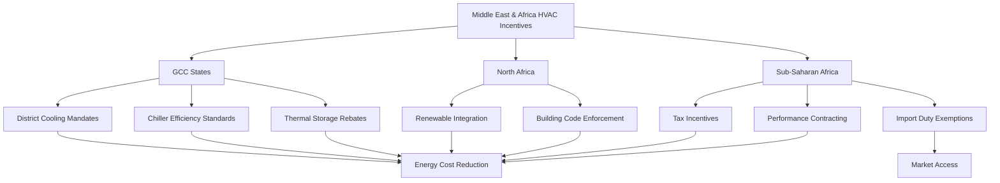

## Regional Climate Challenges and Policy Context

The Middle East and Africa regions face extreme thermal loads requiring intensive cooling systems. The Middle East experiences ambient temperatures exceeding 50°C (122°F) with coincident high humidity in coastal zones, while sub-Saharan Africa encounters diverse climates from equatorial to Mediterranean. Government incentive programs address these challenges through cooling efficiency mandates, district cooling promotion, and renewable energy integration.

Regional HVAC energy consumption accounts for 60-70% of peak electrical demand in Gulf Cooperation Council (GCC) states, creating critical infrastructure stress. Energy subsidy reform since 2015 has shifted policy toward efficiency incentives rather than consumption subsidies, fundamentally altering the economic framework for HVAC investments.

## United Arab Emirates Energy Efficiency Programs

### Dubai Supreme Council of Energy Initiatives

The Dubai Demand Side Management Strategy targets 30% energy demand reduction by 2030. Key HVAC-related incentives include:

**Chiller Efficiency Standards:**
- Minimum coefficient of performance (COP) requirements for new installations
- Retrofit subsidies for systems below baseline efficiency
- Performance-based rebates calculated using:

$$
\text{Rebate} = (\text{COP}_{\text{new}} - \text{COP}_{\text{baseline}}) \times \text{Annual kWh} \times \text{Rate}
$$

**District Cooling Integration:**
- Connection fee waivers for buildings within 500m of district cooling networks
- Reduced tariff structures: $0.05-0.07/kWh versus $0.12-0.15/kWh for conventional systems
- Capacity charge reductions: 25-40% below standalone chiller capital costs

### Abu Dhabi Estidama Program

The Estidama Pearl Rating System mandates minimum building efficiency standards with financial incentives:

| Pearl Rating | HVAC Efficiency Requirement | Municipality Fee Reduction |
|--------------|----------------------------|---------------------------|
| 1 Pearl | 20% below ASHRAE 90.1 baseline | 0% |
| 2 Pearl | 30% below baseline | 25% |
| 3 Pearl | 40% below baseline | 50% |
| 4 Pearl | 50% below baseline | 75% |
| 5 Pearl | Net zero energy | 100% |

Energy modeling must demonstrate compliance using approved simulation tools (EnergyPlus, IES-VE, or eQUEST) with weather data from the Typical Meteorological Year (TMY) for Abu Dhabi (24.4°N, 54.7°E).

## Saudi Arabia SEEC Initiatives

The Saudi Energy Efficiency Center (SEEC) implements the National Energy Services Company (ESCO) Program with government-backed financing:

**HVAC Performance Contracting:**
- Zero-interest loans up to SAR 50 million ($13.3 million) for verified energy savings projects
- Loan terms: 5-10 years based on simple payback period
- Eligible technologies: high-efficiency chillers (COP ≥ 6.0), thermal storage, heat recovery systems

**Tariff Structure Impact:**
Commercial electricity rates increased from $0.013/kWh to $0.048/kWh (2018 reform), improving HVAC efficiency project economics:

$$
\text{Simple Payback} = \frac{\text{Capital Cost}}{\text{Annual kWh Savings} \times 0.048 + \text{Demand Savings (kW)} \times 120}
$$

Where demand charges are $120/kW-month for commercial facilities.

**Thermal Energy Storage Incentives:**
- 30% capital cost rebate for ice storage or chilled water storage systems
- Time-of-use rates: $0.08/kWh peak (12:00-18:00), $0.03/kWh off-peak
- Load shifting potential calculated using:

$$
\text{Cost Savings} = Q_{\text{shifted}} \times (\text{Rate}_{\text{peak}} - \text{Rate}_{\text{off-peak}}) - \text{Storage Losses}
$$

## South Africa Energy Efficiency Tax Incentive (Section 12L)

Section 12L of the Income Tax Act provides tax deductions for verifiable energy savings:

**HVAC Eligible Measures:**
- Variable speed drive (VSD) installations on fans and pumps
- High-efficiency chillers and heat pumps
- Building management system (BMS) optimization
- Heat recovery and economizer systems

**Incentive Calculation:**
The tax deduction is R0.95/kWh saved (approximately $0.053/kWh at 2024 exchange rates) for energy savings exceeding 5% of baseline consumption. Verification requires accredited Measurement and Verification (M&V) professionals following SANS 50010 protocol.

For a commercial building retrofit:

$$
\text{Tax Deduction} = \text{Annual kWh Saved} \times 0.95 \text{ (ZAR)} \times \text{Marginal Tax Rate (28\%)}
$$

**Performance Requirements:**
- Minimum 12-month measurement period post-implementation
- Independent M&V report submitted to South African National Energy Development Institute (SANEDI)
- Baseline adjustment for operational changes per IPMVP Option C

## Kenya Renewable Energy and Energy Efficiency Programs

### Feed-in Tariff for Solar HVAC Systems

Kenya's Energy Act 2019 establishes feed-in tariffs for grid-connected solar PV systems supporting HVAC loads:

- Solar PV + HVAC integration: KES 12/kWh ($0.093/kWh) for 20-year power purchase agreements
- Net metering available for systems up to 1 MW capacity
- Import duty exemption on solar thermal collectors and absorption chillers

### VAT Exemption on Energy-Efficient Equipment

Value-added tax (16%) exemption applies to:
- Air conditioners with Energy Efficiency Ratio (EER) ≥ 3.5 (12.0 SEER equivalent)
- Heat pump water heaters with COP ≥ 3.0
- Variable refrigerant flow (VRF) systems meeting Kenya Bureau of Standards (KEBS) efficiency criteria

This exemption reduces installed costs by 16%, significantly improving project economics in price-sensitive markets.

## Regional Comparative Analysis

## Climate-Specific Design Considerations

Regional programs recognize extreme climate impacts on HVAC performance:

**Hot-Humid Coastal Zones (Dubai, Doha, Jeddah):**
- Cooling loads: 150-200 W/m² for commercial buildings
- Latent load fraction: 30-35% of total cooling
- Incentive programs favor enthalpy wheels and desiccant dehumidification systems

**Hot-Dry Inland Zones (Riyadh, Khartoum):**
- Cooling loads: 120-180 W/m² with high solar contribution
- Diurnal temperature swing: 15-20°C enabling free cooling
- Incentives support indirect evaporative cooling and thermal mass strategies

**Temperate Zones (Johannesburg, Nairobi):**
- Mixed heating and cooling requirements
- Emphasis on heat pump technology with reversible operation
- Incentive alignment with ASHRAE Standard 90.1 climate zone 3B-4A provisions

## Implementation Requirements and Verification

Regional programs generally require:

1. **Pre-qualification:** Engineering analysis demonstrating predicted energy savings using approved calculation methods (bin method, degree-day method, or hourly simulation)

2. **Equipment certification:** Third-party testing per AHRI, Eurovent, or equivalent regional standards

3. **Post-installation verification:** Functional performance testing per ASHRAE Guideline 1.1 or regional commissioning protocols

4. **Ongoing monitoring:** Continuous measurement for performance-based incentives using building automation systems (BAS) with data logging intervals ≤ 15 minutes

The effectiveness of these programs depends on enforcement mechanisms, technical capacity of implementation agencies, and alignment with broader energy sector reforms addressing subsidy rationalization and renewable energy integration targets.

## Components

- Uae Energy Efficiency Programs
- Saudi Arabia Seec Initiatives
- South Africa Energy Efficiency Incentives
- Kenya Renewable Energy Programs
