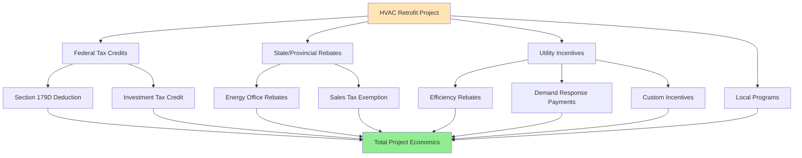

## Overview of North American HVAC Incentive Framework

North American governments at federal, state/provincial, and local levels provide substantial financial incentives for high-efficiency HVAC equipment installation and retrofit. These programs reduce first-cost barriers while accelerating market adoption of energy-efficient technologies. The incentive landscape spans direct rebates, tax credits, accelerated depreciation, low-interest financing, and performance-based payments.

The thermodynamic and economic rationale centers on the societal benefit of reduced peak electrical demand and decreased greenhouse gas emissions. HVAC systems represent 40-60% of commercial building energy consumption and 50-70% of residential energy use in climate-controlled spaces. Equipment efficiency improvements directly translate to grid load reduction and carbon intensity decrease.

## United States Federal Programs

### Federal Investment Tax Credit (ITC) - Commercial Buildings

The federal tax code under Section 25D and 48 provides investment tax credits for qualified HVAC equipment integrated with renewable energy systems. The credit applies to commercial geothermal heat pump installations at 30% of project cost through 2032, stepping down to 26% in 2033 and 22% in 2034.

**Eligible systems include:**

- Ground-source heat pumps meeting ENERGY STAR efficiency criteria
- Water-source heat pumps in commercial applications
- Direct geothermal exchange systems
- Absorption chillers powered by solar thermal collectors

The credit calculation basis includes equipment cost, installation labor, and commissioning expenses. For a commercial ground-source heat pump system with coefficient of performance (COP) of 4.2:

$$\text{Tax Credit} = 0.30 \times (\text{Equipment Cost} + \text{Installation} + \text{Controls})$$

$$\text{Example: } \$150,000 \text{ project} \times 0.30 = \$45,000 \text{ credit}$$

### Section 179D Commercial Building Deduction

Section 179D enables building owners to deduct up to $1.88 per square foot (inflation-adjusted from $1.80 base) for HVAC improvements that reduce total building energy consumption by 25% or more compared to ASHRAE 90.1-2007 baseline. Partial deductions apply for HVAC-only improvements meeting efficiency thresholds.

**Calculation methodology:**

$$D = A \times d \times \frac{E_{\text{actual}}}{E_{\text{target}}}$$

Where:
- D = total deduction ($)
- A = building area (ft²)
- d = deduction rate ($/ft²)
- E_actual = achieved energy reduction (%)
- E_target = threshold energy reduction (25%)

For HVAC systems specifically, the partial deduction reaches $0.63/ft² when heating and cooling systems achieve 15% energy reduction versus baseline. A 100,000 ft² building qualifies for $63,000 deduction at this threshold.

### Residential Clean Energy Credit (Section 25C)

Residential HVAC equipment qualifying under the Inflation Reduction Act receives tax credits up to $2,000 annually for heat pumps, heat pump water heaters, and biomass stoves meeting efficiency standards.

| Equipment Type | Maximum Credit | Efficiency Requirement |
|----------------|----------------|------------------------|
| Air-source heat pump | $2,000 | ENERGY STAR Most Efficient |
| Geothermal heat pump | 30% of cost (no cap) | ENERGY STAR certified |
| Central A/C | $600 | SEER2 ≥16, EER2 ≥12 |
| Gas furnace | $600 | AFUE ≥97% |
| Heat pump water heater | $2,000 | UEF ≥3.3 |
| Electrical panel upgrade | $600 | Required for heat pump |

The high-efficiency heat pump credit recognizes the thermodynamic advantage of vapor compression systems operating in heating mode. A heat pump with heating seasonal performance factor (HSPF2) of 10.0 delivers 10 units of heating energy per unit of electrical input, substantially exceeding resistance heating efficiency of 1.0.

## State and Utility Incentive Programs

### Tiered Rebate Structures

State energy offices and investor-owned utilities implement tiered rebate programs rewarding incremental efficiency improvements. The economic structure incentivizes adoption of equipment exceeding minimum federal standards.

**Typical commercial chiller rebate structure:**

| Efficiency Level | Full Load kW/ton | IPLV kW/ton | Rebate ($/ton) |
|------------------|------------------|-------------|----------------|
| ASHRAE 90.1 baseline | 0.780 | 0.700 | $0 |
| Tier 1 | 0.650 | 0.550 | $150 |
| Tier 2 | 0.550 | 0.480 | $300 |
| Tier 3 | 0.500 | 0.420 | $500 |

The rebate magnitude reflects utility avoided costs. Peak demand reduction from a 400-ton chiller improving from 0.700 kW/ton baseline to 0.500 kW/ton:

$$\Delta P = Q_{\text{cooling}} \times (\text{kW/ton}_{\text{base}} - \text{kW/ton}_{\text{improved}})$$

$$\Delta P = 400 \text{ tons} \times (0.700 - 0.500) = 80 \text{ kW demand reduction}$$

At utility avoided capacity cost of $200/kW-year, the 10-year avoided cost reaches $160,000, economically justifying the $200,000 total rebate (400 tons × $500/ton).

### Demand Response Incentive Programs

Demand response (DR) programs compensate building owners for temporary HVAC load reduction during grid stress events. Compensation structures include capacity payments ($/kW-year for committed availability) and energy payments ($/kWh for actual curtailment).

**DR program participation requirements:**

- Automated demand response (ADR) capability through building automation system
- Minimum curtailment commitment (typically 50-100 kW)
- Telemetry providing real-time power measurement
- Maximum response time (10-30 minutes from dispatch signal)

HVAC strategies for DR events include:

1. **Pre-cooling:** Lower setpoints 2-3°F during off-peak hours, storing sensible cooling capacity in building mass
2. **Global zone temperature reset:** Raise cooling setpoints 2-4°F during event
3. **Duty cycling:** Sequence HVAC zones on 15-minute rotations maintaining minimum ventilation
4. **Chiller demand limiting:** Reduce chilled water setpoint 4-6°F, accepting temporary zone temperature drift

The thermodynamic basis of pre-cooling leverages building thermal mass as energy storage. The sensible heat capacity relationship:

$$Q_{\text{storage}} = m \times c_p \times \Delta T$$

For concrete structure with equivalent mass of 2,000,000 lbm and specific heat 0.23 Btu/(lbm·°F), a 3°F temperature reduction stores:

$$Q = 2,000,000 \times 0.23 \times 3 = 1,380,000 \text{ Btu}$$

This stored cooling capacity supports 2-3 hour DR events with minimal occupant comfort impact.

## Canadian Provincial Programs

### Canada Greener Homes Grant

The federal Greener Homes Grant provides up to CAD $5,000 for residential HVAC upgrades following EnergyGuide home evaluation. Cold-climate air-source heat pumps qualify for maximum rebates due to heating decarbonization priority.

| Equipment Category | Rebate Amount (CAD) | Technical Requirement |
|--------------------|---------------------|----------------------|
| Cold-climate heat pump | $5,000 | HSPF ≥10 at -15°C |
| Ground-source heat pump | $5,000 | Energy Star certified |
| Secondary heat pump | $2,500 | Supplemental to existing system |
| Smart thermostat | $50 | ENERGY STAR certified |

The cold-climate specification recognizes performance degradation at low ambient temperatures. Conventional air-source heat pumps experience capacity reduction following:

$$Q_{\text{capacity}} = Q_{\text{rated}} \times \left(1 - k \times (T_{\text{rated}} - T_{\text{ambient}})\right)$$

Where degradation factor k ≈ 0.012/°F. Cold-climate models with enhanced vapor injection maintain heating capacity to -15°F (-26°C) outdoor temperature.

### Provincial Utility Rebates - British Columbia

BC Hydro and FortisBC offer stacked incentives for commercial HVAC retrofits, with particular emphasis on heat recovery and controls optimization.

**Commercial incentive schedule:**

- Variable refrigerant flow (VRF) systems: $400-600/ton depending on efficiency
- Energy recovery ventilators: $1.50/cfm recovered airflow
- Demand-controlled ventilation: $500/zone
- Economizer retrofits: $2,000-4,000/system
- Building automation upgrades: $0.10-0.15/ft² conditioned area

## Mexican Energy Efficiency Programs

### CFE ASI (Ahorro Sistemático Integral) Program

Mexico's federal electricity commission (Comisión Federal de Electricidad) administers the Systematic Comprehensive Savings program targeting commercial and industrial HVAC improvements. The program structure provides technical assistance, energy audits, and financial incentives for qualifying retrofits.

**Incentive calculation basis:**

$$I = kWh_{\text{annual saved}} \times \$_{\text{rate}} \times F_{\text{payback}}$$

Where F_payback ranges from 0.3-0.5 depending on project simple payback period. Projects with 2-year payback receive 50% cost coverage, while 5-year payback projects receive 30% coverage.

**Priority HVAC measures:**

- Chiller replacement (≥0.65 kW/ton efficiency improvement required)
- Variable frequency drives on constant-volume systems
- Cool roof integration reducing cooling loads
- High-efficiency evaporative cooling in arid climates
- Thermal insulation improvements

### FIDE (Fideicomiso para el Ahorro de Energía Eléctrica)

The Energy Savings Trust provides zero-interest financing for qualified commercial HVAC projects with payback periods under 5 years. The financing structure eliminates first-cost barriers while maintaining project economic viability.

## Incentive Stacking and Optimization

Strategic incentive stacking maximizes financial return. A commercial building owner in California replacing a 500-ton chilled water plant combines:

1. **Federal 179D deduction:** $0.63/ft² × 200,000 ft² = $126,000 tax benefit
2. **Utility rebate:** 500 tons × $400/ton = $200,000 direct rebate
3. **Demand response enrollment:** 150 kW × $150/kW-year = $22,500 annual payment
4. **Accelerated depreciation:** MACRS 7-year schedule on remaining cost basis

The combined incentives reduce effective first cost by 35-50% while generating ongoing demand response revenue, substantially improving project internal rate of return.

## Program Participation Strategy

### Documentation Requirements

Rigorous documentation ensures incentive payment approval. Critical submittals include:

- **Pre-installation approval:** Equipment specifications confirming efficiency thresholds
- **Utility account information:** Establishing baseline energy consumption
- **Installation verification:** Contractor certification, photos, commissioning reports
- **Performance monitoring:** Metered data demonstrating energy savings
- **Tax documentation:** IRS forms, professional engineer certification for 179D

### Timing Considerations

Program funding cycles create strategic timing imperatives. Many state and utility programs operate on fiscal year budgets with first-come, first-served allocation. Project completion by year-end captures expiring tax benefits and annual rebate caps.

Federal tax credit phasedowns require multi-year planning for large capital projects. Geothermal heat pump installations benefit from accelerating project timelines before 2033 when ITC steps down from 30% to 26%.

## Economic Analysis Framework

Net present value analysis incorporating all incentive layers determines project viability:

$$\text{NPV} = -C_0 + \sum_{t=1}^{n} \frac{S_t - O_t}{(1+r)^t} + \sum_{t=1}^{n} \frac{I_t}{(1+r)^t}$$

Where:
- C₀ = initial capital cost minus direct rebates
- S_t = energy savings in year t
- O_t = incremental O&M costs in year t
- I_t = incentive payments in year t (DR, tax benefits)
- r = discount rate
- n = analysis period

The incentive components (I_t) often transform marginally economic projects into strongly positive NPV investments, justifying adoption of premium-efficiency equipment that would otherwise fail financial screening criteria.

## Components

- Energy Star Rebates USA
- Federal Tax Credits USA
- State Utility Incentives USA
- Demand Response Incentives USA
- Residential Renewable Energy Tax Credit
- Commercial 179D Tax Deduction
- Canadian Home Efficiency Rebate
- Canadian Greener Homes Grant
- Mexico CFE ASI Program
- Mexico Energy Efficiency Trust
