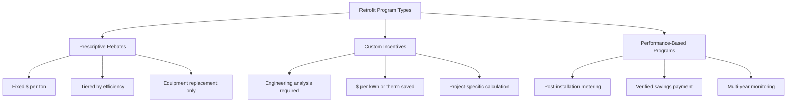

## Overview of HVAC Retrofit Programs

Government retrofit programs provide financial incentives to upgrade existing HVAC systems, targeting energy efficiency improvements in residential, commercial, and industrial facilities. These programs reduce first costs, accelerate payback periods, and drive market transformation toward high-efficiency equipment.

Retrofit programs typically incentivize equipment replacement based on energy efficiency metrics (SEER, EER, IEER, AFUE), with rebate amounts scaled to performance improvements over baseline standards.

## Economic Fundamentals of Retrofit Incentives

### Simple Payback Calculation

The payback period quantifies return on investment for HVAC retrofits:

$$
\text{Payback Period (years)} = \frac{\text{Incremental First Cost} - \text{Rebate}}{\text{Annual Energy Savings}}
$$

Where annual energy savings derive from reduced operating hours and improved equipment efficiency:

$$
\text{Annual Savings} = \text{FLH} \times \text{Load} \times \left(\frac{1}{\text{EER}_{\text{old}}} - \frac{1}{\text{EER}_{\text{new}}}\right) \times \text{Cost}_{\text{electricity}}
$$

**FLH** = Full Load Hours (typical values: 1000-2000 h/yr residential cooling, 2000-4000 h/yr commercial)

### Energy Savings Verification

Programs utilize measurement and verification (M&V) protocols per ASHRAE Guideline 14 to quantify actual savings:

$$
\text{Normalized Savings} = \frac{\text{Baseline Energy} - \text{Post-Retrofit Energy}}{\text{Heating/Cooling Degree Days}}
$$

Baseline adjustments account for weather normalization, occupancy changes, and operational schedule variations.

## Program Structure and Delivery Models

### Prescriptive Programs

Prescriptive rebates provide fixed incentive amounts based on equipment efficiency ratings. Eligibility typically requires:

- Minimum SEER/EER thresholds (commonly SEER ≥16, EER ≥13 for residential)
- AHRI certification of rated performance
- Licensed contractor installation
- Proper sizing per ACCA Manual J/S methodology

Prescriptive rebates simplify administration but may not capture savings from improved controls, economizers, or system optimization.

### Custom Incentive Programs

Custom programs calculate incentives based on engineering analysis of specific project savings:

$$
\text{Incentive} = \text{Savings}_{\text{kWh/year}} \times \text{Rate}_{\text{\$/kWh}} \times \text{Incentive Rate}
$$

Typical incentive rates range from $0.05-0.15/kWh for commercial projects, with caps at 50% of incremental cost.

## Sector-Specific Program Characteristics

| Sector | Typical Equipment | Incentive Range | Payback Target |
|--------|------------------|----------------|----------------|
| Residential | Central AC, heat pumps, furnaces | $300-2,000/unit | 3-7 years |
| Small Commercial | Rooftop units 3-25 tons | $100-400/ton | 2-5 years |
| Large Commercial | Chillers, boilers, VRF | $50-150/ton | 3-6 years |
| Industrial | Process cooling, air compressors | $0.08-0.12/kWh saved | 1-3 years |
| Municipal | Central plants, district systems | Custom calculation | 5-10 years |

## Technical Requirements and Standards

### Efficiency Thresholds

Programs establish minimum efficiency requirements above federal standards:

**Air-Cooled Chillers (AHRI 550/590):**
- Baseline: IPLV 9.5 EER (≥150 tons)
- Incentive threshold: IPLV ≥13.0 EER
- Premium tier: IPLV ≥15.0 EER

**Variable Refrigerant Flow (VRF):**
- Cooling EER ≥11.0
- Heating COP ≥3.3 at 47°F
- IEER ≥14.0 for part-load performance

### Installation Quality Requirements

Programs increasingly mandate proper installation practices per ACCA Standard 5 and ANSI/ASHRAE Standard 180:

- Duct leakage testing (≤6% total leakage to outdoors)
- Airflow verification (350-450 CFM/ton)
- Refrigerant charge verification (±5% of manufacturer specification)
- Combustion efficiency testing for furnaces (≥80% steady-state efficiency)

## Energy Impact Calculation Methodology

### Cooling Energy Reduction

For air conditioning retrofit from SEER 10 to SEER 16 system:

$$
\text{Annual kWh Savings} = \frac{\text{Design Load (Btu/h)} \times \text{FLH}}{\text{EER}_{\text{seasonal}}} \times \left(\frac{1}{\text{SEER}_{\text{old}}} - \frac{1}{\text{SEER}_{\text{new}}}\right)
$$

Example: 3-ton (36,000 Btu/h) residential AC, 1200 FLH/year:

$$
\text{Savings} = \frac{36,000 \times 1200}{3.413} \times \left(\frac{1}{10} - \frac{1}{16}\right) = 3,164 \text{ kWh/year}
$$

At $0.12/kWh, annual savings = $380. With $1,500 rebate reducing net cost from $7,000 to $5,500, payback = 14.5 years without rebate vs. 7.2 years with rebate.

### Heating Energy Reduction

Gas furnace upgrade from 80% AFUE to 95% AFUE:

$$
\text{Annual Therm Savings} = \frac{\text{Heating Load (Btu/year)}}{\text{Heating Value}_{\text{gas}}} \times \left(\frac{1}{\text{AFUE}_{\text{old}}} - \frac{1}{\text{AFUE}_{\text{new}}}\right)
$$

With 100 MMBtu/year heating load:

$$
\text{Savings} = \frac{100 \times 10^6}{100,000} \times \left(\frac{1}{0.80} - \frac{1}{0.95}\right) = 197 \text{ therms/year}
$$

## Program Performance Metrics

### Utility Cost of Conserved Energy

Programs evaluate cost-effectiveness using the Utility Cost Test (UCT):

$$
\text{CCE} = \frac{\text{Program Cost} + \text{Incentive}}{\sum_{t=1}^{n} \frac{\text{Annual kWh Savings}}{(1+d)^t}}
$$

Where **d** = discount rate (typically 3-6% real). Programs target CCE below avoided cost of supply (generation + transmission + distribution).

### Participant Cost-Effectiveness

Total Resource Cost (TRC) test evaluates societal benefit:

$$
\text{TRC Ratio} = \frac{\text{PV(Energy Savings + Demand Savings)}}{\text{PV(Program Costs + Participant Costs)}}
$$

Ratio >1.0 indicates net economic benefit. Most programs require TRC ≥1.25 to account for uncertainty and non-energy benefits.

## Emerging Program Innovations

### Connected Equipment Programs

Advanced programs incentivize smart thermostats and equipment with demand response capability:

- Grid-interactive controls enabling peak load reduction
- Real-time performance monitoring and fault detection
- Automated optimization based on occupancy and weather forecasts

Incentives typically $50-150 per device, with additional capacity payments for demand response participation.

### Heat Pump Conversion Programs

Electrification programs incentivize fuel switching from fossil fuels to electric heat pumps:

$$
\text{Source Energy Ratio} = \frac{\text{Gas Use}_{\text{baseline}} \times 1.05}{\text{Electricity Use}_{\text{HP}} \times 3.14}
$$

Site-to-source conversion factors per ASHRAE 90.1 Appendix C. Programs require ratio ≤1.0 for net source energy savings.

### Midstream and Upstream Programs

Emerging models provide incentives to distributors and manufacturers rather than end-users:

- Reduced administrative burden on customers
- Market transformation through supply chain engagement
- Enhanced compliance and quality assurance

Distributor rebates typically 60-80% of end-user rebate level, with point-of-sale discount to customer.

## Program Participation Barriers

Technical barriers limiting retrofit adoption:

- **Split incentives** in rented properties (owner pays capital cost, tenant receives energy savings)
- **Financing constraints** for upfront costs despite positive cash flow
- **Information asymmetry** regarding equipment performance and contractor quality
- **Disruption costs** from installation downtime in occupied facilities

Programs address barriers through complementary measures: direct install programs, on-bill financing, contractor training, and technical assistance.

## Integration with Building Performance Standards

Retrofit programs increasingly align with mandatory performance standards:

- **Building Performance Standards (BPS)** require periodic energy benchmarking and improvement targets
- **Energy Use Intensity (EUI)** limits trigger mandatory retrofits
- Programs provide financial pathway to compliance with regulatory requirements

ASHRAE Standard 100 (Energy Efficiency in Existing Buildings) provides technical framework for identifying and implementing cost-effective retrofits.

## Components

- Equipment Replacement Incentives
- Hvac Upgrade Rebates
- Insulation Incentive Programs
- Air Sealing Incentives
- Lighting Upgrade Programs
- Window Replacement Incentives
- Residential Sector Programs
- Commercial Sector Programs
- Industrial Sector Programs
- Municipal Building Programs
