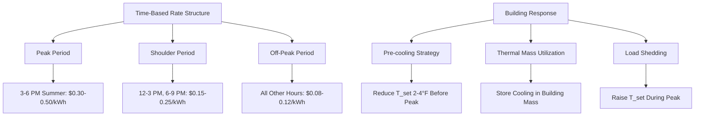

Utility-sponsored programs represent demand-side management (DSM) initiatives designed to reduce peak electrical demand, improve load factors, and defer infrastructure investments. These programs offer financial incentives for high-efficiency HVAC equipment while simultaneously reducing utility capacity requirements and improving grid stability.

## Program Structure and Economics

Utility programs operate on the principle that reducing customer demand costs less than generating additional capacity. The economic justification follows from avoided capacity costs:

$$\text{Program Value} = C_{\text{capacity}} \times \Delta P_{\text{peak}} + C_{\text{energy}} \times \Delta E_{\text{annual}} - C_{\text{incentive}}$$

Where $C_{\text{capacity}}$ represents the avoided cost per kW of peak demand (typically $100-300/kW annually), $\Delta P_{\text{peak}}$ is the reduction in peak demand, $C_{\text{energy}}$ is the avoided energy cost per kWh, and $\Delta E_{\text{annual}}$ is the annual energy reduction. Programs remain viable when total avoided costs exceed incentive expenditures plus administrative overhead.

## Incentive Program Types

### Equipment Replacement Programs

Direct rebates compensate customers for purchasing high-efficiency equipment exceeding minimum code requirements. Typical incentive structures:

| Equipment Type | Efficiency Threshold | Incentive Range | Peak Demand Reduction |
|----------------|---------------------|-----------------|----------------------|
| Central AC (residential) | SEER ≥ 16 | $300-800/unit | 0.5-1.0 kW/ton |
| Heat pump (residential) | HSPF ≥ 9.0 | $500-1200/unit | 0.8-1.5 kW/ton |
| RTU (commercial) | IEER ≥ 13.0 | $75-150/ton | 0.3-0.6 kW/ton |
| Chiller (commercial) | 0.55 kW/ton or better | $25-100/ton | Per ASHRAE 90.1 baseline |
| VFD on HVAC motors | Any existing motor ≥5 HP | $100-200/HP | 20-40% of motor HP |
| ECM blowers | Replace PSC motors | $50-150/motor | 0.2-0.5 kW/motor |

### Custom Incentive Programs

Large commercial and industrial projects receive customized incentives based on engineering calculations. The incentive calculation follows:

$$I = \min(C_{\text{project}} \times f_{\text{cap}}, \, \Delta E_{\text{annual}} \times C_{\text{incentive}})$$

Where $f_{\text{cap}}$ represents the maximum incentive fraction of project cost (typically 0.3-0.5), and $C_{\text{incentive}}$ ranges from $0.05-0.15/kWh of first-year savings. Programs impose maximum simple payback requirements (3-7 years post-incentive) to ensure measure persistence.

## Load Management Strategies

### Direct Load Control Programs

Utilities install control devices on customer equipment to cycle operation during peak demand events. The demand reduction capacity follows:

$$P_{\text{available}} = N_{\text{units}} \times P_{\text{unit}} \times f_{\text{duty}} \times f_{\text{response}}$$

Where $N_{\text{units}}$ is the enrolled equipment count, $P_{\text{unit}}$ is the average unit demand, $f_{\text{duty}}$ is the duty cycle reduction (0.5 for 50% cycling), and $f_{\text{response}}$ accounts for customer opt-outs and equipment already off (typically 0.7-0.8). Residential central AC programs provide 0.8-1.2 kW per controlled ton during peak events.

### Time-of-Use and Critical Peak Pricing

Rate structures incentivize HVAC load shifting through price signals:

Pre-cooling effectiveness depends on building thermal mass and envelope characteristics. The achievable peak load reduction follows:

$$\Delta P_{\text{peak}} = \frac{C_{\text{thermal}} \times \Delta T}{t_{\text{event}}} - Q_{\text{envelope}}$$

Where $C_{\text{thermal}}$ represents building thermal capacitance (Btu/°F), $\Delta T$ is the temperature swing during the event, $t_{\text{event}}$ is the peak period duration, and $Q_{\text{envelope}}$ accounts for heat gain through the envelope during the event.

## Technical Requirements and Verification

### Equipment Qualification Standards

Programs require third-party certification to recognized standards:

- **AHRI certification** for unitary equipment and chillers
- **ASHRAE 90.1 baseline compliance** for custom measures
- **CEE Tier specifications** for premium efficiency levels
- **ENERGY STAR qualification** for packaged equipment

### Measurement and Verification Protocols

Utilities verify savings using IPMVP (International Performance Measurement and Verification Protocol) approaches:

| M&V Option | Application | Accuracy | Cost |
|------------|-------------|----------|------|
| Deemed savings | Residential equipment replacement | ±20% | Low |
| Stipulated calculation | Small commercial projects | ±15% | Low-Medium |
| Retrofit isolation | Individual measure verification | ±10% | Medium |
| Whole-building calibration | Large custom projects | ±5% | High |

Deemed savings for HVAC measures incorporate coincidence factors relating annual energy savings to peak demand reduction:

$$\text{CF} = \frac{\Delta E_{\text{annual}} / 8760}{\Delta P_{\text{peak}}}$$

Typical coincidence factors range from 0.3-0.5 for cooling equipment in peak-driven utilities, reflecting that peak demand occurs during limited hours annually.

## Program Implementation Considerations

### Contractor Network Management

Successful programs maintain approved contractor lists with training requirements:

- Equipment sizing per ACCA Manual J procedures
- Duct design following ACCA Manual D standards
- Airflow verification to ±10% of design
- Refrigerant charge verification per manufacturer specifications
- Combustion safety testing for fuel-fired equipment

### Quality Installation Verification

Post-installation inspections verify proper equipment performance. Critical verification points include:

- Airflow measurement: 350-450 CFM per ton for comfort cooling
- Static pressure: Total external static ≤ manufacturer specifications
- Temperature split: 18-22°F for properly charged AC systems
- Refrigerant charge: Superheat/subcooling within manufacturer tolerances
- Economizer operation: Functional testing across all control modes

Verification identifies that 30-40% of new installations exhibit deficiencies affecting efficiency and capacity, justifying quality assurance protocols.

## Performance Metrics and Reporting

Utilities track program effectiveness through standard metrics:

- **Levelized cost of saved energy**: Total program cost divided by lifetime kWh savings (target: $0.02-0.05/kWh)
- **Cost per peak kW reduced**: Total incentive plus administrative costs divided by verified peak demand reduction (target: $200-600/kW)
- **Benefit-cost ratio**: Utility avoided costs divided by total program costs (target: >1.25 for program viability)
- **Net-to-gross ratio**: Actual program-induced savings divided by claimed savings, accounting for free riders (typical: 0.6-0.8)

Programs delivering levelized costs below marginal generation and capacity costs provide economic value to the utility system while reducing customer energy costs and improving equipment reliability.
