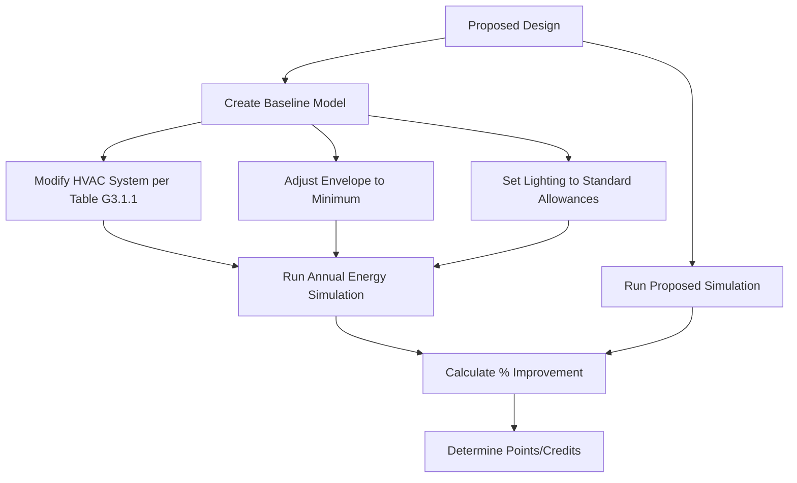

## Overview of Green Building Rating Systems

Green building rating systems provide standardized frameworks for evaluating building performance across environmental, health, and economic dimensions. HVAC systems represent the largest single contributor to building energy consumption, typically accounting for 40-60% of total energy use, making them critical to achieving certification requirements.

The primary rating systems differ in their geographical focus, evaluation criteria, and scoring methodologies, but all emphasize energy efficiency, indoor environmental quality, and operational performance.

## Major Rating System Comparison

| Rating System | Origin | Geographic Focus | HVAC Weight | Primary Metrics |
|--------------|--------|------------------|-------------|-----------------|
| LEED | USA | Global | 33 points | Energy & Atmosphere |
| BREEAM | UK | Europe/Global | 19% total | Energy category |
| Green Star | Australia | Asia-Pacific | 25 points | Energy section |
| DGNB | Germany | Europe | 22.5% | Technical quality |
| WELL | USA | Global | 21 concepts | Air, Thermal comfort |
| Living Building Challenge | USA | Global | Net Zero Energy | Performance-based |

## LEED HVAC Requirements

### Energy Performance Path

LEED v4.1 awards up to 18 points for energy performance based on percentage improvement over ASHRAE 90.1 baseline:

$$E_{improvement} = \frac{E_{baseline} - E_{proposed}}{E_{baseline}} \times 100\%$$

Points are awarded on a sliding scale:

- 6% improvement: 1 point
- 50% improvement: 18 points (new construction)
- Net Zero Energy: 20 points

### Minimum Energy Performance

All projects must demonstrate 5% improvement over ASHRAE 90.1-2016 Appendix G baseline through whole-building energy modeling. The baseline HVAC system is determined by building type, size, and number of floors according to Table G3.1.1.

### Indoor Air Quality Prerequisites

**Minimum IAQ Performance**: Outdoor air delivery must meet ASHRAE 62.1 requirements with verification through design calculations showing:

$$V_{oz} = R_p \times P_z + R_a \times A_z$$

Where ventilation rates account for occupant density and floor area.

**Environmental Tobacco Smoke Control**: HVAC systems serving areas within 25 feet of building entries require exhaust or pressurization strategies to prevent smoke infiltration.

## BREEAM Energy Assessment

### Energy Performance Certificate

BREEAM awards credits based on the Energy Performance Certificate (EPC) rating under UK Building Regulations Part L or equivalent international standards:

- A+ rating: 15 credits
- A rating: 12 credits
- B rating: 9 credits

### Energy Monitoring

Permanent sub-metering of HVAC systems is required with monitoring points for:
- Heating systems (boilers, heat pumps)
- Cooling systems (chillers, DX units)
- Ventilation fans and air handling equipment
- Pumping systems

Data must be accessible for building management and trend analysis at intervals no greater than 30 minutes.

## Energy Modeling Requirements

### ASHRAE 90.1 Appendix G Methodology

The performance rating method requires creation of a baseline building identical to the proposed design except for specific modifications:

### Critical HVAC Modeling Parameters

**System Efficiency**: Equipment efficiency must match manufacturer specifications or AHRI certification data:

$$COP_{chiller} = \frac{Q_{cooling}}{W_{compressor} + W_{auxiliaries}}$$

**Fan Power**: Total system fan power limited by pressure drop calculations:

$$P_{fan} = \frac{Q \times \Delta P}{\eta_{fan} \times \eta_{motor}} \times 6356$$

Where P is in watts, Q in cfm, and ΔP in inches water column.

**Economizer Operation**: Per ASHRAE 90.1, economizers required for cooling systems ≥54,000 Btu/h in climate zones 3B, 3C, 4-8. Models must include economizer control logic and damper positions.

## Thermal Comfort and Indoor Air Quality

### WELL Building Standard Requirements

WELL Feature A01 (Air Quality Standards) mandates:
- PM2.5 ≤ 15 μg/m³ (annual average)
- PM10 ≤ 50 μg/m³ (annual average)
- Ozone ≤ 51 ppb (8-hour average)
- CO ≤ 9 ppm (8-hour average)
- NO₂ ≤ 53 ppb (annual average)

HVAC filtration must achieve minimum MERV 13 for all outdoor and return air.

### Thermal Comfort Compliance

ASHRAE Standard 55 compliance required for certification with verification through:

$$PMV = f(M, I_{cl}, T_a, T_r, V_a, RH)$$

The Predicted Mean Vote accounts for metabolic rate, clothing insulation, air temperature, radiant temperature, air velocity, and relative humidity. Acceptable range: -0.5 < PMV < +0.5 for 90% satisfaction.

## Commissioning Requirements

### Enhanced Commissioning (LEED EA Credit)

Beyond fundamental commissioning, enhanced commissioning includes:

1. **Design Review**: Commissioning authority reviews HVAC design at 50%, 90%, and 100% completion
2. **Systems Manual**: Comprehensive documentation including sequence of operations, control diagrams, and set points
3. **Training**: Two separate training sessions for operations staff
4. **Seasonal Testing**: Verification under both heating and cooling conditions
5. **Post-Occupancy Review**: Performance evaluation 8-10 months after substantial completion

### Functional Performance Testing

Critical HVAC tests include:
- Airflow verification at all terminal devices (±10% tolerance)
- Temperature control verification (±1°F of set point)
- Economizer operation across all control modes
- DDC point-to-point checkout
- Trending of system performance data

## Measurement and Verification

### IPMVP Protocol Application

The International Performance Measurement and Verification Protocol provides standardized approaches:

**Option B - Retrofit Isolation**: Direct measurement of HVAC system energy using dedicated meters:

$$Savings = (E_{baseline,adjusted} - E_{post-installation}) \pm Adjustments$$

**Option D - Calibrated Simulation**: Whole-building energy model calibrated to actual utility data with monthly error:

$$MBE = \frac{\sum_{i=1}^{12}(M_i - S_i)}{\sum_{i=1}^{12}M_i} \times 100\%$$

Target: MBE within ±5% and CV(RMSE) within ±15%.

## Carbon Accounting

### Operational Carbon from HVAC

Annual HVAC carbon emissions calculated from energy consumption and grid carbon intensity:

$$CO_2_{annual} = \sum(E_{electric} \times CI_{grid} + E_{fuel} \times EF_{fuel})$$

Where CI represents carbon intensity (kg CO₂/kWh) and EF represents emission factor for fossil fuels.

### Embodied Carbon Considerations

Refrigerant global warming potential increasingly factored into rating systems:

$$CO_{2,eq} = M_{refrigerant} \times GWP \times L_{annual}$$

Low-GWP refrigerants (R-32, R-454B, R-513A) reduce lifecycle carbon impact by 50-75% compared to R-410A.

## Certification Strategy for HVAC Design

### Point Optimization Approach

1. **Energy Performance**: Maximum points through aggressive efficiency measures (variable speed drives, heat recovery, high-efficiency equipment)
2. **Refrigerant Management**: 1-2 points through low-GWP selection and leak detection
3. **Enhanced Commissioning**: 3-6 points through comprehensive verification
4. **Thermal Comfort**: 1 point through ASHRAE 55 compliance demonstration
5. **Advanced Metering**: 1 point through detailed sub-metering strategy

High-performance HVAC design targeting 30-40% energy savings above code baseline enables achievement of Gold or Platinum certification levels while providing superior indoor environmental quality and reduced operating costs.
