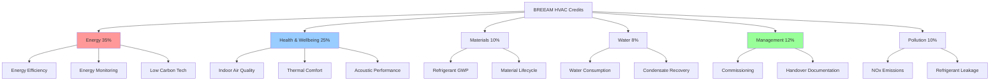

## Overview

BREEAM (Building Research Establishment Environmental Assessment Method) represents the world's first environmental assessment method for buildings, established in 1990 by the Building Research Establishment (BRE) in the United Kingdom. HVAC systems play a critical role in achieving BREEAM credits across multiple assessment categories, particularly in Energy, Health & Wellbeing, and Management sections.

The BREEAM framework evaluates buildings across nine categories, with HVAC systems directly impacting approximately 40-50% of available credits. Performance is measured through a weighted scoring system, resulting in certification levels: Pass (≥30%), Good (≥45%), Very Good (≥55%), Excellent (≥70%), and Outstanding (≥85%).

## Energy Performance Credits

### Energy Efficiency Requirements

BREEAM Ene 01 credits reward reductions in operational energy and CO₂ emissions compared to a notional building baseline. The energy performance calculation uses the Building Emission Rate (BER) methodology:

$$
\text{Energy Credits} = \frac{BER_{notional} - BER_{actual}}{BER_{notional}} \times 100\%
$$

where:
- $BER_{notional}$ = emission rate for baseline building (kg CO₂/m²·yr)
- $BER_{actual}$ = emission rate for actual design (kg CO₂/m²·yr)

HVAC systems must demonstrate significant improvements over Part L Building Regulations minimums to achieve higher credit levels. A 25% improvement yields approximately 6-8 credits, while 100% improvement (net zero carbon) achieves maximum credits (15 points).

### Low Carbon Design Strategies

BREEAM Ene 04 awards credits for low and zero carbon (LZC) technologies that offset building energy demand. HVAC-related technologies include:

**Heat Pump Installations:**
The seasonal coefficient of performance (SCOP) determines effective carbon reduction:

$$
\text{Carbon Offset} = Q_{thermal} \times \left(1 - \frac{1}{SCOP \times \eta_{grid}}\right) \times CF_{displaced}
$$

where:
- $Q_{thermal}$ = annual thermal energy delivered (kWh/yr)
- $SCOP$ = seasonal coefficient of performance (typically 2.5-4.5)
- $\eta_{grid}$ = grid electricity carbon factor relative to displaced fuel
- $CF_{displaced}$ = carbon factor of displaced heating fuel (kg CO₂/kWh)

Ground source heat pumps with SCOP > 4.0 provide greater carbon reductions than air source units (SCOP 2.5-3.5) for equivalent capacity.

## Health & Wellbeing Credits

### Indoor Air Quality Performance

BREEAM Hea 02 credits require ventilation systems to meet or exceed ventilation effectiveness standards. The assessment uses age-of-air efficiency:

$$
\epsilon_a = \frac{\tau_n}{\overline{\tau}_p}
$$

where:
- $\epsilon_a$ = air change effectiveness (dimensionless)
- $\tau_n$ = nominal time constant (room volume/supply airflow rate)
- $\overline{\tau}_p$ = mean age of air in occupied zone (measured or CFD-calculated)

Displacement ventilation systems achieving $\epsilon_a > 1.1$ earn additional credits compared to conventional mixing ventilation ($\epsilon_a \approx 1.0$).

### Thermal Comfort Criteria

Hea 04 credits require thermal modeling demonstrating compliance with adaptive comfort standards per CIBSE Guide A or ASHRAE Standard 55. The predicted percentage dissatisfied (PPD) must not exceed 10% for occupied hours:

$$
PMV = \left[0.303 \cdot e^{-0.036M} + 0.028\right] \times L
$$

where:
- $PMV$ = predicted mean vote (thermal sensation scale)
- $M$ = metabolic rate (W/m²)
- $L$ = thermal load on body (function of activity, clothing, air temperature, radiant temperature, humidity, air speed)

HVAC systems must maintain PMV between -0.5 and +0.5 for maximum credits.

## BREEAM HVAC Credit Distribution

## Commissioning and Performance Verification

### Management Credits (Man 02)

BREEAM requires comprehensive commissioning following CIBSE Commissioning Code M or equivalent. Credits are awarded based on:

| Commissioning Level | Credits | Requirements |
|---------------------|---------|--------------|
| Basic | 1 | Functional testing per manufacturer specifications |
| Intermediate | 2 | Seasonal commissioning, controls verification |
| Enhanced | 3 | Performance monitoring, fine-tuning after 12 months occupancy |
| Advanced | 4 | Continuous commissioning with BMS integration, energy verification |

**Pre-Commissioning Verification:**
Air handling unit performance must be verified against design specifications with tolerance limits:

$$
\text{Performance Ratio} = \frac{Q_{measured}}{Q_{design}} \times \frac{\Delta P_{design}}{\Delta P_{measured}}
$$

Acceptable performance ratio: 0.95-1.05 for credit achievement.

### Building User Guide (Man 03)

HVAC systems require comprehensive documentation including:
- Seasonal operating schedules with setpoint temperatures
- Maintenance intervals for filters, coils, dampers
- Energy consumption benchmarks with monitoring protocols
- Fault diagnosis procedures for common system issues

## Refrigerant Impact Assessment

### Materials Credits (Mat 05)

BREEAM Pollution 02 credits assess refrigerant environmental impact through total equivalent warming impact (TEWI):

$$
TEWI = GWP \times \left(L_{annual} \times n + m \times (1-\alpha_{recovery})\right) + n \times E_{annual} \times \beta
$$

where:
- $GWP$ = global warming potential (kg CO₂-eq/kg refrigerant)
- $L_{annual}$ = annual leakage rate (kg/yr)
- $n$ = system operating life (years)
- $m$ = refrigerant charge (kg)
- $\alpha_{recovery}$ = end-of-life recovery factor (0.7-0.95)
- $E_{annual}$ = annual energy consumption (kWh/yr)
- $\beta$ = carbon intensity of electricity (kg CO₂/kWh)

Systems using low-GWP refrigerants (R-32, R-1234yf, natural refrigerants) with GWP < 675 earn maximum credits.

## BREEAM vs LEED HVAC Requirements Comparison

| Criterion | BREEAM | LEED v4 |
|-----------|--------|---------|
| Energy modeling baseline | Part L Building Regs | ASHRAE 90.1 Appendix G |
| Minimum ventilation rate | BB101 or CIBSE Guide A | ASHRAE 62.1 |
| Thermal comfort standard | CIBSE TM52 / EN 15251 | ASHRAE 55 |
| Commissioning authority | Independent or in-house | Independent CxA required |
| Refrigerant threshold | GWP < 675 for credits | GWP < 50 for exemplary |
| Energy monitoring | Building-level required | System-level preferred |
| Performance period | 12 months verification | Optional (LEED v4.1) |

## Acoustic Performance Requirements

BREEAM Hea 05 awards credits for acoustic performance in occupied spaces. HVAC noise contributions must not exceed:

| Space Type | Maximum LAeq,T (dB) | Maximum NR Rating |
|------------|---------------------|-------------------|
| Cellular offices | 40 | NR 35 |
| Open plan offices | 45 | NR 40 |
| Meeting rooms | 35 | NR 30 |
| Lecture halls | 35 | NR 30 |

HVAC system sound power level at terminal devices:

$$
L_{p,room} = L_w + 10\log_{10}\left(\frac{Q}{4\pi r^2} + \frac{4}{R_{room}}\right)
$$

where:
- $L_{p,room}$ = sound pressure level in room (dB)
- $L_w$ = sound power level at source (dB)
- $Q$ = directivity factor (typically 2 for ceiling-mounted units)
- $r$ = distance from source (m)
- $R_{room}$ = room constant (function of absorption)

Low-velocity duct design (≤4 m/s in occupied spaces) and vibration isolation achieve compliance more readily than high-velocity systems requiring extensive attenuation.

## Energy Monitoring and Sub-Metering

BREEAM Ene 02 requires sub-metering of HVAC energy consumption separately from other building loads. Minimum metering resolution:

- Heating system primary energy input
- Cooling system electrical consumption
- Air handling unit fan power
- Auxiliary pumps and controls

Data collection frequency must support monthly energy analysis with automated trending capabilities. BMS integration enables granular fault detection, with energy consumption deviations >15% from baseline triggering investigation protocols per CIBSE TM39 guidance.

---

*BREEAM assessment methodology continues evolving, with 2023 updates emphasizing operational performance verification and in-use energy ratings. HVAC system design for BREEAM projects requires integrated analysis spanning energy efficiency, occupant comfort, environmental impact, and long-term performance verification to achieve Excellent and Outstanding ratings.*
