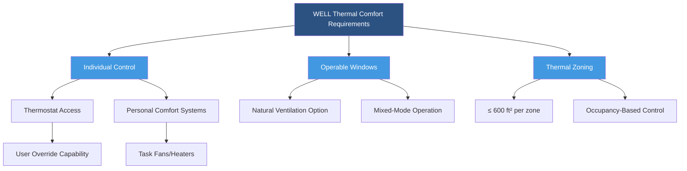
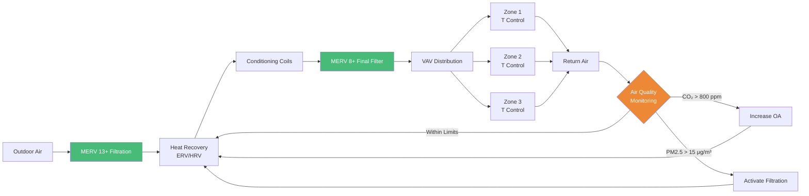

The WELL Building Standard represents a performance-based system measuring, certifying, and monitoring features of the built environment that impact human health and well-being. For HVAC professionals, WELL certification demands rigorous attention to air quality, thermal comfort, moisture management, and ventilation effectiveness—requirements that often exceed conventional building codes.

## WELL Air Concept Requirements

The Air concept forms the foundation of WELL's HVAC-related requirements, establishing stringent thresholds for indoor air quality parameters.

### Ventilation Design Parameters

WELL mandates minimum outdoor air ventilation rates based on ASHRAE 62.1 with enhanced requirements for specific space types:

**Minimum ventilation effectiveness:**

$$\varepsilon_v = \frac{C_e - C_s}{C_r - C_s} \geq 0.9$$

Where:
- $\varepsilon_v$ = ventilation effectiveness (dimensionless)
- $C_e$ = exhaust air contaminant concentration (ppm)
- $C_s$ = supply air contaminant concentration (ppm)
- $C_r$ = room average contaminant concentration (ppm)

WELL Feature A01 requires minimum outdoor air rates of:

| Space Type | WELL Requirement | ASHRAE 62.1 Baseline |
|------------|------------------|---------------------|
| Office (density 7/1000 ft²) | 17 CFM/person | 5 CFM/person + 0.06 CFM/ft² |
| Classroom | 12 CFM/person | 10 CFM/person |
| Retail | 10 CFM/person | 7.5 CFM/person |
| Gym/Fitness | 20 CFM/person | 20 CFM/person |

### Air Filtration Standards

WELL Feature A02 establishes minimum MERV ratings significantly higher than conventional practice:

**Particle removal efficiency:**

$$\eta_p = 1 - \frac{C_{down}}{C_{up}}$$

Where:
- $\eta_p$ = particle removal efficiency (fraction)
- $C_{down}$ = downstream particle concentration (particles/m³)
- $C_{up}$ = upstream particle concentration (particles/m³)

| Filter Location | WELL Minimum | Conventional Practice |
|----------------|--------------|---------------------|
| Outdoor air intake | MERV 13 | MERV 8 |
| Recirculation air | MERV 8 | MERV 6-8 |
| High-risk areas | MERV 14-16 | MERV 11 |

The pressure drop across high-efficiency filters requires careful fan selection:

$$\Delta P_f = K \cdot v^2 \cdot \left(1 + \alpha \cdot m_d\right)$$

Where:
- $\Delta P_f$ = filter pressure drop (Pa)
- $K$ = clean filter coefficient (Pa·s²/m²)
- $v$ = face velocity (m/s)
- $\alpha$ = dust loading coefficient (m²/g)
- $m_d$ = dust mass per unit area (g/m²)

## Thermal Comfort Compliance

WELL Feature T01 requires thermal conditions meeting ASHRAE Standard 55 with enhanced monitoring and control capabilities.

### Thermal Comfort Calculation

**Predicted Mean Vote (PMV) must remain within:**

$$-0.5 \leq PMV \leq +0.5$$

The PMV calculation incorporates six factors:

$$PMV = f(M, W, I_{cl}, t_a, \bar{t_r}, v_{ar}, p_a)$$

Where:
- $M$ = metabolic rate (met)
- $W$ = external work (typically 0 for office work)
- $I_{cl}$ = clothing insulation (clo)
- $t_a$ = air temperature (°C)
- $\bar{t_r}$ = mean radiant temperature (°C)
- $v_{ar}$ = relative air velocity (m/s)
- $p_a$ = water vapor partial pressure (Pa)

## Moisture Management Requirements

WELL Feature W02 mandates humidity control to prevent mold growth and maintain occupant comfort:

**Relative humidity bounds:**

$$30\% \leq RH \leq 60\%$$

The moisture removal rate required for dehumidification:

$$\dot{m}_w = \rho \cdot \dot{V} \cdot (W_{in} - W_{out})$$

Where:
- $\dot{m}_w$ = moisture removal rate (kg/s)
- $\rho$ = air density (kg/m³)
- $\dot{V}$ = volumetric flow rate (m³/s)
- $W_{in}$ = inlet humidity ratio (kg water/kg dry air)
- $W_{out}$ = outlet humidity ratio (kg water/kg dry air)

## WELL HVAC System Integration

## Air Quality Monitoring Requirements

WELL Feature A07 requires continuous monitoring of:

| Parameter | Threshold | Measurement Interval |
|-----------|-----------|---------------------|
| PM2.5 | ≤ 15 μg/m³ annual avg | 10 minutes |
| PM10 | ≤ 50 μg/m³ annual avg | 10 minutes |
| Ozone | ≤ 51 ppb 8-hr avg | Continuous |
| Carbon Monoxide | ≤ 9 ppm 8-hr avg | Continuous |
| Carbon Dioxide | ≤ 800 ppm above outdoor | Continuous |
| Formaldehyde | ≤ 27 ppb | Quarterly |
| Total VOCs | ≤ 500 μg/m³ | Quarterly |

The sensor placement density requirement:

$$n_{sensors} = \frac{A_{floor}}{f_{coverage}} \geq n_{min}$$

Where:
- $n_{sensors}$ = number of sensors required
- $A_{floor}$ = floor area (ft²)
- $f_{coverage}$ = coverage factor (7,500 ft²/sensor for PM, 2,500 ft²/sensor for CO₂)
- $n_{min}$ = minimum sensors per floor (typically 1)

## Energy Recovery Requirements

WELL Feature A04 mandates energy recovery ventilation for climate zones with significant heating or cooling loads:

**Enthalpy recovery effectiveness:**

$$\varepsilon_h = \frac{h_{supply} - h_{outdoor}}{h_{exhaust} - h_{outdoor}}$$

Where:
- $\varepsilon_h$ = enthalpy effectiveness (fraction)
- $h_{supply}$ = supply air enthalpy after recovery (kJ/kg)
- $h_{outdoor}$ = outdoor air enthalpy (kJ/kg)
- $h_{exhaust}$ = exhaust air enthalpy (kJ/kg)

WELL requires minimum effectiveness of 60% sensible and 50% latent for Energy Recovery Ventilators (ERV).

## Sound and Vibration Control

WELL Feature S02 establishes maximum background noise levels for HVAC systems:

| Space Type | Maximum Background Noise (dBA) | NC Curve |
|------------|-------------------------------|----------|
| Private Office | 40 | NC 35 |
| Open Office | 45 | NC 40 |
| Conference Room | 35 | NC 30 |
| Classroom | 35 | NC 30 |
| Healthcare Patient Room | 35 | NC 30 |

The sound power attenuation through ductwork:

$$L_{out} = L_{in} - \alpha \cdot L - 10 \log_{10}\left(\frac{A_{out}}{A_{in}}\right)$$

Where:
- $L_{out}$ = outlet sound pressure level (dB)
- $L_{in}$ = inlet sound pressure level (dB)
- $\alpha$ = attenuation coefficient (dB/m)
- $L$ = duct length (m)
- $A_{out}, A_{in}$ = outlet and inlet duct areas (m²)

## Implementation Strategies

Achieving WELL certification requires integrated design approaches:

1. **Oversized filtration sections** to accommodate MERV 13+ filters while maintaining acceptable pressure drops below 0.8 in. w.g. at design flow
2. **Dedicated outdoor air systems (DOAS)** to decouple ventilation from thermal loads, enabling superior humidity control
3. **Demand-controlled ventilation** with CO₂ sensors maintaining levels below 800 ppm above outdoor concentrations
4. **Individual thermal comfort control** providing user adjustment within ±3°F of setpoint
5. **Low-velocity distribution** limiting terminal velocities to 500 FPM to minimize noise generation

The total system static pressure increase from enhanced filtration:

$$\Delta P_{total} = \Delta P_{MERV8} + \Delta P_{MERV13-MERV8}$$

Typically adds 0.3-0.5 in. w.g., requiring fan selection with adequate pressure capability and motor efficiency to maintain WELL Feature A09 demand ventilation requirements.

WELL Building Standard transforms HVAC design from code-minimum compliance to health-optimized performance, demanding sophisticated engineering analysis, continuous monitoring, and integrated building systems that prioritize occupant well-being alongside energy efficiency.
