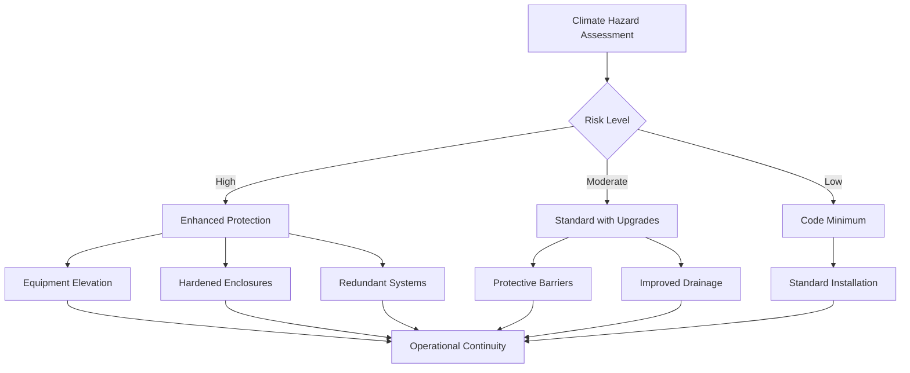
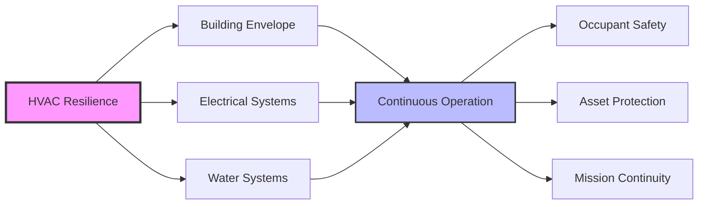

# Resilience and Climate Adaptation in HVAC Systems

Climate resilience in HVAC design addresses system performance under extreme conditions, operational continuity during disruptions, and adaptation to long-term climate trends. Engineering resilient systems requires analyzing thermal loads under stress conditions, designing redundancy strategies, and implementing adaptive control algorithms.

## Climate Change Impact on HVAC Design

### Temperature Extremes

Rising design temperatures affect cooling capacity and energy consumption. The design cooling load adjustment follows:

$$Q_{design,future} = Q_{design,current} \times \frac{(T_{o,future} - T_{i})}{(T_{o,current} - T_{i})}$$

Where:
- $Q_{design,future}$ = Future design cooling load (Btu/hr)
- $Q_{design,current}$ = Current design cooling load (Btu/hr)
- $T_{o,future}$ = Projected outdoor design temperature (°F)
- $T_{o,current}$ = Current outdoor design temperature (°F)
- $T_{i}$ = Indoor setpoint temperature (°F)

ASHRAE Research Project 1613 provides climate projections for design conditions through 2100. Equipment capacity must accommodate projected temperature increases of 3-9°F in most U.S. climate zones by 2050.

### Humidity and Latent Load Impacts

Increasing absolute humidity raises latent cooling loads. The latent load change calculation:

$$Q_{latent,change} = \dot{m}_{air} \times (W_{future} - W_{current}) \times h_{fg}$$

Where:
- $\dot{m}_{air}$ = Air mass flow rate (lb/hr)
- $W_{future}$ = Future humidity ratio (lb water/lb dry air)
- $W_{current}$ = Current humidity ratio (lb water/lb dry air)
- $h_{fg}$ = Latent heat of vaporization ≈ 1,060 Btu/lb

## Resilience Design Strategies

### Equipment Redundancy

| Redundancy Level | Configuration | Availability | Application |
|------------------|---------------|--------------|-------------|
| N+1 | One backup unit | 99.5-99.9% | Critical facilities |
| N+2 | Two backup units | 99.9-99.99% | Data centers, hospitals |
| 2N | Fully redundant | 99.99%+ | Mission critical |
| Distributed | Multiple smaller units | 99-99.5% | Commercial buildings |

Redundancy cost-effectiveness analysis:

$$ROI_{redundancy} = \frac{(C_{downtime} \times P_{failure} \times T_{recovery}) - C_{redundancy}}{C_{redundancy}}$$

Where:
- $C_{downtime}$ = Cost per hour of system failure ($/hr)
- $P_{failure}$ = Annual probability of primary system failure
- $T_{recovery}$ = Expected recovery time (hours)
- $C_{redundancy}$ = Capital cost of redundant capacity ($)

### Passive Survivability

Buildings must maintain habitable conditions during mechanical system failures. The thermal drift time without active cooling:

$$t_{drift} = \frac{M_{total} \times c_{p} \times (T_{limit} - T_{initial})}{Q_{gains} - Q_{passive}}$$

Where:
- $t_{drift}$ = Time to reach temperature limit (hours)
- $M_{total}$ = Building thermal mass (lb)
- $c_{p}$ = Specific heat capacity (Btu/lb·°F)
- $T_{limit}$ = Upper temperature limit (°F)
- $T_{initial}$ = Initial interior temperature (°F)
- $Q_{gains}$ = Internal and solar heat gains (Btu/hr)
- $Q_{passive}$ = Passive heat rejection (Btu/hr)

ASHRAE Standard 55 defines thermal stress limits. Core interior spaces should maintain temperatures below 90°F for at least 4 hours after system failure.

## Extreme Weather Preparedness

### Flood Protection

Equipment elevation requirements follow FEMA guidelines for base flood elevation (BFE):

- Critical equipment: BFE + 2 feet minimum
- Outdoor units: Platform or rooftop mounting in flood zones
- Electrical components: Waterproof enclosures rated IP67 or higher

Submersion risk for ground-level equipment:

$$P_{flood} = 1 - e^{-\lambda \times t}$$

Where:
- $P_{flood}$ = Probability of flooding event
- $\lambda$ = Annual flood frequency (events/year)
- $t$ = Time period (years)

### Wind and Hurricane Resistance

ASCE 7 specifies wind load design for rooftop equipment. Anchorage force requirements:

$$F_{wind} = q_{z} \times G \times C_{f} \times A_{f}$$

Where:
- $F_{wind}$ = Design wind force (lb)
- $q_{z}$ = Velocity pressure at height z (psf)
- $G$ = Gust effect factor (typically 0.85)
- $C_{f}$ = Force coefficient (1.4-2.0 for equipment)
- $A_{f}$ = Projected area (ft²)

Hurricane-rated equipment requires wind resistance to 150+ mph in coastal zones. Seismic bracing per ASCE 7 Chapter 13 prevents displacement during earthquakes.

### Power Resilience

Backup power systems maintain critical HVAC functions during outages:

| System Type | Start Time | Runtime | Application |
|-------------|------------|---------|-------------|
| UPS | Instantaneous | 15-60 min | Controls, critical loads |
| Battery storage | <1 second | 2-8 hours | Bridging power |
| Natural gas generator | 10-30 seconds | Days-weeks | Full building backup |
| Diesel generator | 10-30 seconds | Days | Emergency power |
| Microgrid with solar | Varies | Indefinite | Resilient facilities |

Generator sizing for HVAC loads:

$$P_{generator} = (P_{cooling} + P_{heating} + P_{fans} + P_{pumps}) \times 1.25$$

The 1.25 factor accounts for motor starting currents and future load growth.

## Adaptive Control Strategies

### Predictive Response

Model predictive control (MPC) adjusts operation based on weather forecasts. Pre-cooling before extreme heat events reduces peak demand:

$$Q_{precool} = M \times c_{p} \times (T_{normal} - T_{precool})$$

Where:
- $Q_{precool}$ = Energy stored in thermal mass (Btu)
- $M$ = Building thermal mass (lb)
- $T_{normal}$ = Normal setpoint (°F)
- $T_{precool}$ = Pre-cooling setpoint (°F)

Pre-cooling by 3-5°F can defer peak loads by 2-4 hours, reducing strain during grid stress events.

### Demand Response Integration

Automated demand response (ADR) maintains comfort while reducing consumption during emergencies. Load shedding hierarchy:

1. Supply air temperature reset (+2°F)
2. Ventilation reduction to code minimum
3. Zone setpoint adjustment (±2°F)
4. Non-critical area shutdown

Total shed potential:

$$P_{shed} = P_{baseline} \times \sum_{i=1}^{n} (r_{i} \times f_{i})$$

Where:
- $P_{shed}$ = Total power reduction (kW)
- $P_{baseline}$ = Baseline HVAC power (kW)
- $r_{i}$ = Load reduction fraction for strategy i
- $f_{i}$ = Fraction of building area affected

## Future-Proofing Design Decisions

### Oversizing Considerations

Traditional practice avoids oversizing due to efficiency penalties. Climate adaptation requires intentional capacity margins:

$$CF_{design} = 1 + (r_{climate} \times t_{lifetime}) + r_{uncertainty}$$

Where:
- $CF_{design}$ = Design capacity factor
- $r_{climate}$ = Annual climate trend rate (typically 0.01-0.03)
- $t_{lifetime}$ = Equipment design life (15-25 years)
- $r_{uncertainty}$ = Uncertainty margin (0.05-0.15)

A 20-25% capacity margin accommodates climate trends without significant efficiency loss in variable-capacity equipment.

### Material Selection

Corrosion-resistant materials extend equipment life in changing environments:

| Environment | Material | Coating | Expected Life |
|-------------|----------|---------|---------------|
| Coastal/salt | Aluminum with epoxy | E-coat + powder coat | 15-20 years |
| High humidity | Stainless steel | Marine-grade finish | 20-25 years |
| Extreme heat | Copper-nickel alloy | Anodized | 20-30 years |
| Standard | Galvanized steel | Standard paint | 10-15 years |

## Integration with Building Resilience

Coordinated resilience planning addresses:

- **Thermal envelope**: Enhanced insulation extends passive survivability
- **Electrical infrastructure**: Redundant feeds and backup power
- **Water supply**: Closed-loop systems reduce external dependencies
- **Controls**: Distributed architecture prevents single-point failures

## Performance Metrics

Resilience quantification enables comparison and optimization:

$$R_{HVAC} = \frac{\int_{t_0}^{t_r} Q(t) \, dt}{Q_{nominal} \times t_{r}}$$

Where:
- $R_{HVAC}$ = System resilience metric (0-1)
- $Q(t)$ = Cooling/heating capacity at time t (Btu/hr)
- $Q_{nominal}$ = Rated capacity (Btu/hr)
- $t_r$ = Recovery time to full capacity (hours)

Values above 0.8 indicate highly resilient systems maintaining 80%+ functionality during disruptions.

Resilience investments balance upfront costs against long-term risk reduction, operational continuity value, and climate adaptation requirements. Design decisions made today determine building performance for 30+ year operational lifespans spanning significant climate change impacts.
