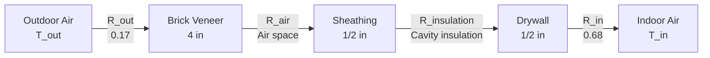

# Building Envelope Heat Transfer & Thermal Performance Analysis

Building envelope thermal performance determines heating and cooling loads, occupant comfort, and energy efficiency. This guide covers heat transfer mechanisms, U-value calculations, thermal bridging, fenestration performance, infiltration, and moisture control for residential and commercial building design.

## Heat Transfer Mechanisms

### Steady-State Conduction Through Walls

**Fourier's Law (one-dimensional conduction):**

$$q = -k \cdot A \cdot \frac{dT}{dx}$$

Where:
- $q$ = heat transfer rate (Btu/hr)
- $k$ = thermal conductivity (Btu·in/hr·ft²·°F or Btu/hr·ft·°F)
- $A$ = area (ft²)
- $dT/dx$ = temperature gradient (°F/ft)

**For composite wall (series resistance):**

$$q = \frac{A \cdot \Delta T}{R_{total}} = U \cdot A \cdot \Delta T$$

Where:
- $R_{total}$ = total thermal resistance (ft²·°F·hr/Btu)
- $U$ = overall heat transfer coefficient (Btu/hr·ft²·°F)
- $\Delta T$ = temperature difference (°F)

**Total resistance:**

$$R_{total} = R_{out} + R_{1} + R_{2} + ... + R_{n} + R_{in}$$

Where:
- $R_{out}$ = exterior surface film resistance
- $R_{1}, R_{2}, ...$ = material layer resistances
- $R_{in}$ = interior surface film resistance

**Surface film coefficients (still air):**

| Surface | Winter (15 mph wind) | Summer (7.5 mph wind) |
|---------|----------------------|-----------------------|
| Exterior vertical wall | R = 0.17 | R = 0.25 |
| Interior vertical wall | R = 0.68 | R = 0.68 |
| Horizontal surface (heat flow up) | R = 0.61 | R = 0.61 |
| Horizontal surface (heat flow down) | R = 0.92 | R = 0.92 |

**Material resistance:**

$$R = \frac{L}{k}$$

Where:
- $L$ = thickness (ft or in)
- $k$ = thermal conductivity (Btu/hr·ft·°F or Btu·in/hr·ft²·°F)

### U-Value Calculation

**Overall heat transfer coefficient:**

$$U = \frac{1}{R_{total}}$$

**Example: Insulated wall assembly:**

**Resistance calculation:**

| Layer | Thickness | k or R | Resistance |
|-------|-----------|--------|------------|
| Outside air film | — | — | 0.17 |
| Brick veneer | 4 in | k = 5.0 | 4/5.0 = 0.80 |
| Air space (3/4") | — | — | 1.01 |
| Sheathing (OSB) | 1/2 in | k = 0.62 | 0.5/0.62 = 0.81 |
| Fiberglass batt | 5.5 in | R-19 | 19.00 |
| Gypsum drywall | 1/2 in | k = 1.11 | 0.5/1.11 = 0.45 |
| Inside air film | — | — | 0.68 |
| **Total** | — | — | **R-22.92** |

**U-value:** $U = 1/22.92 = 0.044$ Btu/hr·ft²·°F

<h3>Worked Example 1: Wall Heat Loss Calculation</h3>

**Given:**
- Wall area: 1,000 ft²
- Wall assembly: R-22.92 (from table above)
- Indoor temperature: 70°F
- Outdoor temperature: 10°F (winter design)

**Find:** Heat loss through wall

**Solution:**

$$q = U \cdot A \cdot \Delta T$$

$$q = 0.044 \times 1,000 \times (70 - 10) = 2,640 \text{ Btu/hr}$$

**Annual heating energy (simplified, 5,500 HDD):**

$$E_{annual} = U \cdot A \cdot HDD \times 24$$

$$E_{annual} = 0.044 \times 1,000 \times 5,500 \times 24 = 5,808,000 \text{ Btu} = 5.8 \text{ MMBtu}$$

At $3/therm natural gas (100,000 Btu, 80% furnace efficiency):

$$Cost = \frac{5,808,000}{100,000 \times 0.80} \times 3.00 = \$218$$

**Answer:** Peak heat loss: 2,640 Btu/hr; Annual cost: ~$218

## Thermal Bridging

**Thermal bridge:** Conductive path through insulation (studs, structural members)

**Effect:** Local U-value increase, condensation risk, reduced overall R-value

### Parallel Path Method

**For walls with framing:**

$$U_{effective} = (U_{cavity} \times f_{cavity}) + (U_{framing} \times f_{framing})$$

Where:
- $f_{cavity}$ = fraction of wall area with cavity insulation
- $f_{framing}$ = fraction of wall area with framing (studs)

**Typical framing fractions:**
- 2×4 studs @ 16" o.c.: 15-20% framing
- 2×6 studs @ 24" o.c.: 10-15% framing
- Steel studs @ 16" o.c.: 25% framing (worse thermal bridging)

**Example:**
- Cavity R-value: R-19 (fiberglass between studs)
- Framing R-value: R-5 (wood studs through cavity)
- Framing fraction: 15%

$$U_{eff} = (1/19 \times 0.85) + (1/5 \times 0.15) = 0.045 + 0.030 = 0.075$$

$$R_{eff} = 1/0.075 = 13.3$$

**Thermal bridging reduces R-19 wall to effective R-13.3 (30% reduction)**

### Mitigation Strategies

1. **Continuous exterior insulation:** Eliminates thermal bridges
   - Rigid foam over sheathing (1-2 in typical)
   - Adds R-5 to R-10 without bridging

2. **Advanced framing:** Reduce framing fraction
   - 24" o.c. spacing instead of 16"
   - Single top plate, eliminate headers on non-bearing walls
   - Reduces framing to 10-12%

3. **Structural insulated panels (SIPs):** Minimal thermal bridging
   - Effective R-value ≈ 95% of nominal

4. **Thermal break in steel framing:** Critical for metal buildings
   - Z-girts with thermal spacers
   - Exterior insulation over studs

## Fenestration Performance

### Window and Glazing U-Values

**Window performance metrics:**
- **U-factor:** Overall heat transfer coefficient (lower is better)
- **SHGC (Solar Heat Gain Coefficient):** Fraction of solar radiation transmitted (0-1)
- **VT (Visible Transmittance):** Fraction of visible light transmitted (0-1)

**Typical residential window U-factors (NFRC rated):**

| Glazing Type | Frame | U-factor (Btu/hr·ft²·°F) | SHGC |
|--------------|-------|--------------------------|------|
| Single clear | Aluminum | 1.30 | 0.76 |
| Single clear | Vinyl | 1.00 | 0.75 |
| Double clear | Aluminum | 0.80 | 0.70 |
| Double clear | Vinyl | 0.50 | 0.70 |
| Double low-E (ε=0.10) | Vinyl | 0.30 | 0.40 |
| Triple low-E, argon | Vinyl | 0.20 | 0.35 |

**Low-emissivity (low-E) coating:** Reduces radiant heat transfer between panes
- $\epsilon$ = 0.84 (clear glass)
- $\epsilon$ = 0.10 (hard-coat low-E)
- $\epsilon$ = 0.04 (soft-coat low-E)

**Gas fill:** Argon or krypton between panes reduces conduction
- Air: k = 0.015 Btu/hr·ft·°F
- Argon: k = 0.010 Btu/hr·ft·°F (reduces U-factor ~10%)
- Krypton: k = 0.005 Btu/hr·ft·°F (expensive, thin gaps)

### Solar Heat Gain

**Solar heat gain through windows:**

$$Q_{solar} = A_{window} \times SHGC \times I_{solar}$$

Where:
- $A_{window}$ = glazing area (ft²)
- $SHGC$ = solar heat gain coefficient (0-1)
- $I_{solar}$ = incident solar radiation (Btu/hr·ft²)

**Peak solar radiation (clear day, perpendicular surface):**
- South-facing vertical: 200-250 Btu/hr·ft² (winter)
- West-facing vertical: 180-220 Btu/hr·ft² (summer afternoon)
- Horizontal (roof): 250-300 Btu/hr·ft² (summer)

**Shading coefficient (older metric):**

$$SC = \frac{SHGC_{actual}}{SHGC_{reference}} \approx 1.15 \times SHGC$$

Where reference is single clear glass (SHGC ≈ 0.87)

## Infiltration and Air Leakage

### Air Leakage Measurement

**Blower door test:** Pressurize building to 50 Pa, measure airflow

**Metrics:**
- **ACH50:** Air changes per hour at 50 Pa pressure
- **CFM50:** Cubic feet per minute leakage at 50 Pa

**Typical ACH50 values:**
- Existing homes (no air sealing): 8-15 ACH50
- Standard new construction: 4-7 ACH50
- Energy Star homes: 3-5 ACH50
- Passive House: < 0.6 ACH50

**Conversion to natural infiltration:**

$$ACH_{natural} = \frac{ACH_{50}}{N}$$

Where $N$ = 20 typical (depends on climate, shielding, height)

**Infiltration heat loss:**

$$Q_{inf} = \rho \cdot c_p \cdot V \cdot ACH \cdot \Delta T$$

Simplified:

$$Q_{inf} = 1.08 \times CFM_{inf} \times \Delta T$$

<h3>Worked Example 2: Infiltration Load</h3>

**Given:**
- House volume: 12,000 ft³
- Blower door result: ACH50 = 5.0
- Indoor: 70°F
- Outdoor: 20°F (winter design)

**Find:** Infiltration heat loss

**Solution:**

Natural air changes:
$$ACH_{natural} = \frac{5.0}{20} = 0.25 \text{ ACH}$$

Infiltration airflow:
$$CFM_{inf} = \frac{12,000 \times 0.25}{60} = 50 \text{ CFM}$$

Sensible heat loss:
$$Q_{inf,s} = 1.08 \times 50 \times (70 - 20) = 2,700 \text{ Btu/hr}$$

Latent heat loss (winter, small):
$$Q_{inf,l} \approx 0$$

**Answer:** 2,700 Btu/hr infiltration heat loss

**For tight house (ACH50 = 2.0):**
$$Q_{inf,tight} = 1.08 \times 20 \times 50 = 1,080 \text{ Btu/hr}$$

**Savings:** 1,620 Btu/hr (60% reduction)

## Thermal Mass Effects

**Thermal mass:** Material capacity to store and release heat

**Heat storage capacity:**

$$Q_{stored} = m \cdot c_p \cdot \Delta T = \rho \cdot V \cdot c_p \cdot \Delta T$$

Where:
- $\rho$ = density (lb/ft³)
- $c_p$ = specific heat (Btu/lb·°F)
- $V$ = volume (ft³)

**Volumetric heat capacity:**

$$C_v = \rho \cdot c_p$$

**Materials:**

| Material | ρ (lb/ft³) | c_p (Btu/lb·°F) | C_v (Btu/ft³·°F) |
|----------|-----------|----------------|------------------|
| Concrete | 140 | 0.20 | 28 |
| Brick | 120 | 0.20 | 24 |
| Gypsum | 50 | 0.26 | 13 |
| Wood | 35 | 0.45 | 16 |
| Water | 62.4 | 1.00 | 62 |

**Benefit:** Thermal mass dampens temperature swings, reduces peak loads

**Example:** Concrete floor slab (4 in thick, 1,000 ft²)
- Volume: $1,000 \times 4/12 = 333$ ft³
- Mass: $333 \times 140 = 46,667$ lb
- Heat capacity: $46,667 \times 0.20 = 9,333$ Btu/°F

**Temperature swing reduction:** 10°F swing → 5°F swing with thermal mass

## Moisture Control and Condensation

### Vapor Diffusion

**Fick's Law (vapor diffusion):**

$$\dot{m}_v = -M \cdot A \cdot \frac{dP_v}{dx}$$

Where:
- $\dot{m}_v$ = vapor mass flow rate (lb/hr)
- $M$ = permeance (perm = grains/hr·ft²·in Hg)
- $dP_v/dx$ = vapor pressure gradient

**Permeability:** $M = \mu/L$ (material property / thickness)

**Vapor retarder classifications:**
- **Class I (impermeable):** < 0.1 perm (polyethylene sheet, foil)
- **Class II (semi-impermeable):** 0.1-1.0 perm (kraft paper, some paints)
- **Class III (semi-permeable):** 1-10 perm (latex paint)

### Condensation Risk

**Dewpoint temperature:** Temperature at which moisture condenses

**At each layer interface, check:**

$$T_{interface} > T_{dewpoint}$$

If $T_{interface} < T_{dewpoint}$, condensation occurs.

**Condensation prevention strategies:**

1. **Warm-side vapor retarder:** Prevent moisture entry into wall
2. **Exterior insulation:** Keep sheathing warm (above dewpoint)
3. **Ventilation:** Remove moisture from building
4. **Dehumidification:** Control indoor humidity (< 40% RH winter)

---

**Related Technical Guides:**
- [Material Thermal Properties](/technical-guides/material-thermal-properties/)
- [Heat Transfer Fundamentals](/technical-guides/heat-transfer-fundamentals/)
- [Heating Load Calculations](/technical-guides/heating-load-calculations/)
- [Cooling Load Calculations](/technical-guides/cooling-load-calculations/)
- [Psychrometric Fundamentals](/technical-guides/psychrometric-fundamentals/)

**References:**
- ASHRAE Fundamentals Handbook, Chapter 26: Heat, Air, and Moisture Control in Building Assemblies
- ASHRAE Fundamentals Handbook, Chapter 25: Thermal and Water Vapor Transmission Data
- Building Science Corporation: www.buildingscience.com
- Lstiburek, J., "Builder's Guide to Cold Climates"
- Straube, J., "High Performance Enclosures"
