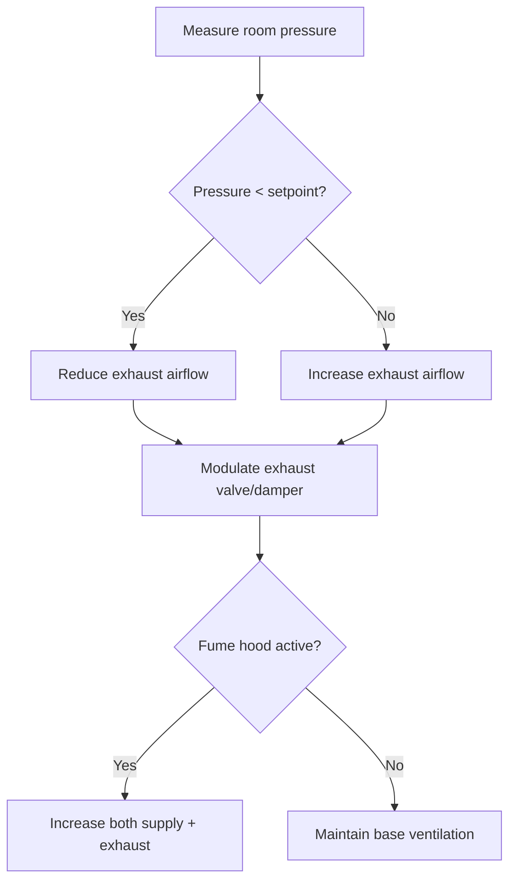

# Building Pressurization Control for HVAC Engineers

Building pressurization control maintains pressure differentials between spaces to control airflow direction, prevent infiltration/exfiltration, and ensure occupant comfort. Critical applications include laboratories, hospitals, cleanrooms, and stairwell pressurization.

## Pressure Relationships

**Pressure differential:**

$$\Delta P = P_{high} - P_{low}$$

Typical units: Pascals (Pa) or inches water gauge (\"w.g.)

**Conversion:** 1 \"w.g. = 249 Pa

**Airflow through opening:**

$$Q = C \times A \times \sqrt{2 \Delta P / \rho}$$

Where:
- $Q$ = airflow (CFM)
- $C$ = discharge coefficient (0.6-0.7)
- $A$ = opening area (ft²)
- $\Delta P$ = pressure difference (lb/ft²)
- $\rho$ = air density (lb/ft³)

**Simplified for standard air:**

$$CFM = 2610 \times A \times \sqrt{\Delta P_{\"w.g.}}$$

<h3>Worked Example 1: Leakage Through Door</h3>

**Given:**
- Door size: 3 ft × 7 ft
- Door gap: 0.5 inches all around
- Pressure differential: 0.05 \"w.g.
- Discharge coefficient: 0.65

**Find:** Leakage airflow

**Solution:**

Gap area:

$$A = \frac{0.5}{12} \times 2 \times (3 + 7) = 0.833 \text{ ft}^2$$

Airflow:

$$CFM = 2610 \times 0.65 \times 0.833 \times \sqrt{0.05} = 390 \text{ CFM}$$

**Answer:** 390 CFM leakage through door gaps

## Laboratory Pressurization

### Negative Pressure Labs

**Purpose:** Contain hazardous materials (BSL-2, BSL-3, chemical labs)

**Typical pressure:** -0.01 to -0.05 \"w.g. relative to corridor

**Control strategy:**

**Design:**
- Exhaust > Supply by 100-300 CFM
- Exhaust located low (heavy vapors) and high (light vapors)
- Supply diffusers away from exhaust (avoid short-circuiting)

### Positive Pressure Labs

**Purpose:** Protect sensitive materials (cleanrooms, semiconductor, pharmaceutical)

**Typical pressure:** +0.02 to +0.05 \"w.g. relative to corridor

**Design:**
- Supply > Exhaust by 100-500 CFM (depends on room volume)
- Pressure cascades: Cleanroom > Gowning > Corridor

**Cascade example:**
- ISO 5 cleanroom: +0.05 \"w.g.
- ISO 7 gowning: +0.03 \"w.g.
- Corridor: +0.01 \"w.g.
- Ambient: 0 \"w.g.

## Stairwell Pressurization

**Purpose:** Provide smoke-free egress during fires

**Code requirements (IBC/NFPA 92):**
- Minimum pressure: 0.10 \"w.g. (25 Pa)
- Maximum pressure: 0.35 \"w.g. (87 Pa) with all doors closed

**Design airflow:**

$$CFM_{stairwell} = CFM_{doors} + CFM_{leakage} + CFM_{weather}$$

**Door opening airflow:**

$$CFM_{door} = 2610 \times A_{door} \times \sqrt{\Delta P}$$

**Typical:** 3,000-5,000 CFM per stairwell

<h3>Worked Example 2: Stairwell Pressurization</h3>

**Given:**
- 10-story stairwell
- Door size: 3 ft × 7 ft = 21 ft²
- Design pressure: 0.30 \"w.g. (single door open)
- Leakage: 200 CFM

**Find:** Required supply airflow

**Solution:**

Airflow for one door:

$$CFM_{door} = 2610 \times 21 \times \sqrt{0.30} = 30,000 \text{ CFM}$$

Total with leakage:

$$CFM_{total} = 30,000 + 200 = 30,200 \text{ CFM}$$

**Answer:** 30,200 CFM supply fan capacity

(Note: Actual design considers door-opening scenarios per NFPA 92)

**Control strategy:**
- Barometric damper relief (passive)
- Or modulating relief damper (active control)
- Pressure sensor in stairwell

## Makeup Air for Exhaust Systems

**Makeup air must replace exhausted air** to prevent building depressurization

**Calculation:**

$$CFM_{makeup} = CFM_{exhaust} - CFM_{infiltration}$$

**Sources of exhaust:**
- Kitchen hoods: 200-500 CFM per linear foot
- Laboratory fume hoods: 100-150 CFM per ft² face area
- Restroom exhaust: 50-75 CFM per fixture
- Process exhaust: varies by application

**Consequences of inadequate makeup air:**
- Difficulty opening doors (high negative pressure)
- Backdrafting of combustion appliances
- Infiltration of unconditioned air
- Comfort complaints

**Design guidelines:**
- Provide 80-100% of exhaust as dedicated makeup air
- Remainder from infiltration and general ventilation
- Makeup air should be conditioned (heated/cooled)

## Relief Air Sizing

**Relief air prevents over-pressurization** when outdoor air exceeds exhaust

**Typical scenario:** Economizer mode with 100% outdoor air

**Sizing:**

$$CFM_{relief} = CFM_{OA,max} - CFM_{exhaust} - CFM_{exfiltration}$$

**Relief damper types:**
1. **Barometric relief:** Gravity-operated (passive)
2. **Power relief:** Motorized damper (active control)
3. **Relief fan:** Powered exhaust (large systems)

**Location:** High in building (warm air rises)

## Practical Control Strategies

### Direct Pressure Control

**Sensor:** Differential pressure sensor between spaces

**Control:** Modulates supply/exhaust dampers or fans to maintain setpoint

**Advantages:** Precise, responds to all influences (doors, wind, stack)

**Disadvantages:** Sensors drift, requires calibration

### Airflow Tracking

**Measure supply and exhaust flows**, maintain offset

**Example:** Maintain supply = exhaust + 150 CFM

**Advantages:** No drift, simple to commission

**Disadvantages:** Does not account for infiltration/exfiltration

### Combined Approach

Use airflow tracking with pressure monitoring as override/verification

## Practical Design Considerations

1. **Sensor location:** Away from diffusers, doors, HVAC equipment
2. **Door undercuts:** 1-inch undercut = ~21 ft² × 1/12 = 1.75 ft² free area
3. **Vestibules:** Break pressure differential (two-door airlock)
4. **Wind effects:** Can overcome 0.05 \"w.g. pressure control
5. **Commissioning:** Test with doors open/closed, verify pressure cascades

---

**Related Technical Guides:**
- [HVAC Control Strategies](/technical-guides/hvac-control-strategies/)
- [Ventilation Rate Calculations](/technical-guides/ventilation-rate-calculations/)
- [Airflow Measurement & Balancing](/technical-guides/airflow-measurement-balancing/)

**References:**
- ASHRAE Handbook of HVAC Applications, Chapter 16: Laboratories
- NFPA 92: Standard for Smoke Control Systems
- International Building Code (IBC), Section 909: Smoke Control Systems
- ANSI/AIHA Z9.5: Laboratory Ventilation
