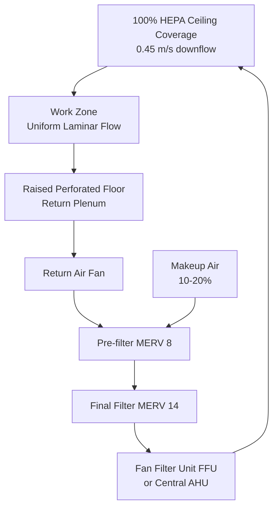
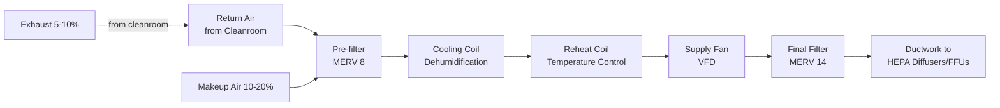

# Cleanroom Design & ISO Classification for HVAC Engineers

Cleanroom HVAC systems maintain controlled environments with specified particle concentrations, temperature, humidity, and pressure. This guide covers ISO 14644 classifications, airflow patterns, filtration requirements, and design methodology for pharmaceutical, semiconductor, biotechnology, and medical device manufacturing facilities.

## ISO 14644 Cleanroom Classification

### Particle Concentration Limits

**ISO 14644-1 Classification Table:**

| ISO Class | 0.1 μm | 0.2 μm | 0.3 μm | 0.5 μm | 1 μm | 5 μm | Common Name (US FED STD 209E) |
|-----------|--------|--------|--------|--------|------|------|-------------------------------|
| ISO 1 | 10 | 2 | — | — | — | — | — |
| ISO 2 | 100 | 24 | 10 | 4 | — | — | — |
| ISO 3 | 1,000 | 237 | 102 | 35 | 8 | — | Class 1 |
| ISO 4 | 10,000 | 2,370 | 1,020 | 352 | 83 | — | Class 10 |
| ISO 5 | 100,000 | 23,700 | 10,200 | 3,520 | 832 | 29 | Class 100 |
| ISO 6 | 1,000,000 | 237,000 | 102,000 | 35,200 | 8,320 | 293 | Class 1,000 |
| ISO 7 | — | — | — | 352,000 | 83,200 | 2,930 | Class 10,000 |
| ISO 8 | — | — | — | 3,520,000 | 832,000 | 29,300 | Class 100,000 |
| ISO 9 | — | — | — | 35,200,000 | 8,320,000 | 293,000 | Room air |

**Units:** Particles per cubic meter

**Maximum particle concentration:**

$$C_N = 10^N \times \left(0.1/D\right)^{2.08}$$

Where:
- $C_N$ = maximum permitted concentration (particles/m³)
- $N$ = ISO classification number (1-9)
- $D$ = particle size (μm), 0.1 to 5.0 μm

**Example for ISO 5 at 0.5 μm:**
$$C_5 = 10^5 \times (0.1/0.5)^{2.08} = 100,000 \times 0.0352 = 3,520 \text{ particles/m}^3$$

### Operational States

**As-Built:** Facility complete, all services connected, no equipment or personnel
**At-Rest:** Equipment installed and operating, no personnel
**Operational:** Normal production with personnel and processes active

Most stringent specification applies to **operational state**.

## Airflow Patterns

### Unidirectional (Laminar) Flow

**Characteristics:**
- Parallel air streams at uniform velocity (0.3-0.5 m/s = 60-100 fpm)
- Vertical downflow or horizontal crossflow
- Minimum turbulence, sweeps particles directly to return/exhaust
- Required for ISO 3-5 cleanrooms (highest cleanliness)

**Design:**


**HEPA coverage:**
- ISO 3-4: 80-100% ceiling coverage
- ISO 5: 60-80% ceiling coverage
- Remainder: non-perforated return grilles

**Velocity uniformity:** ±20% across work zone

### Non-Unidirectional (Turbulent Mixed) Flow

**Characteristics:**
- HEPA diffusers supply air at high velocity (induces mixing)
- Air changes per hour (ACH) dilute particles
- Lower cost than unidirectional flow
- Suitable for ISO 6-8 cleanrooms

**Design:**
- HEPA filters in ceiling (15-25% coverage)
- Low sidewall or floor-level returns
- High air change rates (60-600 ACH depending on class)

**Air change rates:**

| ISO Class | ACH (typical) | Airflow (cfm/ft²) |
|-----------|---------------|-------------------|
| ISO 5 | 240-480 | 40-80 |
| ISO 6 | 90-180 | 15-30 |
| ISO 7 | 40-60 | 6-10 |
| ISO 8 | 20-30 | 3-5 |

## Filtration Requirements

### Filter Cascade

**Three-stage filtration (typical):**

1. **Pre-filter (MERV 8-10):** Protect downstream filters, extend life
2. **Intermediate filter (MERV 14-15):** Remove majority of particles, protect HEPA
3. **Final filter (HEPA H13 or ULPA U15):** Terminal filtration at diffusers

**HEPA filter performance (EN 1822):**

| Filter Class | Efficiency @ MPPS | Typical Size | Pressure Drop |
|--------------|-------------------|--------------|---------------|
| H13 (HEPA) | ≥99.95% | 0.15-0.3 μm | 0.5-1.5" w.g. |
| H14 (HEPA) | ≥99.995% | 0.15-0.3 μm | 0.6-1.8" w.g. |
| U15 (ULPA) | ≥99.9995% | 0.12 μm | 1.0-2.5" w.g. |

MPPS = Most Penetrating Particle Size (minimum efficiency point)

### Fan Filter Units (FFUs)

**Components:**
- HEPA or ULPA filter (2' × 4' or 2' × 2' typical)
- Integral fan (EC motor, variable speed)
- Mounting frame for grid ceiling

**Advantages:**
- Modular, easy to replace
- Individual flow control
- Reduced ductwork
- Lower static pressure (distributed fans)

**Disadvantages:**
- Higher maintenance (many motors)
- Noise (fans in occupied space)
- Heat gain from motors

**Application:** Common for ISO 4-6 cleanrooms in semiconductor, pharmaceutical

## Pressure Cascade Design

### Pressure Differential Strategy

**Principles:**
- Prevent contamination migration from lower to higher cleanliness areas
- Maintain positive pressure in clean areas relative to surrounding spaces
- Pressure cascade: highest pressure in cleanest room

**Typical pressure differentials:**
- Between cleanroom and corridor: +0.02" to +0.05" w.g. (+5 to +12.5 Pa)
- Between ISO classification levels: +0.02" to +0.03" w.g.
- Cleanroom to outdoor: +0.10" to +0.20" w.g.

**Pressure cascade example:**
```mermaid
graph LR
    A[ISO 5 Sterile Core<br/>+0.08\\" w.g.] -->|+0.02\\"| B[ISO 6 Buffer Zone<br/>+0.06\\" w.g.]
    B -->|+0.03\\"| C[ISO 7 Gowning<br/>+0.03\\" w.g.]
    C -->|+0.03\\"| D[Corridor<br/>0.00\\" w.g.]
    D -->|+0.05\\"| E[Outside<br/>-0.05\\" w.g.]
```

### Airflow Balance Method

**Supply - Return - Exhaust = Positive Pressure:**

$$CFM_{supply} = CFM_{return} + CFM_{exhaust} + CFM_{leakage}$$

Where $CFM_{leakage}$ creates positive pressure

**Leakage estimation:**

$$CFM_{leakage} = C \cdot A \cdot \sqrt{\Delta P}$$

Where:
- $C$ = flow coefficient (depends on leakage path)
- $A$ = leakage area (ft²)
- $\Delta P$ = pressure differential (in w.g.)

**Typical design:** 5-10% excess supply over return/exhaust

<div class="worked-example">
<h3>Worked Example 1: ISO 7 Cleanroom Airflow Calculation</h3>

**Given:**
- Cleanroom: 40 ft × 30 ft × 10 ft ceiling
- Classification: ISO 7 operational
- Target ACH: 50 (conservative for ISO 7)
- Heat load: 30,000 Btu/hr (equipment, lights, people)
- Target temperature: 68°F
- Pressure: +0.03" w.g. relative to corridor

**Find:** Supply airflow, cooling load, pressure balance

**Solution:**

Room volume:
$$V = 40 \times 30 \times 10 = 12,000 \text{ ft}^3$$

Supply airflow for ACH requirement:
$$CFM_{ACH} = \frac{50 \times 12,000}{60} = 10,000 \text{ CFM}$$

Supply airflow for cooling (assuming 20°F ΔT):
$$CFM_{cooling} = \frac{30,000}{1.08 \times 20} = 1,389 \text{ CFM}$$

**Controlling requirement:** ACH (10,000 CFM >> 1,389 CFM)

Supply airflow: **10,000 CFM**

Cooling load (with 10,000 CFM supply):
- Sensible: 30,000 Btu/hr (given internal load)
- Supply air temperature rise: $\Delta T = \frac{30,000}{1.08 \times 10,000} = 2.8°F$
- Supply air temp: 68 - 2.8 = 65.2°F
- Ventilation cooling load: $Q = 1.08 \times 10,000 \times 20 = 216,000 \text{ Btu/hr} = 18 \text{ tons}$ (if OA at 85°F)

Pressure balance:
- Supply: 10,000 CFM
- Return to AHU: 9,500 CFM (95%)
- Leakage (pressure): 500 CFM (5%)

**Answers:**
- Supply airflow: 10,000 CFM (ACH-driven)
- Air changes: 50 ACH
- Cooling load: ~18 tons (includes ventilation load)
- Pressure leakage: 500 CFM

</div>

## Temperature and Humidity Control

**Typical requirements:**

| Application | Temperature | Humidity |
|-------------|-------------|----------|
| Pharmaceutical sterile | 68-72°F | 30-50% RH |
| Semiconductor fab | 68°F ±1°F | 40-45% RH ±2% |
| Medical device assembly | 68-72°F | 30-60% RH |
| Biotechnology | 68-72°F | 40-60% RH |

**Humidity control importance:**
- **Low humidity (< 30% RH):** Electrostatic discharge (ESD) risk, product drying
- **High humidity (> 60% RH):** Condensation, microbial growth, corrosion

**Control strategy:**
- Cooling coil + reheat for dehumidification
- Steam humidifier (cleanest, no particles)
- ±2°F temperature stability
- ±5% RH humidity stability

## Cleanroom HVAC System Design

### Recirculation Air Handling Unit (RAHU)

**Components:**


**Makeup air (outdoor air):**
- 10-20% of supply to maintain positive pressure
- Compensate for exhaust (fume hoods, process equipment)
- Pre-conditioned by dedicated makeup air unit (MAU)

**Exhaust:**
- Local exhaust for hazardous processes (fume hoods, biosafety cabinets)
- General room exhaust (5-10% of supply)
- HEPA filtration on exhaust if biohazard or toxic materials

### Control Sequences

**Pressure control:**
1. Measure room pressure relative to reference (corridor)
2. Modulate supply or exhaust airflow to maintain setpoint
3. Typical: modulate exhaust damper, supply constant

**Temperature control:**
1. Measure room temperature
2. Modulate cooling/reheat valves
3. Supply fan maintains constant airflow (pressure independent)

**Humidity control:**
1. Measure room humidity
2. Cooling coil for dehumidification (condensate removal)
3. Steam humidifier for humidification

## Design Methodology

**Step-by-step cleanroom HVAC design:**

1. **Define cleanliness class** (ISO 5-8 typical)
2. **Select airflow pattern** (unidirectional or turbulent)
3. **Calculate air changes** (table lookup or particle generation model)
4. **Size supply airflow** (ACH × volume / 60)
5. **Calculate cooling load** (envelope, lights, equipment, people, ventilation)
6. **Verify supply airflow** (max of ACH or cooling requirement)
7. **Design pressure cascade** (supply = return + exhaust + leakage)
8. **Select filtration** (three-stage: pre, intermediate, HEPA/ULPA)
9. **Layout diffusers/returns** (ensure uniform airflow)
10. **Size ductwork and AHU** (low velocity to reduce noise)
11. **Design controls** (pressure, temperature, humidity)
12. **Specify testing and commissioning** (particle count, airflow, pressure)

## Commissioning and Testing

**ISO 14644-3 Test Methods:**

1. **Particle count test:** Confirm classification with optical particle counter
2. **Airflow velocity/volume:** Verify ACH or unidirectional velocity
3. **Pressure differential:** Confirm cascade between rooms
4. **HEPA filter leak test:** DOP or PAO challenge (99.99% minimum)
5. **Air pattern visualization:** Smoke test to confirm airflow direction
6. **Recovery test:** Time to return to specified cleanliness after contamination
7. **Temperature and humidity:** Verify control ranges

**Acceptance criteria:**
- Particle counts ≤ ISO class limits (at 95% confidence)
- Airflow uniformity ±20% of average
- Pressure differentials ±0.01" w.g. of setpoint
- HEPA integrity: zero leaks > 0.01% of upstream concentration

---

**Related Technical Guides:**
- [Air Filtration Design](/technical-guides/air-filtration-design/)
- [Building Pressurization Control](/technical-guides/building-pressurization-control/)
- [Ventilation Rate Calculations](/technical-guides/ventilation-rate-calculations/)
- [HVAC Control Strategies](/technical-guides/hvac-control-strategies/)
- [Healthcare HVAC Design](/technical-guides/healthcare-hvac-design/)

**References:**
- ISO 14644-1: Classification of Air Cleanliness by Particle Concentration
- ISO 14644-3: Test Methods
- ASHRAE Applications Handbook, Chapter 18: Clean Spaces
- IEST-RP-CC006: Testing Cleanrooms
- FDA Guidance: Sterile Drug Products Produced by Aseptic Processing
