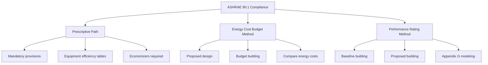

# Code Compliance Analysis for HVAC Engineers

HVAC systems must comply with building, mechanical, energy, and ventilation codes. Understanding compliance paths, calculation procedures, and documentation requirements ensures permit approval and legal operation.

## Primary Code Authorities

### International Mechanical Code (IMC)

**Scope:** Installation, maintenance, alteration of mechanical systems

**Key chapters:**
- Chapter 4: Ventilation (references ASHRAE 62.1)
- Chapter 5: Exhaust systems
- Chapter 6: Duct systems
- Chapter 8: Chimneys and vents
- Chapter 9: Specific appliances

**Enforcement:** Adopted by most U.S. jurisdictions with amendments

### International Building Code (IBC)

**Scope:** Structural, fire safety, egress

**HVAC-relevant sections:**
- Section 909: Smoke control systems
- Section 1203: Ventilation
- Section 1204: Temperature control
- Fire damper requirements

### ASHRAE Standard 90.1

**Energy Standard for Buildings Except Low-Rise Residential**

**Compliance paths:**

**Prescriptive requirements (Section 6: HVAC):**

1. **Equipment efficiency minimums** (Tables 6.8.1-A through M)
2. **Economizers:** Required for cooling ≥54,000 Btu/h (Climate Zones 3-8)
3. **Demand-controlled ventilation:** Required for high-occupancy spaces
4. **Fan power limits:** Based on system type and size
5. **Duct/pipe insulation:** Tables 6.8.3-A and B
6. **Hydronic system controls:** Variable flow, isolation valves

### ASHRAE Standard 62.1

**Ventilation for Acceptable Indoor Air Quality**

**Ventilation rate procedure:**

$$V_{oz} = R_p \times P_z + R_a \times A_z$$

Where:
- $V_{oz}$ = outdoor air flow rate (CFM)
- $R_p$ = outdoor air flow rate per person (CFM/person)
- $P_z$ = zone population
- $R_a$ = outdoor air flow rate per area (CFM/ft²)
- $A_z$ = zone floor area (ft²)

**System level:**

$$V_{ot} = \sum \frac{V_{oz}}{E_z}$$

Where:
- $E_z$ = zone air distribution effectiveness (Table 6.2.2.2)
- Typically 1.0 for ceiling supply, 0.8 for floor supply

<h3>Worked Example 1: ASHRAE 62.1 Ventilation</h3>

**Given:**
- Office space: 5,000 ft²
- Occupancy: 50 people (design)
- Table 6.2.2.1: $R_p$ = 5 CFM/person, $R_a$ = 0.06 CFM/ft²
- Zone air distribution effectiveness: 1.0

**Find:** Required outdoor air flow rate

**Solution:**

Zone outdoor air:

$$V_{oz} = 5 \times 50 + 0.06 \times 5000 = 250 + 300 = 550 \text{ CFM}$$

System outdoor air (single-zone):

$$V_{ot} = \frac{550}{1.0} = 550 \text{ CFM}$$

**Answer:** 550 CFM minimum outdoor air required

**Indoor Air Quality Procedure (alternative):**
- Performance-based approach
- Requires contaminant source analysis
- Not commonly used due to complexity

## ASHRAE 90.1 Prescriptive Compliance

### Equipment Efficiency Tables

**Example: Air-cooled chillers (Table 6.8.1-C):**

| Cooling Capacity | Minimum EER | Minimum IPLV |
|------------------|-------------|---------------|
| < 150,000 Btu/h | 9.5 | 11.0 |
| ≥ 150,000 Btu/h | 9.7 | 12.0 |

**Example: Boilers (Table 6.8.1-F):**

| Size | Fuel | Minimum Thermal Efficiency |
|------|------|---------------------------|
| < 300,000 Btu/h | Gas | 80% Et |
| ≥ 300,000 Btu/h | Gas | 90% Et (condensing) |

### Economizer Requirements

**Required when:**
- Cooling capacity ≥ 54,000 Btu/h
- Climate Zones 3-8 (not required in hot/humid climates)

**Types:**
- Integrated (modulates between economizer and mechanical cooling)
- Non-integrated (economizer OR mechanical cooling)

**Control:**
- Differential dry-bulb
- Or differential enthalpy (required in humid climates)

**Exceptions:**
- Laboratory fume hood systems
- Systems with energy recovery (>50% effectiveness)
- Where prohibited by health/safety codes

### Fan Power Limits

**Calculation:**

$$PFAN_{max} = CFM \times P_f + A$$

Where:
- $CFM$ = system airflow
- $P_f$ = fan power limitation (hp/CFM) from Table 6.5.3.1.1B
- $A$ = adjustment credits (e.g., +0.5 hp per filter, +0.3 hp per sound trap)

<h3>Worked Example 2: Fan Power Limit</h3>

**Given:**
- VAV system, 20,000 CFM
- Table 6.5.3.1.1B: $P_f$ = 0.0015 hp/CFM
- Components: MERV 13 filters (+0.5 hp), return fan (+0.3 hp)

**Find:** Maximum allowable fan power

**Solution:**

Base fan power:

$$PFAN_{base} = 20,000 \times 0.0015 = 30 \text{ hp}$$

Adjustments:

$$A = 0.5 + 0.3 = 0.8 \text{ hp}$$

Maximum fan power:

$$PFAN_{max} = 30 + 0.8 = 30.8 \text{ hp}$$

**Answer:** 30.8 hp maximum total fan power (supply + return + exhaust)

## Energy Cost Budget Method

**Performance-based alternative to prescriptive**

**Process:**

1. **Model proposed design:** Actual HVAC system
2. **Model budget building:** Prescriptive baseline (same geometry, different HVAC)
3. **Compare energy costs:**

$$Cost_{proposed} \leq Cost_{budget}$$

**Software:** EnergyPlus, eQUEST, TRACE 700, IES-VE

**Advantages:**
- Flexibility in design (can use lower-efficiency equipment if system design compensates)
- Credit for innovative strategies

**Disadvantages:**
- Requires detailed energy modeling
- More expensive and time-consuming

## Common Compliance Issues

### Issue 1: Economizer Omission

**Problem:** Designer forgets economizer in Climate Zone 4

**Code violation:** ASHRAE 90.1 Section 6.5.1

**Solution:** Add air-side economizer with differential dry-bulb control

### Issue 2: Outdoor Air Below Minimum

**Problem:** Measured OA = 300 CFM, required = 450 CFM

**Code violation:** IMC Section 403 (references ASHRAE 62.1)

**Solution:** Increase OA damper minimum position, rebalance

### Issue 3: Fan Power Exceeds Limit

**Problem:** Total fan power = 45 hp, limit = 38 hp

**Code violation:** ASHRAE 90.1 Section 6.5.3.1

**Solution:** Reduce duct pressure drop (resize ducts), or use higher-efficiency fans

### Issue 4: Boiler Efficiency Below Minimum

**Problem:** Specified 80% AFUE non-condensing boiler, 500,000 Btu/h

**Code violation:** ASHRAE 90.1 Table 6.8.1-F requires ≥90% Et (condensing)

**Solution:** Specify condensing boiler (90-95% Et)

## Documentation Requirements

**Submittal to authority having jurisdiction (AHJ):**

1. **Mechanical drawings:** Equipment layout, duct/pipe routing
2. **Equipment schedules:** Capacity, efficiency, compliance tables
3. **Ventilation calculations:** ASHRAE 62.1 calculation sheets
4. **Energy compliance:** Certificate of compliance (prescriptive path) or energy model (performance path)
5. **Sequences of operation:** Control narratives
6. **Load calculations:** Heating and cooling loads

**Typical review timeline:** 2-6 weeks depending on jurisdiction

## Practical Compliance Strategies

1. **Early coordination:** Review local amendments to IMC/90.1
2. **Pre-submittal meeting:** Discuss complex systems with plan reviewer
3. **Use compliance software:** ASHRAE 90.1 compliance forms generator
4. **Commissioning:** Some jurisdictions require Cx for 90.1 compliance
5. **Energy code consultants:** Consider for complex projects

---

**Related Technical Guides:**
- [Ventilation Rate Calculations](/technical-guides/ventilation-rate-calculations/)
- [Energy Modeling Methodology](/technical-guides/energy-modeling-methodology/)
- [Commissioning Procedures](/technical-guides/commissioning-procedures/)

**References:**
- International Mechanical Code (IMC), 2021 Edition
- International Building Code (IBC), 2021 Edition
- ASHRAE Standard 90.1: Energy Standard for Buildings Except Low-Rise Residential Buildings
- ASHRAE Standard 62.1: Ventilation for Acceptable Indoor Air Quality
- ASHRAE 90.1 User's Manual
