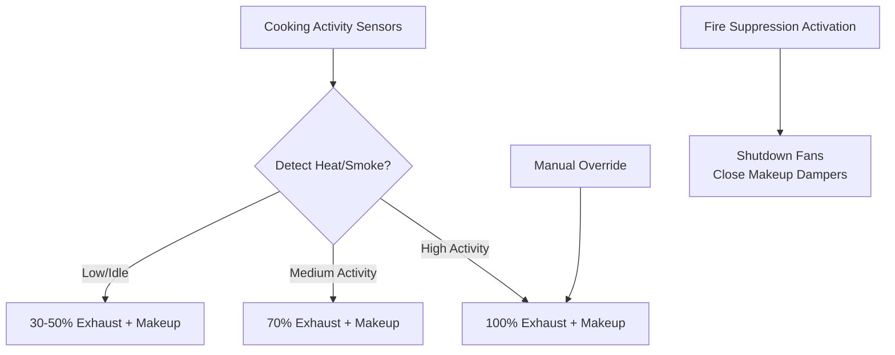

# Commercial Kitchen Ventilation & Exhaust Hood Design

Commercial kitchen ventilation systems capture heat, smoke, steam, grease, and odors from cooking equipment while providing makeup air to replace exhaust. This guide covers hood types, exhaust rate calculations, makeup air strategies, grease control, and demand-controlled ventilation per ASHRAE, NFPA 96, and IMC requirements.

## Hood Classification and Requirements

### Type I (Grease) Hoods

**Definition:** Hoods for cooking equipment producing grease-laden vapors

**Appliances requiring Type I hoods:**
- Charbroilers and grills
- Fryers (open deep-fat fryers)
- Ranges (gas or electric with open flame or high heat)
- Ovens used for high-temperature cooking (> 400°F)
- Woks and stir-fry equipment
- Griddles (solid top cooking surfaces > 400°F)

**Construction requirements (UL 710, NFPA 96):**
- **Material:** 16-20 gauge stainless steel or 18 gauge carbon steel
- **Grease filters:** Baffle or mesh type, UL 1046 listed
- **Slope:** Bottom and sides slope toward grease collection (2% minimum)
- **Grease gutters:** Continuous perimeter gutter, drain to external receptacle
- **Access panels:** For cleaning ductwork, fans

**Fire suppression:** Required per NFPA 96
- Wet chemical or dry chemical system
- Automatic activation (fusible links at 350-500°F)
- Manual pull stations
- Fuel shutoff interlocked with suppression system

### Type II (Heat and Steam) Hoods

**Definition:** Hoods for equipment producing heat and moisture but minimal grease

**Appliances requiring Type II hoods:**
- Steam kettles and steamers
- Dishwashers
- Low-temperature ovens (< 400°F)
- Pasta cookers and rethermalizers

**Construction:**
- Lighter gauge material acceptable (20-22 gauge)
- No grease filters required (optional condensate filters)
- Fire suppression not required

## Exhaust Airflow Rates

### ASHRAE Recommended Exhaust Rates

**Exhaust CFM per linear foot of hood:**

| Appliance Duty | Hood Type | Light Duty | Medium Duty | Heavy Duty | Extra-Heavy Duty |
|----------------|-----------|------------|-------------|------------|------------------|
| **Wall canopy** | Type I | 200 CFM/ft | 300 CFM/ft | 400 CFM/ft | 550 CFM/ft |
| **Single island** | Type I | 300 CFM/ft | 400 CFM/ft | 500 CFM/ft | 600 CFM/ft |
| **Double island** | Type I | 250 CFM/ft | 350 CFM/ft | 450 CFM/ft | 550 CFM/ft |
| **Backshelf/Pass-over** | Type I | 150 CFM/ft | 250 CFM/ft | 300 CFM/ft | 400 CFM/ft |
| **Eyebrow** | Type I | 250 CFM/ft | 350 CFM/ft | 450 CFM/ft | — |

**Appliance duty classification:**

- **Light duty:** Electric ovens, steam kettles, small ranges
- **Medium duty:** Gas ranges, fryers, griddles (standard output)
- **Heavy duty:** Charbroilers, wok ranges, high-Btu equipment
- **Extra-heavy duty:** Solid-fuel (charcoal, wood), mesquite grills

**Hood area method (alternative):**

$$CFM = A_{hood} \times V_{capture}$$

Where:
- $A_{hood}$ = hood face opening area (ft²)
- $V_{capture}$ = capture velocity (100-150 fpm typical)

### Factors Affecting Exhaust Rate

**Hood geometry:**
- Wall-mounted canopy: One side open (lowest exhaust rate)
- Single island: All four sides open (highest exhaust rate)
- Proximity hood (backshelf): Close to appliance (reduced rate)

**Appliance heat output:**
- Higher Btu/hr → more thermal plume → higher exhaust required

**Hood overhang:**
- Minimum 6" overhang beyond appliance footprint (all sides)
- Larger overhang improves capture, may reduce exhaust rate

<h3>Worked Example 1: Type I Hood Exhaust Calculation</h3>

**Given:**
- Wall-mounted canopy hood
- Hood length: 12 ft
- Appliances: Two charbroilers (heavy-duty), three gas ranges (medium-duty)
- Cooking line overhang: 9" beyond appliances

**Find:** Required exhaust airflow

**Solution:**

**Method 1: ASHRAE table (per linear foot)**

Heavy-duty wall canopy: 400 CFM/ft

$$CFM_{exhaust} = 12 \times 400 = 4,800 \text{ CFM}$$

**Method 2: Weighted by appliance duty**

Charbroilers occupy 6 ft (heavy-duty): $6 \times 400 = 2,400$ CFM

Ranges occupy 6 ft (medium-duty): $6 \times 300 = 1,800$ CFM

$$CFM_{total} = 2,400 + 1,800 = 4,200 \text{ CFM}$$

**Method 3: Hood face area**

Hood depth: 4 ft (typical wall canopy)
Hood height above appliances: 3 ft
Face opening: $12 \times 3 = 36$ ft² (conservative, uses full height)
Capture velocity: 100 fpm

$$CFM = 36 \times 100 = 3,600 \text{ CFM}$$

**Design selection:** Use Method 1 (most conservative): **4,800 CFM**

Add 10% safety factor: $4,800 \times 1.10 = 5,280$ CFM

**Answer:** 5,280 CFM exhaust (select 5,500 CFM fan)

## Makeup Air Systems

### Makeup Air Requirements

**Purpose:** Replace exhaust air to prevent building negative pressure

**Makeup air quantity:**

$$CFM_{makeup} = CFM_{exhaust} - CFM_{transfer}$$

Where $CFM_{transfer}$ = air from adjacent spaces (dining room, etc.)

**Typical design:** 80-100% makeup air (20% maximum transfer air from dining/non-kitchen spaces)

**Code requirements (IMC Section 508):**
- Makeup air required when exhaust > 400 CFM
- Makeup air shall be within 10% of exhaust rate

### Makeup Air Delivery Methods

**1. Direct supply to hood (short-circuit):**
- Air curtain at hood front
- Supply air velocities: 300-500 fpm
- Temperature: 10-15°F below room temperature (avoid thermal shock to cooks)

**Advantages:**
- Reduces conditioned makeup air energy (less tempering required)
- Prevents draft on cooking line

**Disadvantages:**
- Can interfere with capture if velocity too high
- Requires careful design (ASHRAE 154P testing)

**2. General dilution (away from hood):**
- Supply air diffusers around perimeter of kitchen
- Low velocity (< 500 fpm at outlets)
- Provides general ventilation and pressurization

**3. Combination:**
- 50-70% direct to hood (short-circuit)
- 30-50% general dilution

### Makeup Air Temperature

**Heating requirement:**

$$Q_{heating} = 1.08 \times CFM_{makeup} \times (T_{supply} - T_{outdoor})$$

**Winter design example:**
- Outdoor air: 0°F
- Supply air target: 60°F (10°F below kitchen ambient)
- Makeup air: 5,000 CFM

$$Q = 1.08 \times 5,000 \times (60 - 0) = 324,000 \text{ Btu/hr} = 27 \text{ tons heating}$$

**Heating methods:**
- Gas-fired makeup air unit (direct-fired or indirect)
- Electric resistance (expensive to operate)
- Heat recovery from exhaust (grease accumulation concern)
- Radiant heaters at cooking line (supplemental comfort heating)

**Summer cooling:**
- Typically no mechanical cooling of makeup air (expensive)
- Evaporative cooling in dry climates (Arizona, New Mexico)
- Relies on short-circuit strategy (reduce sensible load)

## Grease Control and Fire Safety

### Grease Extraction

**Grease-laden vapor capture efficiency:**

| Filter Type | Grease Removal Efficiency | Application |
|-------------|---------------------------|-------------|
| Baffle filters (UL 1046) | 70-90% | Standard (most Type I hoods) |
| Mesh filters | 50-70% | Light-duty applications |
| Water-wash systems | 90-98% | High-volume (casinos, stadiums) |
| Electrostatic precipitators (ESP) | 85-95% | Retrofit, odor control |

**Baffle filter design:**
- Staggered baffles create centrifugal force (grease droplets separated)
- Removable for cleaning (commercial dishwasher weekly minimum)

### Ductwork Design

**NFPA 96 requirements:**

**Material:**
- 16 gauge carbon steel (continuous welded seams)
- 18 gauge stainless steel (Type 304)

**Slope:** 
- Minimum 1/4" per foot horizontal run
- Drain toward hood (grease flows back to collection)

**Access panels:**
- Maximum 12 ft spacing horizontally
- Every floor penetration
- Changes in direction

**Clearances to combustibles:**
- 18" minimum (unprotected duct)
- 6" with listed clearance reduction system
- Zero clearance with factory-built grease duct enclosure

**No dampers permitted in grease exhaust ductwork** (fire/grease accumulation hazard)

### Exhaust Fan Selection

**Upblast centrifugal roof exhaust fan:**
- Grease-rated (UL 762 listing)
- Belt-drive (allows speed adjustment, easier motor replacement)
- Drain connection at fan base (grease collection)
- Hinged roof curb (fan removal for cleaning)

**Fan materials:**
- Aluminum or coated steel wheel (grease-resistant)
- Stainless steel preferred for high-volume or acidic exhaust

**Typical fan static pressure:** 1.0-2.0" w.g. (ductwork + grease filters)

## Demand-Controlled Kitchen Ventilation (DCKV)

### Operating Principle

**Variable exhaust based on cooking activity:**
- Optical sensors (detect smoke/steam plume)
- Temperature sensors (measure hood plenum temperature)
- Modulate exhaust fan speed (VFD)
- Modulate makeup air in proportion

**Turndown ratio:** 30-100% of design airflow typical

**Energy savings:**
- Reduced fan energy: 40-60% (fan power ∝ flow³)
- Reduced heating/cooling of makeup air: 30-50%
- Total kitchen HVAC energy savings: 30-40%

### Control Strategy

**Minimum airflow (idle mode):**
- 30-50% of design exhaust
- Maintains hood capture, prevents grease accumulation
- Complies with makeup air requirements

**Code acceptance:**
- IMC 2021: Allows DCKV with listed controls and sensors
- Local AHJ approval may be required
- ASHRAE 154P: Standard method of test for DCKV systems

<h3>Worked Example 2: DCKV Energy Savings</h3>

**Given:**
- Exhaust hood: 6,000 CFM design
- DCKV idle flow: 40% (2,400 CFM)
- Operating hours: 16 hr/day (8 hr cooking, 8 hr idle/prep)
- Winter outdoor temp: 20°F average
- Makeup air supply: 65°F
- Fan motor: 7.5 hp at full flow
- Energy cost: $0.12/kWh, $0.80/therm (natural gas)
- Heating efficiency: 80%

**Find:** Annual energy and cost savings

**Solution:**

**Fan energy savings:**

Full flow power: 7.5 hp = 5.6 kW

Idle flow power (40% flow): $5.6 \times 0.40^3 = 0.36$ kW

Daily fan energy savings (8 hr idle):
$$E_{fan} = (5.6 - 0.36) \times 8 = 41.9 \text{ kWh/day}$$

Annual: $41.9 \times 365 = 15,294$ kWh/yr

Cost: $15,294 \times 0.12 = $1,835/yr

**Makeup air heating savings:**

Full flow heating (8 hr cooking):
$$Q = 1.08 \times 6,000 \times (65-20) = 291,600 \text{ Btu/hr}$$

Idle flow heating (8 hr idle):
$$Q_{idle} = 1.08 \times 2,400 \times (65-20) = 116,640 \text{ Btu/hr}$$

Daily heating reduction:
$$\Delta Q = (291,600 - 116,640) \times 8 = 1,399,680 \text{ Btu/day}$$

Annual: $1,399,680 \times 365 = 510,893,280$ Btu/yr = 5,109 therms/yr

Accounting for 80% furnace efficiency: $5,109 / 0.80 = 6,386$ therms/yr

Cost: $6,386 \times 0.80 = $5,109/yr

**Total annual savings:**
$$\$1,835 + \$5,109 = \$6,944/yr$$

**If DCKV system costs $15,000 installed:**

Simple payback: $15,000 / $6,944 = 2.2 years

**Answer:** $6,944/year savings (2.2 year payback)

## Kitchen Air Balance and Pressurization

**Negative pressure target:** -0.02" to -0.05" w.g. relative to dining areas

**Purpose:**
- Prevent cooking odors migrating to dining room
- Maintain directional airflow (dining → kitchen → exhaust)

**Air balance:**
$$CFM_{exhaust} > CFM_{makeup} + CFM_{transfer}$$

**Typical imbalance:** 10-20% exhaust exceeds supply (creates negative pressure)

**Transfer air from dining:**
- Relief air grilles or undercut doors
- 100-200 CFM per door opening typical
- Dining room must have adequate supply air (HVAC oversized for transfer)

## Dishwasher Exhaust

**Type II hood or dedicated exhaust:**
- Steam exhaust: 75-150 CFM per ft² dishwasher footprint
- Condensate hood (water-cooled): Captures steam, condenses to drain

**Makeup air for dishwasher:**
- Not required if Type II hood exhaust < 400 CFM (IMC exception)
- Recommended for large commercial dishwashers (prevent backdraft)

---

**Related Technical Guides:**
- [Ventilation Rate Calculations](/technical-guides/ventilation-rate-calculations/)
- [Building Pressurization Control](/technical-guides/building-pressurization-control/)
- [Fan Selection & Performance](/technical-guides/fan-selection-performance/)
- [Air Filtration Design](/technical-guides/air-filtration-design/)
- [HVAC Control Strategies](/technical-guides/hvac-control-strategies/)

**References:**
- ASHRAE Handbook HVAC Applications, Chapter 35: Kitchen Ventilation
- NFPA 96: Standard for Ventilation Control and Fire Protection of Commercial Cooking Operations
- IMC (International Mechanical Code), Chapter 5: Exhaust Systems
- UL 710: Standard for Exhaust Hoods for Commercial Cooking Equipment
- ASHRAE 154P: Standard Method of Test for Demand-Controlled Kitchen Ventilation
- Exxo-Air (Resource): Kitchen Ventilation Design Guide
