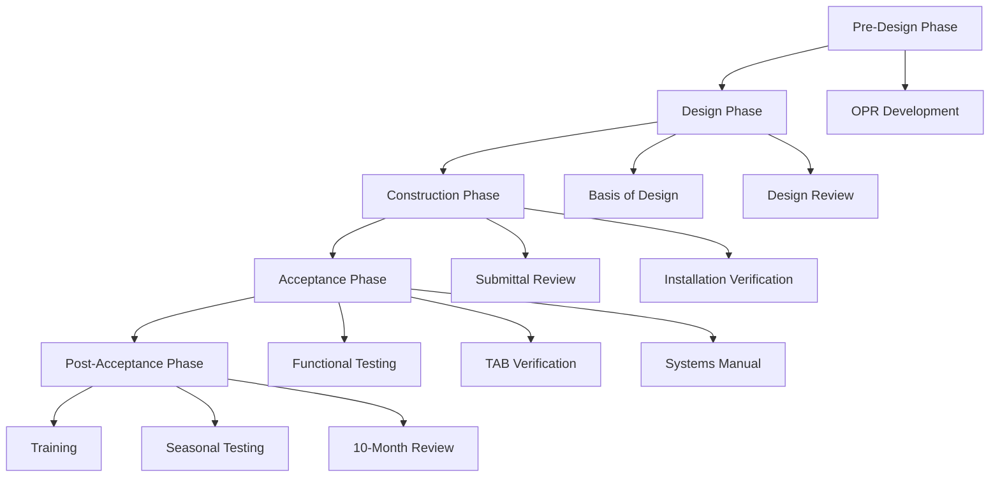

# Commissioning Procedures for HVAC Engineers

Commissioning (Cx) verifies HVAC systems meet design intent and owner's project requirements through systematic functional performance testing. Proper commissioning reduces energy consumption by 10-20% and minimizes occupant complaints.

## Commissioning Process

**Commissioning phases:**

1. **Pre-design:** Develop Owner's Project Requirements (OPR)
2. **Design:** Create Basis of Design (BOD), review submittals
3. **Construction:** Verify installation, review submittals
4. **Acceptance:** Functional performance testing
5. **Post-acceptance:** Training, seasonal testing, warranty review

## Owner's Project Requirements (OPR)

**Documents owner's expectations:**
- Indoor environmental quality (temperature, humidity, IAQ)
- Energy performance targets
- Maintenance requirements
- Special requirements (cleanrooms, labs, etc.)
- Budget and schedule constraints

**Example OPR requirements:**
- "Maintain operating room at 68-73°F, 20-60% RH, +0.01 \"w.g. pressure"
- "Achieve LEED Gold certification with 30% energy cost savings"
- "Design system for 24/7 operation with N+1 redundancy"

## Basis of Design (BOD)

**Engineer's documentation of how OPR will be met:**
- System descriptions
- Design parameters and assumptions
- Equipment specifications
- Control sequences
- Maintenance requirements

**Links OPR to design decisions**

## Functional Performance Testing

**Verifies equipment operates per design intent** under actual and simulated conditions

### Test Categories

**1. Pre-functional checklists:**
- Verify installation completeness
- Check nameplate data vs. submittals
- Confirm startup procedures completed
- Document deficiencies

**2. Functional performance tests:**
- Test control sequences
- Verify safeties and interlocks
- Simulate failure modes
- Measure performance at design conditions

### Example: AHU Functional Test

**Test sequence:**

1. **Economizer test:**
   - Simulate OA temp < RA temp → OA damper opens to 100%
   - Simulate OA temp > RA temp → OA damper returns to minimum

2. **Heating sequence:**
   - Lower space temp setpoint → verify heating valve opens
   - Verify discharge air temp maintains setpoint
   - Check freeze protection (DA temp < 40°F → alarm)

3. **Cooling sequence:**
   - Raise space temp setpoint → verify cooling valve opens
   - Verify discharge air temp maintains setpoint
   - Check high-limit safety (DA temp < 50°F → cooling lockout)

4. **Ventilation:**
   - Verify minimum OA damper position (per ASHRAE 62.1)
   - Measure actual OA flow with pitot traverse
   - Check CO₂-based DCV if applicable

5. **Alarms and safeties:**
   - Simulate dirty filter (increase DP) → verify alarm
   - Simulate fan failure → verify alarm and backup fan start
   - Simulate freeze condition → verify shutdown

<h3>Worked Example 1: VAV Box Functional Test</h3>

**Test:** Verify VAV terminal unit responds correctly to thermostat

**Given:**
- Design airflow: 1,200 CFM max, 360 CFM min (30%)
- Space setpoint: 72°F
- Reheat coil valve

**Test Procedure:**

**Step 1:** Verify minimum airflow
- Set space temp to 65°F (call for heat)
- Measure airflow with flow hood
- **Expected:** 360 CFM ±10%
- **Result:** 355 CFM → PASS

**Step 2:** Verify maximum cooling airflow
- Set space temp to 80°F (call for cooling)
- **Expected:** Airflow increases to 1,200 CFM before reheat
- **Result:** 1,180 CFM → PASS

**Step 3:** Verify reheat operation
- Maintain space at 80°F, increase setpoint to 72°F
- **Expected:** Airflow reduces to minimum, reheat valve opens
- Measure discharge air temp increase
- **Result:** Airflow 360 CFM, DA temp 95°F → PASS

**Step 4:** Verify deadband
- Set space temp = setpoint (72°F)
- **Expected:** Airflow at minimum, no heating or cooling
- **Result:** 360 CFM, reheat closed → PASS

**Conclusion:** VAV terminal operates per sequence

## TAB Verification

**Commissioning agent verifies TAB contractor work:**

1. **Review TAB plan:** Methodology, instruments, tolerances
2. **Witness testing:** Observe 10-20% of measurements
3. **Review reports:** Check calculations, balance tolerances
4. **Spot-check:** Re-measure 5-10% of points independently

**Acceptance criteria:**
- Airflow: ±10% of design
- Hydronic flow: ±10% of design
- Temperature: ±2°F of setpoint
- Pressure: ±0.02 \"w.g. of setpoint

## Controls Verification

**Verify BAS trends and sequences:**

1. **Trend setup:**
   - Sample rate: 15-minute intervals minimum
   - Duration: 48-72 hours (capture occupied/unoccupied cycles)
   - Points: Supply/return temps, damper positions, valve positions, fan status

2. **Trend analysis:**
   - Check control stability (hunting, oscillation)
   - Verify setpoints match design
   - Confirm reset schedules active
   - Identify simultaneous heating/cooling

**Common issues found:**
- PID tuning too aggressive (oscillation)
- Economizer not enabled
- Night setback not programmed
- Outdoor air damper stuck

## Seasonal Testing

**Some systems require testing outside of construction season:**

- **Heating:** Test in winter (or simulate low OA temp)
- **Cooling:** Test in summer (or simulate high OA temp)
- **Free cooling:** Test economizer at shoulder season conditions

**Deferred testing:** Schedule within first year of operation

## Issues Log and Deficiency Tracking

**Maintain master issues log:**

| Issue # | System | Description | Priority | Responsible | Status | Resolution |
|---------|--------|-------------|----------|-------------|--------|------------|
| CX-001 | AHU-1 | Economizer damper stuck at minimum | High | Contractor | Closed | Actuator replaced 5/12 |
| CX-002 | VAV-205 | Airflow 20% below design | Medium | TAB | Open | Damper adjustment scheduled |

**Priority levels:**
- **Critical:** Life safety, code violation
- **High:** Significant energy waste, comfort impact
- **Medium:** Minor performance issue
- **Low:** Documentation, cosmetic

## Systems Manual

**Deliverable to owner:**

1. **Design narrative:** System descriptions, design basis
2. **Equipment documentation:** O&M manuals, shop drawings, warranties
3. **Control sequences:** Detailed written sequences with points list
4. **As-built drawings:** Red-lined to reflect actual installation
5. **TAB reports:** Final airflow and water flow measurements
6. **Functional test reports:** Results of all Cx tests
7. **Training documentation:** Training session materials, video recordings

## Training

**Provide to facilities staff:**

1. **Systems overview:** How each system operates
2. **Operator interface training:** BAS navigation, override procedures
3. **Preventive maintenance:** Filter changes, belt inspections, seasonal tasks
4. **Troubleshooting:** Common problems and solutions

**Training sessions:**
- Minimum 4 hours for complex systems
- Hands-on demonstrations
- Provide training manual
- Record sessions for future staff

## Practical Applications

1. **New construction:** Full commissioning per ASHRAE Guideline 0
2. **Existing buildings:** Retro-commissioning (RCx) identifies 5-15% energy savings
3. **LEED:** Enhanced commissioning (EAc3) requires additional testing
4. **Code compliance:** Some jurisdictions require commissioning (California Title 24)

---

**Related Technical Guides:**
- [Airflow Measurement & Balancing](/technical-guides/airflow-measurement-balancing/)
- [HVAC Control Strategies](/technical-guides/hvac-control-strategies/)
- [Code Compliance Analysis](/technical-guides/code-compliance-analysis/)

**References:**
- ASHRAE Guideline 0: The Commissioning Process
- ASHRAE Guideline 1.1: HVAC&R Technical Requirements for the Commissioning Process
- ASHRAE Standard 202: Commissioning Process for Buildings and Systems
- NEBB Procedural Standards for Building Systems Commissioning
