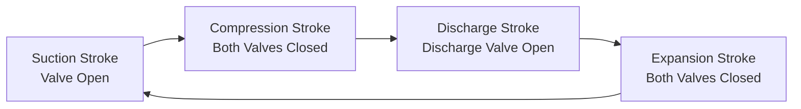
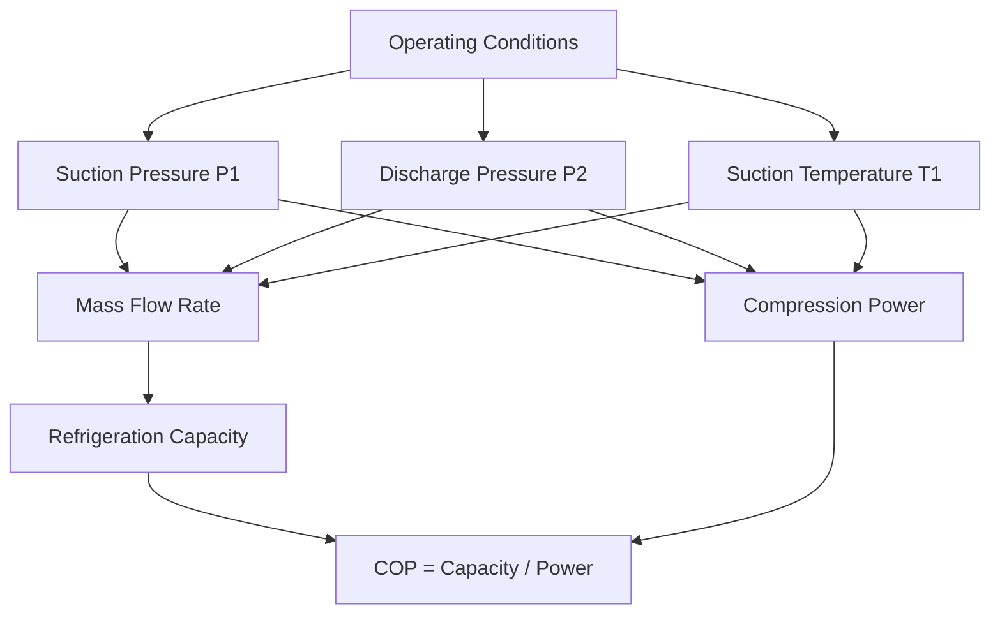
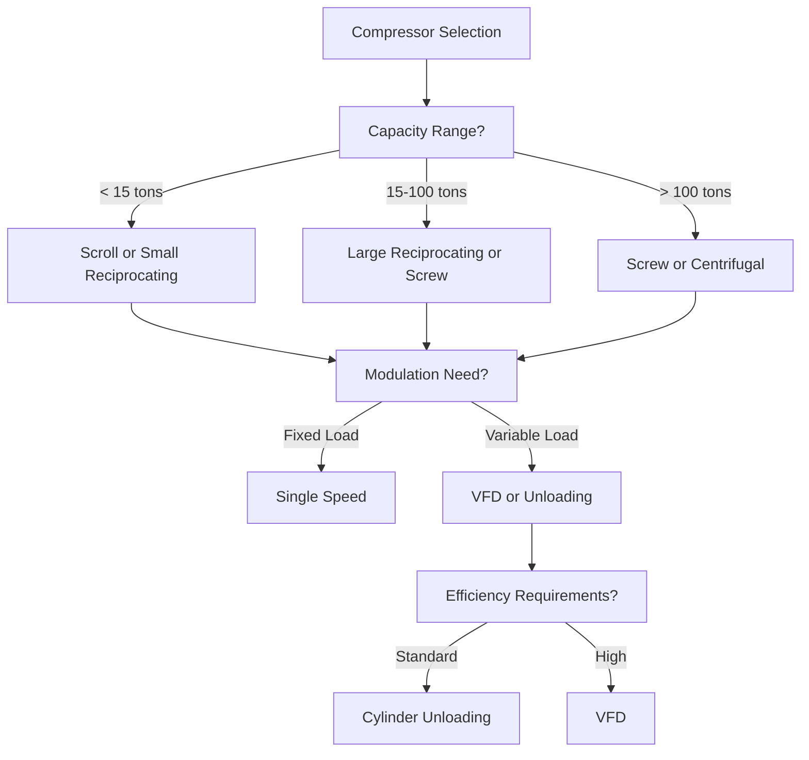

# Compressor Selection & Performance Analysis for Refrigeration Systems

Compressor selection determines refrigeration system efficiency, capacity, reliability, and operating cost. This guide covers compressor types, performance metrics, selection criteria, and capacity modulation strategies for commercial and industrial refrigeration applications.

## Compressor Types and Applications

### Positive Displacement Compressors

**Reciprocating compressors:**
- **Capacity range:** 1-200 hp (0.3-60 tons)
- **Compression ratio:** Up to 10:1 single-stage, 20:1 two-stage
- **Applications:** Commercial refrigeration, cold storage, industrial processes
- **Advantages:** Wide capacity range, high pressure capability, proven reliability
- **Disadvantages:** Pulsating flow, vibration, more maintenance than scroll

**Operating principle:**

**Scroll compressors:**
- **Capacity range:** 1-50 hp (0.3-15 tons)
- **Compression ratio:** Up to 6:1
- **Applications:** Residential/light commercial AC, heat pumps, refrigeration
- **Advantages:** Quiet operation, high efficiency, fewer moving parts, oil management
- **Disadvantages:** Limited capacity range, sensitive to liquid slugging

**Screw compressors (rotary twin-screw):**
- **Capacity range:** 20-1,000+ hp (6-300+ tons)
- **Compression ratio:** Up to 20:1
- **Applications:** Industrial refrigeration, large commercial systems, process cooling
- **Advantages:** Continuous flow, compact, oil cooling (reduces discharge temp), capacity modulation via slide valve
- **Disadvantages:** Higher first cost, requires oil separator

### Dynamic Compressors

**Centrifugal compressors:**
- **Capacity range:** 100-10,000+ tons
- **Compression ratio:** 3-5:1 per stage (multiple stages possible)
- **Applications:** Large chillers, district cooling, industrial processes
- **Advantages:** Very high capacity, smooth operation, compact footprint, long life
- **Disadvantages:** Surge limit (minimum flow), lower efficiency at part load, high first cost

**Operating principle:**
Refrigerant accelerates radially through impeller (kinetic energy), then decelerates in diffuser (pressure rise).

## Performance Metrics

### Volumetric Efficiency

**Definition:** Ratio of actual mass flow to displacement mass flow

$$\eta_v = \frac{\dot{m}_{actual}}{\dot{m}_{displacement}} = \frac{\dot{m}_{actual}}{\rho_1 \cdot V_d \cdot N}$$

Where:
- $\dot{m}_{actual}$ = actual refrigerant mass flow rate (lb/min)
- $\rho_1$ = suction gas density (lb/ft³)
- $V_d$ = displacement volume per revolution (ft³/rev)
- $N$ = compressor speed (rev/min)

**Losses reducing volumetric efficiency:**

1. **Clearance volume:** Gas remaining in cylinder at end of discharge stroke re-expands during suction
   
   $$\eta_{clearance} = 1 - C \left[ \left(\frac{P_2}{P_1}\right)^{1/n} - 1 \right]$$
   
   Where $C$ = clearance volume ratio (typically 0.03-0.08)

2. **Pressure drop:** Suction/discharge valve and port losses

3. **Heat transfer:** Suction gas heating reduces density

4. **Leakage:** Past piston rings and valves

**Typical volumetric efficiencies:**
- Reciprocating: 65-85% (lower at high compression ratio)
- Scroll: 85-95%
- Screw: 85-95%
- Centrifugal: Not applicable (dynamic compressor)

### Isentropic Efficiency

**Definition:** Ratio of ideal isentropic work to actual work

$$\eta_s = \frac{W_{isentropic}}{W_{actual}} = \frac{h_{2s} - h_1}{h_2 - h_1}$$

Where:
- $h_1$ = suction enthalpy (Btu/lb)
- $h_{2s}$ = discharge enthalpy for isentropic compression (Btu/lb)
- $h_2$ = actual discharge enthalpy (Btu/lb)

**Typical isentropic efficiencies:**
- Reciprocating: 65-75%
- Scroll: 60-70%
- Screw: 70-80%
- Centrifugal: 70-85% (design point), drops at part load

**Compression power:**

$$P_{comp} = \frac{\dot{m} (h_2 - h_1)}{\eta_{motor}}$$

Where $\eta_{motor}$ = motor efficiency (0.90-0.95 typical)

### Capacity and Power Relationships

**Refrigeration capacity:**

$$\dot{Q}_{evap} = \dot{m} (h_1 - h_4)$$

Where $h_4$ = enthalpy entering evaporator (Btu/lb)

**COP (Coefficient of Performance):**

$$COP = \frac{\dot{Q}_{evap}}{P_{comp}} = \frac{h_1 - h_4}{h_2 - h_1}$$

**Heat rejection at condenser:**

$$\dot{Q}_{cond} = \dot{m} (h_2 - h_3) = \dot{Q}_{evap} + P_{comp}$$

## Compressor Performance Maps

Compressor performance varies with operating conditions (suction temperature, discharge pressure, superheat).

**Performance rating standards:**
- **AHRI 540:** Performance rating of positive displacement compressors
- **AHRI 550/590:** Performance rating of centrifugal compressors

**Application Rating Point (ARP):**
Standard conditions for compressor performance comparison

| Refrigerant | Evap Temp | Cond Temp | Suction Temp | Subcooling |
|-------------|-----------|-----------|--------------|------------|
| R-404A | -10°F | 100°F | 65°F | 10°F |
| R-134a | 40°F | 100°F | 65°F | 10°F |
| R-717 (NH₃) | -10°F | 95°F | 65°F | 0°F |

<h3>Worked Example 1: Reciprocating Compressor Performance</h3>

**Given:**
- Refrigerant: R-404A
- Evaporating temperature: 0°F (suction pressure: 37.0 psia)
- Condensing temperature: 100°F (discharge pressure: 281.8 psia)
- Suction superheat: 20°F (suction temperature: 20°F)
- Compressor displacement: 10 ft³/min
- Volumetric efficiency: 75%
- Isentropic efficiency: 70%
- Motor efficiency: 92%

**Find:** Mass flow rate, refrigeration capacity, compressor power, COP

**Solution:**

From R-404A tables at 0°F saturated:
- $h_1'$ = 165.5 Btu/lb (saturated vapor)
- At 20°F superheated: $h_1$ = 172.3 Btu/lb, $v_1$ = 1.18 ft³/lb

From R-404A tables at 100°F saturated:
- $h_3$ = 107.8 Btu/lb (saturated liquid)

Isentropic compression from state 1:
- $h_{2s}$ = 190.2 Btu/lb

Actual discharge enthalpy:
$$h_2 = h_1 + \frac{h_{2s} - h_1}{\eta_s} = 172.3 + \frac{190.2 - 172.3}{0.70} = 197.8 \text{ Btu/lb}$$

Mass flow rate:
$$\dot{m} = \eta_v \cdot \frac{V_d}{v_1} = 0.75 \times \frac{10}{1.18} = 6.36 \text{ lb/min} = 381.6 \text{ lb/hr}$$

Expansion process (isenthalpic):
$$h_4 = h_3 = 107.8 \text{ Btu/lb}$$

Refrigeration capacity:
$$\dot{Q}_{evap} = \dot{m} (h_1 - h_4) = 6.36 \times (172.3 - 107.8) = 410.2 \text{ Btu/min} = 3.42 \text{ tons}$$

Compressor power:
$$P_{comp} = \frac{\dot{m} (h_2 - h_1)}{\eta_{motor}} = \frac{6.36 \times (197.8 - 172.3)}{0.92} = 176.2 \text{ Btu/min} = 4.16 \text{ hp}$$

COP:
$$COP = \frac{410.2}{176.2} = 2.33$$

**Answers:**
- Mass flow rate: 381.6 lb/hr
- Refrigeration capacity: 3.42 tons
- Compressor power: 4.16 hp (1.22 kW/ton)
- COP: 2.33

## Capacity Modulation Methods

Variable capacity control improves part-load efficiency and temperature control.

### Reciprocating Compressor Modulation

**1. Cylinder unloading:**
- Disable cylinders (typically 25%, 50%, 75%, 100% steps)
- Solenoid holds suction valve open (no compression)
- Common for 4, 6, 8 cylinder compressors

**2. Hot gas bypass:**
- Recirculates discharge gas to suction
- Maintains minimum compressor load
- Inefficient (wasted energy), used only for minimum capacity

**3. Variable speed drive (VFD):**
- Continuously variable capacity (20-100%)
- Highest efficiency at part load
- Requires inverter-duty motor, oil pump for low speed

### Scroll Compressor Modulation

**1. Digital (on/off cycling):**
- Rapid cycling (10-20 seconds) for 10-100% capacity
- Solenoid prevents compression during off cycle
- Good efficiency, simple control

**2. Variable speed:**
- 20-100% capacity range
- Excellent part-load efficiency
- Requires specialized scroll design

### Screw Compressor Modulation

**1. Slide valve:**
- Adjustable internal volume ratio
- 10-100% capacity continuously variable
- Maintains good efficiency across range
- Standard modulation method for screw compressors

**2. Variable speed:**
- Combined with slide valve for maximum efficiency
- Common in industrial refrigeration

### Centrifugal Compressor Modulation

**1. Inlet guide vanes (IGV):**
- Pre-swirl inlet flow to reduce capacity
- 40-100% capacity range
- Efficiency penalty at low capacity

**2. Variable speed:**
- Best efficiency across operating range
- Extends surge limit to lower capacity
- Magnetic bearings enable wide speed range

**3. Hot gas bypass:**
- Minimum flow protection (prevent surge)
- Very inefficient, only for minimum capacity

## Selection Criteria

**Key selection factors:**

1. **Capacity:** Match compressor range to application load
2. **Refrigerant:** Ensure compressor designed for refrigerant (pressures, materials)
3. **Temperature range:** Low-temp applications require two-stage or cascade
4. **Efficiency:** Balance first cost vs. operating cost (life cycle analysis)
5. **Modulation:** Variable loads require capacity control
6. **Reliability:** Consider maintenance requirements, duty cycle
7. **Noise:** Scroll quietest, reciprocating noisiest, isolation required
8. **Oil management:** Oil separator required for screw, oil return for long lines

## Practical Considerations

**Minimum run time:**
- Prevent short cycling (wear, efficiency loss)
- Typical minimum: 3-5 minutes

**Minimum capacity:**
- Hot gas bypass or capacity unloading
- Maintain oil circulation at low load

**Suction superheat control:**
- 10-20°F typical (prevent liquid slugging)
- Thermostatic expansion valve (TXV) or electronic expansion valve (EEV)

**Discharge temperature limits:**
- Reciprocating: 225-250°F max (oil breakdown)
- Scroll: 225°F max
- Screw: 200-225°F max (oil-cooled)
- Centrifugal: No limit (oil-free)

**Liquid slugging prevention:**
- Suction accumulator for systems with liquid migration risk
- Pumpdown cycle before shutdown
- Crankcase heater

---

**Related Technical Guides:**
- [Vapor Compression Refrigeration Cycle](/technical-guides/vapor-compression-refrigeration/)
- [Refrigerant Selection & Properties](/technical-guides/refrigerant-selection-properties/)
- [Refrigeration Load Calculations](/technical-guides/refrigeration-load-calculations/)
- [Evaporator Design](/technical-guides/evaporator-design/)
- [Condenser Design](/technical-guides/condenser-design/)

**References:**
- ASHRAE Handbook of Refrigeration, Chapter 37: Compressors
- AHRI Standard 540: Performance Rating of Positive Displacement Compressors
- AHRI Standard 550/590: Performance Rating of Centrifugal Compressors
- Stoecker, W.F., "Industrial Refrigeration Handbook"
- Dossat, R.J., "Principles of Refrigeration"
