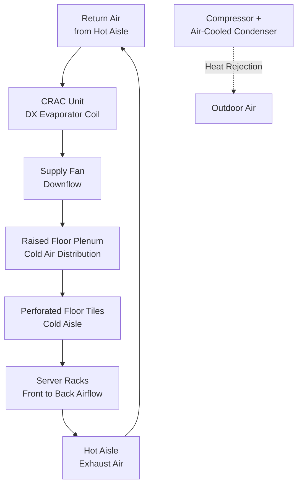
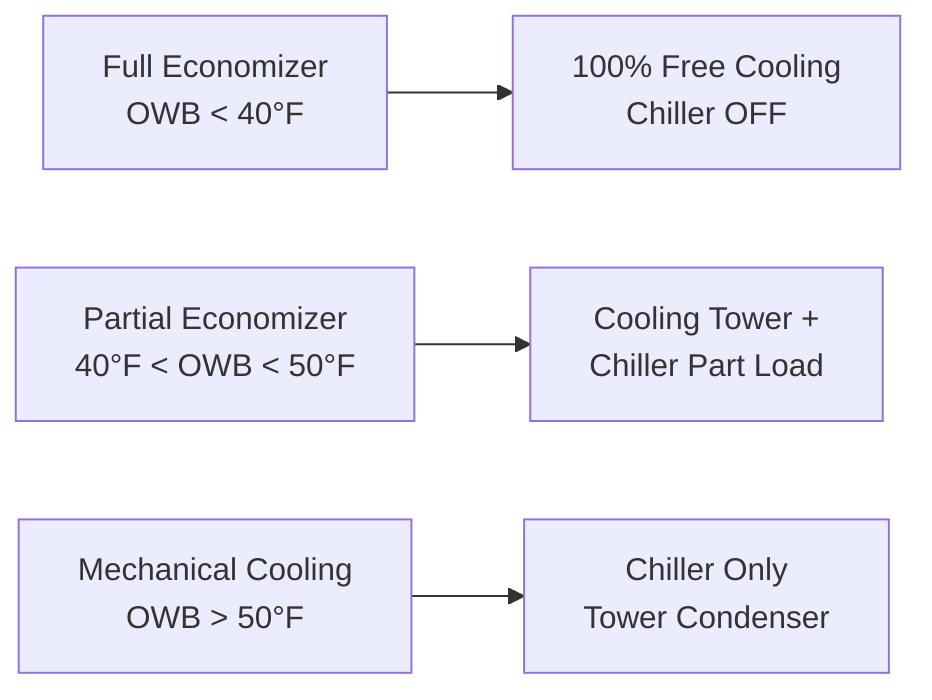

# Data Center Cooling Strategies & Thermal Management

Data center cooling systems remove heat from IT equipment while maintaining temperature and humidity within specified ranges. This guide covers cooling technologies, containment strategies, efficiency metrics, and redundancy configurations for mission-critical facilities.

## Data Center Heat Loads

### IT Equipment Heat Generation

**Server heat output:**

$$Q_{IT} = P_{IT} \times 3.412$$

Where:
- $Q_{IT}$ = heat dissipation (Btu/hr)
- $P_{IT}$ = IT power consumption (watts)
- 3.412 = conversion factor (Btu/hr per watt)

**Typical power densities:**

| Application | Power Density (W/ft²) | Heat Load (Btu/hr·ft²) |
|-------------|----------------------|------------------------|
| Traditional office servers | 50-100 | 170-340 |
| High-density servers | 150-300 | 512-1,024 |
| Blade servers | 300-500 | 1,024-1,706 |
| HPC (High Performance Computing) | 500-1,000 | 1,706-3,412 |

**Per-rack heat loads:**

| Server Type | Power per Rack (kW) | Heat Load (tons) |
|-------------|---------------------|------------------|
| Standard 1U servers | 3-8 kW | 0.9-2.3 tons |
| High-density blade | 15-25 kW | 4.4-7.3 tons |
| GPU/AI compute | 30-50 kW | 8.8-14.6 tons |

### Total Cooling Load Components

**Total data center cooling:**

$$Q_{total} = Q_{IT} + Q_{lighting} + Q_{UPS} + Q_{transmission} + Q_{people}$$

**Infrastructure efficiency factor:**
- IT equipment: 60-80% of total load
- UPS losses: 5-10%
- Lighting: 2-5%
- Envelope transmission: 2-5%

**Example:** 1 MW IT load → 1.15-1.25 MW total cooling load

## Cooling Technologies

### Computer Room Air Conditioning (CRAC)

**Direct expansion (DX) refrigeration:**
- Self-contained cooling unit (compressor, condenser, evaporator)
- Air-cooled condenser (outdoor) or water-cooled
- Capacity: 5-60 tons typical

**Configuration:**

**Advantages:**
- Simple, standalone operation
- No chilled water infrastructure required
- Common in smaller data centers (< 5,000 ft²)

**Disadvantages:**
- Lower efficiency than chilled water (PUE 1.6-2.0)
- Refrigerant leaks disrupt operations
- Limited capacity per unit

### Computer Room Air Handler (CRAH)

**Chilled water cooling:**
- Air handler with chilled water coil
- Separate central chiller plant
- Capacity: 10-100+ tons per unit

**Advantages:**
- Higher efficiency (PUE 1.3-1.5 with efficient chillers)
- Scalability (add CRAHs as needed)
- Waterside economizer opportunity
- No refrigerant in computer room

**Disadvantages:**
- Requires chilled water infrastructure
- Higher first cost
- Leak detection and protection critical

**Typical chilled water design:**
- Supply: 45°F
- Return: 55-60°F (10-15°F ΔT)
- Flow rate: 2.4 gpm/ton (standard), 1.2 gpm/ton (high ΔT design)

### In-Row Cooling

**Close-coupled cooling:**
- Cooling units placed between server racks in hot or cold aisle
- Short air path (reduces fan energy, improves efficiency)
- Chilled water or DX refrigerant

**Benefits:**
- Higher cooling density (supports 15-30 kW/rack)
- Precise temperature control
- Reduced airflow requirements (short distance)
- Modular expansion

**Applications:** High-density computing, blade servers, HPC

### Rear-Door Heat Exchangers

**Passive cooling:**
- Heat exchanger mounted on rear of rack
- Chilled water coils capture heat at source
- No fans required (server fans provide airflow)

**Capacity:** 20-35 kW per door

**Advantages:**
- Silent operation (no fans)
- Very high density cooling
- No floor space required

**Disadvantages:**
- Requires chilled water infrastructure at each rack
- Weight and structural load
- Higher cost per rack

### Liquid Cooling (Direct-to-Chip)

**Cold plates:**
- Liquid-cooled heat sinks on CPUs, GPUs
- Water or dielectric fluid circulates through rack
- Heat rejection to facility chilled water or CDU (coolant distribution unit)

**Capacity:** 50-100+ kW per rack (extreme density)

**Applications:**
- Supercomputers, HPC clusters
- AI/ML training servers (GPU-intensive)
- Cryptocurrency mining

**Cooling distribution unit (CDU):**
- Facility chilled water (45-65°F) → server coolant (60-85°F)
- Plate heat exchanger separates loops
- Prevents contamination of server loop

## Containment Strategies

### Hot Aisle Containment (HAC)

**Enclose hot aisles:**
- Doors, roof, end panels isolate hot exhaust air
- Return air ducts from top of containment to CRAC/CRAH units
- Cold aisles remain open (supply air to room)

**Benefits:**
- Prevents hot air recirculation into cold aisles
- Allows higher return air temperature (60-80°F) → improved chiller efficiency
- Reduces bypass airflow (wasted cooling)

**Typical improvement:** 20-30% reduction in cooling energy

### Cold Aisle Containment (CAC)

**Enclose cold aisles:**
- Doors, roof, end panels isolate supply air
- Supply air ducted into containment from raised floor or overhead
- Hot aisles exhaust to room

**Benefits:**
- More efficient use of supply air (zero bypass)
- Better humidity control (less mixing)
- Allows wider temperature range in hot aisle (safety)

**Comparison to HAC:**
- CAC: Better efficiency, more complex installation
- HAC: Simpler retrofit, occupant comfort (cool room)

### Containment Effectiveness

**Supply air temperature increase:**
- Without containment: 55-65°F supply → 80-90°F rack inlet (mixing losses)
- With containment: 65-75°F supply → 70-80°F rack inlet (minimal mixing)

**Enables higher supply temperatures:**
- Traditional: 55°F supply air
- With containment: 65-75°F supply air
- Chiller efficiency improves ~2% per °F increase in chilled water temperature

<h3>Worked Example 1: Containment Energy Savings</h3>

**Given:**
- Data center: 200 kW IT load
- CRAH units: 4 × 60 ton (240 tons total)
- Chiller: Water-cooled, 0.55 kW/ton at 45°F CHW
- Scenario 1 (no containment): 45°F CHW, 55°F supply air, 20% bypass airflow
- Scenario 2 (hot aisle containment): 55°F CHW, 65°F supply air, 5% bypass

**Find:** Annual energy savings with containment

**Solution:**

**Scenario 1: No containment**

IT heat: $200 \text{ kW} \times 3.412 = 682,400 \text{ Btu/hr} = 56.9 \text{ tons}$

Bypass loss: $56.9 \times 0.20 = 11.4 \text{ tons}$ wasted

Effective cooling: $56.9 + 11.4 = 68.3 \text{ tons}$ required

Chiller power: $68.3 \times 0.55 = 37.6 \text{ kW}$

**Scenario 2: With containment**

Bypass reduced to 5%: $56.9 \times 0.05 = 2.8 \text{ tons}$

Required cooling: $56.9 + 2.8 = 59.7 \text{ tons}$

Higher CHW temp (55°F vs 45°F) improves efficiency: 0.45 kW/ton

Chiller power: $59.7 \times 0.45 = 26.9 \text{ kW}$

**Energy savings:**
$$\Delta P = 37.6 - 26.9 = 10.7 \text{ kW}$$

**Annual savings (8,760 hr/yr):**
$$E_{savings} = 10.7 \times 8,760 = 93,732 \text{ kWh/yr}$$

At $0.12/kWh: Cost savings = $11,248/year

**Payback:** If HAC installation costs $50,000, payback = 4.4 years

**Answer:** 10.7 kW cooling energy reduction (28% savings), $11,248/year

## Economizer Cooling

### Airside Economizer

**Free cooling with outdoor air:**
- When outdoor temperature < return air temperature, use 100% outdoor air
- Direct outdoor air to cold aisles or raised floor plenum
- Mechanical cooling stages on as outdoor air becomes insufficient

**Control strategies:**
1. **Differential temperature:** OAT < return air temp
2. **Fixed drybulb:** OAT < 55-65°F
3. **Differential enthalpy:** Outdoor enthalpy < return enthalpy (prevents high humidity intake)

**Climate effectiveness:**

| Climate | Annual Free Cooling Hours | Economizer Benefit |
|---------|---------------------------|-------------------|
| Seattle | 6,500-7,500 hr | Excellent |
| San Francisco | 7,000-8,000 hr | Excellent |
| Chicago | 4,500-5,500 hr | Good |
| Phoenix | 2,000-3,000 hr | Fair |
| Miami | 500-1,500 hr | Poor |

**Challenges:**
- Filtration (outdoor particulates, pollution)
- Humidity control (condensation risk)
- Makeup air requirements (building pressurization)

### Waterside Economizer

**Chiller bypass with cooling tower:**
- When outdoor wet-bulb < 45-50°F, use cooling tower water directly
- Plate heat exchanger isolates tower water from chilled water loop
- Chiller remains off (compressor energy eliminated)

**Operating modes:**

**Advantages over airside:**
- No outdoor air intake (better humidity/particle control)
- Effective in more climates (uses wet-bulb, not drybulb)
- No building pressurization concerns

**Requirements:**
- Cooling tower capacity (sized for economizer mode)
- Plate-and-frame heat exchanger
- Controls and switchover logic

## Efficiency Metrics

### Power Usage Effectiveness (PUE)

**Definition:**

$$PUE = \frac{Total\ Facility\ Power}{IT\ Equipment\ Power}$$

**Interpretation:**
- PUE = 2.0: 50% efficiency (1 W IT load requires 2 W total, 1 W for cooling/infrastructure)
- PUE = 1.5: 67% efficiency
- PUE = 1.2: 83% efficiency (industry best practice)
- PUE = 1.05: 95% efficiency (hyperscale, free cooling climates)

**Components of overhead (non-IT power):**
- Cooling (chillers, pumps, CRAC/CRAH fans): 30-50%
- UPS losses: 5-10%
- Lighting: 2-5%
- Network equipment: 5-10%

### Data Center Infrastructure Efficiency (DCiE)

$$DCiE = \frac{1}{PUE} = \frac{IT\ Equipment\ Power}{Total\ Facility\ Power}$$

**Example:** PUE 1.5 → DCiE = 66.7%

### Partial PUE (pPUE)

**Cooling-only efficiency:**

$$pPUE_{cooling} = 1 + \frac{Cooling\ System\ Power}{IT\ Power}$$

**Allows benchmarking of cooling system independent of UPS, lighting**

## Redundancy and Availability

### Tier Classifications (Uptime Institute)

**Tier I: Basic Capacity (99.671% uptime, 28.8 hr/yr downtime)**
- Single path for power and cooling
- No redundant components
- Maintenance requires shutdown

**Tier II: Redundant Capacity (99.741%, 22 hr/yr)**
- Single path (N architecture)
- Redundant components (N+1)
- Maintenance on components, not distribution

**Tier III: Concurrently Maintainable (99.982%, 1.6 hr/yr)**
- Multiple distribution paths (only one active)
- N+1 redundancy
- Maintenance without shutdown
- Planned maintenance: zero downtime

**Tier IV: Fault Tolerant (99.995%, 0.4 hr/yr)**
- Multiple active distribution paths (2N or 2N+1)
- Compartmentalized (single failure does not cascade)
- Continuous operation during any failure

### Cooling Redundancy Configurations

**N (no redundancy):**
- Minimum cooling to handle full IT load
- Single point of failure
- Tier I

**N+1 (component redundancy):**
- One extra cooling unit beyond minimum
- Example: 3 × 40 ton CRAHs for 80 ton load (any one unit fails, 80 tons remains)
- Tier II

**2N (fully redundant):**
- Two complete independent systems
- Each system handles 100% load
- Example: Two separate chiller plants (A + B), each 100% capacity
- Tier III-IV

**2N+1 (redundant distribution + component redundancy):**
- Two independent systems + spare unit
- Highest reliability
- Tier IV

## Temperature and Humidity Specifications

**ASHRAE TC 9.9 Thermal Guidelines for Data Centers:**

| Class | Temperature Range | Humidity Range | Dewpoint Range |
|-------|-------------------|----------------|----------------|
| A1 (enterprise) | 59-89°F | 20-80% RH | 41-59°F DP |
| A2 (enterprise) | 50-95°F | 20-80% RH | 41-59°F DP |
| A3 (volume servers) | 41-104°F | 8-85% RH | 28-63°F DP |
| A4 (mission critical) | 41-113°F | 8-90% RH | 28-63°F DP |

**Recommended operating range (Class A1):**
- Temperature: 64-80°F (18-27°C)
- Humidity: 40-60% RH
- Dewpoint: 42-59°F (prevents condensation)

**Wider ranges reduce cooling energy but may impact reliability**

---

**Related Technical Guides:**
- [Chiller Performance Analysis](/technical-guides/chiller-performance-analysis/)
- [Cooling Load Calculations](/technical-guides/cooling-load-calculations/)
- [Building Pressurization Control](/technical-guides/building-pressurization-control/)
- [Energy Modeling Methodology](/technical-guides/energy-modeling-methodology/)
- [HVAC Control Strategies](/technical-guides/hvac-control-strategies/)

**References:**
- ASHRAE TC 9.9: Thermal Guidelines for Data Processing Environments
- Uptime Institute: Data Center Site Infrastructure Tier Standard
- U.S. Department of Energy: Best Practices Guide for Energy-Efficient Data Center Design
- ASHRAE Datacom Series Books: Design Considerations, Thermal Management
- The Green Grid: PUE and DCiE Measurement Protocols
