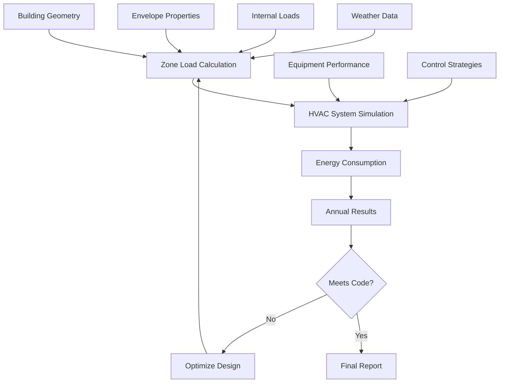

# Energy Modeling Methodology for HVAC Engineers

Energy modeling predicts HVAC energy consumption for design optimization, code compliance, and operational analysis. Methods range from simple degree-day calculations to detailed hourly simulations.

## Degree-Day Method

**Heating degree days (HDD):**

$$HDD = \sum_{days} \max(T_{balance} - T_{outdoor,avg}, 0)$$

**Cooling degree days (CDD):**

$$CDD = \sum_{days} \max(T_{outdoor,avg} - T_{balance}, 0)$$

Where $T_{balance}$ = balance point temperature (typically 65°F for residential)

**Annual heating energy:**

$$Q_{heat} = UA \times 24 \times HDD \times \eta^{-1}$$

Where:
- $UA$ = building heat loss coefficient (Btu/h·°F)
- $\eta$ = heating system efficiency

**Annual cooling energy:**

$$Q_{cool} = UA \times 24 \times CDD \times COP^{-1}$$

<h3>Worked Example 1: Degree-Day Heating Energy</h3>

**Given:**
- Building UA: 5,000 Btu/h·°F
- Climate: Chicago (6,500 HDD base 65°F)
- Boiler efficiency: 85%
- Natural gas cost: $1.00/therm

**Find:** Annual heating energy and cost

**Solution:**

Annual heating load:

$$Q = 5000 \times 24 \times 6500 = 780,000,000 \text{ Btu/year}$$

Gas consumption:

$$Gas = \frac{780,000,000}{100,000 \times 0.85} = 9,176 \text{ therms/year}$$

Annual cost:

$$Cost = 9,176 \times 1.00 = \$9,176$$

**Answer:** 9,176 therms/year, $9,176/year heating cost

**Limitations:**
- Assumes constant balance point
- Ignores internal gains
- No hourly variations
- Linear relationship (not accurate for complex systems)

**Accuracy:** ±20-30% for simple buildings

## Bin Method

**Divides climate data into temperature bins** (5°F increments)

**For each bin:**

$$Energy_{bin} = Load_{bin} \times Hours_{bin} \times PLR \times Efficiency^{-1}$$

Where:
- $Load_{bin}$ = load at bin temperature
- $Hours_{bin}$ = hours in that temperature range (from TMY data)
- $PLR$ = part-load ratio

**Heating load at bin temperature:**

$$Load = UA \times (T_{balance} - T_{bin}) + Ventilation_{load}$$

**Cooling load at bin temperature:**

$$Load = UA \times (T_{bin} - T_{balance}) + Ventilation_{load} - Internal_{gains}$$

**Part-load performance:**

Account for equipment efficiency degradation at part load

$$COP_{part} = COP_{rated} \times (a + b \times PLR + c \times PLR^2)$$

**Advantages over degree-day:**
- Accounts for part-load performance
- Includes hourly climate distribution
- More accurate for HVAC equipment selection

**Accuracy:** ±10-20%

<h3>Worked Example 2: Bin Method Cooling Energy</h3>

**Given:**
- Building UA: 3,000 Btu/h·°F
- Balance point: 60°F (with internal gains)
- Bin: 80-85°F (average 82.5°F)
- Hours in bin: 400 hours/year
- Chiller rated COP: 3.5 at design
- Part-load efficiency factor: 1.1 (improved COP at part load)

**Find:** Cooling energy for this bin

**Solution:**

Load at bin:

$$Load = 3000 \times (82.5 - 60) = 67,500 \text{ Btu/h}$$

Part-load COP:

$$COP_{part} = 3.5 \times 1.1 = 3.85$$

Cooling energy:

$$Energy = \frac{67,500 \times 400}{3.85 \times 3,412} = 2,054 \text{ kWh}$$

**Answer:** 2,054 kWh for 80-85°F temperature bin

(Repeat for all bins and sum for annual energy)

## Detailed Hourly Simulation

**Software tools:**
- DOE-2 / eQUEST (free, widely used for LEED)
- EnergyPlus (free, open-source, detailed physics)
- TRACE 700 / HAP (commercial, user-friendly)
- IES-VE (detailed daylighting, CFD integration)

**Inputs required:**
1. **Geometry:** Building footprint, orientation, zoning
2. **Envelope:** Wall/roof/window construction, U-values, SHGC
3. **Internal loads:** Occupancy, lighting, equipment schedules
4. **HVAC systems:** Equipment types, efficiencies, control strategies
5. **Climate:** TMY3 weather data (8,760 hourly values)

**Simulation process:**

**Calculation methods:**
- Heat balance method (EnergyPlus)
- Weighting factor method (DOE-2)
- Radiant time series (ASHRAE)

**Outputs:**
- Annual energy consumption by end use (heating, cooling, fans, pumps, lighting)
- Peak demand
- Energy cost
- Carbon emissions
- Hourly load profiles

**Accuracy:** ±5-15% if properly calibrated

## Model Calibration

**Compare modeled vs. measured energy** for existing buildings

**Calibration metrics (ASHRAE Guideline 14):**

**Monthly calibration:**

$$MBE = \frac{\sum (measured - modeled)}{\sum measured} \times 100\%$$

**Target:** MBE within ±5%

$$CV(RMSE) = \frac{\sqrt{\frac{\sum (measured - modeled)^2}{n}}}{\overline{measured}} \times 100\%$$

**Target:** CV(RMSE) within 15%

**Calibration process:**
1. **Utility bill analysis:** Establish baseline consumption
2. **Initial model:** Use design parameters
3. **Compare:** Identify discrepancies (monthly or hourly)
4. **Adjust inputs:** Schedules, setpoints, infiltration, plug loads
5. **Iterate:** Refine until within tolerance

**Common calibration adjustments:**
- Occupancy schedules (often different from design)
- Thermostat setpoints (occupants override)
- Infiltration rates (building tightness varies)
- Plug loads (actual equipment differs from design)

## Code Compliance Modeling

**ASHRAE 90.1 Appendix G (Performance Rating Method):**

1. **Baseline building:** Prescriptive minimum efficiency
2. **Proposed design:** Actual design
3. **Percent improvement:**

$$Improvement = \frac{Cost_{baseline} - Cost_{proposed}}{Cost_{baseline}} \times 100\%$$

**LEED requirements:**
- New construction: 5-50% improvement (points scale)
- Core & Shell: 5-50% improvement

**Modeling rules:**
- Identical geometry, orientation, zoning
- Baseline HVAC system per Table G3.1.1 (based on building type/size)
- Baseline envelope per prescriptive requirements

## Practical Applications

1. **Design optimization:** Compare HVAC system alternatives
2. **Equipment sizing:** Right-size based on annual performance
3. **Payback analysis:** Evaluate energy efficiency upgrades
4. **Code compliance:** Demonstrate ASHRAE 90.1 / energy code compliance
5. **LEED certification:** EA Credit 1 (Optimize Energy Performance)
6. **Measurement & Verification (M&V):** Calibrated model as baseline for savings

---

**Related Technical Guides:**
- [Load Calculation Methodology](/technical-guides/load-calculation-methodology/)
- [Heating Load Calculations](/technical-guides/heating-load-calculations/)
- [Cooling Load Calculations](/technical-guides/cooling-load-calculations/)

**References:**
- ASHRAE Handbook of Fundamentals, Chapter 19: Energy Estimating and Modeling Methods
- ASHRAE Standard 90.1: Energy Standard for Buildings Except Low-Rise Residential Buildings
- ASHRAE Guideline 14: Measurement of Energy, Demand, and Water Savings
- DOE Building Energy Software Tools Directory
