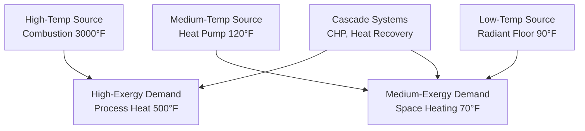

# Exergy Analysis & Thermodynamic Optimization for HVAC Systems

Exergy analysis identifies thermodynamic inefficiencies beyond First Law energy analysis, revealing where useful work potential is destroyed in HVAC systems. This guide covers exergy fundamentals, calculation methodology, and optimization strategies for chillers, boilers, heat exchangers, and building thermal systems.

## Exergy Fundamentals

### Definition of Exergy

**Exergy (availability):** Maximum theoretical useful work obtainable from a system as it reaches equilibrium with the environment.

$$Ex = (H - H_0) - T_0(S - S_0)$$

Where:
- $Ex$ = specific exergy (Btu/lb or kJ/kg)
- $H$ = enthalpy at system state (Btu/lb)
- $H_0$ = enthalpy at dead state (environment)
- $S$ = entropy at system state (Btu/lb·°R)
- $S_0$ = entropy at dead state
- $T_0$ = environment temperature (°R or K)

**Dead state (reference):** Conditions of the surroundings
- Typical: $T_0$ = 77°F (537°R), $P_0$ = 14.7 psia

**Physical interpretation:**
- **Energy (First Law):** Total energy content (conserved, cannot be destroyed)
- **Exergy (Second Law):** Useful energy (quality, can be destroyed by irreversibility)

### Energy vs. Exergy

**Example: 1 lb of water at 200°F vs. 2 lb at 140°F**

**Energy content:**
- 200°F: $H = 168$ Btu/lb, Total = 168 Btu
- 140°F: $H = 108$ Btu/lb, Total = $2 \times 108 = 216$ Btu

216 Btu > 168 Btu (more energy in 140°F water)

**Exergy content (relative to 77°F environment):**

200°F water:
$$Ex = (168 - 45) - 537 \times (0.2938 - 0.0874) = 123 - 111 = 12 \text{ Btu/lb}$$

140°F water:
$$Ex = (108 - 45) - 537 \times (0.1985 - 0.0874) = 63 - 60 = 3 \text{ Btu/lb}$$

Total: $2 \times 3 = 6$ Btu

**Result:** 200°F water has higher exergy (12 Btu vs. 6 Btu) despite lower energy
- Higher temperature = higher thermodynamic quality = more useful work potential

### Exergy Balance

**Steady-flow system:**

$$\sum Ex_{in} = \sum Ex_{out} + Ex_{destroyed} + Ex_{product}$$

**Exergy destruction (irreversibility):**

$$Ex_{destroyed} = T_0 \cdot S_{gen}$$

Where $S_{gen}$ = entropy generation rate (Btu/hr·°R)

**Sources of exergy destruction:**
1. **Heat transfer across finite temperature difference**
2. **Friction (fluid flow, mechanical)**
3. **Mixing of streams at different states**
4. **Throttling (pressure drop without work extraction)**
5. **Chemical reactions (combustion)**

## Second Law Efficiency

### Exergetic Efficiency

**Definition:**

$$\eta_{ex} = \frac{Ex_{product}}{Ex_{input}} = 1 - \frac{Ex_{destroyed}}{Ex_{input}}$$

**Comparison to First Law efficiency:**

$$\eta_{energy} = \frac{Energy_{output}}{Energy_{input}}$$

**Example: Space heating with boiler (outdoor 32°F, indoor 70°F)**

**First Law efficiency:** 85% (15% flue losses)

**Second Law efficiency:**
- Input exergy: Natural gas combustion (high temperature, high exergy)
- Output exergy: 70°F space heating (low temperature, low exergy)
- Exergy efficiency: 5-10% (massive thermodynamic mismatch)

**Conclusion:** High energy efficiency ≠ high exergy efficiency when task requires low-grade energy

## Exergy Analysis of HVAC Components

### Heat Exchangers

**Exergy destruction in counterflow heat exchanger:**

$$Ex_{destroyed} = \dot{m}_h c_{p,h} \ln\frac{T_{h,out}}{T_{h,in}} + \dot{m}_c c_{p,c} \ln\frac{T_{c,out}}{T_{c,in}} + T_0 \Delta S_{gen}$$

**Simplified (constant properties):**

$$Ex_{destroyed} = T_0 \left[\dot{m}_h c_{p,h} \ln\frac{T_{h,out}}{T_{h,in}} + \dot{m}_c c_{p,c} \ln\frac{T_{c,out}}{T_{c,in}}\right]$$

**Minimizing exergy destruction:**
1. Minimize temperature difference (ΔT) between streams
   - Larger heat exchanger (more area) → lower ΔT → lower exergy destruction
   - Trade-off: Capital cost vs. operating exergy loss

2. Balance capacity rates ($\dot{m}c_p$)
   - Matched flows → lower entropy generation

3. Counterflow configuration
   - Lowest exergy destruction (smallest local ΔT)

<h3>Worked Example 1: Heat Exchanger Exergy Analysis</h3>

**Given:**
- Plate heat exchanger (counterflow)
- Hot side: 10,000 lb/hr water, 180°F → 140°F
- Cold side: 10,000 lb/hr water, 120°F → 160°F
- Environment: 77°F (537°R)
- $c_p$ = 1.0 Btu/lb·°F

**Find:** Heat transfer rate, exergy destruction rate

**Solution:**

**Heat transfer:**
$$\dot{Q} = \dot{m}_h c_p (T_{h,in} - T_{h,out}) = 10,000 \times 1.0 \times (180-140) = 400,000 \text{ Btu/hr}$$

Verify energy balance:
$$\dot{Q}_c = 10,000 \times 1.0 \times (160-120) = 400,000 \text{ Btu/hr}$$ ✓

**Entropy generation:**

Hot side entropy change:
$$\Delta S_h = \dot{m}_h c_p \ln\frac{T_{h,out}}{T_{h,in}} = 10,000 \times 1.0 \times \ln\frac{600}{640} = -649 \text{ Btu/hr·°R}$$

(Using absolute temperature: 140+460=600°R, 180+460=640°R)

Cold side entropy change:
$$\Delta S_c = 10,000 \times 1.0 \times \ln\frac{620}{580} = 680 \text{ Btu/hr·°R}$$

Total entropy generation:
$$S_{gen} = 680 - 649 = 31 \text{ Btu/hr·°R}$$

**Exergy destruction:**
$$Ex_{destroyed} = T_0 \times S_{gen} = 537 \times 31 = 16,647 \text{ Btu/hr}$$

**Exergy efficiency:**

Exergy input (hot stream):
$$Ex_{in} = \dot{m}_h c_p [(T_{h,in}-T_0) - T_0 \ln(T_{h,in}/T_0)]$$
$$Ex_{in} = 10,000 \times 1.0 \times [(180-77) - 537 \ln(640/537)] = 49,020 \text{ Btu/hr}$$

$$\eta_{ex} = 1 - \frac{16,647}{49,020} = 0.66 = 66\%$$

**Answer:** 16,647 Btu/hr exergy destroyed (66% exergy efficiency)

**Improvement strategies:**
- Increase heat exchanger area (reduce ΔT): 20°F → 10°F approach → lower exergy destruction
- Counterflow (already optimized)

### Vapor Compression Refrigeration

**Exergy destruction breakdown (typical chiller):**

| Component | % of Total Exergy Destruction |
|-----------|-------------------------------|
| Compressor | 40-50% |
| Condenser | 25-35% |
| Evaporator | 15-20% |
| Expansion valve | 5-10% |

**Exergetic COP:**

$$COP_{ex} = \frac{Ex_{cooling}}{W_{compressor}}$$

Where exergy of cooling:

$$Ex_{cooling} = \dot{Q}_{evap} \left(1 - \frac{T_0}{T_{evap}}\right)$$

**Comparison:**
- Energy COP = $\dot{Q}_{evap} / W_{compressor}$ (typically 3-6)
- Exergy COP = $Ex_{cooling} / W_{compressor}$ (typically 0.3-0.6)

**Interpretation:** Even efficient chillers destroy 40-70% of input work exergy

### Boilers and Combustion

**Exergy destruction in combustion:**

$$Ex_{destroyed,combustion} = T_0 \sum_{products} \dot{n}_i s_i - T_0 \sum_{reactants} \dot{n}_j s_j$$

**Major irreversibilities:**
1. **Chemical reaction:** Mixing of combustion gases (largest)
2. **Heat transfer:** Flame temperature (3,000°F) → furnace walls (1,500°F) → water (350°F)
3. **Flue gas exit:** Hot gases exhausted to atmosphere (exergy loss)

**Typical boiler exergy efficiency:** 30-40% (vs. 85-90% energy efficiency)

**Most exergy destroyed in combustion itself (not recoverable)**

**Improvement strategies:**
- Minimize excess air (lower flue gas flow)
- Economizer (recover flue gas exergy)
- Condensing boiler (recover latent heat at low temperature)
- **Fundamental limit:** Combustion is highly irreversible (cannot approach Carnot efficiency)

## Exergy-Based Optimization

### Building Thermal Systems

**Exergy demand for space heating:**

$$Ex_{heating} = \dot{Q}_{heating} \left(1 - \frac{T_0}{T_{room}}\right)$$

**Example:** 100,000 Btu/hr heating load
- Room: 70°F (530°R)
- Outdoor: 32°F (492°R)

Energy demand: 100,000 Btu/hr

Exergy demand:
$$Ex = 100,000 \left(1 - \frac{492}{530}\right) = 7,170 \text{ Btu/hr}$$

**Exergy demand is only 7% of energy demand** (low-grade heat requirement)

**Implication:** Ideal heating source is low-temperature (heat pumps, waste heat recovery, solar thermal) rather than high-temperature combustion

### Temperature Matching

**Exergy-optimized system matching:**

**Principle:** Match source temperature to demand temperature
- High-temperature combustion → high-temperature processes
- Low-temperature sources → space heating/cooling
- Cascade: Use waste heat from high-temp process for low-temp needs

### Combined Heat and Power (CHP)

**CHP exergy analysis:**

**Conventional separate production:**
- Electricity from power plant: 33% efficient (67% waste heat)
- Heat from boiler: 85% efficient

**CHP (cogeneration):**
- Electricity from gas engine: 35-40% efficient
- Waste heat captured: 40-50% (hot water, steam)
- Total efficiency: 75-90%

**Exergy efficiency:**

CHP: $$\eta_{ex,CHP} = \frac{W_{elec} + Ex_{heat}}{Ex_{fuel}}$$

**Typical:** 50-60% exergy efficiency (vs. 30% conventional)

**Key:** Utilize waste heat at appropriate temperature level (not overheating low-temp loads)

<h3>Worked Example 2: CHP vs. Separate Production</h3>

**Given:**
- Building demand: 500 kW electricity, 3 MMBtu/hr heating (180°F hot water)
- Option 1: Grid electricity (40% generation efficiency) + boiler (85% efficiency)
- Option 2: CHP (35% electric, 45% heat recovery, 180°F)
- Fuel: Natural gas (LHV = 21,500 Btu/lb, exergy ≈ LHV)
- Environment: 77°F

**Find:** Fuel consumption and exergy efficiency for each option

**Solution:**

**Option 1: Separate production**

Electricity fuel input:
$$\dot{m}_{fuel,elec} = \frac{500 \times 3,412}{0.40 \times 21,500} = 198.4 \text{ lb/hr}$$

Heating fuel input:
$$\dot{m}_{fuel,heat} = \frac{3,000,000}{0.85 \times 21,500} = 164.2 \text{ lb/hr}$$

Total fuel: $198.4 + 164.2 = 362.6$ lb/hr

Total fuel energy: $362.6 \times 21,500 = 7,796,000$ Btu/hr

**Option 2: CHP**

CHP fuel input for 500 kW electric:
$$\dot{m}_{fuel,CHP} = \frac{500 \times 3,412}{0.35 \times 21,500} = 227.0 \text{ lb/hr}$$

CHP fuel energy: $227.0 \times 21,500 = 4,880,500$ Btu/hr

Heat recovered: $4,880,500 \times 0.45 = 2,196,225$ Btu/hr

Shortfall: $3,000,000 - 2,196,225 = 803,775$ Btu/hr (supplemental boiler)

Boiler fuel: $803,775 / (0.85 \times 21,500) = 44.0$ lb/hr

Total CHP fuel: $227.0 + 44.0 = 271.0$ lb/hr

Total fuel energy: $271.0 \times 21,500 = 5,826,500$ Btu/hr

**Fuel savings:** $(7,796,000 - 5,826,500)/7,796,000 = 25.3\%$

**Exergy efficiency:**

Exergy of 180°F heat:
$$Ex_{heat} = 3,000,000 \left(1 - \frac{537}{640}\right) = 483,000 \text{ Btu/hr}$$

Option 1:
$$\eta_{ex,sep} = \frac{500 \times 3,412 + 483,000}{7,796,000} = 0.28 = 28\%$$

Option 2:
$$\eta_{ex,CHP} = \frac{500 \times 3,412 + 483,000}{5,826,500} = 0.37 = 37\%$$

**Answer:**
- Fuel savings: 25.3%
- Exergy efficiency: 37% (CHP) vs. 28% (separate) — 32% improvement

## Practical Applications

**Exergy analysis identifies:**
1. **Largest irreversibilities:** Focus optimization efforts
2. **Component inefficiencies:** Beyond energy analysis
3. **System integration opportunities:** Cascade, heat recovery
4. **Temperature matching:** Right source for right demand

**Design guidelines:**
- **Chillers:** Reduce lift (smaller ΔT evap-cond), variable speed compressor
- **Heat exchangers:** Maximize area (lower ΔT), counterflow
- **Boilers:** Economizers, condensing design (when possible)
- **Building systems:** Heat pumps for space conditioning, radiant heating (low-temp distribution)
- **CHP:** Match heat recovery temperature to demand

---

**Related Technical Guides:**
- [Thermodynamic Cycles](/technical-guides/thermodynamic-cycles/)
- [Heat Transfer Fundamentals](/technical-guides/heat-transfer-fundamentals/)
- [Chiller Performance Analysis](/technical-guides/chiller-performance-analysis/)
- [Energy Modeling Methodology](/technical-guides/energy-modeling-methodology/)
- [Heat Pump Technology](/technical-guides/heat-pump-technology/)

**References:**
- Bejan, A., "Advanced Engineering Thermodynamics"
- Moran, M.J., Shapiro, H.N., "Fundamentals of Engineering Thermodynamics"
- Dincer, I., Rosen, M.A., "Exergy: Energy, Environment and Sustainable Development"
- ASHRAE Transactions: "Exergy Analysis of HVAC Systems"
- Shukuya, M., "Exergy Concept and Its Application to the Built Environment"
