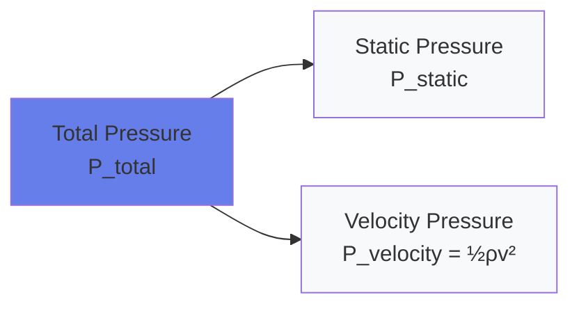
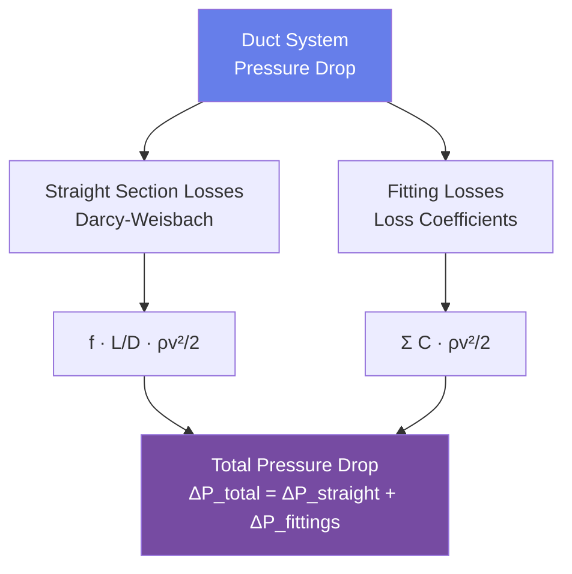

# Fluid Mechanics for HVAC Engineers

Fluid flow governs air and water distribution in HVAC systems. Accurate prediction of pressure drops, pump/fan power requirements, and flow velocities requires application of fluid mechanics principles. This guide provides the engineering equations for incompressible flow in ducts and pipes essential for sizing distribution systems.

## Fundamental Fluid Properties

### Density

Mass per unit volume determines momentum and energy content of flowing fluids.

**Air** (at sea level, 70°F):
$$\rho_{air} = 0.075 \text{ lb/ft}^3 = 1.20 \text{ kg/m}^3$$

**Water** (at 60°F):
$$\rho_{water} = 62.4 \text{ lb/ft}^3 = 1,000 \text{ kg/m}^3$$

### Viscosity

Dynamic viscosity ($\mu$) quantifies internal fluid friction resistance:

**Air** (at 70°F):
$$\mu_{air} = 1.22 \times 10^{-5} \text{ lb/(ft·s)} = 1.81 \times 10^{-5} \text{ Pa·s}$$

**Water** (at 60°F):
$$\mu_{water} = 7.54 \times 10^{-4} \text{ lb/(ft·s)} = 1.12 \times 10^{-3} \text{ Pa·s}$$

Kinematic viscosity ($\nu$):

$$\nu = \frac{\mu}{\rho}$$

Units: ft²/s or m²/s

## Bernoulli's Equation

For steady, incompressible, frictionless flow along a streamline, total energy remains constant:

$$P_1 + \frac{1}{2}\rho v_1^2 + \rho g z_1 = P_2 + \frac{1}{2}\rho v_2^2 + \rho g z_2$$

Where:
- $P$ = static pressure (lb/ft² or Pa)
- $\rho$ = fluid density (lb/ft³ or kg/m³)
- $v$ = fluid velocity (ft/s or m/s)
- $g$ = gravitational acceleration = 32.17 ft/s² = 9.81 m/s²
- $z$ = elevation (ft or m)

In HVAC practice, expressing in pressure units (inches of water gauge, "w.g.):

$$P_{total} = P_{static} + P_{velocity}$$

Where velocity pressure:

$$P_{velocity} = \frac{1}{2}\rho v^2$$

For air at standard conditions (0.075 lb/ft³):

$$P_v = \left(\frac{v}{4005}\right)^2 \text{ in. w.g.}$$

Where $v$ is in ft/min (FPM).

## Reynolds Number and Flow Regimes

Reynolds number determines whether flow is laminar or turbulent:

$$Re = \frac{\rho v D}{\mu} = \frac{v D}{\nu}$$

Where:
- $D$ = characteristic dimension (pipe diameter or duct hydraulic diameter, ft or m)
- $v$ = average velocity (ft/s or m/s)

**Flow regime classification:**
- $Re < 2,300$: Laminar flow (rare in HVAC except small pipes at low flow)
- $2,300 < Re < 4,000$: Transitional flow
- $Re > 4,000$: Turbulent flow (typical for HVAC systems)

Hydraulic diameter for rectangular ducts:

$$D_h = \frac{4A}{P} = \frac{4ab}{2(a+b)} = \frac{2ab}{a+b}$$

Where $a$ and $b$ are duct dimensions (ft or m).

### Worked Example 1: Reynolds Number Calculation

**Given:**
- Air flow through a 12" × 8" rectangular duct
- Air velocity: 1,200 FPM
- Air density: $\rho = 0.075$ lb/ft³
- Air kinematic viscosity: $\nu = 1.63 \times 10^{-4}$ ft²/s

**Find:** Reynolds number and flow regime

**Solution:**

Step 1: Convert velocity to ft/s.

$$v = \frac{1,200 \text{ FPM}}{60} = 20 \text{ ft/s}$$

Step 2: Calculate hydraulic diameter.

$$D_h = \frac{2ab}{a+b} = \frac{2 \times 1.0 \times 0.667}{1.0 + 0.667} = 0.800 \text{ ft}$$

Step 3: Calculate Reynolds number.

$$Re = \frac{vD_h}{\nu} = \frac{20 \times 0.800}{1.63 \times 10^{-4}} = 98,160$$

**Answer:** $Re = 98,160$ (turbulent flow)

**Engineering Insight:** Reynolds number far exceeds 4,000, confirming turbulent flow. All HVAC duct systems operate in turbulent regime at typical velocities (600-2,500 FPM), which justifies using turbulent flow friction factor correlations for pressure drop calculations.

## Pressure Drop in Ducts and Pipes

### Darcy-Weisbach Equation

Universal equation for pressure drop in straight sections:

$$\Delta P = f \frac{L}{D} \frac{\rho v^2}{2}$$

Where:
- $\Delta P$ = pressure drop (lb/ft² or Pa)
- $f$ = Darcy friction factor (dimensionless)
- $L$ = duct/pipe length (ft or m)
- $D$ = diameter or hydraulic diameter (ft or m)

For ductwork in "w.g. per 100 ft:

$$\Delta P = f \frac{L}{D} \frac{v^2}{(4005)^2 \times 12.96}$$

Where $v$ is in FPM.

### Friction Factor Correlations

For turbulent flow in smooth ducts (sheet metal):

**Colebrook equation** (implicit):

$$\frac{1}{\sqrt{f}} = -2.0 \log_{10}\left(\frac{\epsilon/D}{3.7} + \frac{2.51}{Re\sqrt{f}}\right)$$

Where $\epsilon$ = absolute roughness (ft or m).

**Swamee-Jain equation** (explicit approximation):

$$f = \frac{0.25}{\left[\log_{10}\left(\frac{\epsilon/D}{3.7} + \frac{5.74}{Re^{0.9}}\right)\right]^2}$$

For smooth ducts ($\epsilon \approx 0$):

$$f \approx \frac{0.25}{[\log_{10}(Re/7)]^2}$$

Typical absolute roughness values:

| Material | Roughness ε (ft) | Roughness ε (mm) |
|----------|-----------------|-----------------|
| Glass, drawn tubing | 5 × 10⁻⁶ | 0.0015 |
| Commercial steel, PVC | 1.5 × 10⁻⁴ | 0.046 |
| Galvanized steel duct | 5 × 10⁻⁴ | 0.15 |
| Fiberglass duct | 1.5 × 10⁻³ | 0.46 |
| Concrete | 1 - 10 × 10⁻³ | 0.3 - 3.0 |

### Fitting Losses

Fittings (elbows, tees, dampers) cause local pressure drops:

$$\Delta P_{fitting} = C \frac{\rho v^2}{2}$$

Where $C$ = loss coefficient (dimensionless).

Equivalent length method expresses fitting losses as equivalent straight duct length:

$$L_{eq} = C \frac{D}{f}$$

Typical loss coefficients:

| Fitting Type | Loss Coefficient C |
|-------------|-------------------|
| 90° smooth elbow (r/D = 1.5) | 0.3 - 0.5 |
| 90° mitered elbow (no vanes) | 1.2 - 1.3 |
| Tee, branch flow | 0.9 - 1.8 |
| Sudden expansion (d/D = 0.5) | 0.6 |
| Sudden contraction (d/D = 0.5) | 0.4 |
| Damper, fully open | 0.2 - 0.5 |
| Damper, 60° open | 4 - 6 |

### Worked Example 2: Duct Pressure Drop Calculation

**Given:**
- 100 ft of 12" diameter round duct
- Air flow: 2,000 CFM
- Three 90° elbows (C = 0.4 each)
- Air density: 0.075 lb/ft³
- Friction factor: f = 0.018 (from Moody chart or equation)

**Find:** Total pressure drop

**Solution:**

Step 1: Calculate duct area and velocity.

$$A = \frac{\pi D^2}{4} = \frac{\pi (1.0)^2}{4} = 0.785 \text{ ft}^2$$

$$v = \frac{Q}{A} = \frac{2,000}{0.785 \times 60} = 42.5 \text{ ft/s} = 2,550 \text{ FPM}$$

Step 2: Calculate velocity pressure.

$$P_v = \left(\frac{2,550}{4005}\right)^2 = 0.406 \text{ in. w.g.}$$

Step 3: Calculate straight section pressure drop.

$$\Delta P_{straight} = f \frac{L}{D} P_v = 0.018 \times \frac{100}{1.0} \times 0.406 = 0.731 \text{ in. w.g.}$$

Step 4: Calculate fitting losses.

$$\Delta P_{fittings} = 3 \times C \times P_v = 3 \times 0.4 \times 0.406 = 0.487 \text{ in. w.g.}$$

Step 5: Calculate total pressure drop.

$$\Delta P_{total} = 0.731 + 0.487 = 1.218 \text{ in. w.g.}$$

**Answer:** Total pressure drop = 1.22 "w.g., consisting of 0.73 "w.g. (60%) friction and 0.49 "w.g. (40%) fittings.

**Engineering Insight:** Fittings contribute 40% of total pressure drop despite representing only 3-4% of system length. Minimizing fittings and using smooth radius elbows significantly reduces fan power. For this example, replacing sharp elbows (C = 1.3) with radiused elbows (C = 0.4) saves 0.81 "w.g. in fitting losses.

## Pump and Fan Power

Mechanical power required to move fluid:

$$\dot{W} = \frac{Q \Delta P}{\eta}$$

Where:
- $\dot{W}$ = power (hp or kW)
- $Q$ = volumetric flow rate (CFM or m³/s)
- $\Delta P$ = total pressure rise (in. w.g. or Pa)
- $\eta$ = overall efficiency (fan or pump, dimensionless)

For air (in IP units):

$$hp = \frac{CFM \times \Delta P_{in.w.g.}}{6,356 \times \eta}$$

For water (in IP units):

$$hp = \frac{GPM \times \Delta P_{ft}}{3,960 \times \eta}$$

Where $\Delta P_{ft}$ is head in feet of water.

Typical efficiencies:
- **Fans**: 50-75% (total efficiency including motor and drive losses)
- **Pumps**: 60-85% (total efficiency including motor)

## Pipe Sizing for Water Systems

### Hazen-Williams Equation

Empirical equation widely used for water flow in pipes:

$$v = 1.318 C R^{0.63} S^{0.54}$$

Where:
- $v$ = velocity (ft/s)
- $C$ = Hazen-Williams coefficient (dimensionless)
- $R$ = hydraulic radius = $D/4$ for circular pipes (ft)
- $S$ = friction slope = $\Delta P / (\rho g L)$ (dimensionless)

For circular pipes:

$$\Delta P = \frac{4.52 L Q^{1.85}}{C^{1.85} D^{4.87}}$$

Where:
- $\Delta P$ = pressure drop (ft of water)
- $L$ = pipe length (ft)
- $Q$ = flow rate (GPM)
- $D$ = inside diameter (inches)

Hazen-Williams C-factors:

| Pipe Material | C-Factor (New) | C-Factor (Aged) |
|--------------|----------------|-----------------|
| Copper | 140 - 150 | 120 - 130 |
| PVC/CPVC | 150 | 140 |
| Steel (new smooth) | 140 | 100 - 120 |
| Steel (slightly corroded) | 110 | 80 - 100 |
| Cast iron (new) | 130 | 90 - 110 |
| Concrete | 120 - 140 | 100 - 120 |

### Velocity Limits

Design velocities for noise and erosion control:

| Application | Maximum Velocity |
|------------|------------------|
| Suction piping (pumps) | 4 - 7 ft/s |
| Discharge piping (general) | 8 - 10 ft/s |
| Discharge piping (noise-sensitive) | 4 - 6 ft/s |
| Chilled water supply/return | 8 - 12 ft/s |
| Condenser water | 8 - 12 ft/s |
| Hot water supply/return | 6 - 10 ft/s |

## Practical Applications

### Duct System Design

1. **Equal friction method**: Size ducts for constant pressure drop per unit length (typically 0.08-0.15 "w.g./100 ft)
2. **Static regain method**: Size ducts to maintain constant static pressure at each branch takeoff
3. **Velocity method**: Size ducts for maximum allowable velocities (main ducts 1,200-2,000 FPM, branches 800-1,200 FPM)

### Pipe System Design

1. **Velocity-based sizing**: Select pipe size to maintain velocities within limits (4-10 ft/s)
2. **Pressure drop limit**: Size pipes to limit pressure drop (typically 4 ft/100 ft or 1.73 psi/100 ft)
3. **Economic optimization**: Balance first cost (larger pipes) vs. operating cost (pump power)

### Pump and Fan Selection

1. **System curve**: Plot pressure drop vs. flow rate using Darcy-Weisbach equation
2. **Operating point**: Intersection of system curve and fan/pump performance curve
3. **Safety factors**: Add 10-15% to calculated pressure drop for uncertainties and aging

## Common Design Pitfalls

- **Ignoring fitting losses**: Fittings often contribute 30-50% of total pressure drop
- **Using water velocities > 10 ft/s**: Causes erosion, noise, and water hammer risk
- **Undersizing ducts for noise**: Velocities > 2,000 FPM generate objectionable noise
- **Neglecting elevation changes**: Static pressure changes 0.43 psi/ft for water, 0.036 "w.g./ft for air
- **Using smooth pipe friction factors for aged systems**: Corrosion and fouling increase friction significantly

## Summary

Fluid mechanics principles govern HVAC distribution system design:

- **Bernoulli's equation** relates pressure, velocity, and elevation energy
- **Reynolds number** determines flow regime (laminar vs. turbulent)
- **Darcy-Weisbach equation** calculates friction losses in straight sections
- **Fitting loss coefficients** quantify pressure drops in elbows, tees, and transitions
- **Hazen-Williams equation** provides empirical method for water pipe sizing
- **Pump/fan power** is proportional to flow rate and pressure rise, inversely to efficiency

Accurate pressure drop calculations enable proper fan and pump selection, duct and pipe sizing, and energy-efficient system design.

---

**Related Technical Guides:**
- [Duct Design Fundamentals](/technical-guides/duct-design-fundamentals/)
- [Hydronic System Fundamentals](/technical-guides/hydronic-system-fundamentals/)
- [Pump Selection & Performance](/technical-guides/pump-selection-performance/)
- [Fan Selection & Performance](/technical-guides/fan-selection-performance/)

**References:**
- ASHRAE Handbook of Fundamentals, Chapter 3: Fluid Flow
- ASHRAE Duct Fitting Database (DFDB)
- SMACNA HVAC Systems Duct Design, 4th Edition
- Crane Technical Paper No. 410: Flow of Fluids Through Valves, Fittings, and Pipe
