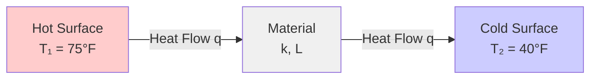
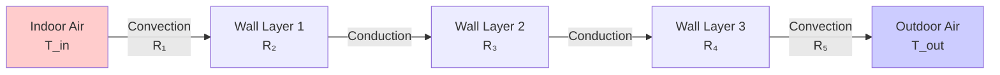
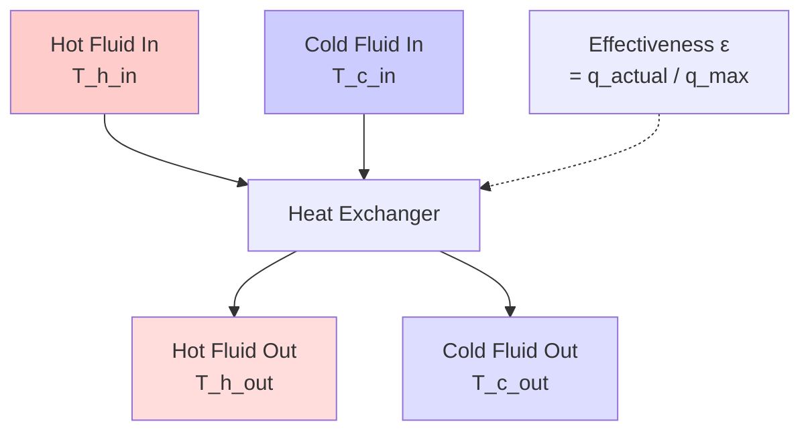

# Heat Transfer Fundamentals for HVAC Engineers

Heat transfer governs energy exchange in all HVAC systems. Accurate prediction of heat flow through building envelopes, across heat exchanger surfaces, and within air streams determines system capacity, energy consumption, and comfort delivery. This guide provides the mathematical framework for conduction, convection, and radiation calculations essential for HVAC design.

## Modes of Heat Transfer

Heat transfers through three distinct physical mechanisms, each governed by different equations and material properties.

### Conduction

Heat conduction occurs through solid materials via molecular collision and electron transport. Fourier's Law quantifies steady-state conduction:

$$q = -k A \frac{dT}{dx}$$

Where:
- $q$ = heat transfer rate (Btu/h or W)
- $k$ = thermal conductivity (Btu/(h·ft·°F) or W/(m·K))
- $A$ = cross-sectional area perpendicular to heat flow (ft² or m²)
- $dT/dx$ = temperature gradient (°F/ft or K/m)

For one-dimensional steady-state conduction through a plane wall with constant properties:

$$q = \frac{kA(T_1 - T_2)}{L}$$

Where:
- $T_1, T_2$ = surface temperatures (°F or K)
- $L$ = wall thickness (ft or m)

**Thermal Resistance for Conduction**:

$$R_{cond} = \frac{L}{kA}$$

Units: h·°F/Btu or K/W

### Convection

Convection transfers heat between a solid surface and a moving fluid (air or water). Newton's Law of Cooling describes convective heat transfer:

$$q = hA(T_s - T_\infty)$$

Where:
- $h$ = convection heat transfer coefficient (Btu/(h·ft²·°F) or W/(m²·K))
- $T_s$ = surface temperature (°F or K)
- $T_\infty$ = bulk fluid temperature (°F or K)

**Thermal Resistance for Convection**:

$$R_{conv} = \frac{1}{hA}$$

The convection coefficient $h$ depends on:
- Flow regime (laminar vs. turbulent)
- Fluid properties (viscosity, thermal conductivity, density)
- Surface geometry
- Flow velocity

Typical convection coefficient ranges for HVAC applications:

| Application | h (Btu/(h·ft²·°F)) | h (W/(m²·K)) |
|------------|-------------------|--------------|
| Free convection, air | 0.5 - 2.0 | 3 - 11 |
| Forced convection, air (low velocity) | 2 - 10 | 11 - 57 |
| Forced convection, air (high velocity) | 10 - 100 | 57 - 570 |
| Free convection, water | 20 - 100 | 113 - 570 |
| Forced convection, water | 100 - 5,000 | 570 - 28,000 |
| Boiling water | 500 - 10,000 | 2,800 - 57,000 |
| Condensing steam | 1,000 - 20,000 | 5,700 - 113,000 |

### Radiation

Thermal radiation transfers energy via electromagnetic waves without requiring a medium. The Stefan-Boltzmann Law governs radiation from a blackbody:

$$q = \sigma A T^4$$

Where:
- $\sigma$ = Stefan-Boltzmann constant = 0.1714×10⁻⁸ Btu/(h·ft²·R⁴) = 5.67×10⁻⁸ W/(m²·K⁴)
- $T$ = absolute temperature (R or K)

For real surfaces (gray bodies) exchanging radiation:

$$q = \epsilon \sigma A (T_1^4 - T_2^4)$$

Where:
- $\epsilon$ = emissivity (0 to 1, dimensionless)

For linearized radiation between surfaces at similar temperatures:

$$q = h_r A (T_1 - T_2)$$

Where the radiation heat transfer coefficient is:

$$h_r = \epsilon \sigma (T_1 + T_2)(T_1^2 + T_2^2)$$

Typical emissivities:

| Surface | Emissivity (ε) |
|---------|---------------|
| Polished aluminum | 0.05 - 0.10 |
| Oxidized aluminum | 0.20 - 0.30 |
| Galvanized steel | 0.25 - 0.30 |
| Painted surfaces | 0.85 - 0.95 |
| Brick, concrete | 0.85 - 0.95 |
| Glass | 0.90 - 0.95 |
| Black paint | 0.95 - 0.98 |

## Composite Heat Transfer

HVAC systems involve multiple modes of heat transfer in series and parallel arrangements.

### Series Thermal Resistances

For heat transfer through multiple layers (building envelope, heat exchanger walls):

Total thermal resistance:

$$R_{total} = R_1 + R_2 + R_3 + ... + R_n = \sum_{i=1}^{n} R_i$$

Heat transfer rate:

$$q = \frac{\Delta T_{overall}}{R_{total}} = \frac{T_{in} - T_{out}}{R_{total}}$$

### Overall Heat Transfer Coefficient (U-Value)

The U-value represents the overall conductance per unit area:

$$U = \frac{1}{R_{total} \cdot A} = \frac{1}{\frac{1}{h_i A} + \frac{L_1}{k_1 A} + \frac{L_2}{k_2 A} + ... + \frac{1}{h_o A}}$$

Simplifying for unit area ($A = 1$):

$$U = \frac{1}{\frac{1}{h_i} + \frac{L_1}{k_1} + \frac{L_2}{k_2} + ... + \frac{1}{h_o}}$$

Units: Btu/(h·ft²·°F) or W/(m²·K)

Lower U-values indicate better insulation. Building codes specify maximum U-values for envelope components.

### Worked Example 1: Wall U-Value Calculation

**Given:**
A commercial building exterior wall consists of (from inside to outside):
- Inside air film: $h_i = 1.46$ Btu/(h·ft²·°F)
- 1/2" gypsum board: $L_1 = 0.042$ ft, $k_1 = 0.092$ Btu/(h·ft·°F)
- 3.5" fiberglass insulation (R-13): $L_2 = 0.292$ ft, $k_2 = 0.027$ Btu/(h·ft·°F)
- 1/2" plywood sheathing: $L_3 = 0.042$ ft, $k_3 = 0.067$ Btu/(h·ft·°F)
- Outside air film: $h_o = 6.0$ Btu/(h·ft²·°F)

**Find:** Overall U-value

**Solution:**

Step 1: Calculate thermal resistance for each layer.

$$R_i = \frac{1}{h_i} = \frac{1}{1.46} = 0.685 \text{ h·ft²·°F/Btu}$$

$$R_1 = \frac{L_1}{k_1} = \frac{0.042}{0.092} = 0.457 \text{ h·ft²·°F/Btu}$$

$$R_2 = \frac{L_2}{k_2} = \frac{0.292}{0.027} = 10.815 \text{ h·ft²·°F/Btu}$$

$$R_3 = \frac{L_3}{k_3} = \frac{0.042}{0.067} = 0.627 \text{ h·ft²·°F/Btu}$$

$$R_o = \frac{1}{h_o} = \frac{1}{6.0} = 0.167 \text{ h·ft²·°F/Btu}$$

Step 2: Sum resistances to find total thermal resistance.

$$R_{total} = R_i + R_1 + R_2 + R_3 + R_o$$
$$R_{total} = 0.685 + 0.457 + 10.815 + 0.627 + 0.167 = 12.751 \text{ h·ft²·°F/Btu}$$

Step 3: Calculate U-value.

$$U = \frac{1}{R_{total}} = \frac{1}{12.751} = 0.078 \text{ Btu/(h·ft²·°F)}$$

**Answer:** $U = 0.078$ Btu/(h·ft²·°F) or R-value = 12.75

**Engineering Insight:** This wall assembly meets most commercial building energy codes requiring R-13 or better for exterior walls. The insulation layer (R₂ = 10.815) dominates the total resistance, contributing 85% of the thermal performance. Doubling the gypsum board thickness would increase R-total by only 0.46, demonstrating the principle that resistance is dominated by the least conductive materials.

## Heat Exchanger Effectiveness

Heat exchangers transfer thermal energy between two fluid streams without mixing. Effectiveness ($\epsilon$) quantifies actual heat transfer relative to maximum possible transfer.

### Heat Exchanger Energy Balance

For a counterflow or parallel-flow heat exchanger:

$$q = \dot{m}_h c_{p,h} (T_{h,in} - T_{h,out}) = \dot{m}_c c_{p,c} (T_{c,out} - T_{c,in})$$

Where:
- $\dot{m}$ = mass flow rate (lb/h or kg/s)
- $c_p$ = specific heat (Btu/(lb·°F) or J/(kg·K))
- Subscripts $h$ and $c$ denote hot and cold streams

### Effectiveness-NTU Method

Heat exchanger effectiveness:

$$\epsilon = \frac{q_{actual}}{q_{max}}$$

Where $q_{max} = C_{min}(T_{h,in} - T_{c,in})$

Heat capacity rate:

$$C = \dot{m} c_p$$

Minimum heat capacity rate:

$$C_{min} = \min(C_h, C_c)$$

Capacity ratio:

$$C_r = \frac{C_{min}}{C_{max}}$$

Number of Transfer Units (NTU):

$$NTU = \frac{UA}{C_{min}}$$

Where:
- $U$ = overall heat transfer coefficient
- $A$ = heat transfer surface area

For counterflow heat exchangers:

$$\epsilon = \frac{1 - e^{-NTU(1-C_r)}}{1 - C_r \cdot e^{-NTU(1-C_r)}} \quad \text{for } C_r < 1$$

$$\epsilon = \frac{NTU}{1 + NTU} \quad \text{for } C_r = 1$$

### Worked Example 2: Heat Exchanger Effectiveness

**Given:**
A counterflow air-to-air heat exchanger in an energy recovery ventilator:
- Exhaust air: $\dot{m}_h = 1,000$ CFM at 72°F entering
- Outdoor air: $\dot{m}_c = 1,000$ CFM at 10°F entering
- Measured exhaust air leaving temperature: 30°F
- Air density: $\rho = 0.075$ lb/ft³
- Air specific heat: $c_p = 0.24$ Btu/(lb·°F)

**Find:** Heat exchanger effectiveness

**Solution:**

Step 1: Convert volumetric flow to mass flow.

$$\dot{m} = \rho \times CFM \times 60 = 0.075 \times 1,000 \times 60 = 4,500 \text{ lb/h}$$

Step 2: Calculate heat capacity rates.

$$C_h = C_c = \dot{m} c_p = 4,500 \times 0.24 = 1,080 \text{ Btu/(h·°F)}$$

Since $C_h = C_c$, then $C_r = 1$ and $C_{min} = 1,080$ Btu/(h·°F)

Step 3: Calculate actual heat transfer from hot stream.

$$q_{actual} = \dot{m}_h c_p (T_{h,in} - T_{h,out}) = 4,500 \times 0.24 \times (72 - 30)$$
$$q_{actual} = 45,360 \text{ Btu/h}$$

Step 4: Calculate maximum possible heat transfer.

$$q_{max} = C_{min}(T_{h,in} - T_{c,in}) = 1,080 \times (72 - 10) = 66,960 \text{ Btu/h}$$

Step 5: Calculate effectiveness.

$$\epsilon = \frac{q_{actual}}{q_{max}} = \frac{45,360}{66,960} = 0.677 = 67.7\%$$

**Answer:** Heat exchanger effectiveness = 67.7%

**Engineering Insight:** This effectiveness is typical for plate-type energy recovery ventilators. The cold air entering temperature can be calculated from energy balance: $T_{c,out} = T_{c,in} + q_{actual}/C_c = 10 + 42 = 52$°F, representing a 42°F preheat of outdoor air. This reduces heating load by 45,360 Btu/h (approximately 3.8 tons of heating capacity saved).

## Thermal Conductivity of Common Materials

| Material | Thermal Conductivity k | Typical Application |
|----------|------------------------|---------------------|
|  | **Btu/(h·ft·°F)** | **W/(m·K)** |  |
| **Metals** |
| Copper | 223 | 386 | Heat exchanger tubes |
| Aluminum | 128 | 221 | Heat exchanger fins |
| Steel | 27 | 47 | Ductwork, structural |
| Stainless steel | 8.7 | 15 | Sanitary piping |
| **Insulation** |
| Fiberglass batt | 0.027 | 0.047 | Wall/ceiling insulation |
| Rigid foam (polyisocyanurate) | 0.014 | 0.024 | Roof insulation |
| Spray foam (closed-cell) | 0.016 | 0.028 | Air sealing |
| Mineral wool | 0.025 | 0.043 | Fire-rated insulation |
| **Building Materials** |
| Concrete (normal weight) | 0.90 | 1.56 | Structural, thermal mass |
| Brick | 0.40 | 0.69 | Exterior cladding |
| Gypsum board | 0.092 | 0.16 | Interior partition walls |
| Plywood | 0.067 | 0.12 | Sheathing |
| **Gases** |
| Air (still) | 0.015 | 0.026 | Air gaps, cavities |
| Argon (sealed glazing) | 0.010 | 0.017 | Low-E window fill |

## Practical Applications

### Building Envelope Design

1. **Wall U-Value Compliance**: Calculate composite U-values for code compliance (ASHRAE 90.1, IECC)
2. **Thermal Bridging**: Account for studs, joists, and fasteners that bypass insulation
3. **Window Performance**: Evaluate NFRC-rated U-values and SHGC for fenestration selection
4. **Roof Insulation**: Size rigid insulation to meet climate zone requirements

### HVAC Equipment Sizing

1. **Heat Loss/Gain**: Apply U-values to envelope areas for load calculations
2. **Duct Heat Loss**: Calculate heat loss/gain through uninsulated or insulated duct runs
3. **Pipe Heat Loss**: Size pipe insulation to limit heat loss in hot water distribution
4. **Heat Exchanger Selection**: Use effectiveness ratings to evaluate energy recovery equipment

### System Performance Analysis

1. **Furnace Heat Exchanger**: Convection coefficients on combustion gas and air sides
2. **Cooling Coil**: Combined convection and condensation on evaporator surfaces
3. **Boiler Flue Loss**: Conduction through refractory and metal surfaces
4. **Radiant Panel Output**: Radiation and convection from floor/ceiling surfaces

## Common Design Pitfalls

- **Ignoring air films**: Convection resistances at surfaces contribute 10-30% of total R-value
- **Using center-of-glass U-values**: Frame and edge effects increase whole-window U-values by 20-50%
- **Neglecting thermal bridging**: Steel studs can reduce nominal wall R-value by 50%
- **Oversimplifying radiation**: Linearized radiation equations only accurate for small temperature differences
- **Confusing R-value and U-value**: R-value is resistance (higher is better), U-value is conductance (lower is better)

## Summary

Heat transfer analysis underpins all HVAC system design:

- **Conduction** through solids follows Fourier's Law: $q = kA(T_1 - T_2)/L$
- **Convection** between surfaces and fluids follows Newton's Law: $q = hA(T_s - T_\infty)$
- **Radiation** between surfaces follows Stefan-Boltzmann Law: $q = \epsilon \sigma A (T_1^4 - T_2^4)$
- **Composite heat transfer** uses series/parallel thermal resistance networks
- **U-values** quantify overall heat transfer through building assemblies (lower is better)
- **Heat exchanger effectiveness** measures recovery efficiency using the ε-NTU method

Accurate heat transfer calculations enable proper equipment sizing, energy code compliance, and energy-efficient system design.

---

**Related Technical Guides:**
- [Psychrometric Fundamentals](/technical-guides/psychrometric-fundamentals/)
- [Heating Load Calculations](/technical-guides/heating-load-calculations/)
- [Cooling Load Calculations](/technical-guides/cooling-load-calculations/)
- [Building Envelope Heat Transfer](/technical-guides/building-envelope-heat-transfer/)

**References:**
- ASHRAE Handbook of Fundamentals, Chapter 4: Heat Transfer
- ASHRAE Handbook of Fundamentals, Chapter 26: Heat, Air, and Moisture Control in Building Assemblies
- Incropera, F.P., DeWitt, D.P., Fundamentals of Heat and Mass Transfer, 7th Edition
- ASHRAE Standard 90.1: Energy Standard for Buildings Except Low-Rise Residential Buildings
