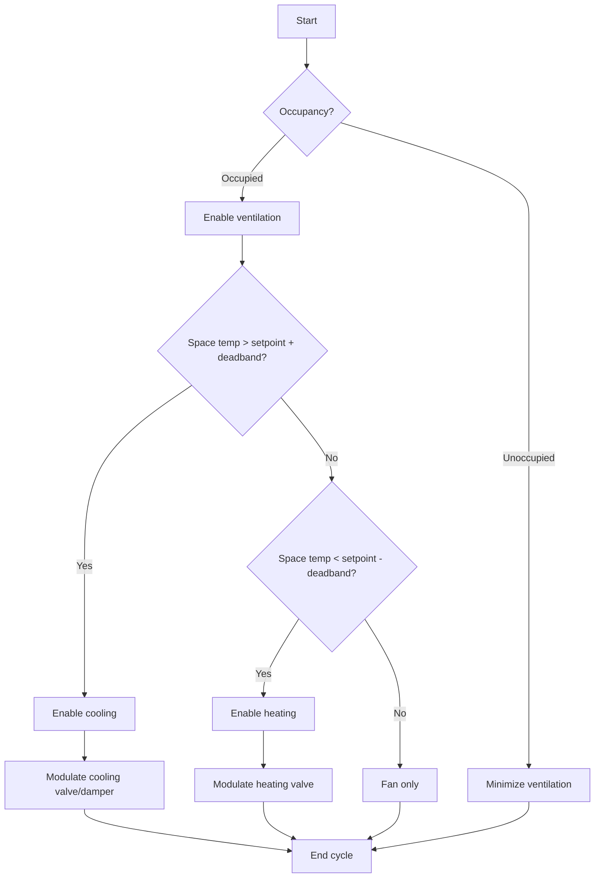
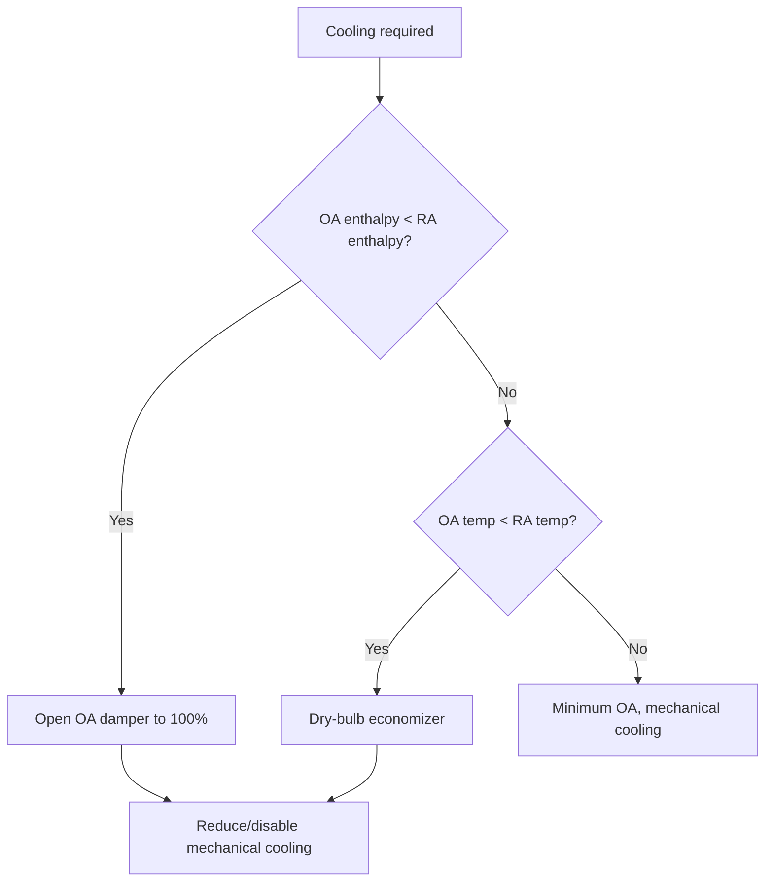

# HVAC Control Strategies for Engineers

HVAC controls regulate temperature, humidity, pressure, and indoor air quality by modulating equipment capacity. Proper control strategy selection and tuning ensures comfort, energy efficiency, and equipment longevity.

## PID Control Theory

**Proportional-Integral-Derivative (PID) controller:**

$$u(t) = K_p e(t) + K_i \int_0^t e(\tau) d\tau + K_d \frac{de(t)}{dt}$$

Where:
- $u(t)$ = control output (0-100%)
- $e(t)$ = error (setpoint - measured value)
- $K_p$ = proportional gain
- $K_i$ = integral gain
- $K_d$ = derivative gain

### Proportional Control

**Output:**

$$u = K_p \times e$$

**Characteristics:**
- Fast response
- Offset error (does not reach setpoint exactly)
- Gain too high: oscillation
- Gain too low: sluggish response

**Typical applications:** Discharge air temperature control

### Integral Control

**Eliminates offset** by integrating error over time

**Characteristics:**
- Eliminates steady-state error
- Slow response
- Can cause instability if gain too high

**Typical applications:** Space temperature control

### Derivative Control

**Anticipates future error** based on rate of change

**Characteristics:**
- Improves stability
- Reduces overshoot
- Sensitive to noise

**Rarely used alone** in HVAC due to sensor noise

## Control Tuning

**Ziegler-Nichols method:**

1. Set $K_i = 0$, $K_d = 0$
2. Increase $K_p$ until sustained oscillation
3. Record ultimate gain $K_u$ and period $P_u$
4. Calculate PID parameters:

$$K_p = 0.6 K_u$$
$$K_i = \frac{1.2 K_u}{P_u}$$
$$K_d = 0.075 K_u P_u$$

**Practical tuning:**
- Start with P-only control
- Add I to eliminate offset
- Add D only if needed for stability

## Reset Schedules

**Outdoor air reset:**

$$T_{supply} = T_{design} - m \times (T_{OA} - T_{design,OA})$$

Where $m$ = reset ratio (typically 0.5-1.0)

<h3>Worked Example 1: Supply Air Reset</h3>

**Given:**
- Design outdoor air temperature: 95°F
- Design supply air temperature: 55°F
- Current outdoor air temperature: 70°F
- Reset ratio: 0.8

**Find:** Supply air temperature setpoint

**Solution:**

$$T_{supply} = 55 - 0.8 \times (70 - 95) = 55 - 0.8 \times (-25) = 55 + 20 = 75°F$$

**Answer:** Supply air temperature resets to 75°F, reducing cooling energy during mild conditions.

**Common reset schedules:**
- Chilled water supply temperature vs. outdoor air
- Hot water supply temperature vs. outdoor air
- Duct static pressure vs. VAV damper position
- Discharge air temperature vs. space load

## Sequences of Operation

**Single-zone VAV sequence:**

1. **Minimum airflow:** Maintain outdoor air requirement
2. **Cooling:** Increase airflow to maximum before enabling mechanical cooling
3. **Heating:** Reduce airflow to minimum, then enable reheat

**Dual-duct sequence:**

1. **Cooling:** Hot deck damper closed, cold deck modulates
2. **Deadband:** Both dampers at minimum
3. **Heating:** Cold deck damper closed, hot deck modulates

## Advanced Control Strategies

### Optimal Start/Stop

**Predicts equipment start time** to reach setpoint at occupancy

**Start time calculation:**

$$t_{start} = t_{occupancy} - \frac{T_{setpoint} - T_{current}}{R}$$

Where $R$ = building warm-up/cool-down rate (°F/hour)

**Energy savings:** 10-30% reduction in operating hours

### Demand Control Ventilation (DCV)

**Modulates outdoor air** based on occupancy (CO₂ sensors)

**Outdoor air calculation:**

$$OA_{CFM} = \frac{(C_{space} - C_{outdoor}) \times OA_{people}}{C_{limit} - C_{outdoor}}$$

Where:
- $C_{space}$ = space CO₂ concentration (ppm)
- $C_{outdoor}$ = outdoor CO₂ concentration (~400 ppm)
- $C_{limit}$ = design CO₂ limit (typically 1,000 ppm)
- $OA_{people}$ = outdoor air per person (CFM/person)

### Economizer Control

**Dry-bulb economizer:** Compare outdoor vs. return air temperature

**Enthalpy economizer:** Compare outdoor vs. return air enthalpy (accounts for humidity)

### Cascade Control

**Master controller** sets setpoint for **slave controller**

**Example:** Duct static pressure (master) controls fan speed (slave)

**Benefits:**
- Improved stability
- Faster response
- Better disturbance rejection

## Practical Applications

1. **Tuning:** Use manufacturer defaults as starting point, fine-tune based on performance
2. **Deadbands:** 2-4°F deadband reduces cycling and energy
3. **Sensor placement:** Avoid direct sunlight, drafts, heat sources
4. **Commissioning:** Verify sequences match design intent

---

**Related Technical Guides:**
- [Variable Flow System Design](/technical-guides/variable-flow-system-design/)
- [Building Pressurization Control](/technical-guides/building-pressurization-control/)
- [Commissioning Procedures](/technical-guides/commissioning-procedures/)

**References:**
- ASHRAE Handbook of HVAC Applications, Chapter 47: Design and Application of Controls
- ASHRAE Guideline 13: Specifying Building Automation Systems
- ASHRAE Guideline 36: High-Performance Sequences of Operation for HVAC Systems
