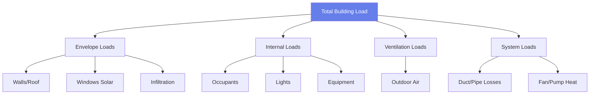

# Load Calculation Methodology for HVAC Engineers

Accurate load calculations determine required HVAC system capacity. Undersizing causes discomfort and humidity problems; oversizing increases first cost, reduces efficiency, and causes short cycling. This guide presents ASHRAE-approved methodology for calculating design heating and cooling loads.

## Load Calculation Fundamentals

### Design Conditions

**Outdoor Design Conditions (ASHRAE Handbook):**
- **Heating:** 99.6% or 99% dry bulb temperature (coldest temperature exceeded 99.6% or 99% of hours annually)
- **Cooling:** 0.4%, 1%, or 2% dry bulb and mean coincident wet bulb

**Indoor Design Conditions (ASHRAE Standard 55):**
- **Winter:** 68-72°F, 30-50% RH
- **Summer:** 73-79°F, 40-60% RH

**Example:** Chicago, IL
- Heating 99.6%: -7°F
- Cooling 0.4%: 94°F DB / 75°F MWB

### Load Components

## Heating Load Calculation

**Total Heating Load:**

$$q_h = q_{transmission} + q_{infiltration} + q_{ventilation}$$

### Transmission Losses

$$q_{trans} = U \times A \times (T_{in} - T_{out})$$

Where:
- $U$ = overall heat transfer coefficient (Btu/(h·ft²·°F))
- $A$ = surface area (ft²)
- $T_{in}$ = indoor design temperature (°F)
- $T_{out}$ = outdoor design temperature (°F)

**Below-grade heat loss** (basement walls/floors):
Use F-factor or C-factor methods from ASHRAE Chapter 18.

### Infiltration Load

$$q_{inf} = 1.08 \times CFM_{inf} \times (T_{in} - T_{out})$$

Where $CFM_{inf}$ from:
- **Blower door test:** $CFM_{50}$ converted to natural infiltration
- **Crack method:** Air leakage through building envelope cracks
- **Air changes per hour:** Conservative estimate (0.35-1.0 ACH)

**Typical infiltration rates:**
- Tight construction: 0.15-0.25 ACH
- Average construction: 0.35-0.60 ACH
- Loose construction: 0.60-1.00 ACH

### Ventilation Load

$$q_{vent} = 1.08 \times CFM_{OA} \times (T_{in} - T_{out})$$

Where $CFM_{OA}$ per ASHRAE Standard 62.1 or 62.2.

## Cooling Load Calculation

**Total Cooling Load:**

$$q_c = q_{envelope} + q_{internal} + q_{ventilation} + q_{system}$$

### Heat Gain vs. Cooling Load

**Heat gain:** Instantaneous rate of heat transfer to space
**Cooling load:** Rate at which heat must be removed to maintain temperature

**Lag effect:** Thermal mass delays conversion of radiative heat gain to cooling load.

### Solar Heat Gain Through Windows

$$q_{solar} = A \times SHGC \times SHGF \times CLF$$

Where:
- $A$ = window area (ft²)
- $SHGC$ = solar heat gain coefficient (dimensionless, 0-1)
- $SHGF$ = solar heat gain factor from tables (Btu/(h·ft²))
- $CLF$ = cooling load factor accounts for thermal mass

**SHGC values:**
- Single clear: 0.86
- Double clear: 0.76
- Double low-E: 0.40-0.70
- Triple low-E: 0.25-0.40

### Conduction Through Envelope

$$q_{cond} = U \times A \times CLTD$$

Where CLTD = Cooling Load Temperature Difference accounts for:
- Sol-air temperature (solar radiation effect)
- Thermal mass storage
- Time of day

### Internal Heat Gains

**Occupants:**

$$q_{people} = N \times (q_{sensible} + q_{latent})$$

Typical office worker:
- Sensible: 250 Btu/h
- Latent: 200 Btu/h
- Total: 450 Btu/h

**Lighting:**

$$q_{lights} = W \times 3.41 \times F_{use} \times F_{ballast}$$

Where:
- $W$ = installed lighting watts
- 3.41 = conversion factor (Btu/W·h)
- $F_{use}$ = usage factor (typically 1.0 for design)
- $F_{ballast}$ = ballast factor (1.0 for LED, 1.2 for fluorescent)

**Equipment:**

$$q_{equip} = W \times 3.41 \times F_{use} \times F_{load}$$

Where $F_{load}$ accounts for actual vs. nameplate power.

### Worked Example: Office Space Cooling Load

**Given:**
Private office: 12 ft × 15 ft × 9 ft ceiling
- Exterior wall: 15 ft × 9 ft, U = 0.08 Btu/(h·ft²·°F)
- Window: 6 ft × 4 ft, SHGC = 0.40, west-facing
- Indoor: 75°F, Outdoor: 95°F DB
- Occupancy: 2 people
- Lighting: 180 watts LED
- Computer/equipment: 300 watts

**Find:** Peak cooling load

**Solution:**

Step 1: Wall conduction (use CLTD = 15°F for lightweight wall, 3 PM west).

$$q_{wall} = 0.08 \times (15 \times 9 - 24) \times 15 = 122 \text{ Btu/h}$$

Step 2: Window solar (SHGF = 200 Btu/(h·ft²) for west at 3 PM, CLF = 0.85).

$$q_{solar} = 24 \times 0.40 \times 200 \times 0.85 = 1,632 \text{ Btu/h}$$

Step 3: Window conduction (U = 0.50 for double-pane).

$$q_{window} = 0.50 \times 24 \times (95 - 75) = 240 \text{ Btu/h}$$

Step 4: Occupants (2 × 450 Btu/h with CLF = 0.90).

$$q_{people} = 2 \times 450 \times 0.90 = 810 \text{ Btu/h}$$

Step 5: Lighting (LED, no ballast factor).

$$q_{lights} = 180 \times 3.41 = 614 \text{ Btu/h}$$

Step 6: Equipment (assume 75% usage).

$$q_{equip} = 300 \times 3.41 \times 0.75 = 767 \text{ Btu/h}$$

Step 7: Ventilation (15 CFM/person × 2 people).

$$q_{vent} = 1.08 \times 30 \times (95 - 75) = 648 \text{ Btu/h}$$

Step 8: Sum all components.

$$q_{total} = 122 + 1,632 + 240 + 810 + 614 + 767 + 648 = 4,833 \text{ Btu/h}$$

**Answer:** Peak cooling load = 4,833 Btu/h ≈ 0.4 tons

**Engineering Insight:** Solar heat gain (1,632 Btu/h) dominates this west-facing office, representing 34% of total load. Interior shading or low-E glass (SHGC = 0.25) would reduce solar gain to 1,020 Btu/h, cutting total load by 13%. This demonstrates why window selection significantly impacts HVAC sizing and energy costs.

## Diversity and Safety Factors

### Diversity Factors

Not all loads occur simultaneously. Apply diversity to:

**Lighting:** 0.70-0.90 (some lights off)
**Plug loads:** 0.50-0.75 (equipment idle)
**Occupancy:** 0.80-0.95 (not all occupants present)

**Do NOT apply diversity to:**
- Envelope loads (always present at design conditions)
- Ventilation loads (required by code)

### Safety Factors

**General practice:** Do NOT add safety factors to calculated loads
**Rationale:** ASHRAE methods already conservative (design conditions rarely occur simultaneously)

**Acceptable adjustments:**
- Duct heat gain/loss: Add 5-10% for distribution losses
- Fan heat: Add 2,500 BTU/h per ton of cooling
- Future capacity: Upsize for known expansion (document separately)

## Block Load vs. Room-by-Room

### Room-by-Room Method

- Calculates load for each space individually
- Sums to determine system capacity
- Required for:
  - VAV system sizing
  - Zone control design
  - Duct/diffuser sizing

### Block Load Method

- Treats entire building as single zone
- Faster but less accurate
- Acceptable for:
  - Residential (small single-zone systems)
  - Preliminary estimates
  - Budget pricing

## Software Tools

**Manual J** (Residential):
- Load calculation for single-family homes
- Simplified ASHRAE method
- Widely used for residential

**ASHRAE Heat Balance Method:**
- Rigorous hourly simulation
- Accounts for thermal mass, time lag
- Required for LEED, energy codes

**Commercial Software:**
- Carrier HAP
- Trane TRACE 700
- IES VE
- DesignBuilder

## Common Calculation Errors

- **Using average temperatures:** Must use design conditions (99.6%/0.4%)
- **Ignoring internal gains:** Lights and equipment significant in commercial buildings
- **Wrong SHGC:** Using U-factor instead of SHGC for solar gains
- **No diversity:** Oversizes system by 20-40%
- **Adding arbitrary safety factors:** Leads to oversizing
- **Ignoring ventilation loads:** Can be 20-40% of total cooling load

## Summary

Accurate load calculations require:

- **Design conditions** from ASHRAE climate data (99.6% heating, 0.4% cooling)
- **Envelope loads** calculated with U-values, SHGC, and CLTD/CLF methods
- **Internal gains** from occupants, lighting, and equipment
- **Ventilation loads** per ASHRAE 62.1 requirements
- **Diversity factors** applied appropriately to non-simultaneous loads
- **Block vs. room-by-room** selection based on system type

Proper methodology prevents undersizing (comfort issues) and oversizing (efficiency penalties).

---

**Related Technical Guides:**
- [Heating Load Calculations](/technical-guides/heating-load-calculations/)
- [Cooling Load Calculations](/technical-guides/cooling-load-calculations/)
- [Heat Transfer Fundamentals](/technical-guides/heat-transfer-fundamentals/)
- [Psychrometric Processes](/technical-guides/psychrometric-processes/)

**References:**
- ASHRAE Handbook of Fundamentals, Chapter 18: Residential Cooling and Heating Load Calculations
- ASHRAE Handbook of Fundamentals, Chapter 18: Nonresidential Cooling and Heating Load Calculations
- ACCA Manual J: Residential Load Calculation, 8th Edition
- ASHRAE Standard 62.1: Ventilation for Acceptable Indoor Air Quality
