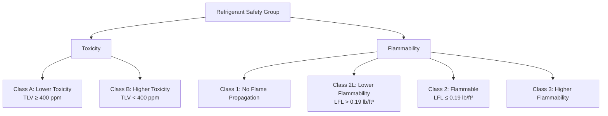

# Refrigerant Selection & Properties for HVAC Engineers

Refrigerant selection impacts system performance, safety, environmental compliance, and operating costs. This guide covers refrigerant classifications, properties, environmental metrics, and selection criteria per ASHRAE Standard 34.

## ASHRAE Refrigerant Numbering System

**Format:** R-[number][letter]

**Organic compounds (CFC, HCFC, HFC, HFO):**
- First digit: (# carbon atoms) - 1
- Second digit: (# hydrogen atoms) + 1
- Third digit: # fluorine atoms
- Letter suffix (a, b, c): isomer designation

**Examples:**
- R-134a: C₂H₂F₄ (1,1,1,2-tetrafluoroethane)
- R-410A: Zeotropic blend of R-32/R-125 (50/50 wt%)
- R-407C: Zeotropic blend

**Inorganic compounds:**
- R-717: Ammonia (NH₃)
- R-718: Water (H₂O)
- R-744: Carbon dioxide (CO₂)

## Safety Classification (ASHRAE 34)

**Safety groups:**

| Group | Toxicity | Flammability | Examples |
|-------|----------|--------------|----------|
| A1 | Lower | None | R-134a, R-410A, R-404A, R-407C |
| A2L | Lower | Lower | R-32, R-454B, R-1234yf, R-1234ze |
| A2 | Lower | Flammable | R-152a, R-290 (propane) |
| A3 | Lower | Higher | R-290, R-600a (isobutane), R-1270 |
| B1 | Higher | None | R-123 |
| B2 | Higher | Flammable | Ammonia (R-717) |

## Environmental Impact Metrics

**Ozone Depletion Potential (ODP):**

Relative to R-11 (CFC-11 = 1.0)

- **CFCs:** ODP = 0.6 to 1.0 (phased out)
- **HCFCs:** ODP = 0.01 to 0.1 (being phased out)
- **HFCs:** ODP = 0 (no chlorine)
- **HFOs:** ODP = 0

**Global Warming Potential (GWP):**

Relative to CO₂ over 100-year timeframe (CO₂ = 1)

| Refrigerant | ODP | GWP (AR5) | Status |
|-------------|-----|-----------|--------|
| R-11 (CFC) | 1.0 | 4,660 | Banned |
| R-12 (CFC) | 1.0 | 10,200 | Banned |
| R-22 (HCFC) | 0.055 | 1,760 | Phase-out |
| R-134a (HFC) | 0 | 1,300 | Restricted |
| R-404A (HFC) | 0 | 3,920 | Restricted |
| R-410A (HFC) | 0 | 2,088 | Current |
| R-407C (HFC) | 0 | 1,770 | Current |
| R-32 (HFC) | 0 | 677 | Low-GWP |
| R-454B (HFO blend) | 0 | 466 | Low-GWP |
| R-1234yf (HFO) | 0 | 4 | Very low-GWP |
| R-1234ze (HFO) | 0 | 7 | Very low-GWP |
| R-744 (CO₂) | 0 | 1 | Natural |
| R-717 (NH₃) | 0 | <1 | Natural |
| R-290 (propane) | 0 | 3 | Natural |

## Thermophysical Properties

### Common HVAC Refrigerants (at 40°F evap, 100°F cond)

| Refrigerant | P_evap (psia) | P_cond (psia) | Pressure Ratio | Discharge Temp (°F) | COP |
|-------------|---------------|---------------|----------------|---------------------|-----|
| R-134a | 37.0 | 124.3 | 3.36 | 125 | 5.2 |
| R-410A | 118.8 | 341.8 | 2.88 | 135 | 5.5 |
| R-407C | 79.4 | 228.5 | 2.88 | 130 | 5.3 |
| R-32 | 99.2 | 281.8 | 2.84 | 145 | 5.7 |
| R-454B | 100.5 | 283.0 | 2.82 | 130 | 5.6 |
| R-22 | 68.5 | 196.5 | 2.87 | 135 | 5.4 |

### Volumetric Capacity

**Refrigeration effect per unit volume:**

$$Q_v = \frac{\dot{m}_r (h_1 - h_4)}{v_1}$$

Where $v_1$ = specific volume at compressor suction (ft³/lb)

| Refrigerant | Volumetric Capacity (Btu/ft³) | Compressor Size (relative to R-22) |
|-------------|-------------------------------|-------------------------------------|
| R-22 | 52 | 1.00 (baseline) |
| R-134a | 27 | 1.93 |
| R-410A | 73 | 0.71 |
| R-407C | 50 | 1.04 |
| R-32 | 82 | 0.63 |
| R-717 (ammonia) | 213 | 0.24 |

Higher volumetric capacity = smaller compressor for same cooling

## Application-Specific Selection

### Residential Air Conditioning

**Current standard:** R-410A (A1, GWP 2088)

**Replacement options:**
- R-32 (A2L, GWP 677): Higher efficiency, mildly flammable
- R-454B (A2L, GWP 466): Drop-in replacement, lower pressure

**Transition:** New equipment moving to low-GWP A2L refrigerants

### Commercial Refrigeration

**Current standards:**
- Supermarket racks: R-404A, R-407A (high GWP)
- Display cases: R-404A, R-134a

**Replacement options:**
- R-448A (A1, GWP 1273): R-404A retrofit
- R-449A (A1, GWP 1282): R-404A retrofit
- R-744 (CO₂): Transcritical systems for cold climates
- R-290 (propane): Small hermetic systems (charge limits)

### Chilled Water Systems

**Current standard:** R-134a (A1, GWP 1300)

**Replacement options:**
- R-513A (A1, GWP 573): Drop-in for R-134a
- R-1234ze (A2L, GWP 7): New equipment
- R-1233zd (B1, GWP 7): Low-pressure chillers

### Industrial Refrigeration

**Current standard:** R-717 (ammonia, B2, GWP <1)

**Advantages:**
- Excellent thermodynamic properties
- Zero GWP
- Low cost

**Disadvantages:**
- Toxic (TLV 25 ppm)
- Flammable
- Requires stringent safety measures

**Alternative:** R-744 (CO₂) for cascade systems

## Refrigerant Regulations

**Montreal Protocol (1987):** Phase-out of ODP substances
- CFCs: Banned since 1996
- HCFCs (R-22): Production ban 2020

**Kigali Amendment (2016):** HFC phase-down
- GWP-weighted reduction schedule
- 85% reduction by 2036 (developed countries)

**EPA SNAP Program:** Prohibits high-GWP refrigerants in specific applications

**EU F-Gas Regulation:** HFC quota system, service bans for high-GWP

## Refrigerant Blends

**Azeotropic:** Behaves as single substance (constant boiling point)
- Example: R-507A (R-125/R-143a 50/50)

**Zeotropic:** Temperature glide during phase change
- Example: R-407C (glide ~10°F)
- Requires careful charging (liquid only)

**Temperature glide impact:**
- Reduces heat transfer effectiveness
- Complicates superheat control
- Affects system design

## Selection Criteria Summary

1. **Safety:** Comply with building codes, charge limits
2. **Environmental:** Minimize GWP, comply with regulations
3. **Performance:** COP, capacity, operating pressures
4. **Compatibility:** Oil type, materials, existing equipment
5. **Availability:** Regional supply, cost
6. **Future-proofing:** Regulatory trends

---

**Related Technical Guides:**
- [Vapor Compression Refrigeration Cycle](/technical-guides/vapor-compression-refrigeration/)
- [Compressor Selection & Performance](/technical-guides/compressor-selection-performance/)
- [Refrigeration Load Calculations](/technical-guides/refrigeration-load-calculations/)

**References:**
- ASHRAE Standard 34: Designation and Safety Classification of Refrigerants
- ASHRAE Handbook of Refrigeration, Chapter 29: Refrigerants
- EPA Significant New Alternatives Policy (SNAP) Program
- AHRI Guideline N: Assignment of Refrigerant Container Colors
