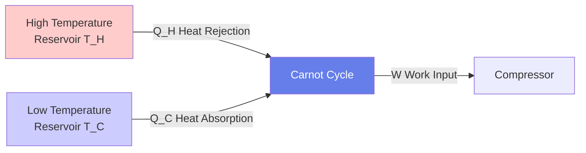
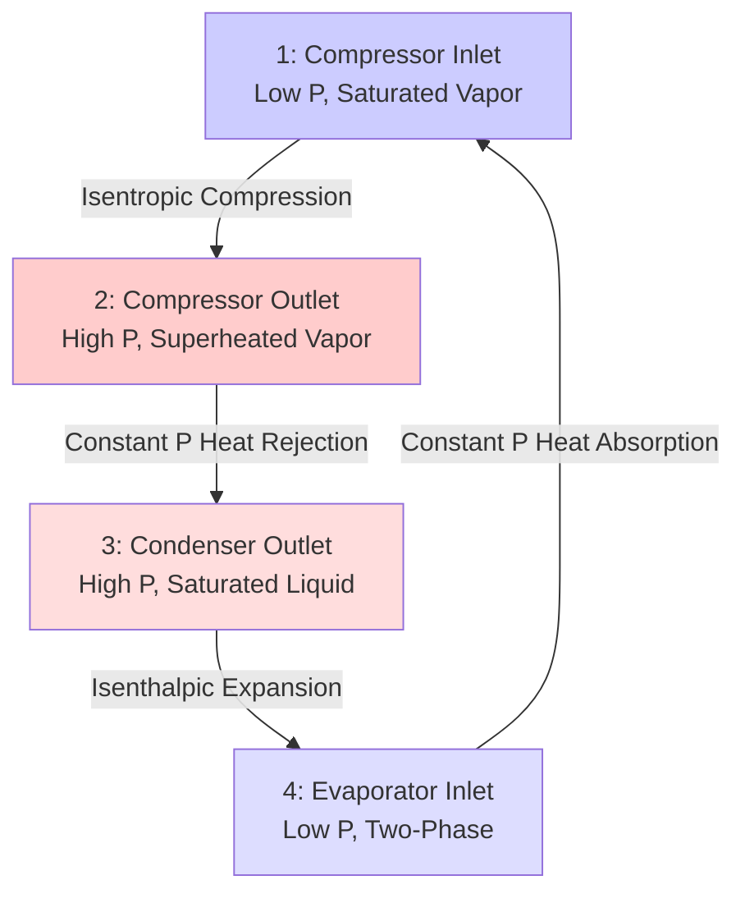

# Thermodynamic Cycles for HVAC Engineers

Thermodynamic cycles convert thermal energy to mechanical work (power cycles) or transfer heat from cold to hot reservoirs (refrigeration cycles). Understanding cycle efficiency limits, component behavior, and performance optimization enables proper HVAC equipment selection and operation.

## Carnot Cycle - The Ideal Reference

The Carnot cycle represents maximum theoretical efficiency for any heat engine or refrigerator operating between two temperature reservoirs.

### Carnot Heat Engine Efficiency

$$\eta_{Carnot} = 1 - \frac{T_C}{T_H}$$

Where:
- $\eta_{Carnot}$ = thermal efficiency (dimensionless)
- $T_C$ = absolute temperature of cold reservoir (R or K)
- $T_H$ = absolute temperature of hot reservoir (R or K)

**Physical Significance:** No real cycle can exceed Carnot efficiency. The larger the temperature difference, the higher the potential efficiency.

### Carnot Refrigeration COP

$$COP_{Carnot,cooling} = \frac{T_C}{T_H - T_C}$$

$$COP_{Carnot,heating} = \frac{T_H}{T_H - T_C}$$

Where COP = Coefficient of Performance (dimensionless, higher is better).

**Key Insight:** Refrigeration COP decreases as temperature lift $(T_H - T_C)$ increases. This explains why air conditioners work harder (use more energy) on extremely hot days.

## Rankine Cycle - Steam Power Generation

The Rankine cycle powers steam turbines in large cogeneration (CHP) systems and central heating plants.

### Rankine Cycle Components

1. **Boiler**: Constant pressure heat addition, converts water to superheated steam
2. **Turbine**: Isentropic expansion, produces mechanical work
3. **Condenser**: Constant pressure heat rejection, condenses steam to liquid
4. **Pump**: Isentropic compression, returns condensate to boiler pressure

### Rankine Cycle Efficiency

$$\eta_{Rankine} = \frac{W_{net}}{Q_{in}} = \frac{(h_1 - h_2) - (h_4 - h_3)}{h_1 - h_4}$$

Where:
- $h$ = specific enthalpy (Btu/lb or kJ/kg)
- State 1: Turbine inlet (high P, high T superheated steam)
- State 2: Turbine outlet (low P saturated vapor)
- State 3: Pump inlet (low P saturated liquid)
- State 4: Pump outlet (high P compressed liquid)

**Typical Values:**
- Simple Rankine cycle: 30-40% efficiency
- Reheat Rankine cycle: 40-45% efficiency
- Combined cycle (gas turbine + steam): 55-60% efficiency

### Worked Example: Rankine Cycle Analysis

**Given:**
Steam turbine system with:
- Boiler outlet: 600 psia, 800°F (State 1)
- Condenser pressure: 1 psia (States 2, 3)
- Turbine isentropic efficiency: 85%
- Pump isentropic efficiency: 90%

From steam tables:
- $h_1 = 1,407.6$ Btu/lb (superheated steam at 600 psia, 800°F)
- $h_{2s} = 935.8$ Btu/lb (isentropic expansion to 1 psia)
- $h_3 = 69.7$ Btu/lb (saturated liquid at 1 psia)
- $h_{4s} = 70.7$ Btu/lb (isentropic compression to 600 psia)

**Find:** Actual cycle thermal efficiency

**Solution:**

Step 1: Calculate actual turbine work.

$$h_2 = h_1 - \eta_t(h_1 - h_{2s}) = 1,407.6 - 0.85(1,407.6 - 935.8) = 1,006.5 \text{ Btu/lb}$$

Step 2: Calculate actual pump work.

$$h_4 = h_3 + \frac{h_{4s} - h_3}{\eta_p} = 69.7 + \frac{70.7 - 69.7}{0.90} = 70.8 \text{ Btu/lb}$$

Step 3: Calculate net work output.

$$w_{net} = (h_1 - h_2) - (h_4 - h_3) = (1,407.6 - 1,006.5) - (70.8 - 69.7) = 400.0 \text{ Btu/lb}$$

Step 4: Calculate heat input.

$$q_{in} = h_1 - h_4 = 1,407.6 - 70.8 = 1,336.8 \text{ Btu/lb}$$

Step 5: Calculate thermal efficiency.

$$\eta = \frac{w_{net}}{q_{in}} = \frac{400.0}{1,336.8} = 0.299 = 29.9\%$$

**Answer:** Cycle thermal efficiency = 29.9%

**Engineering Insight:** Component inefficiencies reduce ideal cycle efficiency. Turbine losses reduce work output by 15%, while pump inefficiencies are negligible (pumping liquid requires minimal work compared to expanding vapor). Higher boiler temperatures and lower condenser pressures increase efficiency but face material and cooling water temperature limitations.

## Vapor Compression Refrigeration Cycle

The vapor compression cycle is fundamental to air conditioning, refrigeration, and heat pump systems.

### Ideal Vapor Compression Cycle

### Refrigeration Performance Metrics

**Cooling COP:**

$$COP_{cooling} = \frac{Q_L}{W_{comp}} = \frac{h_1 - h_4}{h_2 - h_1}$$

**Heating COP (Heat Pump):**

$$COP_{heating} = \frac{Q_H}{W_{comp}} = \frac{h_2 - h_3}{h_2 - h_1}$$

Where:
- $Q_L$ = cooling capacity (Btu/h or kW)
- $Q_H$ = heating capacity (Btu/h or kW)
- $W_{comp}$ = compressor power (Btu/h or kW)

**Energy Efficiency Ratio (EER):**

$$EER = \frac{Q_L \text{ (Btu/h)}}{W_{comp} \text{ (Watts)}}$$

**Seasonal Energy Efficiency Ratio (SEER):**
Weighted average EER over typical cooling season (higher is better).

**Typical Values:**
- Residential AC: SEER 13-21, EER 10-14
- Commercial chiller: COP 4.0-6.5
- Heat pump (heating): COP 2.5-4.5 (HSPF 7.7-13)

## Real Cycle Deviations from Ideal

### Compressor Inefficiencies

Isentropic efficiency accounts for real compression:

$$\eta_{comp} = \frac{h_{2s} - h_1}{h_2 - h_1}$$

Where $h_{2s}$ is ideal discharge enthalpy.

Typical compressor efficiencies:
- Reciprocating: 70-80%
- Scroll: 65-75%
- Screw: 70-85%
- Centrifugal: 75-85%

### Pressure Drops

- **Suction line**: 1-2 psi loss reduces capacity
- **Discharge line**: 2-5 psi loss increases power
- **Liquid line**: Minimal impact if subcooled

### Superheat and Subcooling

**Superheat** (evaporator outlet):
- Ensures vapor-only to compressor
- Typical: 10-15°F above saturation

**Subcooling** (condenser outlet):
- Ensures liquid-only to expansion device
- Typical: 10-20°F below saturation
- Benefits: Increases capacity, prevents flash gas

## Exergy Analysis

Exergy quantifies work potential of energy relative to ambient conditions.

**Exergy of heat transfer:**

$$Ex = Q\left(1 - \frac{T_0}{T}\right)$$

Where $T_0$ = ambient absolute temperature.

**Significance:**
- High-temperature heat has high exergy (can produce work efficiently)
- Low-temperature heat has low exergy (limited work potential)
- HVAC systems that match source/sink temperatures minimize exergy destruction

## Practical Applications

### Equipment Selection

1. **Chiller Efficiency**: Select chillers with COP > 5.0 for energy code compliance
2. **Heat Pump Balance Point**: Calculate where heat pump COP equals resistance heat (COP = 1.0)
3. **Part-Load Performance**: Evaluate IPLV (Integrated Part Load Value) for actual operating conditions

### System Design

1. **Temperature Lift Minimization**: Reduce $(T_H - T_C)$ to maximize COP
   - Use reset controls: lower chilled water temperature when loads decrease
   - Increase condenser water temperature in cold weather

2. **Subcooling Benefits**: Every 1°F subcooling increases capacity by ~0.5%

3. **Superheat Control**: Maintain 10-15°F superheat for optimal capacity without liquid slugging risk

## Common Design Pitfalls

- **Ignoring real component efficiencies**: Ideal cycle COP overpredicts performance by 30-50%
- **Oversizing equipment**: Reduces part-load efficiency and cycling losses
- **Fixed setpoints**: Missing savings from reset strategies (chilled water, condenser water)
- **Excessive superheat**: Reduces capacity and efficiency
- **Insufficient subcooling**: Flash gas formation reduces capacity

## Summary

Thermodynamic cycles define HVAC equipment performance limits:

- **Carnot cycle** establishes theoretical maximum efficiency/COP
- **Rankine cycle** powers steam turbines in CHP systems (30-40% efficiency)
- **Vapor compression cycle** dominates refrigeration and air conditioning
- **COP** quantifies refrigeration efficiency: higher COP = better performance
- **Real cycles** deviate from ideal due to component inefficiencies, pressure drops
- **Exergy analysis** reveals where energy degradation occurs in systems

Understanding cycle thermodynamics enables proper equipment sizing, performance prediction, and energy optimization.

---

**Related Technical Guides:**
- [Heat Transfer Fundamentals](/technical-guides/heat-transfer-fundamentals/)
- [Refrigeration Cycle Design](/technical-guides/refrigeration-cycle-design/)
- [Chiller Performance Analysis](/technical-guides/chiller-performance-analysis/)
- [Heat Pump Technology](/technical-guides/heat-pump-technology/)

**References:**
- ASHRAE Handbook of Fundamentals, Chapter 2: Thermodynamics and Refrigeration Cycles
- ASHRAE Handbook of HVAC Systems and Equipment, Chapter 38: Compressors
- Moran, M.J., Shapiro, H.N., Fundamentals of Engineering Thermodynamics, 8th Edition
