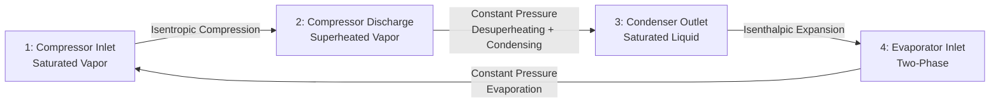

# Vapor Compression Refrigeration Cycle Analysis

The vapor compression cycle forms the foundation of modern refrigeration and air conditioning. Understanding cycle thermodynamics enables equipment selection, performance prediction, and efficiency optimization.

## Ideal Vapor Compression Cycle

**Process descriptions:**
- **1→2:** Isentropic compression (ideal)
- **2→3:** Constant pressure heat rejection
- **3→4:** Isenthalpic throttling
- **4→1:** Constant pressure heat absorption

## Pressure-Enthalpy (P-h) Diagram

The P-h diagram visualizes refrigeration cycles:

**Key regions:**
- **Subcooled liquid:** Left of saturated liquid line
- **Two-phase mixture:** Between sat. liquid and sat. vapor lines
- **Superheated vapor:** Right of saturated vapor line

**State points:**
- State 1: Compressor suction (saturated or superheated vapor)
- State 2: Compressor discharge (superheated vapor)
- State 3: Condenser outlet (subcooled liquid)
- State 4: Evaporator inlet (two-phase mixture)

## Thermodynamic Analysis

**Refrigeration effect (cooling capacity):**

$$Q_e = \dot{m}_r (h_1 - h_4)$$

Where:
- $Q_e$ = evaporator capacity (Btu/hr or tons)
- $\dot{m}_r$ = refrigerant mass flow rate (lb/hr)
- $h_1, h_4$ = enthalpies at states 1 and 4 (Btu/lb)

**Compressor work (ideal):**

$$W_c = \dot{m}_r (h_2 - h_1)$$

**Heat rejection:**

$$Q_c = \dot{m}_r (h_2 - h_3)$$

**Energy balance:**

$$Q_c = Q_e + W_c$$

## Coefficient of Performance (COP)

**Refrigeration COP:**

$$COP_R = \frac{Q_e}{W_c} = \frac{h_1 - h_4}{h_2 - h_1}$$

**Heat pump COP:**

$$COP_{HP} = \frac{Q_c}{W_c} = \frac{h_2 - h_3}{h_2 - h_1}$$

**Relationship:**

$$COP_{HP} = COP_R + 1$$

**Carnot COP (theoretical maximum):**

$$COP_{Carnot} = \frac{T_e}{T_c - T_e}$$

Where temperatures in absolute units (°R or K)

<h3>Worked Example 1: Basic Refrigeration Cycle Analysis</h3>

**Given:**
- Refrigerant: R-134a
- Evaporator temperature: 40°F
- Condenser temperature: 100°F
- Compressor isentropic efficiency: 75%
- Refrigeration capacity: 10 tons

**Find:** COP, compressor power, mass flow rate

**Solution:**

**Step 1: Determine state properties**

State 1 (saturated vapor at 40°F):
- $P_1 = 51.7$ psia
- $h_1 = 107.5$ Btu/lb
- $s_1 = 0.2228$ Btu/(lb·°R)

State 2s (isentropic compression to 100°F, $s_2s = s_1$):
- $P_2 = 138.9$ psia
- $h_{2s} = 116.5$ Btu/lb

Actual compressor discharge (with 75% efficiency):
$$h_2 = h_1 + \frac{h_{2s} - h_1}{\eta_c} = 107.5 + \frac{116.5 - 107.5}{0.75} = 119.5 \text{ Btu/lb}$$

State 3 (saturated liquid at 100°F):
- $h_3 = 38.8$ Btu/lb

State 4 (isenthalpic expansion):
- $h_4 = h_3 = 38.8$ Btu/lb

**Step 2: Calculate COP**

$$COP = \frac{h_1 - h_4}{h_2 - h_1} = \frac{107.5 - 38.8}{119.5 - 107.5} = \frac{68.7}{12.0} = 5.73$$

**Step 3: Calculate compressor power**

$$Q_e = 10 \times 12,000 = 120,000 \text{ Btu/hr}$$

$$W_c = \frac{Q_e}{COP} = \frac{120,000}{5.73} = 20,941 \text{ Btu/hr} = 6.14 \text{ hp}$$

**Step 4: Calculate mass flow rate**

$$\dot{m}_r = \frac{Q_e}{h_1 - h_4} = \frac{120,000}{68.7} = 1,747 \text{ lb/hr}$$

**Answers:**
- COP: 5.73
- Compressor power: 6.14 hp (4.58 kW)
- Mass flow rate: 1,747 lb/hr
- Carnot COP (for comparison): $\frac{500}{560 - 500} = 8.33$
- Carnot efficiency: $5.73 / 8.33 = 68.8\%$

## Superheat and Subcooling

**Superheat:** Temperature above saturation at compressor inlet

$$\Delta T_{superheat} = T_1 - T_{sat,evap}$$

**Typical values:** 5-15°F

**Benefits:**
- Ensures no liquid enters compressor
- Increases refrigeration effect slightly
- Prevents compressor damage

**Penalties:**
- Increases compressor discharge temperature
- Slightly increases compression work

**Subcooling:** Temperature below saturation at condenser outlet

$$\Delta T_{subcool} = T_{sat,cond} - T_3$$

**Typical values:** 5-20°F

**Benefits:**
- Increases refrigeration effect
- Prevents flash gas in liquid line
- Improves COP

**No penalty**

<h3>Worked Example 2: Effect of Subcooling on COP</h3>

**Given:** Same cycle as Example 1, but with 10°F subcooling

**Solution:**

State 3 (subcooled liquid at 100°F - 10°F = 90°F):
- $h_3 = 38.8 - (c_p \times \Delta T) \approx 38.8 - (0.32 \times 10) = 35.6$ Btu/lb

Refrigeration effect:
$$Q_e = h_1 - h_4 = 107.5 - 35.6 = 71.9 \text{ Btu/lb}$$

Increase: $(71.9 - 68.7) / 68.7 = 4.7\%$

New COP:
$$COP = \frac{71.9}{12.0} = 5.99$$

Improvement: $(5.99 - 5.73) / 5.73 = 4.5\%$

**Answer:** 10°F subcooling improves COP by ~4.5%

## Real Cycle Deviations from Ideal

1. **Compressor inefficiency:** Isentropic efficiency 70-85%
2. **Pressure drops:** Evaporator and condenser internal friction
3. **Heat transfer:** Superheat and subcooling
4. **Non-ideal expansion:** Real expansion devices have losses

## Multi-Stage Compression

**When required:**
- Large pressure ratios (> 8:1)
- Low evaporator temperatures (< 0°F)
- High condenser temperatures (> 120°F)

**Benefits:**
- Reduced discharge temperature
- Improved volumetric efficiency
- Better COP

**Configuration:** Two-stage with intercooling

$$P_{intermediate} = \sqrt{P_e \times P_c}$$

## Performance Optimization Strategies

1. **Maximize subcooling:** Use liquid subcoolers or suction-liquid heat exchangers
2. **Minimize superheat:** 5-10°F optimal for most systems
3. **Reduce pressure drops:** Proper pipe sizing, minimize bends
4. **Floating head pressure:** Lower condenser pressure when possible
5. **Variable speed compressors:** Match capacity to load

## Refrigeration Tons and Capacity

**1 ton of refrigeration = 12,000 Btu/hr**

Origin: Heat removal to freeze 1 ton of water in 24 hours

**Capacity calculation:**

$$Tons = \frac{Q_e}{12,000}$$

---

**Related Technical Guides:**
- [Refrigerant Selection & Properties](/technical-guides/refrigerant-selection-properties/)
- [Compressor Selection & Performance](/technical-guides/compressor-selection-performance/)
- [Thermodynamic Cycles](/technical-guides/thermodynamic-cycles/)

**References:**
- ASHRAE Handbook of Refrigeration, Chapter 1: Thermodynamics and Refrigeration Cycles
- Stoecker, W.F. Industrial Refrigeration Handbook
- AHRI Standard 540: Performance Rating of Positive Displacement Refrigerant Compressors
