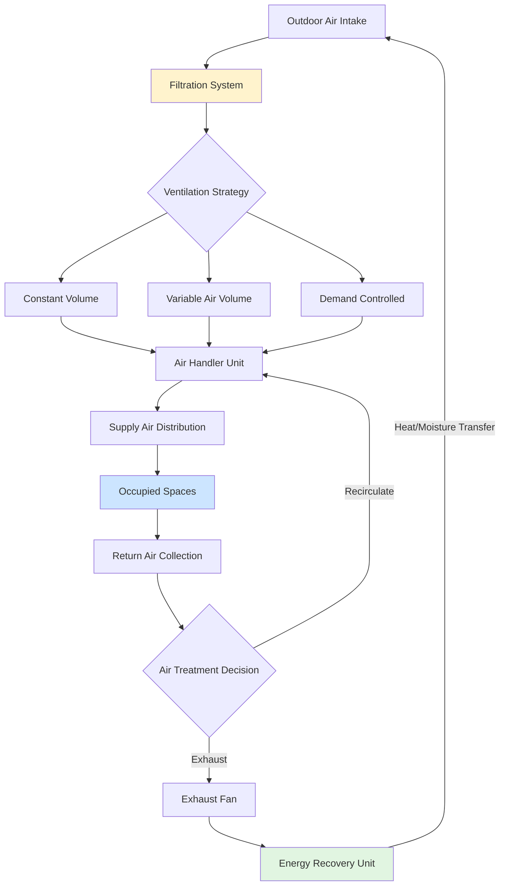
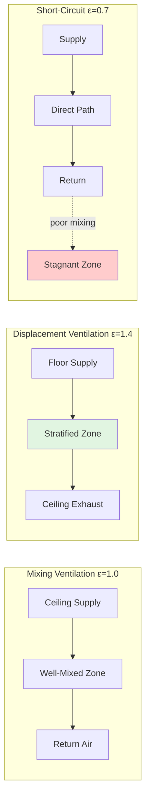
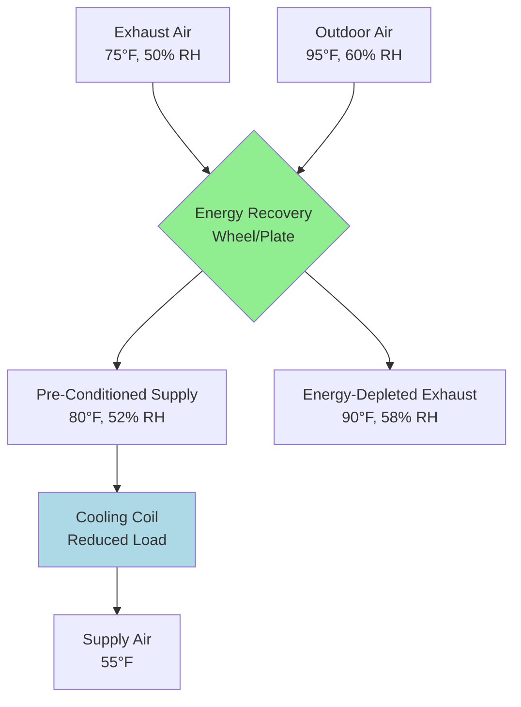

Ventilation systems maintain acceptable indoor air quality through controlled outdoor air introduction, contaminant dilution, and strategic air distribution. Building occupants generate carbon dioxide, moisture, and bioeffluents while building materials, furnishings, and activities release volatile organic compounds, particulates, and other contaminants. Effective ventilation dilutes these pollutants to concentrations that protect occupant health, comfort, and productivity while managing energy consumption through optimized outdoor air delivery and advanced recovery technologies.

## Ventilation System Architecture and Airflow Pathways

Modern ventilation systems employ multiple configurations to deliver conditioned outdoor air while exhausting contaminated indoor air. The fundamental architecture determines energy performance, control complexity, and indoor air quality outcomes.

The ventilation pathway incorporates outdoor air intake through properly located louvers positioned to avoid contamination sources, pre-filtration to remove large particles and protect equipment, optional energy recovery to minimize conditioning loads, mixing with return air in appropriate proportions, final filtration before supply, distribution to occupied zones, and exhaust with potential recovery integration.

## Outdoor Air Requirements and Ventilation Rate Determination

ASHRAE Standard 62.1 establishes minimum ventilation rates based on occupancy density and floor area using the ventilation rate procedure. The breathing zone outdoor airflow requirement combines people-related and area-related components:

$$V_{bz} = R_p \times P_z + R_a \times A_z$$

Where:
- $V_{bz}$ = breathing zone outdoor airflow rate (CFM)
- $R_p$ = outdoor air rate per person (CFM/person)
- $P_z$ = zone population (people)
- $R_a$ = outdoor air rate per unit area (CFM/ft²)
- $A_z$ = zone floor area (ft²)

Space-specific requirements vary substantially based on occupant density and expected contaminant generation. Office spaces typically require 5 CFM/person plus 0.06 CFM/ft², while conference rooms demand 5 CFM/person plus 0.06 CFM/ft² but accommodate higher occupant densities. Retail spaces specify 7.5 CFM/person plus 0.12 CFM/ft² due to product off-gassing and higher activity levels.

### Multi-Zone System Calculations

Systems serving multiple zones require outdoor air intake calculations that account for zone diversity, system ventilation efficiency, and airflow distribution. The system outdoor air intake becomes:

$$V_{ot} = \frac{\sum D \times V_{oz}}{E_v}$$

Where:
- $V_{ot}$ = outdoor air intake at the system level (CFM)
- $D$ = occupant diversity factor (< 1.0)
- $V_{oz}$ = zone outdoor air requirement (CFM)
- $E_v$ = system ventilation efficiency (dimensionless)

System ventilation efficiency depends on primary airflow fraction, discharge air fraction, and zone air distribution effectiveness. Single-zone systems achieve $E_v$ = 1.0, while multi-zone VAV systems typically operate at $E_v$ = 0.6 to 0.8, requiring increased outdoor air intake to ensure adequate delivery to critical zones.

## Ventilation Effectiveness and Air Distribution

Air distribution patterns profoundly affect contaminant removal efficiency. Ventilation effectiveness quantifies the relationship between supply air, exhaust air, and breathing zone contaminant concentrations:

$$\varepsilon = \frac{C_e - C_s}{C_b - C_s}$$

Where:
- $\varepsilon$ = ventilation effectiveness (dimensionless)
- $C_e$ = exhaust air contaminant concentration
- $C_s$ = supply air contaminant concentration
- $C_b$ = breathing zone contaminant concentration

Well-mixed conditions with ceiling supply and return produce effectiveness near 1.0. Displacement ventilation, delivering cool air at floor level and extracting warm contaminated air at ceiling height, achieves effectiveness of 1.2 to 1.5 by leveraging thermal buoyancy. Poor distribution with short-circuiting reduces effectiveness below 0.8, requiring proportionally increased ventilation rates to maintain acceptable breathing zone conditions.

## Contaminant Dilution and Mass Balance Analysis

Steady-state contaminant concentration in a ventilated space follows fundamental mass balance principles. At equilibrium, contaminant generation rate equals removal rate through ventilation and any air cleaning:

$$G = Q \times (C_i - C_o) + \eta \times Q_r \times C_i$$

For spaces without recirculation air cleaning, solving for indoor concentration yields:

$$C_i = C_o + \frac{G}{Q}$$

Where:
- $G$ = contaminant generation rate (mass/time)
- $Q$ = outdoor air ventilation rate (volume/time)
- $C_i$ = indoor concentration (mass/volume)
- $C_o$ = outdoor concentration (mass/volume)
- $\eta$ = air cleaner removal efficiency (dimensionless)
- $Q_r$ = recirculation airflow through cleaner (volume/time)

This relationship demonstrates that doubling ventilation rate halves the concentration increase above outdoor levels. However, energy costs increase proportionally, making air cleaning economically attractive for certain contaminants.

### Transient Response Analysis

During transient conditions, such as building startup or sudden contaminant release, the time-dependent concentration follows first-order decay:

$$C_i(t) = C_{ss} + (C_0 - C_{ss}) \times e^{-\lambda t}$$

Where:
- $C_{ss}$ = steady-state concentration
- $C_0$ = initial concentration at time zero
- $\lambda$ = decay constant = $(Q + \eta Q_r)/V$ (hour⁻¹)
- $V$ = space volume

The time constant $\tau = 1/\lambda$ indicates the time required to achieve 63% of the concentration change toward steady state. Spaces with air change rates of 4 ACH reach 95% of steady-state conditions within 45 minutes.

## Indoor Air Quality Parameters and Acceptance Criteria

Multiple parameters characterize indoor air quality, each with distinct health implications and measurement approaches:

| Parameter | Acceptable Range | Primary Source | Measurement Method | Health Impact |
|-----------|------------------|----------------|-------------------|---------------|
| CO₂ | < 1000 ppm | Occupant respiration | NDIR sensor | Cognitive performance indicator |
| PM2.5 | < 12 μg/m³ annual | Combustion, outdoor | Optical particle counter | Respiratory, cardiovascular disease |
| PM10 | < 50 μg/m³ 24-hr | Mechanical processes | Optical particle counter | Respiratory irritation |
| TVOC | < 500 μg/m³ | Materials, products | Photoionization detector | Varies by specific compound |
| Formaldehyde | < 27 ppb (33 μg/m³) | Composite wood | Electrochemical sensor | Respiratory irritant, carcinogen |
| Ozone | < 70 ppb 8-hr | Outdoor infiltration | UV absorption | Respiratory irritation |
| Relative Humidity | 30-60% | Occupants, processes | Capacitive sensor | Mold growth, comfort |
| Radon | < 4 pCi/L | Soil gas infiltration | Alpha particle detector | Lung cancer risk |

### Carbon Dioxide as Ventilation Indicator

Occupants generate CO₂ at rates proportional to metabolic activity. Sedentary office work produces approximately 0.3 CFH per person, while moderate physical activity generates 0.6 CFH per person. The steady-state indoor CO₂ concentration provides a direct indicator of ventilation rate per person:

$$CO_{2,indoor} = CO_{2,outdoor} + \frac{N \times G_{CO_2}}{Q}$$

Where $N$ represents occupancy and $G_{CO_2}$ is the per-person generation rate. With outdoor CO₂ at 420 ppm and target indoor concentration of 1000 ppm, the required ventilation becomes:

$$Q = \frac{N \times 0.3 \text{ CFH}}{(1000 - 420) \times 10^{-6}} = 517 \times N \text{ CFM}$$

This yields approximately 15 CFM per person for sedentary occupants, aligning with ASHRAE 62.1 requirements when combined with area-related ventilation.

## Ventilation System Strategies and Performance Comparison

Different ventilation approaches offer distinct advantages for specific applications:

| Strategy | Typical Application | Energy Characteristic | Control Complexity | Ventilation Effectiveness | Initial Cost |
|----------|---------------------|----------------------|-------------------|--------------------------|--------------|
| Constant volume | Small buildings, stable occupancy | Moderate (baseline) | Low | Adequate (ε ≈ 1.0) | Low |
| Variable air volume | Large commercial, variable loads | 15-30% reduction | Moderate | Good with proper control | Moderate |
| Demand controlled | High-occupancy variable spaces | 20-40% reduction | High | Excellent with sensors | High |
| Natural ventilation | Mild climates, low buildings | Minimal conditioning | Weather dependent | Variable (ε = 0.8-1.5) | Low-Moderate |
| Mixed-mode hybrid | Temperate climates | 30-50% reduction | High | Good seasonal performance | High |
| Displacement | High ceilings, high heat loads | 10-20% reduction | Moderate | Superior (ε = 1.2-1.5) | Moderate-High |
| Personalized ventilation | Task-oriented spaces | 30-50% reduction | Moderate | Excellent locally (ε > 2.0) | Moderate |

### Demand Controlled Ventilation Implementation

Demand controlled ventilation modulates outdoor air intake based on actual occupancy using CO₂ sensors, occupancy sensors, or scheduled controls. The control algorithm maintains target CO₂ concentration through proportional-integral damper positioning:

$$V_{ot}(t) = V_{min} + K_p \times e(t) + K_i \times \int_0^t e(\tau) d\tau$$

Where:
- $e(t)$ = error signal = $CO_{2,measured} - CO_{2,setpoint}$
- $K_p$ = proportional gain
- $K_i$ = integral gain
- $V_{min}$ = minimum ventilation rate per codes

Proper sensor placement at breathing zone height (3-6 feet above floor), adequate control response time, and appropriate setpoints prevent excessive concentration excursions. Multi-zone systems require sensors in representative zones or sophisticated zone aggregation algorithms.

## Energy Recovery Ventilation Technologies

Energy recovery systems transfer sensible heat and latent energy between exhaust and outdoor airstreams, dramatically reducing conditioning loads while maintaining ventilation requirements.

### Heat Transfer Effectiveness

Sensible effectiveness quantifies temperature recovery:

$$\varepsilon_s = \frac{T_{supply} - T_{outdoor}}{T_{exhaust} - T_{outdoor}}$$

Latent effectiveness quantifies moisture recovery:

$$\varepsilon_L = \frac{W_{supply} - W_{outdoor}}{W_{exhaust} - W_{outdoor}}$$

Where $T$ represents dry-bulb temperature and $W$ represents humidity ratio (lbm water/lbm dry air). Total effectiveness combines both:

$$\varepsilon_t = \frac{h_{supply} - h_{outdoor}}{h_{exhaust} - h_{outdoor}}$$

Where $h$ represents specific enthalpy (Btu/lbm). High-quality rotary wheels achieve 75-85% total effectiveness, while fixed-plate exchangers reach 60-75% sensible effectiveness without latent transfer.

### Economic Analysis and Payback

Annual energy recovery savings depend on climate severity, operating hours, and outdoor air fraction:

$$\text{Savings} = 1.08 \times Q \times \Delta T_{avg} \times \text{Hours} \times \text{CostPerTherm} \times \varepsilon_s / \text{Efficiency}$$

Cold climates with heating degree days exceeding 5000 and hot-humid climates with cooling degree days exceeding 2000 provide optimal conditions. Applications with 3000+ annual operating hours and outdoor air fractions above 30% achieve typical paybacks of 3-7 years.

## Air Filtration and Cleaning Technologies

Particulate control remains the most effective IAQ improvement strategy. Filter performance depends on particle size, airflow velocity, filter depth, and media characteristics.

### Filter Performance Comparison

| Filter Type | MERV Rating | Particle Size Efficiency | Pressure Drop | Maintenance Interval | Application |
|-------------|-------------|-------------------------|---------------|---------------------|-------------|
| Pleated panel | MERV 8-11 | 35-65% @ 1.0 μm | 0.3-0.6 in w.g. | 3 months | Residential, light commercial |
| Extended surface | MERV 13-14 | 75-85% @ 0.3 μm | 0.5-0.8 in w.g. | 6 months | Commercial buildings |
| Mini-pleat | MERV 15-16 | 90-95% @ 0.3 μm | 0.8-1.2 in w.g. | 12 months | Healthcare, laboratories |
| HEPA | H13-H14 | > 99.97% @ 0.3 μm | 1.0-1.5 in w.g. | 12-24 months | Cleanrooms, critical care |
| Activated carbon | N/A | None (gases only) | 0.2-0.4 in w.g. | 3-12 months | VOC control |
| Electronic ESP | MERV 12 equiv. | 70-85% @ 0.3 μm | 0.1-0.2 in w.g. | Monthly cleaning | Industrial applications |

Higher efficiency filtration increases fan energy due to elevated pressure drop. The incremental energy cost must be weighed against IAQ benefits:

$$\text{Annual Energy Cost} = \frac{Q \times \Delta P \times \text{Hours}}{6356 \times \eta_{fan}} \times \text{Cost per kWh}$$

Where $\Delta P$ is pressure drop in inches water gauge and $\eta_{fan}$ is total fan efficiency (typically 0.50-0.65).

## Air Changes Per Hour and Space Classification

Air change rate relates volumetric airflow to space volume:

$$\text{ACH} = \frac{Q \times 60}{V}$$

Where $Q$ is airflow in CFM and $V$ is volume in cubic feet. Space classification determines minimum requirements:

| Space Type | Minimum ACH | Outdoor Air Fraction | Temperature Control | Pressurization |
|------------|-------------|---------------------|-------------------|----------------|
| Residences | 0.35 | 100% of ACH | ± 3°F | Slightly positive |
| Offices | 4-6 | 15-25% | ± 2°F | Positive |
| Classrooms | 6-8 | 100% of requirement | ± 2°F | Positive |
| Retail | 5-7 | 20-30% | ± 3°F | Positive or neutral |
| Healthcare patient room | 6 minimum | 100% outdoor air option | ± 2°F | Positive except isolation |
| Airborne infection isolation | 12+ | 100% | ± 2°F | Negative with anteroom |
| Operating rooms | 15-20+ | 20-30% | ± 2°F | Positive with cascade |
| Laboratories (general) | 6-12 | 50-100% | ± 2°F | Negative |
| Laboratories (high hazard) | 12-20+ | 100% | ± 2°F | Negative with staged cascade |

Higher air change rates enable faster contaminant dilution and tighter temperature control but increase energy consumption proportionally. Ventilation effectiveness improvements allow acceptable IAQ with reduced air change requirements in appropriate applications.