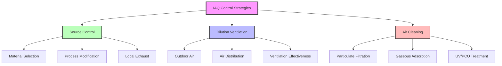
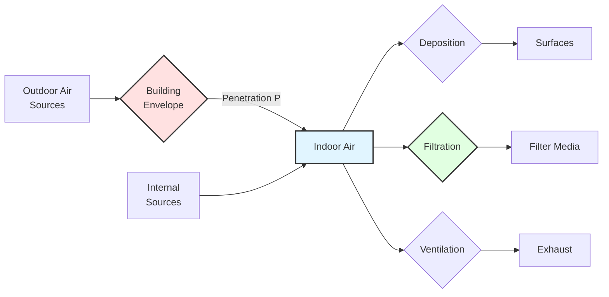

# Indoor Air Quality Management

Indoor air quality management represents a critical building environmental control discipline directly impacting occupant health, cognitive performance, and productivity. Modern IAQ practice integrates ventilation engineering, contaminant source control, air cleaning technologies, and continuous monitoring to maintain acceptable air within occupied spaces.

## Fundamental IAQ Parameters

### Contaminant Mass Balance

The steady-state contaminant concentration in a well-mixed zone follows the fundamental mass balance equation:

$$C_{ss} = \frac{S + Q_{oa} C_{oa}}{Q_{oa} + kV}$$

Where:
- $C_{ss}$ = steady-state indoor concentration (µg/m³)
- $S$ = contaminant generation rate (µg/h)
- $Q_{oa}$ = outdoor air ventilation rate (m³/h)
- $C_{oa}$ = outdoor air concentration (µg/m³)
- $k$ = first-order decay/removal rate (h⁻¹)
- $V$ = space volume (m³)

This equation demonstrates three primary control strategies: source reduction (decrease $S$), dilution ventilation (increase $Q_{oa}$), and active removal (increase $k$ through filtration or sorption).

### Carbon Dioxide as Ventilation Indicator

CO₂ serves as a surrogate for occupant bioeffluent dilution. The steady-state CO₂ concentration above outdoor levels:

$$C_{CO_2} - C_{CO_2,oa} = \frac{N \cdot G}{Q_{oa}}$$

Where:
- $N$ = number of occupants
- $G$ = CO₂ generation rate per person (L/h·person)
- Typical $G$ values: 18 L/h (sedentary), 38 L/h (moderate activity), 75 L/h (heavy work)

For target indoor CO₂ of 1000 ppm with 400 ppm outdoor concentration, required outdoor air per person:

$$\frac{Q_{oa}}{N} = \frac{G}{(C_{CO_2} - C_{CO_2,oa}) \times 10^6} \times \frac{10^6 \text{ L}}{m^3}$$

Substituting $G = 18$ L/h·person and 600 ppm differential yields approximately 30 m³/h·person (8.5 L/s·person) minimum ventilation.

## ASHRAE 62.1 Compliance Paths

### Ventilation Rate Procedure

The Ventilation Rate Procedure (VRP) prescribes minimum outdoor air based on occupancy and floor area. The breathing zone outdoor airflow:

$$V_{bz} = R_p \cdot P_z + R_a \cdot A_z$$

Where:
- $V_{bz}$ = breathing zone outdoor airflow (L/s or cfm)
- $R_p$ = outdoor air rate per person (L/s·person or cfm/person)
- $P_z$ = zone population (people)
- $R_a$ = outdoor air rate per unit area (L/s·m² or cfm/ft²)
- $A_z$ = zone floor area (m² or ft²)

For multiple zones with central outdoor air system, system outdoor air intake:

$$V_{ot} = \sum_{all zones} \frac{V_{oz}}{E_z} + V_{ou}$$

Where:
- $V_{ot}$ = outdoor air intake flow (L/s)
- $V_{oz}$ = zone outdoor air (L/s)
- $E_z$ = zone air distribution effectiveness (typically 0.8-1.2)
- $V_{ou}$ = unconditioned space outdoor air (L/s)

| Space Type | $R_p$ (L/s·person) | $R_a$ (L/s·m²) | Typical Application |
|------------|-------------------|----------------|---------------------|
| Office Space | 2.5 | 0.3 | General office, conference rooms |
| Classrooms | 5.0 | 0.3 | Educational spaces, ages 9+ |
| Retail | 3.8 | 0.3 | Sales floors, merchandising |
| Gymnasium | 10 | 0.3 | Sports facilities, exercise spaces |
| Conference/Meeting | 2.5 | 0.3 | Meeting rooms <13 m² per person |
| Food Preparation | 3.8 | 0.9 | Commercial kitchens |
| Laboratories | 5.0 | 0.9 | General laboratory spaces |

### IAQ Procedure

The IAQ Procedure requires demonstrating that contaminant concentrations remain below maximum acceptable levels. For each contaminant $i$:

$$C_i \leq C_{max,i}$$

The required outdoor air rate accounting for source strength, outdoor concentration, and removal mechanisms:

$$Q_{oa} = \frac{S_i - kV(C_{max,i} - C_{oa,i})}{C_{max,i} - C_{oa,i}}$$

The IAQ Procedure permits reduced outdoor air when source control, air cleaning, or other methods achieve acceptable contaminant levels. Verification requires measurement or validated modeling demonstrating compliance.

## IAQ Performance Metrics

### Ventilation Effectiveness

Air change effectiveness characterizes how efficiently ventilation air reaches occupied zones:

$$\epsilon_a = \frac{C_e - C_s}{C_r - C_s}$$

Where:
- $\epsilon_a$ = air change effectiveness
- $C_e$ = exhaust air concentration
- $C_s$ = supply air concentration
- $C_r$ = room average concentration

Values: $\epsilon_a > 1.0$ indicates better-than-perfect mixing, $\epsilon_a = 1.0$ represents perfect mixing, $\epsilon_a < 1.0$ indicates short-circuiting.

Contaminant removal effectiveness evaluates pollutant clearance:

$$\epsilon_c = \frac{C_r - C_s}{C_{breathing} - C_s}$$

Where $C_{breathing}$ represents contaminant concentration at breathing zone.

### Particle Penetration and Deposition

Indoor particulate concentration depends on outdoor sources, penetration efficiency, deposition, and filtration:

$$\frac{dC_p}{dt} = P \cdot \lambda_v (C_{p,oa} - C_p) + \frac{S_p}{V} - \lambda_d C_p - \eta_f \lambda_r C_p$$

At steady state ($dC_p/dt = 0$):

$$C_p = \frac{P \lambda_v C_{p,oa} + S_p/V}{\lambda_v + \lambda_d + \eta_f \lambda_r}$$

Where:
- $P$ = building penetration factor (0.4-1.0)
- $\lambda_v$ = ventilation rate (h⁻¹)
- $\lambda_d$ = deposition rate (h⁻¹, typically 0.1-0.6 for PM₂.₅)
- $\eta_f$ = filtration efficiency
- $\lambda_r$ = recirculation rate (h⁻¹)
- $S_p$ = indoor particle generation rate (µg/h)

## Health Effects and Exposure Assessment

### Dose-Response Relationships

Inhalation exposure dose integrates concentration and breathing rate over time:

$$D = \int_0^t C(t) \cdot BR(t) \cdot dt$$

For constant concentration and breathing rate:

$$D = C \cdot BR \cdot t$$

Where:
- $D$ = inhaled dose (µg or mg)
- $C$ = contaminant concentration (µg/m³)
- $BR$ = breathing rate (m³/h, typically 0.5-0.7 m³/h sedentary, 1.5-2.5 m³/h active)
- $t$ = exposure duration (h)

Deposited dose in respiratory tract depends on particle size, breathing pattern, and deposition efficiency:

$$D_{dep} = D \cdot \eta_{dep}(d_p, Q_b)$$

Where $\eta_{dep}$ varies from 10-30% for 0.1-1.0 µm particles to 70-90% for >5 µm particles.

## Comparison: Traditional vs. Performance-Based IAQ

| Aspect | Ventilation Rate Procedure | IAQ Procedure |
|--------|---------------------------|---------------|
| **Approach** | Prescriptive dilution | Performance-based verification |
| **Design Complexity** | Low - table lookup | High - detailed analysis |
| **Flexibility** | Limited - fixed rates | High - innovative solutions |
| **Outdoor Air** | Minimum specified rates | Optimized to maintain C < C_max |
| **Source Control** | Assumed standard materials | Explicitly quantified and credited |
| **Air Cleaning** | Not credited for OA reduction | Can reduce OA requirements |
| **Verification** | Airflow measurement | Contaminant concentration measurement |
| **Energy Impact** | Fixed ventilation energy | Potential significant reduction |
| **Application** | Standard buildings | Unique buildings, tight envelopes |
| **Risk** | Lower - established approach | Higher - requires validation |

## Monitoring and Control Strategies

### Multi-Parameter IAQ Monitoring

Comprehensive IAQ assessment requires simultaneous measurement of multiple parameters. Critical measurements include:

**Temperature and Humidity**: Thermal comfort per ASHRAE 55 (20-26°C, 30-60% RH) and mold prevention (surface RH <80%).

**CO₂ Concentration**: Ventilation adequacy indicator. Target <1000 ppm for good IAQ, <800 ppm for enhanced cognitive performance. Demand-controlled ventilation modulates outdoor air based on real-time CO₂:

$$Q_{oa}(t) = Q_{oa,min} + K \cdot (C_{CO_2}(t) - C_{setpoint})$$

**Particulate Matter**: PM₂.₅ and PM₁₀ mass concentrations. WHO guideline: 15 µg/m³ (24-h mean) for PM₂.₅. Particle counts differentiate size fractions.

**Volatile Organic Compounds**: Total VOC screening via PID or metal oxide sensors. Individual VOC speciation requires GC-MS for formaldehyde, benzene, toluene quantification.

**Pressure Relationships**: Maintain positive pressure (+2.5 to +12.5 Pa) in clean spaces relative to surrounding areas to prevent contaminant infiltration.

### Control Hierarchy

1. **Elimination**: Remove contaminant sources through material substitution or process redesign
2. **Substitution**: Replace high-emission materials with low-VOC alternatives
3. **Engineering Controls**: Local exhaust ventilation at point of generation
4. **Administrative Controls**: Occupancy scheduling, maintenance procedures
5. **Dilution Ventilation**: General outdoor air supply as final defense
6. **Personal Protection**: Last resort for extreme exposures

## Integration with Building Systems

IAQ management requires coordination across building systems. HVAC systems provide primary control through outdoor air delivery, filtration, and contaminant dilution. Building envelope design controls infiltration, moisture entry, and outdoor pollutant penetration. Space pressurization prevents cross-contamination between zones with differential pressure control. Humidity management through cooling coil condensate removal and supplemental dehumidification prevents microbial amplification. Air distribution design ensures adequate air change effectiveness and prevents stagnant zones.

The optimal IAQ strategy balances health outcomes, energy consumption, capital costs, and operational complexity. Advanced buildings integrate real-time IAQ sensors with building automation systems for responsive control, achieving superior air quality while minimizing energy waste through precision ventilation delivery matched to actual occupancy and contamination levels.

## References to Standards

- **ASHRAE 62.1**: Ventilation for Acceptable Indoor Air Quality
- **ASHRAE 55**: Thermal Environmental Conditions for Human Occupancy
- **ASHRAE 52.2**: Method of Testing General Ventilation Air-Cleaning Devices for Removal Efficiency by Particle Size
- **ASHRAE 145.1**: Laboratory Test Method for Assessing the Performance of Gas-Phase Air-Cleaning Systems
- **ISO 16000**: Indoor Air (parts 1-40 covering measurement methods)
- **WHO Air Quality Guidelines**: Indoor air quality pollutant concentration limits

## Conclusion

Indoor air quality management integrates physics-based ventilation design, contaminant source control, and continuous monitoring to maintain healthy indoor environments. The evolution from prescriptive ventilation rates to performance-based IAQ procedures enables optimized solutions balancing health protection with energy efficiency. Successful implementation requires understanding fundamental mass transfer principles, applying appropriate measurement technologies, and coordinating multiple building systems to achieve comprehensive contaminant control.
