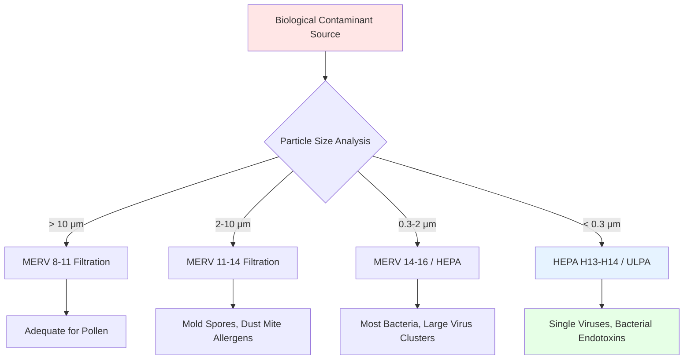

## Overview

Biological contaminants represent a diverse category of airborne particles that include viable organisms (bacteria, viruses, fungi) and biologically-derived materials (pollen, allergens, endotoxins, mycotoxins). These contaminants range from 0.01 to 100 micrometers in size and pose varying health risks from mild allergic reactions to severe respiratory infections.

Effective control requires a multi-layered approach combining source control, dilution ventilation, filtration, and where appropriate, active disinfection through ultraviolet germicidal irradiation (UVGI). Selection of control strategies depends on contaminant characteristics, occupied space requirements, and risk tolerance levels.

## Biological Contaminant Characteristics

### Size Distribution and Behavior

Biological particles exhibit distinct size ranges that determine their airborne behavior and susceptibility to capture:

| Contaminant Type | Particle Size Range | Settling Velocity | Primary Control Method |
|-----------------|-------------------|------------------|----------------------|
| Viruses (airborne) | 0.01-0.3 μm | Negligible (hours airborne) | HEPA/ULPA filtration, UVGI |
| Bacteria (single cells) | 0.3-10 μm | 0.001-0.3 m/s | MERV 13-16, UVGI |
| Mold spores | 2-20 μm | 0.01-1.0 m/s | MERV 11-14 filtration |
| Pollen grains | 10-100 μm | 0.3-3.0 m/s | MERV 8-11 filtration |
| Dust mite allergens | 5-20 μm (fecal particles) | 0.1-0.5 m/s | MERV 11-13 filtration |

The terminal settling velocity follows Stokes' Law for particles in the viscous flow regime:

$$V_s = \frac{g d_p^2 (\rho_p - \rho_a)}{18 \mu}$$

Where:
- $V_s$ = settling velocity (m/s)
- $g$ = gravitational acceleration (9.81 m/s²)
- $d_p$ = particle diameter (m)
- $\rho_p$ = particle density (typically 1000-1200 kg/m³ for biological material)
- $\rho_a$ = air density (1.2 kg/m³ at standard conditions)
- $\mu$ = dynamic viscosity of air (1.81 × 10⁻⁵ Pa·s at 20°C)

Particles smaller than 5 μm remain airborne for extended periods, facilitating long-range transport through ventilation systems and requiring enhanced filtration or disinfection for effective control.

### Viability and Environmental Sensitivity

Biological contaminants respond to environmental conditions:

**Relative Humidity Effects:**
- Viruses: Maximum survival at RH < 40% or RH > 70%, minimum at 40-70% RH
- Bacteria: Optimal survival at RH > 60%, reduced viability below 40% RH
- Mold growth: Requires RH > 60% on surfaces, optimally 75-95% RH
- Pollen: Non-viable, allergenic regardless of environmental conditions

**Temperature Sensitivity:**
Most pathogens demonstrate reduced viability at elevated temperatures (> 35°C) or prolonged cold exposure (< 5°C), though survival in dormant states complicates eradication strategies.

## Filtration Strategies

### Filter Selection by Contaminant

### Minimum Efficiency Reporting Value (MERV) Performance

ASHRAE Standard 52.2 defines filter performance across three particle size ranges relevant to biological contaminants:

| MERV Rating | E₁ (0.3-1 μm) | E₂ (1-3 μm) | E₃ (3-10 μm) | Biological Contaminant Capture |
|------------|--------------|------------|-------------|-------------------------------|
| MERV 8 | < 20% | < 70% | ≥ 70% | Pollen, large mold spores |
| MERV 11 | 20-65% | 65-80% | ≥ 80% | Most mold spores, dust mite allergens |
| MERV 13 | 50-85% | ≥ 85% | ≥ 90% | Most bacteria, large viral droplets |
| MERV 14 | 75-90% | ≥ 90% | ≥ 90% | Enhanced bacterial capture |
| MERV 16 | ≥ 95% | ≥ 95% | ≥ 95% | Small bacteria, virus clusters |

ASHRAE 62.1 recommends minimum MERV 8 filtration for general commercial applications, with MERV 13 specified for healthcare and high-risk environments.

### HEPA Filtration for Critical Applications

High-Efficiency Particulate Air (HEPA) filters achieve minimum efficiency specifications across the most penetrating particle size (MPPS), typically 0.1-0.3 μm:

$$E_{HEPA} = 1 - \frac{C_{downstream}}{C_{upstream}}$$

Where:
- $E_{HEPA}$ = filter efficiency (dimensionless)
- $C$ = particle concentration (particles/m³)

HEPA classifications per ISO 29463:

- **H13:** ≥ 99.95% efficiency at MPPS (< 0.05% penetration)
- **H14:** ≥ 99.995% efficiency at MPPS (< 0.005% penetration)
- **U15 (ULPA):** ≥ 99.9995% efficiency at MPPS (< 0.0005% penetration)

HEPA filtration provides essential protection in:
- Hospital isolation rooms (airborne infection isolation)
- Pharmaceutical manufacturing cleanrooms
- Biosafety Level 3 and 4 laboratories
- Agricultural biosecurity facilities (PRRS, avian influenza control)

### Pressure Drop Considerations

Filter installation increases system static pressure, requiring fan capacity analysis:

$$\Delta P_{filter} = K \cdot Q^n$$

Where:
- $\Delta P_{filter}$ = filter pressure drop (Pa)
- $K$ = resistance coefficient dependent on filter type and loading
- $Q$ = airflow rate (m³/s)
- $n$ = exponent (typically 1.8-2.0 for turbulent flow)

| Filter Type | Initial Pressure Drop | Final Pressure Drop | Replacement Interval |
|------------|---------------------|-------------------|---------------------|
| MERV 8 | 50-75 Pa | 200 Pa | 3-6 months |
| MERV 13 | 75-150 Pa | 300 Pa | 3-6 months |
| MERV 16 | 150-250 Pa | 450 Pa | 6-12 months |
| HEPA H13 | 250-350 Pa | 600 Pa | 12-24 months |

Differential pressure gauges monitor filter loading, triggering replacement when terminal pressure drop is reached to prevent excessive energy consumption and potential filter bypass.

## Ultraviolet Germicidal Irradiation (UVGI)

### UV-C Radiation Principles

Ultraviolet light at 254 nm wavelength (UV-C) inactivates microorganisms by damaging nucleic acids (DNA/RNA), preventing replication. Germicidal effectiveness depends on UV dose exposure:

$$D = I \cdot t$$

Where:
- $D$ = UV dose (mJ/cm² or μW·s/cm²)
- $I$ = UV intensity at target surface (mW/cm²)
- $t$ = exposure time (seconds)

### Susceptibility by Organism Type

Different microorganisms require varying UV doses for inactivation:

| Organism | UV Dose for 90% Inactivation (D₉₀) | UV Dose for 99.9% Inactivation |
|----------|-----------------------------------|------------------------------|
| E. coli (bacteria) | 3-6 mJ/cm² | 9-18 mJ/cm² |
| Staphylococcus aureus | 2-5 mJ/cm² | 6-15 mJ/cm² |
| Tuberculosis mycobacteria | 6-10 mJ/cm² | 18-30 mJ/cm² |
| Influenza virus | 3-6 mJ/cm² | 9-18 mJ/cm² |
| SARS-CoV-2 (COVID-19) | 4-6 mJ/cm² | 12-18 mJ/cm² |
| Aspergillus niger (mold) | 60-120 mJ/cm² | 180-360 mJ/cm² |

### In-Duct UVGI Systems

In-duct UV systems irradiate airstreams within air handling units, typically positioned downstream of cooling coils:

**Dose Calculation:**

$$D = \frac{I_0 \cdot A_{lamp}}{Q} \cdot \eta$$

Where:
- $I_0$ = UV lamp output (W)
- $A_{lamp}$ = effective irradiation zone area (m²)
- $Q$ = airflow rate (m³/s)
- $\eta$ = system efficiency factor (0.15-0.30 accounting for geometry, reflectance, lamp aging)

**Design Parameters:**
- Lamp spacing: 0.3-0.6 m for uniform irradiation coverage
- Air velocity: 2.5-5 m/s through irradiation zone
- Exposure time: 0.1-0.5 seconds typical
- Required intensity: 20-50 mW/cm² for bacterial control, 50-200 mW/cm² for mold spores

### Upper-Room UVGI Systems

Upper-room systems create a disinfection zone in the upper portion of occupied spaces, relying on natural air mixing to circulate room air through the UV field:

**Mixing Requirements:**

The room air circulation time constant determines effectiveness:

$$\tau_{mixing} = \frac{V}{Q_{circulation}}$$

Where:
- $\tau_{mixing}$ = mixing time constant (seconds)
- $V$ = room volume (m³)
- $Q_{circulation}$ = air circulation rate through upper zone (m³/s)

For effective pathogen reduction, circulation rates achieving 6-12 complete air changes per hour through the upper zone are required, typically accomplished through thermal convection or ceiling fans.

**Safety Considerations:**
- Occupant exposure limit: 0.2 μW/cm² per ACGIH threshold
- Installation height: Minimum 2.1 m above floor
- Fixture baffles: Direct UV upward while preventing eye-level exposure
- Warning signage: Required per OSHA regulations

### UV Lamp Maintenance

UV-C lamp output degrades with operating time due to phosphor aging and mercury depletion:

$$I(t) = I_0 \cdot e^{-\lambda t}$$

Where:
- $I(t)$ = UV output at time $t$ (W)
- $I_0$ = initial UV output (W)
- $\lambda$ = degradation rate constant (typically 8-12% per 1000 hours)
- $t$ = operating time (hours)

Standard maintenance schedules replace lamps annually (approximately 8000-9000 hours operation) when output has degraded to 70-80% of initial intensity. UV sensors provide continuous monitoring for critical applications, triggering replacement when output falls below minimum effective levels.

## Ventilation-Based Dilution

### Contaminant Generation and Removal

Steady-state contaminant concentration in a well-mixed space follows the mass balance equation:

$$C_{ss} = \frac{G}{Q \cdot E}$$

Where:
- $C_{ss}$ = steady-state concentration (organisms/m³ or CFU/m³)
- $G$ = contaminant generation rate (organisms/s)
- $Q$ = outdoor air ventilation rate (m³/s)
- $E$ = ventilation effectiveness (typically 0.8-1.2)

### Transient Concentration Decay

Following elimination of contaminant source, concentration decays exponentially:

$$C(t) = C_0 \cdot e^{-\frac{Q \cdot E}{V} \cdot t}$$

Where:
- $C(t)$ = concentration at time $t$
- $C_0$ = initial concentration
- $V$ = room volume (m³)
- $t$ = time elapsed (seconds)

The air change rate $(ACH = \frac{Q \cdot 3600}{V})$ determines purge time. Achieving 99% contaminant removal requires:

$$t_{99\%} = \frac{4.6 \cdot V}{Q \cdot E}$$

For a typical office space (ACH = 2 h⁻¹, E = 1.0), 99% removal requires approximately 2.3 hours.

### Enhanced Ventilation Strategies

**Increased Outdoor Air:**
ASHRAE Standard 62.1 specifies minimum outdoor air rates of 2.5 L/s/person (5 CFM/person) for office spaces. Enhanced ventilation at 5-10 L/s/person reduces contaminant concentration proportionally but increases energy consumption.

**Dedicated Outdoor Air Systems (DOAS):**
Decouples ventilation from thermal conditioning, allowing consistent outdoor air delivery independent of cooling/heating loads while enabling efficient dehumidification and filtration of outdoor air prior to distribution.

**Displacement Ventilation:**
Introduces cool, clean air at floor level, allowing thermal buoyancy to carry contaminants upward for high-level exhaust. Achieves ventilation effectiveness (E) of 1.2-1.8, providing 20-80% reduction in breathing zone contaminant concentration compared to mixing ventilation.

## Moisture Control for Mold Prevention

### Critical Relative Humidity Threshold

Mold growth on building surfaces requires sustained elevated moisture:

- **Growth threshold:** RH > 60% on surface for > 24-48 hours
- **Optimal growth:** RH 75-95% on surface
- **Germination:** Typically requires RH > 85% for spore germination

Surface relative humidity differs from room air RH due to temperature effects:

$$RH_{surface} = RH_{air} \cdot \frac{P_{sat}(T_{air})}{P_{sat}(T_{surface})}$$

Where:
- $P_{sat}$ = saturation vapor pressure at specified temperature (Pa)

Cold surfaces (thermal bridges, uninsulated pipes, exterior walls) exhibit elevated surface RH even when room air RH remains controlled, necessitating insulation and thermal break strategies.

### Humidity Control Methods

**Dehumidification Capacity Requirement:**

$$\dot{m}_{removal} = \dot{m}_{generation} + \dot{m}_{infiltration} + \dot{m}_{ventilation}$$

Where:
- $\dot{m}$ = moisture flow rate (kg/s)

| Strategy | Latent Capacity | Application | Energy Consumption |
|----------|----------------|-------------|-------------------|
| Refrigerant-based cooling coil | 0.5-1.5 kW per kW sensible | Standard HVAC systems | Coupled to sensible cooling |
| Desiccant dehumidification | 2-8 g/kg air processed | High latent load applications | 2500-4000 kJ/kg water removed |
| Subcooling with reheat | 1-3 kW per kW sensible | Precise humidity control | 20-40% reheat energy penalty |
| Heat pipe dehumidification | 0.8-1.8 kW per kW sensible | Energy-efficient humidity control | 10-15% energy increase vs. standard |

ASHRAE Standard 62.1 recommends maintaining indoor relative humidity between 30-60% for occupant comfort and biological contaminant control.

## Integrated Control Strategies

Effective biological contaminant control combines multiple approaches:

**Baseline Protection (General Commercial):**
- MERV 11-13 filtration
- ASHRAE 62.1 minimum ventilation rates
- RH control 30-60%
- Regular maintenance and coil cleaning

**Enhanced Protection (Healthcare, Schools):**
- MERV 13-16 filtration
- Increased outdoor air ventilation (150-200% of minimum)
- In-duct UVGI downstream of cooling coils
- RH control 40-60%
- Quarterly duct cleaning and inspection

**Maximum Protection (Isolation Rooms, Biosecurity):**
- HEPA H13-H14 filtration
- 100% outdoor air systems (no recirculation)
- Combined in-duct and upper-room UVGI
- Negative pressure isolation (-2.5 to -8 Pa)
- Continuous air quality monitoring

The selection and intensity of control measures scale with contaminant risk level, occupant vulnerability, and regulatory requirements, balanced against capital costs and ongoing energy consumption considerations.

## References

- ASHRAE Standard 62.1: Ventilation for Acceptable Indoor Air Quality
- ASHRAE Standard 52.2: Method of Testing General Ventilation Air-Cleaning Devices for Removal Efficiency by Particle Size
- CDC Guidelines for Environmental Infection Control in Health-Care Facilities
- NIOSH Criteria for Recommended Standard: Occupational Exposure to Ultraviolet Radiation
- ISO 29463: High-Efficiency Filters and Filter Media for Removing Particles in Air
