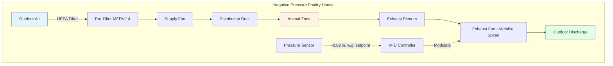
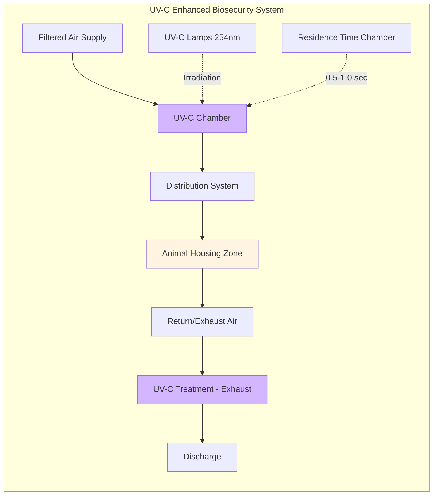

## Overview of Agricultural Biosecurity Filtration

Agricultural biosecurity filtration represents a critical intersection of HVAC engineering and animal health management. These systems prevent airborne pathogen transmission into confined animal feeding operations (CAFOs), breeding facilities, and research installations. Effective biosecurity filtration combines mechanical filtration, ultraviolet germicidal irradiation (UVGI), and controlled pressure differentials to create barriers against viral, bacterial, and fungal threats.

The economic impact of disease outbreaks in concentrated animal populations—such as avian influenza in poultry or porcine reproductive and respiratory syndrome (PRRS) in swine—justifies substantial investment in engineered air quality control. Modern agricultural biosecurity systems must balance pathogen exclusion with the ventilation rates required for metabolic heat removal and moisture control in high-density animal housing.

## Filtration Efficiency Requirements

Agricultural biosecurity applications demand high-efficiency particulate filtration to capture bioaerosols containing pathogens. The minimum efficiency reporting value (MERV) or ISO 16890 classification determines particle removal capability.

### Particle Capture Efficiency

Filtration efficiency follows penetration theory:

$$\eta = 1 - e^{-\left(\frac{4\alpha EL}{(1-\alpha)\pi d_f}\right)}$$

Where:
- $\eta$ = fractional filtration efficiency (dimensionless)
- $\alpha$ = packing density of filter media (dimensionless)
- $E$ = single fiber efficiency (dimensionless)
- $L$ = filter thickness (m)
- $d_f$ = fiber diameter (m)

For biosecurity applications targeting viral particles (0.02-0.3 μm) and bacterial aerosols (0.5-5 μm), MERV 14-16 or HEPA filtration (≥99.97% efficient at 0.3 μm) is typically specified.

### Biosecurity-Level Classification

**High Biosecurity (Research/Breeding Stock):**
- HEPA filtration (H13-H14): 99.97-99.995% at MPPS
- Pre-filtration: MERV 14 minimum
- Final pressure differential: -0.02 to -0.05 in. w.g.

**Medium Biosecurity (Commercial Production):**
- MERV 14-16 filtration: 75-95% at 0.3 μm
- Pre-filtration: MERV 8-11
- Pressure differential: -0.01 to -0.02 in. w.g.

**Standard Biosecurity (General Protection):**
- MERV 11-13 filtration
- Positive pressure exclusion acceptable
- Focus on ventilation rate maintenance

## Air Change Rates and Ventilation Design

Agricultural facilities require substantial ventilation rates to manage heat and moisture loads while maintaining biosecurity filtration.

### Minimum Ventilation Rate

The required outdoor air exchange rate depends on animal heat production and building envelope:

$$Q_{min} = \frac{q_{sensible}}{c_p \rho_{air} \Delta T}$$

Where:
- $Q_{min}$ = minimum airflow rate (m³/s)
- $q_{sensible}$ = sensible heat production from animals (W)
- $c_p$ = specific heat of air = 1006 J/(kg·K)
- $\rho_{air}$ = air density ≈ 1.2 kg/m³ at standard conditions
- $\Delta T$ = allowable temperature rise (K)

### Air Changes Per Hour

Biosecurity facilities typically operate at:

$$ACH = \frac{Q_{min} \times 3600}{V_{building}}$$

Where:
- $ACH$ = air changes per hour (h⁻¹)
- $V_{building}$ = building volume (m³)

Typical ACH ranges:
- Poultry broiler houses: 6-12 ACH (winter minimum to summer maximum)
- Swine farrowing rooms: 8-20 ACH
- High biosecurity research facilities: 15-20 ACH with HEPA exhaust

## Negative Pressure Biosecurity Systems

Negative pressure ventilation prevents unfiltered air infiltration by maintaining building pressure below atmospheric.

### Pressure Differential Calculation

The required pressure differential to prevent infiltration through building leakage:

$$\Delta P = \rho_{air} \frac{v^2}{2} \times C_d$$

Where:
- $\Delta P$ = pressure differential (Pa)
- $v$ = velocity through leakage path (m/s)
- $C_d$ = discharge coefficient ≈ 0.6-0.8 for building cracks

Typical specifications maintain -5 to -12.5 Pa (-0.02 to -0.05 in. w.g.) negative pressure relative to outdoors.

## HEPA Filtration Applications

High-efficiency particulate air (HEPA) filters provide maximum biosecurity for high-value animal populations.

### HEPA System Design Considerations

**Filter Specifications:**
- Minimum efficiency: 99.97% at 0.3 μm MPPS (H13 classification)
- Initial pressure drop: 200-250 Pa (0.8-1.0 in. w.g.)
- Final pressure drop: 500-600 Pa (2.0-2.4 in. w.g.)
- Face velocity: 1.27-2.54 m/s (250-500 fpm)

**Pre-filtration Requirements:**
HEPA filters require upstream protection to maximize service life:
1. Pre-filter stage 1: MERV 8-11 (30-65% efficiency)
2. Pre-filter stage 2: MERV 14-15 (75-90% efficiency)
3. Final stage: HEPA H13-H14

### Poultry Facility HEPA Application

Modern high-biosecurity poultry facilities implement HEPA filtration to prevent avian influenza transmission:

**System Configuration:**
- Filter wall construction with multiple HEPA modules
- Individual filter pressure monitoring
- Redundant fan capacity for maintenance
- Airflow rate: 0.85-1.13 m³/min per m² floor area (2.8-3.7 cfm/ft²)

## UV-C Germicidal Irradiation

Ultraviolet germicidal irradiation complements mechanical filtration by inactivating pathogens in the airstream.

### UV-C Dose Calculation

Germicidal effectiveness depends on UV dose delivered:

$$D_{UV} = I \times t$$

Where:
- $D_{UV}$ = UV dose (μW·s/cm² or mJ/cm²)
- $I$ = UV-C intensity at 254 nm (μW/cm²)
- $t$ = exposure time (s)

Required doses for 90% inactivation (D₉₀):
- Avian influenza virus: 2,000-4,000 μW·s/cm²
- Newcastle disease virus: 3,000-6,000 μW·s/cm²
- E. coli bacteria: 3,000-6,000 μW·s/cm²

### Design Parameters

**Chamber Design:**
- Airflow velocity: 2.5-4.0 m/s (500-800 fpm)
- Residence time: 0.5-1.0 seconds
- Lamp intensity: 40-80 μW/cm² at chamber centerline
- Lamp spacing: 0.3-0.6 m (12-24 inches) on-center

## Practical Implementation Examples

### Case Study: High-Biosecurity Swine Breeding Facility

**Facility Specifications:**
- Building volume: 15,000 m³
- Animal capacity: 1,200 sows
- Ventilation rate: 51 m³/s (108,000 cfm) summer maximum

**Biosecurity System:**
1. Three-stage filtration:
   - MERV 8 pre-filter (25% initial efficiency)
   - MERV 14 secondary (85% efficiency at 0.3 μm)
   - MERV 16 final (95% efficiency at 0.3 μm)
2. Negative pressure: -10 Pa (-0.04 in. w.g.)
3. Air changes: 12.2 ACH at maximum ventilation
4. UV-C supplemental treatment at supply

**Results:**
- Zero PRRS virus detections over 3-year monitoring period
- Filter replacement: 8-12 months for final stage
- Fan power: 18.7 kW (25 hp) total

### Case Study: Poultry Broiler House with HEPA Protection

**Facility Specifications:**
- Floor area: 1,200 m² (12,900 ft²)
- Bird capacity: 30,000 broilers
- Ventilation: 0.94 m³/min per m² (3.1 cfm/ft²) peak

**HEPA Filter Wall:**
- 48 HEPA modules, each 0.6 m × 0.6 m × 0.29 m (24" × 24" × 11.5")
- Total filter area: 17.3 m² (186 ft²)
- Face velocity: 2.03 m/s (400 fpm)
- Pressure drop: 225 Pa (0.9 in. w.g.) initial

**Performance:**
- Biosecurity maintained during regional AI outbreak
- Filter service life: 14-18 months average
- Additional fan power: 7.5 kW (10 hp)

## Integration with ASHRAE Standards

While ASHRAE Standard 62.1 (Ventilation for Acceptable Indoor Air Quality) primarily addresses human occupancy, agricultural biosecurity systems apply relevant principles:

**Applicable Provisions:**
- Outdoor air delivery monitoring
- Filter maintenance protocols (Section 6.1.4)
- Ventilation system operation during occupied periods
- Air cleaning device performance verification

**Agricultural-Specific Guidelines:**
- ASABE EP270.5: Design of Ventilation Systems for Poultry and Livestock Shelters
- MWPS-32: Mechanical Ventilation Systems for Livestock Housing
- NPIP (National Poultry Improvement Plan) biosecurity protocols

## Maintenance and Operational Considerations

**Filter Replacement Criteria:**
- Pressure drop exceeds 2× initial resistance
- Visual inspection reveals media damage
- Biosecurity breach detected (pathogen monitoring)
- Time-based replacement: 6-18 months depending on application

**System Monitoring:**
- Differential pressure gauges: ±25 Pa (±0.1 in. w.g.) accuracy
- Airflow measurement: ±10% of design
- Building pressure: continuous monitoring with alarm at ±2.5 Pa deviation
- UV-C lamp intensity: annual verification with radiometer

**Cost Analysis:**
Initial installation for medium biosecurity (MERV 14-16):
- Filter housings and media: $40-75/m² floor area
- Additional fan capacity: $25-50/m² floor area
- Controls and monitoring: $15-30/m² floor area

Annual operating costs:
- Filter replacement: $8-20/m² floor area
- Additional energy: $5-15/m² floor area
- UV-C lamp replacement: $2-5/m² floor area (if applicable)

---

**Related Topics:**
- HEPA Filter Design and Selection
- Negative Pressure System Control
- UV Germicidal Irradiation
- Biosecurity Protocols in Healthcare
- Industrial Air Filtration Systems
