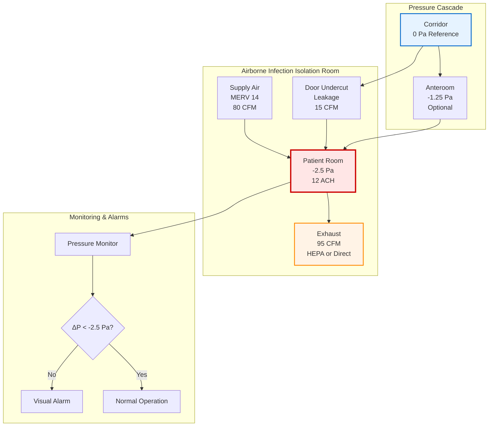
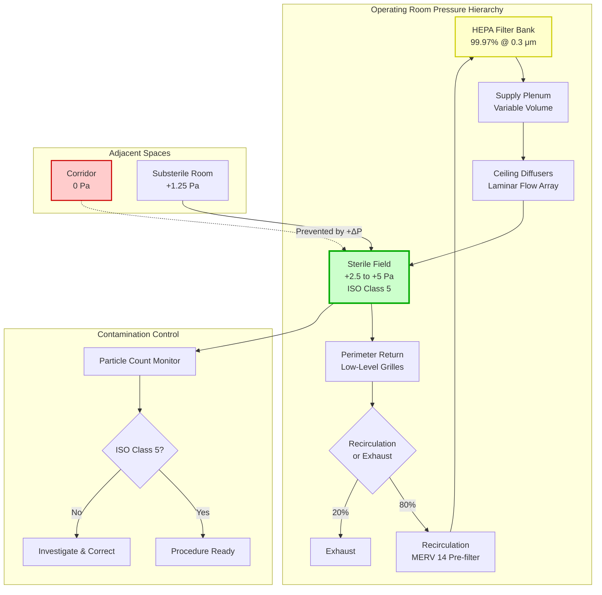

Healthcare HVAC biosecurity systems represent the most critical application of infection control engineering, where ventilation design directly impacts patient outcomes and nosocomial transmission rates. ASHRAE Standard 170, CDC Guidelines for Environmental Infection Control in Healthcare Facilities, and the Facility Guidelines Institute (FGI) Guidelines establish comprehensive requirements for airflow direction, filtration efficiency, pressure relationships, and air change rates across diverse clinical environments.

## ASHRAE 170 Ventilation Requirements

ASHRAE Standard 170: Ventilation of Health Care Facilities specifies minimum outdoor air changes, total air changes, pressure relationships, and filtration requirements for 62 distinct healthcare space types. These requirements balance infection control, odor dilution, and anesthetic gas removal while maintaining energy efficiency.

### Critical Space Classifications

| Space Type | Pressure | Min OA ACH | Min Total ACH | Recirculation | Filtration Supply | Filtration Exhaust |
|------------|----------|------------|---------------|---------------|-------------------|-------------------|
| Airborne Infection Isolation (AII) | Negative | 2 | 12 | Prohibited | MERV 14 | HEPA or direct exhaust |
| Protective Environment (PE) | Positive | 2 | 12 | Permitted | HEPA | MERV 14 |
| Operating Room | Positive | 3 | 20 | Permitted | HEPA | MERV 14 |
| Emergency Department Exam | Negative | 2 | 12 | Prohibited | MERV 14 | MERV 14 |
| Bronchoscopy Suite | Negative | 2 | 12 | Prohibited | MERV 14 | HEPA or exhaust |
| Autopsy Room | Negative | 2 | 12 | Prohibited | MERV 14 | HEPA or exhaust |
| General Patient Room | Equal/Positive | 2 | 6 | Permitted | MERV 14 | MERV 8 |
| Intensive Care Unit | Positive | 2 | 6 | Permitted | MERV 14 | MERV 14 |
| Pharmacy Cleanroom (ISO 7) | Positive | Per calc | 30+ | HEPA recirculation | HEPA | MERV 14 |

**Pressure differential requirements:** ±2.5 Pa (±0.01 in. H₂O) minimum between critical spaces and adjacent areas. Continuous monitoring with visual or audible alarms mandatory.

**Air change rate calculation:**

$$\text{ACH} = \frac{Q_{total}}{V_{room}}$$

Where:
- ACH = air changes per hour (h⁻¹)
- $Q_{total}$ = total airflow rate (m³/h or cfm)
- $V_{room}$ = room volume (m³ or ft³)

For a 400 ft³ airborne infection isolation room requiring 12 ACH:

$$Q_{total} = \frac{12 \times 400}{60} = 80 \text{ cfm}$$

## Airborne Infection Isolation Room Design

Airborne Infection Isolation Rooms (AIIRs) contain patients with suspected or confirmed tuberculosis, measles, varicella (chickenpox), SARS-CoV-2, or other airborne pathogens. Negative pressure prevents infectious aerosol escape into corridors and adjacent patient areas.

### Pressure Differential Maintenance

The pressure differential between isolation room and corridor results from exhaust airflow exceeding supply airflow. The differential pressure across building envelope openings:

$$\Delta P = \frac{\rho Q_{leak}^2}{2 C_d^2 A_{leak}^2}$$

Simplified for HVAC applications using empirical flow coefficient:

$$Q_{leak} = C \cdot A_{leak} \cdot \sqrt{\Delta P}$$

Where:
- $Q_{leak}$ = leakage airflow maintaining pressure differential (cfm)
- $C$ = flow coefficient (typically 350-650 cfm/ft² at 1 in. H₂O for door undercuts)
- $A_{leak}$ = effective leakage area (ft²)
- $\Delta P$ = pressure differential (in. H₂O)

For AIIR with 1-inch door undercut (3 ft width = 0.25 ft² area) maintaining -2.5 Pa (-0.01 in. H₂O):

$$Q_{leak} = 500 \times 0.25 \times \sqrt{0.01} = 12.5 \text{ cfm}$$

Total exhaust must exceed supply by this leakage flow plus safety margin:

$$Q_{exhaust} = Q_{supply} + Q_{leak} + Q_{safety}$$

Typical design: 80 cfm supply, 95 cfm exhaust provides -0.01 in. H₂O differential.

### Infection Risk Reduction Through Ventilation

The Wells-Riley equation quantifies airborne infection probability based on ventilation rate. The infection risk for susceptible individual:

$$P = 1 - e^{-\frac{Iqpt}{Q}}$$

Where:
- $P$ = probability of infection
- $I$ = number of infectors
- $q$ = quanta generation rate (infectious doses/h, pathogen-specific)
- $p$ = pulmonary ventilation rate of susceptible (m³/h, typically 0.6 m³/h)
- $t$ = exposure time (h)
- $Q$ = room ventilation rate (m³/h)

Rearranging to determine ventilation rate for target infection risk:

$$Q = \frac{-Iqpt}{\ln(1-P)}$$

For tuberculosis patient ($q$ ≈ 12 quanta/h), 8-hour exposure, target infection risk <1%:

$$Q = \frac{-1 \times 12 \times 0.6 \times 8}{\ln(1-0.01)} = \frac{-57.6}{-0.01005} = 5,731 \text{ m³/h} = 3,375 \text{ cfm}$$

This theoretical calculation demonstrates that for highly infectious patients, isolation in negative pressure room with HEPA-filtered or direct exhaust prevents corridor contamination rather than relying solely on dilution.

## Protective Environment Room Design

Protective Environment (PE) rooms house severely immunocompromised patients (hematopoietic stem cell transplant recipients, neutropenic patients) requiring protection from environmental fungi, particularly *Aspergillus* species. Positive pressure with HEPA filtration prevents spore infiltration.

### HEPA Filtration Performance

HEPA filters capture ≥99.97% of 0.3 μm particles, the most penetrating particle size (MPPS). *Aspergillus* conidia range from 2-3 μm, placing them in >99.99% capture efficiency regime.

Penetration through HEPA filter:

$$P_{filter} = 1 - \eta_{HEPA} = 1 - 0.9997 = 0.0003$$

For room supplied with 100% HEPA-filtered outdoor air at 12 ACH, steady-state spore concentration:

$$C_{indoor} = \frac{C_{outdoor} \cdot P_{filter} \cdot Q}{Q + k \cdot V}$$

Assuming negligible spore decay ($k$ ≈ 0) and outdoor concentration 1,000 spores/m³:

$$C_{indoor} = 1,000 \times 0.0003 = 0.3 \text{ spores/m³}$$

Target for PE rooms: <1 spore/m³. HEPA filtration reduces ambient fungal loads by 3-4 orders of magnitude.

### Positive Pressure Control

PE rooms maintain +2.5 Pa relative to anteroom and +5.0 Pa relative to corridor. This requires supply airflow exceeding exhaust and infiltration:

$$Q_{supply} = Q_{exhaust} + Q_{leak,pressure}$$

Unlike negative pressure rooms where differential is maintained by exhaust fan, positive pressure relies on supply fan with modulated exhaust to establish differential.

**Pressure cascade for optimal protection:**

Corridor (0 Pa) → Anteroom (+2.5 Pa) → PE Room (+5.0 Pa)

This ensures directional airflow from clean to potentially contaminated zones. Door opening temporarily disrupts pressure, requiring rapid recovery. Supply fan VFD control maintains setpoint during disturbances.

## Operating Room Ventilation

Operating rooms require positive pressure (+2.5 Pa minimum) to prevent corridor air containing skin flora from entering sterile field. Total air changes: 20 ACH minimum, with 3 ACH outdoor air. HEPA filtration on supply mandatory for orthopedic implant, cardiovascular, and other high-consequence procedures.

### Unidirectional Airflow for Ultra-Clean Environments

Laminar flow systems deliver HEPA-filtered air in unidirectional pattern over surgical field at 25-35 air changes per hour through ceiling-mounted diffuser array. ISO Class 5 cleanliness (<3,520 particles ≥0.5 μm per m³) achievable in critical zone.

Supply airflow for unidirectional system:

$$Q_{laminar} = V_{face} \cdot A_{diffuser}$$

Where:
- $V_{face}$ = face velocity (typically 0.30-0.45 m/s = 60-90 fpm)
- $A_{diffuser}$ = diffuser face area (m²)

For 10 ft × 10 ft (9.3 m²) diffuser array at 0.38 m/s:

$$Q_{laminar} = 0.38 \times 9.3 = 3.5 \text{ m³/s} = 7,480 \text{ cfm}$$

This high-volume unidirectional flow sweeps particles away from surgical site, reducing wound infection rates in joint replacement and cardiac procedures.

## Anteroom and Pressure Cascade Design

Anterooms provide buffer zones between isolation rooms and corridors, preventing pressure disruption during door opening events. Two configurations exist:

**Positive-Negative-Positive Cascade (for AIIR):**
Corridor (0 Pa) → Positive Anteroom (+1.25 Pa) → AIIR (-2.5 Pa)

**Positive-Positive-Positive Cascade (for PE):**
Corridor (0 Pa) → Anteroom (+2.5 Pa) → PE Room (+5.0 Pa)

CDC guidelines permit elimination of anteroom if AIIR door remains closed except during entry/exit and room maintains -2.5 Pa continuously. FGI Guidelines require anteroom for new construction.

### Door Opening Pressure Recovery

Door opening creates sudden pressure equalization. Recovery time to re-establish differential depends on room volume and net airflow:

$$t_{recovery} = \frac{V_{room} \cdot \ln(C_0/C_t)}{Q_{net}}$$

For contaminant decay from initial concentration $C_0$ to target $C_t$ (typically 99% removal):

$$t_{99\%} = \frac{4.6 \cdot V_{room}}{Q_{net}}$$

AIIR with 400 ft³ volume and 15 cfm net exhaust:

$$t_{99\%} = \frac{4.6 \times 400}{15} = 123 \text{ seconds} \approx 2 \text{ minutes}$$

Rapid pressure recovery (<1 minute to -2.5 Pa) requires adequate exhaust flow capacity and proper door sealing.

## Exhaust System Design and Discharge

AIIR exhaust handling depends on facility exhaust capacity and outdoor discharge location:

**Option 1: HEPA Filtration Before Recirculation** (not recommended by CDC)
Exhaust → HEPA filter → Return air system

**Option 2: Direct Exhaust to Outdoors**
Exhaust → Dedicated duct → Roof discharge with dispersion analysis

**Option 3: HEPA Filtration Before Exhaust**
Exhaust → HEPA filter → Exhaust duct → Outdoor discharge

CDC recommends Options 2 or 3. Roof discharge requires exhaust velocity >2,500 fpm and location ensuring no air intake contamination. Dispersion modeling per ASHRAE Fundamentals confirms dilution to safe levels.

Exhaust fan location critical: place downstream of HEPA filter (if used) to maintain negative pressure in contaminated duct. Bag-in/bag-out filter housing permits safe filter replacement without room contamination.

## Commissioning and Continuous Verification

Initial commissioning per ASHRAE 170 and ASHRAE Guideline 1.1 includes:

1. **Airflow verification:** Measure supply, exhaust, and leakage flows using calibrated hot-wire anemometer or balometer
2. **Pressure differential testing:** Manometer verification of ±2.5 Pa minimum under closed-door and open-door conditions
3. **Air change rate calculation:** Confirm total and outdoor air ACH meet minimum requirements
4. **Filter integrity testing:** DOP or PAO scan of HEPA filters verifying ≤0.01% penetration
5. **Pressure recovery time:** Door-opening test measuring time to re-establish differential
6. **Smoke visualization:** Confirm directional airflow during door opening events
7. **Alarm functionality:** Verify pressure monitor alarms activate when differential falls outside acceptable range

**Continuous monitoring requirements:**

- Differential pressure: Real-time display outside each critical room with visual/audible alarm
- Airflow rate: Optional but recommended for supply and exhaust verification
- Filter pressure drop: Monitors filter loading, replace when exceeds terminal ΔP
- Temperature and humidity: Maintain 20-24°C, 30-60% RH per ASHRAE 170

Daily visual inspection of pressure monitors by clinical staff provides immediate notice of HVAC failure. Monthly filter inspections and quarterly functional testing ensure sustained performance.

## Integration with Infection Prevention Protocols

HVAC biosecurity effectiveness depends on coordination with clinical infection control practices:

- **Patient placement:** Symptomatic patients in AIIR pending diagnostic confirmation
- **PPE compliance:** N95 respirators for healthcare workers entering AIIR regardless of ventilation
- **Door management:** Minimize door openings; use anteroom for supply staging
- **Cohorting:** Group patients with same pathogen when AIIR capacity insufficient
- **Environmental cleaning:** HEPA-filtered vacuum cleaners prevent surface-to-air transfer
- **Construction infection control:** Temporary barriers and negative pressure during renovation in occupied areas per ICRA (Infection Control Risk Assessment)

Engineering controls provide critical layer of defense but cannot substitute for administrative controls and proper clinical practices. Comprehensive infection prevention integrates multiple barriers to achieve maximum risk reduction.

## Design Considerations for Emerging Pathogens

Recent pandemic experience reinforces need for adaptable healthcare HVAC:

**Surge capacity:** Design general patient areas with infrastructure for rapid conversion to AIIR (exhaust capacity, ducting provisions, pressure monitoring points)

**Outdoor air fraction:** Higher OA percentages (50-100%) reduce recirculation of infectious aerosols during outbreaks

**Portable HEPA filtration:** Supplemental units provide temporary enhancement; ensure adequate CADR for room volume

**Upper-room UVGI:** Supplemental inactivation in high-risk areas (emergency departments, waiting rooms) without requiring AIIR infrastructure

**Flexible zoning:** Ability to reconfigure pressure relationships and airflow paths based on pathogen characteristics and patient census

Future-ready healthcare facilities incorporate adaptability, redundancy, and monitoring to respond to known and emerging airborne threats while maintaining energy efficiency during normal operations.
