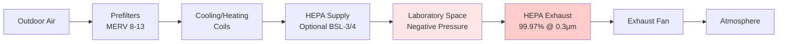
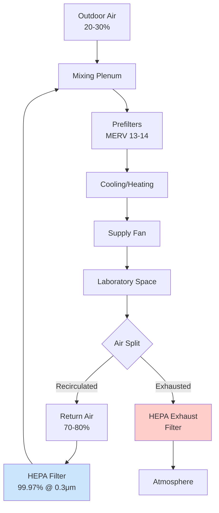
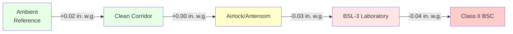

## Overview

Biosecurity HVAC system configurations must balance containment requirements, energy efficiency, and operational safety. The selection of single-pass, recirculation, or hybrid systems depends on biosafety level (BSL), pathogen characteristics, facility constraints, and regulatory compliance with CDC/NIH biosafety guidelines and ANSI/AIHA Z9.5 standards.

## Single-Pass (100% Exhaust) Systems

Single-pass configurations provide maximum containment by eliminating any possibility of recirculation. All air passes through the space once and exhausts through HEPA filtration.

### Design Characteristics

**Airflow Path:**
- 100% outdoor air supply
- Complete exhaust with no return air
- HEPA filtration on exhaust (minimum 99.97% at 0.3 μm)
- Optional HEPA supply filtration for BSL-3/BSL-4

**Applications:**
- BSL-3 and BSL-4 laboratories
- High-risk pathogen research
- Select agent facilities
- Facilities requiring maximum biocontainment

**Energy Considerations:**

Single-pass systems impose significant energy penalties. Heating and cooling 100% outdoor air requires approximately 30-50% more energy than recirculation systems. Annual energy costs for a 1,000 CFM single-pass laboratory can exceed $15,000-$25,000 in moderate climates.

### Pressure Control

Single-pass systems maintain laboratory spaces at negative pressure relative to surrounding areas. Typical pressure differentials:

| Space Classification | Pressure Differential | Air Changes/Hour |
|---------------------|----------------------|------------------|
| BSL-2 Laboratory | -0.01 to -0.02 in. w.g. | 6-12 ACH |
| BSL-3 Laboratory | -0.03 to -0.04 in. w.g. | 10-15 ACH |
| BSL-4 Laboratory | -0.04 to -0.06 in. w.g. | 12-20 ACH |

## Recirculation Systems with HEPA Filtration

Recirculation reduces energy consumption by reusing conditioned air. This configuration is permissible for BSL-1 and BSL-2 facilities when HEPA filtration is installed in the recirculation path.

### System Architecture

**Airflow Distribution:**
- Minimum 20-30% outdoor air
- 70-80% HEPA-filtered return air
- Exhaust air HEPA-filtered before discharge
- Continuous monitoring of filter integrity

**Recirculation Criteria (per CDC guidelines):**
- Limited to BSL-1 and BSL-2 applications
- HEPA filters must achieve 99.97% efficiency minimum
- Differential pressure monitoring across filters
- Automatic shutdown on filter failure
- Annual DOP/PAO testing of installed filters

### Energy Recovery Considerations

Energy recovery is prohibited when it allows potential cross-contamination between exhaust and supply airstreams. However, dedicated heat recovery systems with double-wall separation and leak detection are acceptable for certain BSL-2 applications.

## Hybrid Systems

Hybrid configurations combine single-pass and recirculation strategies within a single facility, optimizing containment and energy use by zone.

### Zoned Approach

**High-Containment Zones (Single-Pass):**
- BSL-3/BSL-4 laboratories
- Procedure rooms with aerosol-generating activities
- Necropsy suites
- Centrifuge rooms

**Low-Risk Zones (Recirculation):**
- BSL-1/BSL-2 laboratories
- Office spaces
- Support areas
- Corridors (if positive pressure)

### Isolation Requirements

Physical and control separation between zones prevents cross-contamination:
- Dedicated air handling units per zone
- No shared ductwork between containment levels
- Independent controls and monitoring
- Pressure cascade enforcement through interlocks

## Pressure Cascade Design

Pressure cascades establish directional airflow from clean to contaminated spaces, preventing pathogen migration.

### Cascade Hierarchy

### Implementation Parameters

**Differential Pressure Targets:**
- Minimum 0.01 in. w.g. between adjacent zones
- Increased to 0.03-0.04 in. w.g. for high-containment spaces
- Visual indicators (magnehelic gauges) at each transition
- Audible/visual alarms on pressure loss

**Supply/Exhaust Balance:**

Pressure control achieved through volumetric flow imbalance:

\[ \Delta P \propto (Q_{exhaust} - Q_{supply}) \]

For a 1,000 ft² laboratory at -0.03 in. w.g., exhaust typically exceeds supply by 150-300 CFM, depending on envelope leakage characteristics.

## Airlock Configurations

Airlocks provide physical and atmospheric barriers between containment zones.

### Types

**Sinking Bubble (Negative Pressure):**
- Airlock at more negative pressure than adjacent spaces
- Air flows inward from both sides
- Prevents contaminated air escape
- Required for BSL-3/BSL-4

**Rising Bubble (Positive Pressure):**
- Airlock at positive pressure
- Prevents contamination entry to clean spaces
- Used for personnel protective equipment areas

**Neutral Pressure:**
- Pressure between adjacent zones
- Directional flow maintained by sequenced doors
- Common in BSL-2 applications

### Operational Controls

- Interlocked door operation (one door open maximum)
- Time delay between door operations (10-15 seconds minimum)
- Airflow verification before door unlock
- Override capability for emergency egress

## Monitoring and Verification

Continuous monitoring ensures cascade maintenance and system integrity.

**Critical Parameters:**
- Differential pressure (±0.005 in. w.g. accuracy)
- Airflow rates (±10% tolerance)
- HEPA filter pressure drop (initial and trending)
- Room air changes per hour

**Alarm Thresholds:**
- Pressure deviation exceeding 0.005 in. w.g. from setpoint
- Airflow reduction below 90% of design
- HEPA filter pressure drop exceeding 150% of initial

## Regulatory Compliance

System configurations must satisfy multiple regulatory frameworks:

**CDC/NIH Biosafety in Microbiological and Biomedical Laboratories (BMBL):**
- Defines containment requirements by biosafety level
- Specifies minimum air change rates
- Mandates HEPA filtration locations

**ANSI/AIHA Z9.5:**
- Laboratory ventilation design standards
- Airflow verification methodologies
- Commissioning requirements

**Select Agent Regulations (42 CFR Part 73):**
- Enhanced physical security
- Redundant containment systems
- Continuous monitoring requirements

## System Selection Criteria

| Factor | Single-Pass | Recirculation | Hybrid |
|--------|-------------|---------------|--------|
| Initial Cost | High | Moderate | High |
| Operating Cost | Highest | Lowest | Moderate |
| Containment Level | Maximum | Limited (BSL-1/2) | Optimized |
| Energy Efficiency | Poor | Excellent | Good |
| Regulatory Acceptance | Universal | Restricted | Flexible |

---

**References:**
- CDC/NIH. *Biosafety in Microbiological and Biomedical Laboratories*, 6th Edition
- ANSI/AIHA Z9.5-2012, *Laboratory Ventilation*
- ASHRAE. *HVAC Design Manual for Hospitals and Clinics*, 2nd Edition
