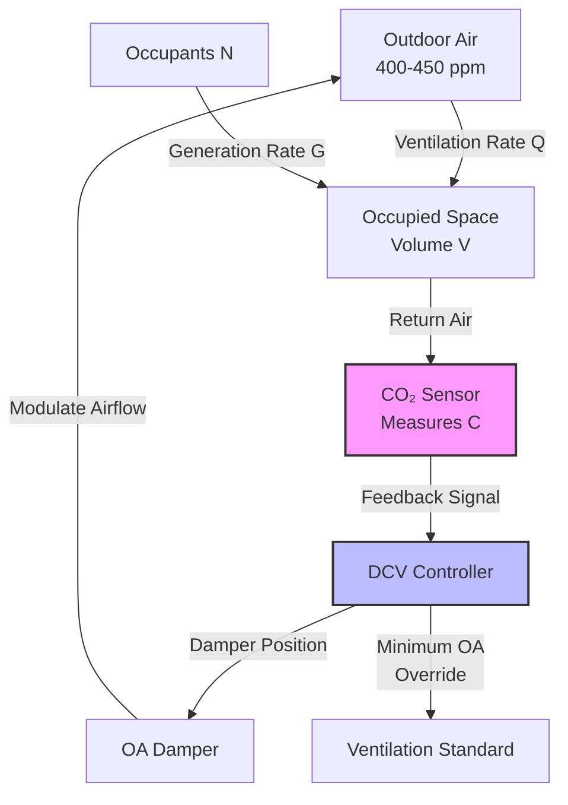

## Fundamental Principles

Demand-controlled ventilation (DCV) modulates outdoor air ventilation rates based on actual occupancy rather than design occupancy. Carbon dioxide (CO₂) serves as an effective proxy for occupant-generated bioeffluents and metabolic contaminants. The mass balance equation governing CO₂ concentration in a ventilated space:

$$\frac{dC}{dt} = \frac{N \cdot G - Q(C - C_o)}{V}$$

Where:
- $C$ = indoor CO₂ concentration (ppm)
- $t$ = time (hours)
- $N$ = number of occupants
- $G$ = CO₂ generation rate per person (cfm·ppm or L/s·ppm)
- $Q$ = ventilation rate (cfm or L/s)
- $C_o$ = outdoor CO₂ concentration (typically 400-450 ppm)
- $V$ = space volume (cubic feet or cubic meters)

At steady-state conditions ($dC/dt = 0$), the required ventilation rate to maintain a target CO₂ concentration:

$$Q = \frac{N \cdot G}{C_{target} - C_o}$$

ASHRAE Standard 62.1 recognizes DCV as an acceptable ventilation strategy for spaces with variable and unpredictable occupancy, provided CO₂ sensors maintain calibration and the control system responds appropriately.

## CO₂ Generation Rates

Human metabolic CO₂ production varies with activity level and metabolic rate:

| Activity Level | Metabolic Rate (met) | CO₂ Generation (L/h·person) | CO₂ Generation (cfm·ppm/person) |
|----------------|---------------------|---------------------------|--------------------------------|
| Seated at rest | 1.0 | 18-20 | 0.0106 |
| Office work | 1.2 | 21-24 | 0.0127 |
| Light activity | 1.6-2.0 | 28-35 | 0.0169 |
| Moderate exercise | 3.0-4.0 | 60-80 | 0.0381 |
| Heavy exercise | 5.0-7.0 | 100-140 | 0.0635 |

For typical office environments, a standard generation rate of 0.3 L/s (0.0127 cfm·ppm) per person is commonly applied.

## Sensor Technology and Placement

### Non-Dispersive Infrared (NDIR) Sensors

NDIR sensors measure CO₂ concentration based on infrared absorption at 4.26 μm wavelength. CO₂ molecules absorb specific infrared frequencies proportional to concentration. The Beer-Lambert Law describes absorption:

$$I = I_0 e^{-\alpha C L}$$

Where:
- $I$ = transmitted light intensity
- $I_0$ = incident light intensity
- $\alpha$ = absorption coefficient
- $C$ = CO₂ concentration
- $L$ = optical path length

**Sensor specifications:**
- Accuracy: ±50 ppm or ±3% of reading
- Range: 0-2000 ppm (typical) or 0-5000 ppm (extended)
- Response time: 60-120 seconds
- Calibration interval: 2-5 years (self-calibrating) or annually (manual)
- Operating temperature: 32-122°F (0-50°C)

### Strategic Sensor Placement

1. **Return air pathway**: Single sensor in return duct measures mixed space conditions
2. **Breathing zone**: 3-6 feet above floor in occupied zone
3. **Away from sources**: Minimum 6 feet from exhaust grilles, operable windows, or occupant clusters
4. **Representative location**: Areas reflecting average space occupancy

## Control Strategies

### Proportional Control

The ventilation rate adjusts proportionally to CO₂ concentration above outdoor levels:

$$Q = Q_{min} + K(C - C_o)$$

Where:
- $Q_{min}$ = minimum ventilation rate per code
- $K$ = proportional gain (cfm/ppm or L/s/ppm)
- $C$ = measured indoor CO₂ concentration

### Setpoint Control

Outdoor air dampers modulate to maintain indoor CO₂ at or below a setpoint (typically 1000-1200 ppm):

$$Q = Q_{min} \text{ when } C \leq C_{setpoint}$$
$$Q = Q_{design} \text{ when } C > C_{setpoint}$$

### Reset Control

The setpoint resets based on outdoor temperature or cooling load to optimize energy consumption while maintaining air quality.

## Design Requirements Per ASHRAE 62.1

**Minimum ventilation airflow**: DCV systems must provide the breathing zone outdoor airflow required by ASHRAE 62.1 at design occupancy conditions:

$$V_{bz} = R_p \cdot P_z + R_a \cdot A_z$$

Where:
- $V_{bz}$ = breathing zone outdoor airflow (cfm)
- $R_p$ = outdoor air rate per person (cfm/person)
- $P_z$ = zone population (design occupancy)
- $R_a$ = outdoor air rate per unit area (cfm/ft²)
- $A_z$ = zone floor area (ft²)

**Sensor requirements:**
- Located in return air stream or breathing zone
- Accuracy within ±75 ppm of actual concentration
- Maintained and calibrated per manufacturer specifications

**Applicable spaces**: Spaces with design occupancy ≥25 people/1000 ft² and variable occupancy patterns (classrooms, meeting rooms, theaters, restaurants).

## Energy Savings Analysis

Annual energy savings from DCV implementation:

$$E_{savings} = \rho \cdot c_p \cdot \Delta T \cdot (Q_{design} - Q_{avg}) \cdot h_{occupied} \cdot \eta_{system}$$

Where:
- $\rho$ = air density (0.075 lb/ft³ or 1.2 kg/m³)
- $c_p$ = specific heat of air (0.24 Btu/lb·°F or 1.005 kJ/kg·K)
- $\Delta T$ = temperature difference between outdoor and indoor air
- $Q_{design}$ = design ventilation rate
- $Q_{avg}$ = average DCV-controlled ventilation rate
- $h_{occupied}$ = annual occupied hours
- $\eta_{system}$ = system efficiency factor

Typical energy savings range from 20-60% of ventilation-related heating and cooling energy, depending on:
- Climate zone
- Occupancy variability
- Space type
- Operating schedule

## Performance Comparison

| Parameter | Fixed Ventilation | DCV System |
|-----------|------------------|------------|
| Outdoor air rate | Constant (design occupancy) | Variable (actual occupancy) |
| Energy consumption | Baseline | 20-60% reduction |
| Initial cost | Lower | $1,500-$3,000 per zone |
| Operating cost | Higher | Lower (energy savings) |
| IAQ maintenance | Consistent | Equivalent at design occupancy |
| Sensor maintenance | None | Annual calibration check |
| Code compliance | ASHRAE 62.1 | ASHRAE 62.1 (with sensors) |
| Best applications | Stable occupancy | Variable occupancy |

## Implementation Considerations

**Sensor calibration**: Self-calibrating sensors use ABC (Automatic Background Calibration) logic, assuming periodic exposure to outdoor air concentrations. Manual calibration with reference gas (400 ppm or 1000 ppm) provides higher accuracy.

**Minimum ventilation override**: Systems must provide code-required minimum ventilation regardless of CO₂ readings to address non-bioeffluent contaminants (materials emissions, cleaning products).

**Response time**: Controller algorithms must account for sensor lag time (60-120 seconds) and mixing dynamics to prevent oscillation or underdamping.

**Multiple zone systems**: Each zone requires individual sensors or proportional distribution based on representative sampling locations.

**Commissioning verification**: Functional testing confirms sensor accuracy, control response, minimum airflow delivery, and alarm functionality at various occupancy levels.

## Integration with Building Automation

Modern DCV systems integrate with building automation systems (BAS) to provide:
- Real-time CO₂ trending and alarming
- Automatic sensor drift compensation
- Coordinated control with economizer cycles
- Occupancy-based scheduling optimization
- Energy consumption tracking
- Remote diagnostics and calibration verification

The synergy between CO₂-based DCV and other energy conservation measures (economizers, variable air volume, heat recovery) maximizes both indoor air quality and energy efficiency across diverse building types and climates.
