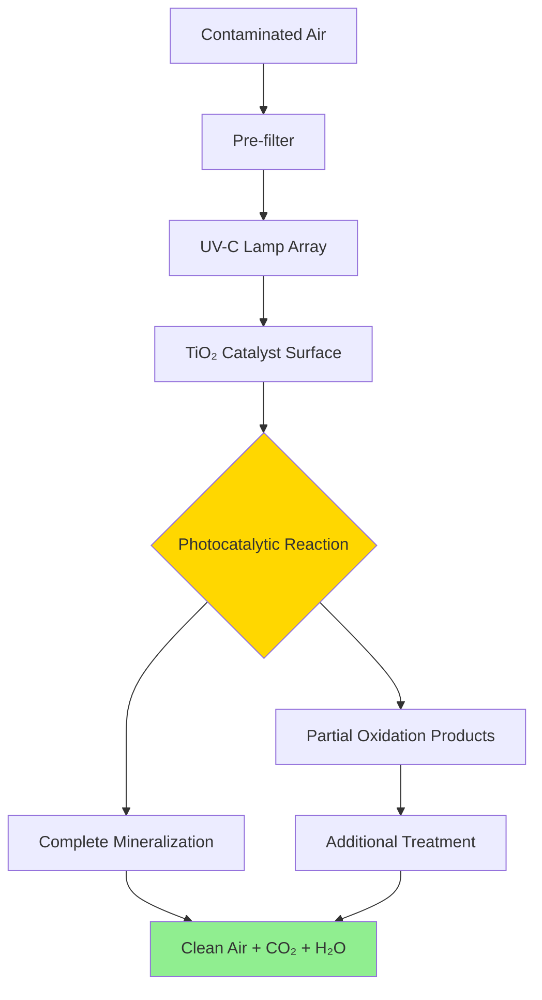

# Gaseous Contaminant Control Systems

Gaseous contaminant control addresses molecular-scale pollutants that particulate filters cannot capture. These systems remove volatile organic compounds (VOCs), odors, and chemical irritants through adsorption, oxidation, or photocatalytic destruction. Selection depends on contaminant type, concentration, required removal efficiency, and operational constraints.

## Physical Adsorption Mechanisms

### Activated Carbon Systems

Activated carbon removes gaseous contaminants through physical adsorption onto a high surface area matrix (800-1200 m²/g). Van der Waals forces attract and retain molecules within the microporous structure. Performance depends on:

**Carbon Properties:**
- Surface area and pore size distribution
- Particle size (4×6, 4×8, or 4×10 mesh typical)
- Bulk density (affects bed depth and pressure drop)
- Moisture content (water competes for adsorption sites)

**Operating Conditions:**
- Face velocity (typically 250-500 fpm)
- Bed depth (2-4 inches for HVAC applications)
- Relative humidity (performance degrades above 50% RH)
- Temperature (adsorption capacity decreases at elevated temperatures)

### Adsorption Isotherms

The relationship between adsorbate concentration and loading follows isotherm models:

**Langmuir Isotherm (monolayer coverage):**
```
q = (q_max × K × C) / (1 + K × C)

Where:
q = adsorbent loading (g contaminant/g carbon)
q_max = maximum adsorption capacity
K = adsorption equilibrium constant
C = contaminant concentration (mg/m³)
```

**Freundlich Isotherm (multilayer, heterogeneous surfaces):**
```
q = K_f × C^(1/n)

Where:
K_f = Freundlich constant
n = adsorption intensity factor (typically 1-10)
```

These isotherms predict carbon capacity at specific contaminant concentrations and enable sizing calculations for media beds.

### Breakthrough Analysis

Breakthrough occurs when the adsorption wave front reaches the outlet face, causing effluent concentration to rise. The breakthrough curve characterizes filter service life:

**Key Parameters:**
| Parameter | Definition | Significance |
|-----------|------------|--------------|
| Breakthrough point | Effluent reaches 5-10% of inlet | Media replacement threshold |
| Saturation point | Effluent equals inlet | Complete exhaustion |
| Mass transfer zone | Active adsorption region | Determines bed depth requirement |
| Service life | Time to breakthrough | Replacement frequency |

**Breakthrough Time Estimation:**
```
t_b = (ρ_b × V × q × W_f) / (Q × C_in)

Where:
t_b = breakthrough time (hours)
ρ_b = bulk density (g/L)
V = bed volume (L)
q = adsorption capacity (g/g)
W_f = working capacity factor (0.3-0.6)
Q = airflow rate (L/hr)
C_in = inlet concentration (g/L)
```


## Chemical Adsorption and Oxidation

### Impregnated Carbon

Standard activated carbon performs poorly on low molecular weight compounds (formaldehyde, ammonia, hydrogen sulfide). Impregnation with reactive chemicals enables chemisorption:

**Common Impregnants:**
- Potassium iodide (for mercury vapor)
- Sulfur compounds (for mercury and arsenic)
- Phosphoric acid (for ammonia)
- Metal oxides (for hydrogen sulfide)

### Potassium Permanganate Media

Alumina spheres impregnated with KMnO₄ oxidize contaminants through redox reactions rather than physical adsorption. The permanganate provides oxidation capacity that converts reduced sulfur compounds, aldehydes, and other oxidizable species to less harmful products.

**Advantages:**
- Effective at high humidity (no moisture penalty)
- Lower pressure drop than carbon at equivalent efficiency
- Long service life for aldehyde removal

**Limitations:**
- Higher initial cost
- Specific to oxidizable compounds
- Purple dust generation requires downstream filtration

## Photocatalytic Oxidation (PCO)

### UV-PCO System Design

Photocatalytic oxidation uses UV-C radiation (254 nm) to activate titanium dioxide (TiO₂) catalyst surfaces. Photon energy creates electron-hole pairs that generate hydroxyl radicals and superoxide ions. These reactive species oxidize organic compounds to CO₂ and H₂O.

**System Components:**
1. UV-C lamp array (germicidal wavelength)
2. TiO₂-coated substrate (honeycomb or pleated)
3. Catalyst surface area (30-50 m²/unit typical)
4. Residence time chamber (0.5-2 seconds)

**Performance Factors:**
- UV intensity at catalyst surface (mW/cm²)
- Catalyst loading and activation state
- Contaminant molecular structure (aromatics resist oxidation)
- Relative humidity (30-50% optimal)
- Air velocity through reactor (lower = better)



**Oxidation Kinetics:**
```
Rate = k × I^n × C / (1 + K_ads × C)

Where:
k = rate constant
I = UV intensity
n = light intensity order (0.5-1.0)
C = contaminant concentration
K_ads = adsorption constant
```

## Gas-Phase Filtration System Design

### Media Selection Matrix

| Contaminant Type | Activated Carbon | KMnO₄ Media | UV-PCO | Combined System |
|------------------|------------------|-------------|---------|-----------------|
| VOCs (high MW) | Excellent | Poor | Good | Excellent |
| Formaldehyde | Fair | Excellent | Excellent | Excellent |
| Ozone | Fair | Excellent | Poor | Good |
| Odors | Excellent | Fair | Good | Excellent |
| Acid gases | Fair (impregnated) | Excellent | Poor | Excellent |

### Configuration Strategies

**Series Arrangement:**
Particulate filter → Carbon → KMnO₄ → HEPA (if required)

Removes particles first (prevents media fouling), adsorbs VOCs, oxidizes reactive species, captures particulates from chemical media.

**Parallel Arrangement:**
Separate air streams treated by optimal media, then blended.

**Hybrid Systems:**
Carbon pre-adsorption → UV-PCO destruction → Polishing filter

Reduces peak loading on PCO reactor while achieving high destruction efficiency.

## ASHRAE 145.2 Testing Protocol

ASHRAE Standard 145.2 provides laboratory test methods for assessing gas-phase air-cleaning system performance. Key test parameters:

**Challenge Conditions:**
- Contaminant type and concentration
- Face velocity (typically 492 fpm)
- Temperature (73°F ± 2°F)
- Relative humidity (45% ± 5%)

**Performance Metrics:**
- Single-pass efficiency at multiple concentrations
- Breakthrough time to 50% efficiency
- Pressure drop throughout service life
- Byproduct generation (ozone, aldehydes)

Test results enable comparison between technologies and predict installed performance under defined operating conditions.

## VOC Removal Strategy Selection

### Decision Framework

**For Low Concentration, Broad Spectrum VOCs (<1 ppm):**
Standard activated carbon with adequate bed depth. Size for 6-12 month service life based on breakthrough calculations.

**For Formaldehyde and Low MW Aldehydes:**
Potassium permanganate media or UV-PCO systems. Carbon alone provides insufficient capacity.

**For High Humidity Environments (>60% RH):**
KMnO₄ media or UV-PCO. Standard carbon loses 40-60% capacity above 50% RH.

**For Ozone Removal:**
Activated carbon (unimpregnated) or manganese dioxide media. PCO systems may generate ozone as byproduct.

**For Maximum Removal Efficiency:**
Series configuration: Carbon → UV-PCO → KMnO₄. Initial adsorption reduces PCO loading, oxidation destroys adsorbed species and breakthrough contaminants, final oxidation stage captures residuals.

## Pressure Drop and Energy Considerations

Gas-phase filters add significant static pressure to air handling systems:

**Typical Pressure Drops:**
- 2-inch carbon bed: 0.3-0.6 in. w.g.
- 4-inch carbon bed: 0.6-1.2 in. w.g.
- KMnO₄ media: 0.2-0.4 in. w.g.
- UV-PCO reactor: 0.1-0.3 in. w.g.

**Fan Energy Impact:**
```
ΔPower = (Q × Δp) / (6356 × η)

Where:
ΔPower = additional fan power (hp)
Q = airflow (cfm)
Δp = additional pressure drop (in. w.g.)
η = fan efficiency (typically 0.65-0.75)
```

For a 10,000 cfm system with 1.0 in. w.g. added from gas-phase filtration:
```
ΔPower = (10,000 × 1.0) / (6356 × 0.70) = 2.25 hp

Annual energy cost = 2.25 hp × 0.746 kW/hp × 8760 hr × $0.12/kWh
                   = $1,770/year
```

This energy penalty must be balanced against contaminant removal benefits and occupant health impacts.

## Maintenance and Monitoring

**Carbon Bed Management:**
- Monitor pressure drop (20% increase indicates particle loading)
- Sample effluent concentration (breakthrough detection)
- Replace at 80% of predicted breakthrough time
- Dispose as hazardous waste if saturated with regulated compounds

**UV-PCO System Maintenance:**
- Measure UV intensity quarterly (replace lamps at 80% output)
- Inspect catalyst surface for fouling
- Monitor for ozone generation (should be <0.05 ppm)
- Clean or replace catalyst every 2-3 years

**KMnO₄ Media Indicators:**
- Color change from purple to brown (oxidation capacity depleted)
- Downstream particulate filter loading (media dusting)
- Replace when 50% of bed shows color change

Proper maintenance ensures consistent removal efficiency and prevents breakthrough events that expose occupants to elevated contaminant levels.
