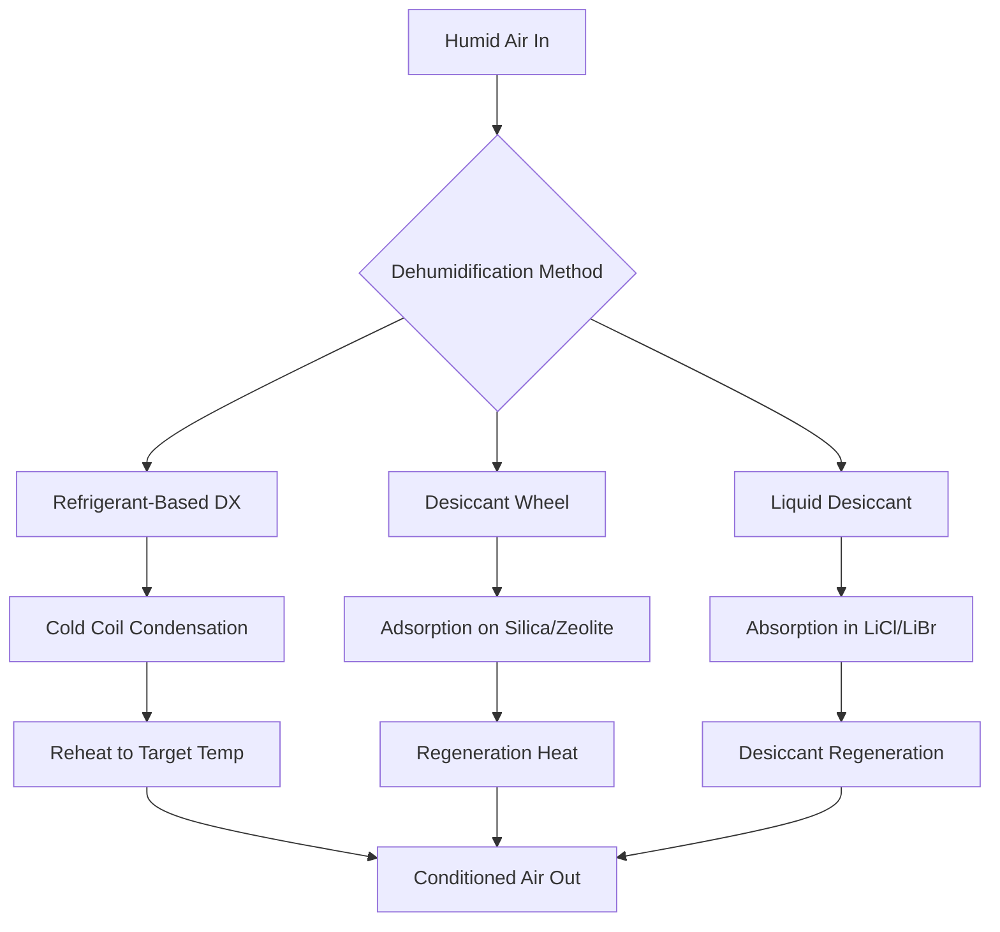
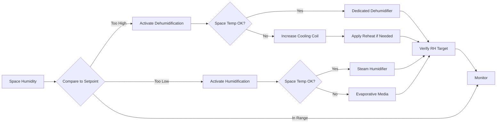

## Overview

Humidity control represents a critical aspect of indoor air quality management that directly impacts occupant health, comfort, building envelope integrity, and material preservation. Maintaining relative humidity within acceptable ranges prevents mold growth, dust mite proliferation, respiratory irritation, and structural degradation. ASHRAE Standard 62.1 recommends maintaining indoor relative humidity between 30% and 60% for most occupied spaces, with more stringent requirements for specific applications.

The physics of humidity control involves understanding psychrometric relationships, latent heat transfer, moisture generation rates, and the interaction between temperature and moisture content in air. Effective humidity management requires coordination between heating, cooling, ventilation, and dedicated moisture control equipment.

## Psychrometric Fundamentals

### Moisture Content Relationships

The relationship between dry-bulb temperature, relative humidity, and absolute humidity governs all humidity control strategies:

$$\phi = \frac{p_v}{p_{vs}} \times 100\%$$

Where:
- $\phi$ = relative humidity (%)
- $p_v$ = partial pressure of water vapor (Pa)
- $p_{vs}$ = saturation vapor pressure at dry-bulb temperature (Pa)

The humidity ratio (absolute humidity) quantifies actual moisture content:

$$W = 0.622 \times \frac{p_v}{p_{atm} - p_v}$$

Where:
- $W$ = humidity ratio (kg water/kg dry air)
- $p_{atm}$ = atmospheric pressure (Pa)

Dew point temperature indicates the temperature at which condensation occurs when air is cooled at constant pressure and humidity ratio. This parameter proves essential for preventing condensation on building surfaces and within HVAC equipment.

## Health and Comfort Impacts

### Relative Humidity Effects on IAQ

| RH Range | Health Effects | Material Effects | Biological Growth |
|----------|----------------|------------------|-------------------|
| < 20% | Dry mucous membranes, static electricity, eye irritation | Wood shrinkage, paint cracking | Minimal microbial activity |
| 20-30% | Reduced respiratory defenses, increased infection susceptibility | Acceptable for most materials | Low dust mite populations |
| 30-50% | Optimal respiratory function, reduced infection transmission | Stable dimensional behavior | Minimal mold, low dust mites |
| 50-60% | Acceptable comfort, slight perception of moisture | Acceptable for conditioned spaces | Moderate dust mite activity |
| 60-70% | Perceived stuffiness, reduced evaporative cooling | Hygroscopic material absorption | Active mold growth begins |
| > 70% | Respiratory discomfort, allergen proliferation | Corrosion, decay, dimensional changes | Rapid mold/bacteria growth |

ASHRAE Standard 55 establishes comfort zones based on the intersection of temperature and humidity. At 50% RH, the comfort range extends from approximately 68°F to 76°F for typical clothing and metabolic rates.

### Pathogen Survival and Humidity

Research demonstrates that relative humidity significantly influences airborne pathogen survival. Most respiratory viruses show minimum survival rates between 40-60% RH. Below 30% RH, viral particles remain airborne longer and retain infectivity. Above 60% RH, bacterial growth accelerates on surfaces and in building materials.

## Moisture Sources and Loads

### Internal Moisture Generation

Occupant metabolic processes generate significant moisture loads:

$$\dot{m}_{occupant} = 0.04 \text{ to } 0.08 \text{ kg/hr per person}$$

The specific rate depends on activity level, with sedentary activities at the lower end and moderate physical work at the upper range.

Additional internal sources include:
- Cooking activities: 1.5-3.0 kg/hr (residential kitchens)
- Bathing/showering: 0.5-1.0 kg/hr
- Clothes washing/drying: 0.2-2.0 kg/hr
- Indoor plants: 0.01-0.05 kg/hr per plant
- Aquariums: 0.5-2.0 kg/day per 100 liters

### External Moisture Infiltration

Moisture enters buildings through air infiltration and vapor diffusion:

$$\dot{m}_{inf} = \rho_{air} \times Q_{inf} \times (W_{out} - W_{in})$$

Where:
- $\rho_{air}$ = air density (kg/m³)
- $Q_{inf}$ = infiltration airflow rate (m³/s)
- $W_{out}$, $W_{in}$ = outdoor and indoor humidity ratios

Vapor diffusion through building envelope assemblies contributes additional moisture transfer, particularly in climates with significant indoor-outdoor vapor pressure differentials.

## Dehumidification Strategies

### Cooling-Based Dehumidification

Standard cooling coils remove moisture when surface temperature falls below the dew point of entering air:

$$\dot{Q}_{latent} = \dot{m}_{air} \times h_{fg} \times (W_{in} - W_{out})$$

Where:
- $\dot{Q}_{latent}$ = latent cooling capacity (kW)
- $\dot{m}_{air}$ = air mass flow rate (kg/s)
- $h_{fg}$ = latent heat of vaporization (2450 kJ/kg at standard conditions)

Sensible heat ratio (SHR) indicates the proportion of total cooling capacity devoted to temperature reduction versus moisture removal:

$$SHR = \frac{\dot{Q}_{sensible}}{\dot{Q}_{sensible} + \dot{Q}_{latent}}$$

Standard DX coils operate with SHR values of 0.70-0.80. Applications requiring enhanced dehumidification employ coils with SHR as low as 0.50-0.60.

### Dedicated Dehumidification Equipment

**Refrigerant-Based Systems**: Dedicated outdoor air systems (DOAS) precondition ventilation air to specific humidity levels before mixing with recirculated air. These systems typically deliver air at 45-55°F and 40-50% RH, requiring downstream reheating for comfort delivery.

**Desiccant Dehumidifiers**: Rotating desiccant wheels transfer moisture from process air to regeneration airstream. Silica gel and molecular sieve media operate effectively at dew points below 40°F where cooling coils lose efficiency. Regeneration requires heat input at 180-250°F.

**Liquid Desiccant Systems**: Lithium chloride or lithium bromide solutions absorb moisture from air through direct contact. These systems achieve lower humidity levels than cooling-based methods and facilitate heat recovery from regeneration processes.

## Humidification Strategies

### Evaporative Humidification

Direct evaporation introduces moisture while cooling air adiabatically along constant enthalpy lines on the psychrometric chart. This process proves energy-efficient but reduces dry-bulb temperature:

$$\Delta T = \frac{h_{fg} \times (W_{final} - W_{initial})}{c_{p,air}}$$

Where $c_{p,air}$ = specific heat of air (1.006 kJ/kg·K)

Steam humidification adds both moisture and sensible heat, increasing enthalpy:

$$\dot{Q}_{total} = \dot{m}_{steam} \times (h_{steam} - h_{water,makeup})$$

### Humidification Technologies

| Technology | Efficiency | Control Precision | Hygiene Risk | Application |
|------------|-----------|-------------------|--------------|-------------|
| Steam Grid | 95-100% | Excellent (±2% RH) | Low | Hospitals, museums, labs |
| Steam-to-Steam | 95-100% | Excellent (±2% RH) | Very Low | Clean rooms, pharmaceuticals |
| Electrode Boiler | 96-99% | Excellent (±3% RH) | Low | Commercial buildings |
| Ultrasonic | 70-90% | Good (±5% RH) | Moderate | Residential, light commercial |
| Evaporative Media | 80-95% | Fair (±5-10% RH) | Moderate-High | Industrial, air handlers |
| Atomizing Nozzle | 75-90% | Good (±5% RH) | Moderate | Process applications |

Steam-based systems eliminate biological contamination risks but consume significant energy. Evaporative methods offer lower operating costs but require water treatment and regular maintenance to prevent microbial growth.

## Control Strategies

### Humidity Sensing and Setpoints

Accurate humidity measurement requires proper sensor placement away from direct moisture sources and thermal gradients. Capacitive sensors provide ±2-3% RH accuracy suitable for most HVAC applications. Chilled mirror hygrometers achieve ±0.1% accuracy for critical environments.

Control setpoints balance competing objectives:

**Winter Humidification**: Limit indoor RH to prevent condensation on coldest interior surfaces. The maximum safe humidity ratio follows:

$$W_{max} = W_{sat}(T_{surface,min})$$

For typical construction with double-pane windows, this yields maximum RH of 25-35% at outdoor temperatures below 20°F.

**Summer Dehumidification**: Maintain RH below 60% to prevent mold growth while minimizing energy consumption. Dedicated dehumidification may activate when space cooling loads alone cannot achieve humidity targets.

### Integrated System Coordination

Modern building automation systems modulate multiple components simultaneously: supply air temperature, ventilation rates, dehumidification equipment, and humidification output. Predictive control algorithms anticipate humidity changes based on occupancy schedules, weather forecasts, and historical patterns.

## Energy Considerations

Humidity control significantly impacts HVAC energy consumption. Dehumidification requires cooling energy plus potential reheat to maintain comfort temperatures. Humidification demands steam generation or water evaporation energy.

The coefficient of performance for dehumidification via cooling and reheat:

$$COP_{dehum} = \frac{\dot{m}_{water} \times h_{fg}}{\dot{Q}_{cooling} + \dot{Q}_{reheat}}$$

Typical values range from 1.0-2.5, substantially lower than sensible cooling COP of 3.0-5.0. Energy recovery systems capture waste heat from dehumidification for reheat or preheating outdoor air, improving overall efficiency by 20-40%.

## Standards and Guidelines

ASHRAE Standard 62.1 specifies ventilation rates but defers humidity limits to other standards. ASHRAE Standard 55 defines acceptable humidity ranges for thermal comfort: 0.012 kg/kg maximum humidity ratio and dew point temperatures not exceeding 62°F.

Specific applications require stricter control:
- **Museums/Archives**: 45-55% RH ±5% per ASHRAE Handbook - HVAC Applications
- **Hospitals**: 30-60% RH per ASHRAE Standard 170
- **Data Centers**: 40-60% RH per ASHRAE TC 9.9 guidelines
- **Pharmaceutical Manufacturing**: 35-65% RH per FDA/cGMP requirements

Building codes increasingly mandate humidity control provisions. The International Energy Conservation Code (IECC) requires dedicated dehumidification capabilities in humid climates (Climate Zones 1A, 2A, 3A).

## Conclusion

Humidity control serves as a fundamental IAQ parameter affecting health, comfort, and building durability. Effective implementation requires understanding psychrometric principles, accurate load calculation, appropriate equipment selection, and integrated control strategies. The energy penalty for humidity control necessitates efficient system design incorporating heat recovery and demand-based operation. Compliance with ASHRAE standards ensures acceptable indoor environments across diverse building types and climate zones.
