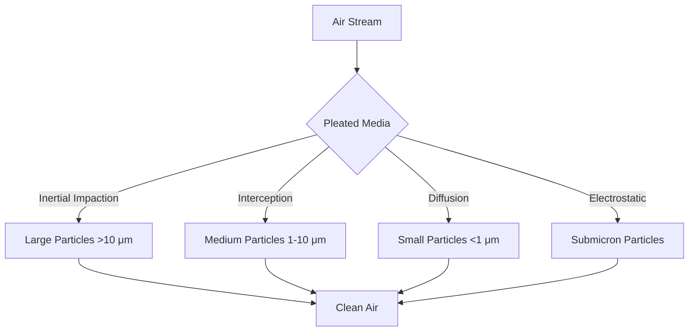
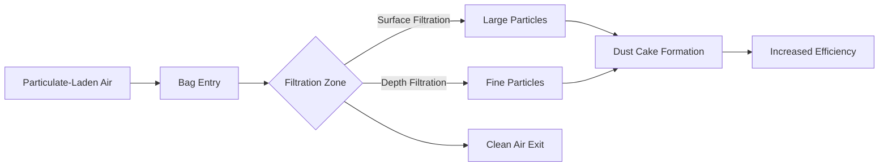
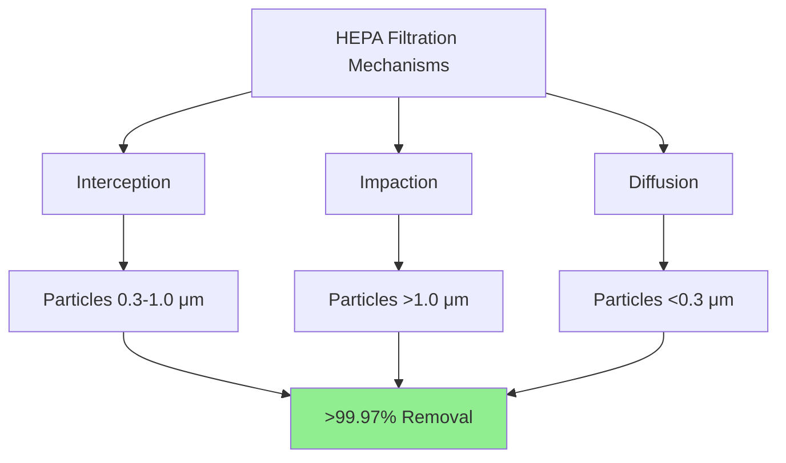

## Filter Construction Categories

Air filters are classified by construction method, which directly influences filtration efficiency, pressure drop, dust-holding capacity, and service life. Understanding construction differences enables proper selection for specific applications and operating conditions.

## Panel Filters

Panel filters represent the simplest filter construction, consisting of a flat media pack held within a rigid frame.

### Construction Characteristics

**Media Types:**
- Fiberglass mat (low-efficiency applications)
- Polyester synthetic fiber
- Electrostatically charged synthetic media
- Metal mesh (washable/reusable types)

**Frame Materials:**
- Cardboard (disposable, MERV 1-4)
- Galvanized steel (industrial applications)
- Aluminum (corrosion resistance)
- Molded plastic (moisture resistance)

**Typical Dimensions:**
- Standard: 20" × 20", 20" × 25", 24" × 24"
- Thickness: 1" to 2"
- Limited media area equals low dust capacity

### Performance Range

| Parameter | Low-Efficiency | Medium-Efficiency |
|-----------|---------------|-------------------|
| MERV Rating | 1-4 | 5-8 |
| Initial Δp | 0.05-0.10 in. w.g. | 0.15-0.30 in. w.g. |
| Dust Capacity | 50-150 g | 150-300 g |
| Particle Removal (0.3-1.0 μm) | <20% | 20-35% |
| Service Life | 1-3 months | 2-4 months |

### Applications

- Residential HVAC systems (MERV 1-8)
- Pre-filtration in multi-stage systems
- Light commercial applications with low particulate loads
- Equipment protection (coil protection)

## Pleated Filters

Pleated construction increases media area within the same face dimensions by folding the media into accordion-like pleats. This configuration provides superior dust-holding capacity and service life compared to panel filters.

### Construction Features

**Pleat Geometry:**
- Pleat height: 0.5" to 3" (depth determines media area)
- Pleat spacing: 12-24 pleats per foot
- Media support: Metal wire or plastic grid prevents pleat collapse

**Media Options:**
- Synthetic fiberglass blends (MERV 8-13)
- Electrostatically charged media (enhanced efficiency)
- Cotton-polyester blends (MERV 7-10)

### Performance Characteristics

**Comparative Performance:**

| Depth | Media Area Ratio | MERV Range | Typical Δp | Dust Capacity |
|-------|------------------|------------|------------|---------------|
| 1" | 3-4× panel | 7-10 | 0.20-0.35 in. w.g. | 250-400 g |
| 2" | 6-8× panel | 8-11 | 0.25-0.45 in. w.g. | 400-600 g |
| 4" | 12-16× panel | 11-14 | 0.30-0.60 in. w.g. | 800-1200 g |

### Applications

- Commercial HVAC systems (standard efficiency)
- Residential high-efficiency upgrades
- General office and retail environments
- Healthcare non-critical areas

## Bag Filters

Bag filters utilize pockets of media extending downstream from the filter frame, maximizing media area and dust-holding capacity. This design provides the highest dust capacity among sub-HEPA filters.

### Construction Details

**Bag Configuration:**
- Number of pockets: 3 to 12 per filter
- Pocket depth: 12" to 36"
- Header attachment: Welded, stitched, or sonic-bonded seams
- Support: Internal wire supports maintain bag shape under airflow

**Media Selection:**
- Synthetic microfiber (MERV 13-15)
- Multi-layer lofted media
- Progressive density media (surface loading to depth loading)

### Performance Specifications

| Pockets | Depth | Media Area | MERV | Initial Δp | Dust Capacity |
|---------|-------|------------|------|------------|---------------|
| 6 | 24" | 45-55 ft² | 13-14 | 0.50-0.70 in. w.g. | 1500-2500 g |
| 8 | 24" | 60-70 ft² | 14-15 | 0.55-0.75 in. w.g. | 2000-3000 g |
| 6 | 36" | 65-80 ft² | 13-14 | 0.45-0.65 in. w.g. | 2500-3500 g |

### Collection Mechanisms

### Applications

- Hospital non-critical areas (MERV 13-14)
- Pharmaceutical manufacturing (pre-filtration)
- Clean room pre-filtration stages
- Commercial buildings requiring high IAQ
- Data centers and electronics manufacturing

## Cartridge Filters

Cartridge filters employ cylindrical or conical media configurations, primarily used in industrial dust collection and specialized HVAC applications.

### Design Variations

**Cylindrical Cartridges:**
- Media: Cellulose, polyester, or spunbond
- Pleat count: 150-300 pleats
- Filtration area: 20-150 ft² per cartridge
- End caps: Metal or plastic with gasket seal

**Panel-Style Cartridges:**
- Rigid frame with extended pleats
- Used in compact filter housings
- MERV 11-15 typical range

### Performance and Maintenance

**Operating Characteristics:**
- Initial pressure drop: 0.3-0.8 in. w.g.
- Replacement threshold: 2.0-3.0 in. w.g.
- Cleaning: Some designs allow pulse-jet cleaning
- Service life: 6-24 months depending on loading

### Applications

- Industrial ventilation systems
- Dust collection pre-filtration
- Process air filtration
- High-volume low-pressure applications

## HEPA Filters

High-Efficiency Particulate Air (HEPA) filters represent the highest efficiency class for mechanical filtration, removing ≥99.97% of particles at 0.3 μm (most penetrating particle size).

### Construction Standards

**Media Composition:**
- Microglass fiber paper
- Submicron fiber diameter (0.5-2.0 μm)
- Depth: 0.3-0.5 mm compressed
- Binder content: 5-15% for structural integrity

**Assembly Requirements:**
- Separator material: Aluminum corrugated, hot-melt adhesive
- Frame: Particle board, metal, or plastic
- Seal: Polyurethane or neoprene gasket
- Quality assurance: 100% factory tested per MIL-STD-282 or equivalent

### Filtration Physics

### Performance Specifications

| Standard | Efficiency at MPPS | Typical Δp | Velocity | Application |
|----------|-------------------|------------|----------|-------------|
| HEPA (Type A) | 99.97% @ 0.3 μm | 0.8-1.2 in. w.g. | 250 fpm | Healthcare critical |
| HEPA (Type B) | 99.97% @ 0.3 μm | 1.0-1.5 in. w.g. | 300 fpm | Pharmaceutical |
| ULPA | 99.999% @ 0.12 μm | 1.2-2.0 in. w.g. | 250 fpm | Semiconductor |

### Critical Applications

- Hospital operating rooms and isolation rooms
- Pharmaceutical clean rooms (ISO Class 5-7)
- Semiconductor manufacturing
- Biosafety laboratories (BSL-3, BSL-4)
- Nuclear facilities

## Selection Criteria Matrix

| Factor | Panel | Pleated | Bag | Cartridge | HEPA |
|--------|-------|---------|-----|-----------|------|
| Initial Cost | $ | $$ | $$$ | $$-$$$ | $$$$ |
| Operating Cost | High | Medium | Low | Medium | High |
| Efficiency Range | MERV 1-8 | MERV 7-14 | MERV 13-15 | MERV 11-15 | MERV 17-20 |
| Dust Capacity | Very Low | Medium | Very High | High | Low |
| Space Required | Minimal | Minimal | Moderate | Moderate | Significant |
| Maintenance Frequency | Monthly | Quarterly | Semi-Annual | Quarterly | Annual |
| Pressure Drop | Low | Medium | Medium-High | Medium | High |

## Design Considerations

**Airflow Requirements:**
- Face velocity limits prevent media damage
- Panel/Pleated: 300-500 fpm maximum
- Bag: 250-350 fpm recommended
- HEPA: 250 fpm standard (critical applications)

**Filter Housing:**
- Access door sizing for filter replacement
- Manometer ports for pressure drop monitoring
- Gasket contact surface flatness (HEPA: ≤0.062")
- Bypass prevention (100% airflow through media)

**System Integration:**
- Pre-filtration extends final filter life
- MERV 7-8 before MERV 13-15 recommended
- MERV 11-13 before HEPA mandatory
- Pressure drop monitoring for timely replacement

## References

- ASHRAE Handbook—HVAC Systems and Equipment, Chapter 29: Air Cleaners for Particulate Contaminants
- ASHRAE Standard 52.2: Method of Testing General Ventilation Air-Cleaning Devices for Removal Efficiency by Particle Size
- ISO 16890: Air filters for general ventilation
- MIL-STD-282: Filter Units, Protective Clothing, Gas Mask Components and Related Products: Performance-Test Methods

