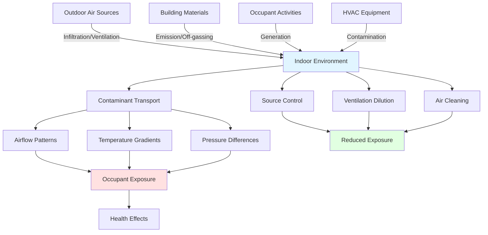
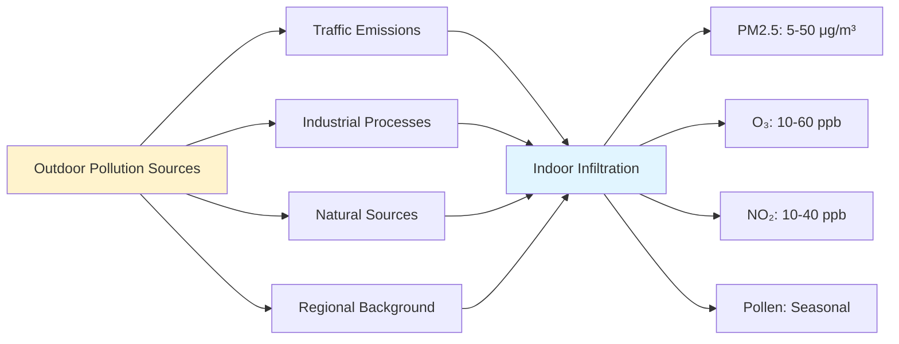
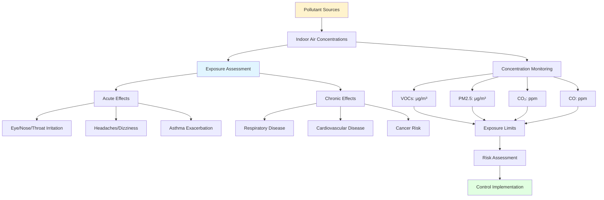

## Overview of Indoor Pollutant Sources

Indoor air quality depends on identifying and controlling pollutant sources that continuously introduce contaminants into building spaces. ASHRAE 62.1 establishes that source control represents the most effective and energy-efficient strategy for maintaining acceptable indoor air quality, prioritizing elimination or reduction of pollutants at their origin before dilution ventilation becomes necessary.

Indoor pollutants originate from four primary categories: building materials and furnishings, occupant activities, mechanical equipment and systems, and outdoor air infiltration. Each source category contributes distinct contaminant profiles requiring specific control approaches based on pollutant type, emission rate, and health impact.

## Major Pollutant Categories and Sources

### Volatile Organic Compounds (VOCs)

VOCs represent the largest group of indoor air pollutants, encompassing hundreds of individual compounds with emission rates ranging from micrograms to milligrams per square meter per hour.

**Primary VOC Sources:**

| Source Category | Specific Sources | Common VOCs | Emission Duration |
|----------------|------------------|-------------|-------------------|
| Building Materials | Paints, adhesives, sealants | Formaldehyde, toluene, xylene | Weeks to months |
| Flooring | Carpet, vinyl, laminates | 4-PCH, styrene, acetaldehyde | Months to years |
| Furnishings | Furniture, upholstery, drapes | Formaldehyde, benzene, limonene | Months to years |
| Cleaning Products | Disinfectants, floor cleaners | Chloroform, perchloroethylene | Hours during use |
| Personal Care | Fragrances, cosmetics | Limonene, ethanol, acetone | Hours during use |
| Office Equipment | Printers, copiers | Toluene, styrene, phenol | Continuous during operation |

VOC emission rates follow exponential decay curves, with highest concentrations occurring immediately after installation or application, decreasing by 50-90% within the first month for most materials.

### Particulate Matter

Particulate pollution includes solid and liquid particles ranging from 0.01 to 100 micrometers in diameter, with health impacts inversely proportional to particle size.

**Particulate Matter Sources:**

| Particle Size | Sources | Composition | Primary Health Concern |
|--------------|---------|-------------|----------------------|
| PM10 (≤10 μm) | Resuspension, outdoor infiltration | Dust, pollen, mold spores | Upper respiratory irritation |
| PM2.5 (≤2.5 μm) | Combustion, cooking, outdoor sources | Soot, organic compounds | Deep lung penetration |
| PM1.0 (≤1.0 μm) | Combustion, condensation | Ultrafine particles, acids | Systemic circulation |
| PM0.1 (≤0.1 μm) | High-temperature processes | Nanoparticles, metallic compounds | Cellular and neurological effects |

Indoor particle concentrations typically range from 10-50 μg/m³ for PM2.5 in residential buildings, with peaks exceeding 200 μg/m³ during cooking or cleaning activities.

### Bioaerosols

Biological contaminants include microorganisms, allergens, and organic compounds produced by living organisms or biological decay processes.

**Common Bioaerosol Sources:**

- **Occupants:** Bacteria, viruses, skin flakes, hair (emission rate: 10⁶-10⁷ particles per person per hour)
- **HVAC Systems:** Bacterial growth in cooling coils, condensate pans, humidifiers
- **Water-Damaged Materials:** Mold spores, mycotoxins, bacterial endotoxins
- **Pets:** Dander, allergen proteins (primary source of Can f 1, Fel d 1 allergens)
- **Plants:** Pollen, fungal spores from soil
- **Outdoor Infiltration:** Fungal spores, pollen (concentrations: 100-10,000 spores/m³)

Relative humidity above 60% accelerates microbial growth on porous materials, with mold colonization occurring within 24-48 hours on wet surfaces.

### Combustion Products

Incomplete combustion generates carbon monoxide, nitrogen dioxide, sulfur dioxide, and fine particulate matter containing polycyclic aromatic hydrocarbons.

**Indoor Combustion Sources:**

| Source | Primary Pollutants | Typical Concentrations | Control Requirements |
|--------|-------------------|----------------------|---------------------|
| Gas Cooking | NO₂, CO, PM2.5 | 200-2000 μg/m³ NO₂ | Range hood exhaust ≥100 cfm |
| Fireplaces | CO, PM2.5, PAHs | 50-500 μg/m³ PM2.5 | Direct venting, sealed combustion |
| Gas Water Heaters | CO, NO₂ | 5-35 ppm CO (if backdrafting) | Sealed combustion, proper venting |
| Tobacco Smoking | 4000+ compounds | PM2.5: 200-1000 μg/m³ | Complete prohibition or dedicated exhaust |
| Candles/Incense | PM2.5, VOCs, PAHs | 50-300 μg/m³ PM2.5 | Ventilation, elimination |

Carbon monoxide concentrations above 9 ppm (8-hour average) or 35 ppm (1-hour average) exceed EPA National Ambient Air Quality Standards.

## Pollutant Pathways and Interactions

## Outdoor Air as Pollutant Source

Outdoor air introduces pollutants through mechanical ventilation systems and building envelope infiltration, with concentrations varying by location, season, and meteorological conditions.

**Common Outdoor Pollutants:**

Outdoor-to-indoor pollutant ratios vary by contaminant: PM2.5 (0.5-0.8), ozone (0.1-0.4), and NO₂ (0.4-0.8), with lower ratios indicating greater attenuation by building envelope and filtration systems.

## Building Materials and Off-Gassing

New building materials emit VOCs through evaporation and chemical reactions, with emission rates governed by material composition, temperature, humidity, and air velocity across surfaces.

**Emission Decay Characteristics:**

Most building materials follow first-order decay kinetics:

**E(t) = E₀ × e^(-kt)**

Where:
- E(t) = emission rate at time t (μg/m²/h)
- E₀ = initial emission rate (μg/m²/h)
- k = decay constant (h⁻¹)
- t = time since installation (h)

Half-lives range from 24-168 hours for water-based paints to 1000-5000 hours for composite wood products containing urea-formaldehyde resins.

## Source Control Strategies

### Material Selection

**Low-Emission Material Criteria:**

| Material Category | Emission Standard | Testing Protocol | Maximum Limits |
|------------------|-------------------|------------------|----------------|
| Paints/Coatings | CDPH Standard Method v1.2 | Small chamber test | ≤0.5 mg/m³ TVOC at 14 days |
| Composite Wood | CARB Phase 2 | ASTM E1333 | ≤0.05 ppm formaldehyde |
| Flooring | FloorScore | CDPH v1.2 | ≤0.5 mg/m³ TVOC at 14 days |
| Adhesives/Sealants | SCAQMD Rule 1168 | EPA Method 24 | 50-250 g/L VOC content |

### Activity-Based Controls

**Pollutant-Specific Control Measures:**

- **Combustion Sources:** Eliminate unvented combustion appliances, install sealed-combustion equipment, provide dedicated outdoor air for combustion makeup
- **Moisture Sources:** Maintain 30-50% relative humidity, repair leaks within 24 hours, use exhaust ventilation in bathrooms and kitchens
- **Cleaning Activities:** Use Green Seal certified products, implement wet cleaning methods for particle control, schedule during unoccupied periods
- **Office Equipment:** Locate high-emission devices in separately ventilated rooms, specify low-emission equipment

### HVAC System Contamination Prevention

**Critical Control Points:**

1. **Cooling Coils:** Maintain ≥10°F approach temperature to prevent moisture carryover, slope drain pans ≥1/8 in per foot
2. **Condensate Pans:** Install UV lights (minimum 0.5 W/ft² coil face area) or apply antimicrobial coatings
3. **Filtration Media:** Replace per manufacturer schedule, inspect for bypass, maintain face velocity ≤500 fpm
4. **Humidification Systems:** Use steam injection, avoid wetted media systems, maintain water treatment
5. **Ductwork:** Seal to SMACNA Class A leakage, install access doors every 20 feet for inspection

### Ventilation Isolation

Spaces with high pollutant generation require dedicated exhaust to prevent contaminant migration:

**Recommended Pressure Differentials:**

| Space Type | Pressure Relative to Adjacent | Minimum Air Changes | Exhaust Requirements |
|-----------|------------------------------|-------------------|---------------------|
| Restrooms | -5 Pa minimum | 6-10 ACH | 100% exhaust, no recirculation |
| Copy/Print Rooms | -2.5 Pa minimum | 10-15 ACH | Dedicated exhaust |
| Laboratories | -2.5 to -10 Pa | 6-12 ACH | 100% exhaust |
| Kitchens | -5 Pa minimum | 15-20 ACH | Hood capture velocity ≥100 fpm |

## Health Effects and Exposure Assessment

**EPA Indoor Air Quality Guidelines:**

- **Formaldehyde:** ≤0.1 ppm (NIOSH REL ceiling)
- **PM2.5:** ≤35 μg/m³ (24-hour average)
- **CO:** ≤9 ppm (8-hour average)
- **NO₂:** ≤0.05 ppm (annual average)
- **Radon:** ≤4 pCi/L (EPA action level)

## Implementation Hierarchy

Source control effectiveness follows a hierarchical approach consistent with industrial hygiene principles:

1. **Elimination:** Remove or prohibit pollutant sources (most effective)
2. **Substitution:** Replace high-emission materials with low-emission alternatives
3. **Engineering Controls:** Install local exhaust ventilation, seal emission surfaces
4. **Administrative Controls:** Schedule high-emission activities during unoccupied periods
5. **Dilution Ventilation:** Increase outdoor air ventilation rates (least effective, highest energy cost)

Implementing source control at the top of this hierarchy achieves 80-95% pollutant reduction compared to 30-70% reduction from dilution ventilation alone, while reducing HVAC energy consumption by 20-40% through lower ventilation requirements.

## References

- ASHRAE Standard 62.1-2022: Ventilation for Acceptable Indoor Air Quality
- EPA Indoor Air Quality Guidelines and Standards
- California Department of Public Health Standard Method v1.2
- CARB Composite Wood Products Regulation
- ASHRAE Fundamentals Handbook, Chapter 11: Air Contaminants
