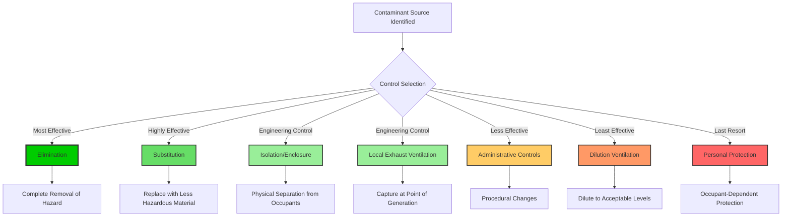
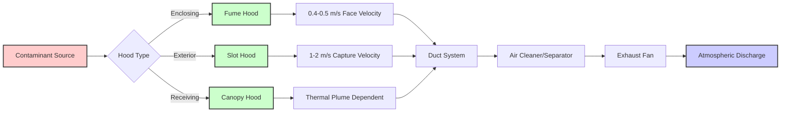

# Source Control Strategies for Indoor Air Quality

Source control represents the most effective and economical approach to indoor air quality management by preventing contaminants from entering occupied spaces rather than attempting removal after release. The industrial hygiene hierarchy of controls provides the framework for systematic contaminant management through elimination, substitution, engineering controls, administrative controls, and personal protective equipment.

## Hierarchy of Control Effectiveness

The control hierarchy prioritizes intervention strategies based on effectiveness and reliability. Higher-level controls provide inherently more reliable protection than lower-level interventions.

## Control Method Effectiveness and Cost Analysis

Different source control strategies provide varying levels of protection, capital investment, and operational costs. Selection requires balancing effectiveness against economic and practical constraints.

| Control Method | Effectiveness | Capital Cost | Operating Cost | Reliability | Implementation Complexity |
|----------------|---------------|--------------|----------------|-------------|--------------------------|
| **Elimination** | 100% | Low-Medium | None | Highest | Low-Medium |
| **Substitution** | 80-100% | Low-High | Similar to baseline | High | Medium |
| **Isolation/Enclosure** | 90-99% | Medium-High | Low | High | Medium-High |
| **Local Exhaust** | 70-95% | Medium-High | Medium-High | Medium-High | Medium-High |
| **Administrative** | 40-70% | Low | Medium | Low-Medium | Low-Medium |
| **Dilution Ventilation** | 30-60% | Medium | High | Medium | Medium |
| **Personal Protection** | 50-90% | Low | Medium | Low | Low |

## Elimination Strategy

Elimination removes the contaminant source entirely, providing absolute control without ongoing operational costs. This approach requires analysis of process requirements to identify unnecessary emission sources.

### Implementation Methods

**Process Redesign**: Modify operations to eliminate hazardous steps. Example: Replace solvent-based cleaning with aqueous ultrasonic cleaning eliminates VOC emissions while improving cleaning effectiveness.

**Material Phase-Out**: Remove high-emission materials from building inventory. Example: Eliminate mercury-containing fluorescent lamps in favor of LED lighting eliminates mercury vapor hazard.

**Activity Relocation**: Move emission-generating activities to outdoor locations or unoccupied spaces. Example: Relocate diesel generator testing to outdoor area eliminates indoor particulate and NOx exposure.

The economic benefit of elimination:

$$NPV_{elim} = \sum_{t=1}^{n} \frac{C_{vent,t} + C_{health,t} + C_{liability,t}}{(1+r)^t} - C_{redesign}$$

Where:
- $NPV_{elim}$ = net present value of elimination (currency)
- $C_{vent,t}$ = avoided ventilation costs in year $t$
- $C_{health,t}$ = avoided health-related costs
- $C_{liability,t}$ = avoided liability/compliance costs
- $C_{redesign}$ = one-time process redesign cost
- $r$ = discount rate
- $n$ = analysis period (years)

## Substitution Strategy

Substitution replaces hazardous materials with less hazardous alternatives that perform equivalent functions. ASHRAE 62.1 IAQ Procedure explicitly credits source substitution in calculating required outdoor air rates.

### Material Selection Criteria

**Low-VOC Materials**: Select products meeting California Section 01350 or CDPH Standard Method v1.2 emission limits. These standards establish chamber testing protocols limiting emissions to:

| Material Category | Formaldehyde (µg/m²·h) | Total VOC (µg/m²·h) | Test Duration |
|-------------------|------------------------|---------------------|---------------|
| Flooring | 16.5 | 500 | 14 days |
| Ceiling/Wall Panels | 16.5 | 500 | 14 days |
| Insulation | 16.5 | 500 | 14 days |
| Furniture/Seating | 11.0 | 330 | 14 days |
| Adhesives/Sealants | 50 | 1500 | 14 days |

**GreenGuard Certification**: Third-party verified low-emission products meeting chemical emission limits for volatile organic compounds and formaldehyde. Gold certification requires stricter limits suitable for schools and healthcare.

**Refrigerant Selection**: Substitute high-GWP refrigerants with lower-GWP alternatives meeting safety and performance requirements per ASHRAE Standard 34. Transition from R-410A (GWP 2088) to R-32 (GWP 675) or R-454B (GWP 466) reduces climate impact while eliminating future regulatory compliance issues.

The emission reduction from substitution:

$$\Delta E = (E_{baseline} - E_{substitute}) \cdot A \cdot t$$

Where:
- $\Delta E$ = total emission reduction (mg)
- $E_{baseline}$ = baseline material emission rate (mg/m²·h)
- $E_{substitute}$ = substitute material emission rate (mg/m²·h)
- $A$ = material surface area (m²)
- $t$ = exposure period (h)

## Isolation and Enclosure

Isolation physically separates contaminant sources from occupied spaces through barriers, containment, or dedicated enclosures. This strategy proves particularly effective for unavoidable emission sources.

### Isolation Methods

**Room Pressurization**: Maintain pressure differentials to prevent contaminant migration. Contaminated spaces operate at negative pressure relative to adjacent clean spaces:

$$\Delta P = 1.29 \times 10^{-3} \cdot \frac{Q^2}{A_{leak}^2}$$

Where:
- $\Delta P$ = pressure differential (Pa)
- $Q$ = makeup air leakage flow (L/s)
- $A_{leak}$ = effective leakage area (m²)

Target pressure differentials: 2.5-5 Pa for general isolation, 5-12.5 Pa for critical containment.

**Physical Enclosures**: Isolate equipment or processes within sealed enclosures exhausted to outdoors. Enclosure effectiveness depends on capture efficiency and face velocity:

$$\eta_{capture} = 1 - e^{-V_f \cdot t / L}$$

Where:
- $\eta_{capture}$ = contaminant capture efficiency (fraction)
- $V_f$ = face velocity at enclosure opening (m/s)
- $t$ = contaminant residence time (s)
- $L$ = characteristic enclosure dimension (m)

**Vestibules and Airlocks**: Create pressure buffer zones between contaminated and clean areas with sequential door operation preventing simultaneous opening.

## Local Exhaust Ventilation

Local exhaust ventilation (LEV) captures contaminants at the point of generation before mixing with room air. Properly designed LEV systems achieve 70-95% capture efficiency while exhausting only 5-20% of the volumetric flow required for equivalent dilution ventilation.

### LEV Design Fundamentals

**Capture Velocity**: The minimum air velocity at the contaminant source required to overcome opposing air currents and draw contaminants into the hood. Required capture velocity depends on contaminant generation characteristics:

| Release Condition | Capture Velocity (m/s) | Example Application |
|-------------------|------------------------|---------------------|
| Released with no velocity into quiet air | 0.25-0.50 | Evaporation from open containers |
| Released at low velocity into moderately still air | 0.50-1.00 | Container filling, low-speed transfer |
| Active generation into zone of rapid air motion | 1.00-2.50 | Spray painting, grinding, abrasive blasting |
| Released at high initial velocity into zone of very rapid air motion | 2.50-10.0 | Grinding large surfaces, barrel filling |

**Hood Entry Loss**: Pressure loss at hood entry depends on geometry and flow characteristics:

$$\Delta P_e = \frac{\rho V^2}{2} \cdot C_e$$

Where:
- $\Delta P_e$ = entry loss (Pa)
- $\rho$ = air density (kg/m³)
- $V$ = duct velocity (m/s)
- $C_e$ = entry loss coefficient (0.25 for tapered entry, 0.49 for plain opening, 0.93 for sharp edge)

**Required Airflow**: Calculate hood airflow based on capture velocity and hood geometry:

$$Q = V_c \cdot A_c \cdot (1 + \frac{X}{D})^2$$

For circular hoods at distance $X$ from source, where:
- $Q$ = required volumetric flow (m³/s)
- $V_c$ = required capture velocity (m/s)
- $A_c$ = hood face area (m²)
- $X$ = distance from hood to source (m)
- $D$ = hood diameter (m)

### LEV System Types

**Enclosing Hoods**: Partial or complete enclosure of contaminant source. Most effective LEV configuration, requiring lowest exhaust volume. Laboratory fume hoods represent the archetype, maintaining 0.4-0.5 m/s face velocity for occupant protection.

**Exterior Hoods**: Positioned adjacent to contaminant source without enclosure. Require higher exhaust rates due to lack of physical containment. Slot hoods along tank edges or grinding wheel hoods exemplify this configuration.

**Receiving Hoods**: Capture contaminants with natural upward trajectory, such as canopy hoods over heated processes. Effective only when thermal plume provides upward contaminant transport.

## Flush-Out Procedures

Pre-occupancy flush-out reduces elevated contaminant concentrations from new materials before building occupancy. LEED v4 specifies two flush-out pathways:

**Pathway 1**: Deliver 4,267 m³ outdoor air per m² floor area after construction completion with all interior finishes installed. Maintain minimum 15°C and maximum 60% RH throughout flush-out.

**Pathway 2**: If occupancy is required before completing full flush-out, deliver 1,067 m³/m² before occupancy, then continue until 4,267 m³/m² total achieved while space is occupied.

The concentration reduction during flush-out follows exponential decay:

$$C(t) = C_0 \cdot e^{-\lambda t} + \frac{G}{\lambda V}(1 - e^{-\lambda t})$$

Where:
- $C(t)$ = concentration at time $t$ (µg/m³)
- $C_0$ = initial concentration (µg/m³)
- $\lambda$ = air change rate (h⁻¹)
- $G$ = contaminant generation rate (µg/h)
- $V$ = space volume (m³)

## Cost-Benefit Analysis Framework

Source control investment decisions require quantitative comparison of control costs versus benefits from reduced ventilation energy, improved occupant productivity, and avoided health costs.

### Total Cost of Ownership

$$TCO_{control} = C_{capital} + \sum_{t=1}^{n} \frac{C_{operating,t} + C_{maintenance,t}}{(1+r)^t}$$

$$TCO_{baseline} = C_{ventilation} + C_{energy} + C_{health} + C_{productivity}$$

$$Savings = TCO_{baseline} - TCO_{control}$$

Where savings represent the economic value of implementing source control versus relying on ventilation dilution alone.

### Energy Savings Calculation

Reduced outdoor air requirements from source control directly decrease heating and cooling loads:

$$\Delta E_{annual} = Q_{reduced} \cdot \rho \cdot c_p \cdot (T_{indoor} - T_{outdoor,avg}) \cdot H$$

Where:
- $\Delta E_{annual}$ = annual heating energy savings (kWh)
- $Q_{reduced}$ = outdoor air reduction (m³/s)
- $\rho$ = air density (1.2 kg/m³)
- $c_p$ = specific heat (1.006 kJ/kg·K)
- $H$ = annual heating hours

Cooling savings calculation must account for both sensible and latent loads.

## Integration with ASHRAE 62.1 IAQ Procedure

ASHRAE 62.1 IAQ Procedure explicitly permits reduced outdoor air ventilation when source control maintains contaminant concentrations below acceptable limits. The procedure requires:

1. **Contaminant Identification**: Identify all relevant contaminants and their sources
2. **Concentration Limits**: Establish maximum acceptable concentrations for each contaminant
3. **Source Quantification**: Measure or estimate generation rates for all sources
4. **Control Documentation**: Document source control measures and effectiveness
5. **Performance Verification**: Measure actual concentrations to verify compliance

The required outdoor air accounting for source control:

$$Q_{oa} = \max\left[\frac{S_i - \eta_{control,i} \cdot S_i}{C_{max,i} - C_{oa,i}}\right]$$

Where $\eta_{control,i}$ represents source control effectiveness for contaminant $i$. High source control effectiveness directly reduces required outdoor air.

## Implementation Best Practices

Successful source control implementation requires systematic approach:

1. **Conduct Source Assessment**: Identify all contaminant sources and quantify emission rates through measurement or emission factor databases
2. **Prioritize by Hazard**: Rank sources by toxicity, exposure potential, and emission magnitude
3. **Evaluate Control Options**: Assess feasibility, cost, and effectiveness of elimination, substitution, and engineering controls
4. **Implement Highest-Level Controls**: Apply most effective feasible controls per hierarchy
5. **Verify Performance**: Measure concentrations post-implementation to confirm effectiveness
6. **Document and Maintain**: Record control specifications and establish maintenance procedures

Source control provides superior indoor air quality outcomes compared to ventilation-only approaches while reducing energy consumption, capital costs for oversized HVAC systems, and operational complexity. The industrial hygiene hierarchy provides proven framework for systematic contaminant management applicable across all building types and occupancies.
