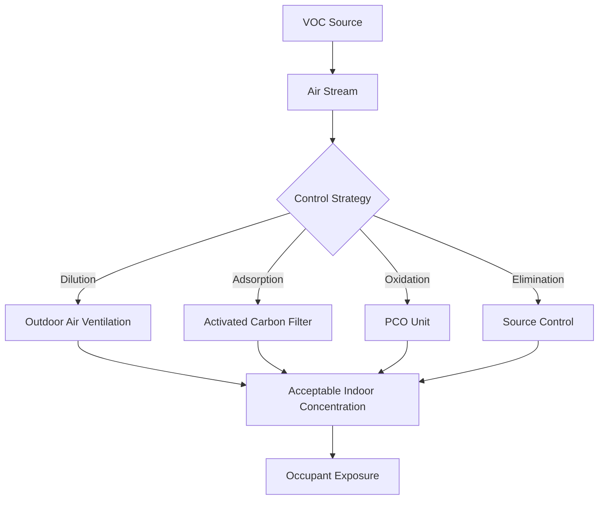

# VOC Control in HVAC Systems

Volatile organic compounds (VOCs) represent a diverse class of carbon-containing chemicals that vaporize at room temperature and pose significant indoor air quality challenges. Effective VOC control requires understanding the physical mechanisms of generation, transport, and removal within building environments.

## VOC Sources and Generation Rates

VOC emissions originate from building materials, furnishings, cleaning products, occupant activities, and outdoor air infiltration. Emission rates follow first-order decay kinetics for diffusion-controlled sources:

$$E(t) = E_0 \cdot e^{-kt}$$

Where:
- $E(t)$ = emission rate at time $t$ (mg/h)
- $E_0$ = initial emission rate (mg/h)
- $k$ = decay constant (h⁻¹)
- $t$ = time since installation (h)

Material-specific decay constants range from 0.001 to 0.1 h⁻¹, with higher values indicating faster emission decrease. Wet materials like paints and adhesives exhibit higher initial emissions with rapid decay, while dry materials show lower but more persistent emissions.

## Dilution Ventilation Fundamentals

Dilution ventilation removes VOCs through continuous replacement of contaminated indoor air with cleaner outdoor air. The steady-state indoor concentration follows mass balance principles:

$$C_{ss} = \frac{G}{Q \cdot \eta} + C_o$$

Where:
- $C_{ss}$ = steady-state indoor concentration (µg/m³)
- $G$ = total VOC generation rate (µg/h)
- $Q$ = outdoor air ventilation rate (m³/h)
- $\eta$ = ventilation effectiveness (dimensionless, 0.5-1.2)
- $C_o$ = outdoor VOC concentration (µg/m³)

ASHRAE Standard 62.1 prescribes minimum ventilation rates but does not explicitly address VOC-specific ventilation requirements. For spaces with elevated VOC sources, ventilation rates must be calculated based on target concentration levels and known emission rates.

## Activated Carbon Adsorption

Activated carbon removes VOCs through physical adsorption onto high surface area carbonaceous material. The adsorption capacity follows the Freundlich isotherm:

$$q_e = K_f \cdot C_e^{1/n}$$

Where:
- $q_e$ = equilibrium adsorption capacity (mg VOC/g carbon)
- $K_f$ = Freundlich constant (units vary)
- $C_e$ = equilibrium gas-phase concentration (mg/m³)
- $n$ = adsorption intensity (dimensionless, typically 1-10)

| Carbon Type | Surface Area (m²/g) | Typical Applications | Replacement Frequency |
|-------------|---------------------|----------------------|----------------------|
| Granular Activated Carbon (GAC) | 500-1500 | Gas-phase filters, large systems | 6-24 months |
| Impregnated Carbon | 800-1200 | Acid gases, formaldehyde | 12-18 months |
| Carbon Cloth | 1000-2000 | Compact filters, specialty applications | 3-12 months |
| Pelletized Carbon | 900-1400 | Deep bed filters, high flow rates | 12-36 months |

The breakthrough time determines filter service life:

$$t_b = \frac{\rho_b \cdot V \cdot q_e}{Q \cdot C_0}$$

Where:
- $t_b$ = breakthrough time (h)
- $\rho_b$ = bulk density of carbon bed (g/L)
- $V$ = carbon bed volume (L)
- $q_e$ = adsorption capacity (mg/g)
- $Q$ = airflow rate (L/h)
- $C_0$ = inlet VOC concentration (mg/L)

## Photocatalytic Oxidation

Photocatalytic oxidation (PCO) systems use ultraviolet light to activate titanium dioxide catalysts, generating hydroxyl radicals that oxidize VOCs to carbon dioxide and water. The oxidation rate follows Langmuir-Hinshelwood kinetics:

$$r = \frac{k \cdot K \cdot C}{1 + K \cdot C}$$

Where:
- $r$ = reaction rate (mg/m²·s)
- $k$ = reaction rate constant (mg/m²·s)
- $K$ = adsorption equilibrium constant (m³/mg)
- $C$ = VOC concentration (mg/m³)

PCO effectiveness depends on UV intensity, residence time, humidity, and catalyst surface area. Systems achieve 40-90% single-pass removal efficiency for common VOCs at face velocities below 2.5 m/s.

## Source Control Strategies

Source control eliminates or reduces VOC emissions at the point of generation, providing the most cost-effective long-term solution:

1. **Material Selection**: Specify low-emitting materials meeting California Section 01350 or CDPH Standard Method v1.2 criteria
2. **Pre-Occupancy Flush-Out**: Implement 72-hour minimum flush-out at 0.15 m³/s per m² floor area before occupancy
3. **Scheduling**: Conduct high-emission activities during unoccupied periods with elevated ventilation
4. **Isolation**: Separate emission sources in dedicated spaces with negative pressurization and dedicated exhaust

## Humidity Impact on VOC Control

Relative humidity significantly affects both VOC emissions and removal effectiveness. Water vapor competes for adsorption sites on activated carbon, reducing capacity for non-polar VOCs by 10-50% at humidity levels above 50% RH. Conversely, PCO systems require 30-60% RH for optimal hydroxyl radical generation.

The humidity-adjusted carbon capacity follows:

$$q_{e,humid} = q_{e,dry} \cdot (1 - \alpha \cdot RH)$$

Where $\alpha$ is the humidity sensitivity factor (0.002-0.01 per %RH) depending on carbon type and VOC polarity.

## Control System Integration

Effective VOC control integrates multiple strategies based on emission characteristics, occupancy patterns, and economic constraints. Demand-controlled ventilation using VOC sensors provides dynamic response to variable emission rates while minimizing energy consumption. ASHRAE Guideline 36 provides sequences of operation for integrated VOC control in automated building systems.

Sensor placement must account for emission source locations, airflow patterns, and mixing effectiveness to provide representative measurements for control algorithms. Multi-point averaging improves control stability compared to single-point sensing in large spaces.

## Performance Verification

VOC control system performance requires periodic verification through direct air sampling and analysis. ASTM D5197 specifies protocols for determining formaldehyde in indoor air, while EPA Method TO-15 addresses measurement of volatile organic compounds in air using canisters and gas chromatography-mass spectrometry.

Target indoor VOC levels depend on occupancy type and regulatory requirements, with typical limits ranging from 50 µg/m³ for total VOCs in sensitive environments to 500 µg/m³ in industrial settings.

