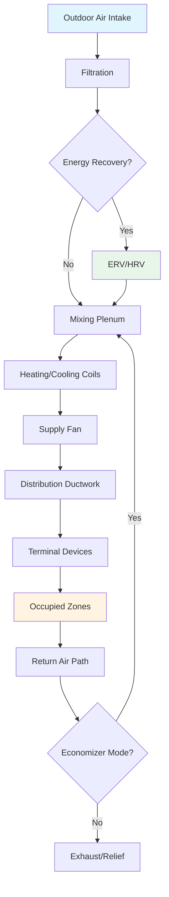

## Fundamental Principles

Ventilation systems provide outdoor air to occupied spaces to dilute and remove contaminants while maintaining acceptable indoor air quality. The primary functions include:

- **Contaminant Dilution**: Reducing concentrations of occupant-generated pollutants (CO₂, bioeffluents, VOCs)
- **Moisture Control**: Managing latent loads from occupants and processes
- **Odor Management**: Maintaining acceptable sensory conditions
- **Pressurization Control**: Preventing infiltration and managing airflow patterns between zones

The dilution principle follows mass balance:

$$C = \frac{G}{Q} + C_o \left(1 - e^{-Qt/V}\right)$$

Where:
- $C$ = indoor contaminant concentration (ppm or mg/m³)
- $G$ = contaminant generation rate (mass/time)
- $Q$ = outdoor air flow rate (volume/time)
- $C_o$ = outdoor contaminant concentration
- $V$ = space volume
- $t$ = time

At steady-state equilibrium:

$$C_{ss} = \frac{G}{Q} + C_o$$

This relationship demonstrates that doubling outdoor airflow reduces the steady-state concentration increment by half.

## Ventilation Rate Determination

ASHRAE Standard 62.1 establishes minimum ventilation rates using the Ventilation Rate Procedure (VRP):

$$V_{oz} = R_p \times P_z + R_a \times A_z$$

Where:
- $V_{oz}$ = outdoor air requirement for zone (cfm)
- $R_p$ = people outdoor air rate (cfm/person)
- $P_z$ = zone population
- $R_a$ = area outdoor air rate (cfm/ft²)
- $A_z$ = zone floor area (ft²)

For multiple-zone systems, the system outdoor air intake must account for the fraction of outdoor air in the supply:

$$V_{ot} = \frac{\sum_{all\ zones} V_{oz}}{E_v}$$

Where $E_v$ is the system ventilation efficiency, ranging from 0.6 to 1.0 depending on system configuration.

## Ventilation System Categories

### Mechanical Ventilation Systems

**Constant Volume Systems**
Supply fixed airflow rates regardless of load variations. Outdoor air is typically controlled by dampers maintaining minimum position or CO₂ concentration.

**Variable Air Volume (VAV) Systems**
Modulate supply airflow based on thermal load. Outdoor air control must compensate for varying supply rates:

$$\%OA_{min} = \frac{V_{ot}}{V_{supply}}$$

As supply airflow decreases during part-load, the outdoor air damper opens to maintain required ventilation rate.

**Dedicated Outdoor Air Systems (DOAS)**
Decouple ventilation from thermal conditioning. The DOAS handles 100% outdoor air, pre-conditioning it before delivery. Parallel terminal units manage sensible loads independently.

### Natural Ventilation

Utilizes driving forces from wind and temperature differences (stack effect). Effective opening area required:

$$A_{eff} = \frac{Q}{\sqrt{2 \times \frac{\Delta P}{\rho}}}$$

Where $\Delta P$ represents wind or buoyancy-driven pressure difference.

## Ventilation System Comparison

| System Type | Outdoor Air Control | Energy Recovery Potential | Application |
|-------------|-------------------|------------------------|-------------|
| Single-Zone CAV | Fixed damper position | Limited | Small buildings, constant occupancy |
| VAV with Reset | Airflow tracking or CO₂ | Moderate via economizer | Office buildings, variable loads |
| DOAS + Parallel | 100% dedicated | High via ERV/HRV | All climates, high ventilation needs |
| Natural Ventilation | Opening modulation | None (free cooling) | Mild climates, low sensible loads |
| Demand-Controlled | CO₂ or occupancy sensors | Variable | Assembly spaces, variable density |

## Air Change Rate Method

An alternative approach expresses ventilation as air changes per hour (ACH):

$$ACH = \frac{Q \times 60}{V}$$

Converting to outdoor air rate:

$$Q = \frac{ACH \times V}{60}$$

Typical requirements:
- **Residential**: 0.35 ACH minimum (ASHRAE 62.2)
- **Offices**: 4-6 ACH total, 15-20% outdoor air
- **Laboratories**: 6-12 ACH minimum, often 100% outdoor air
- **Healthcare isolation rooms**: 12 ACH with negative pressure

## Ventilation Effectiveness

Not all ventilation air equally reaches the breathing zone. Ventilation effectiveness ($E_v$) accounts for short-circuiting and stratification:

$$E_v = \frac{C_e - C_s}{C_r - C_s}$$

Where:
- $C_e$ = exhaust contaminant concentration
- $C_r$ = breathing zone concentration
- $C_s$ = supply air concentration

Perfect mixing yields $E_v$ = 1.0. Displacement ventilation can achieve $E_v$ > 1.0, while poor distribution results in $E_v$ < 1.0.

## Energy Considerations

Ventilation represents a significant energy load:

$$Q_{sensible} = 1.08 \times Q \times (T_o - T_s)$$

$$Q_{latent} = 4840 \times Q \times (W_o - W_s)$$

Where $Q$ is in cfm, temperatures in °F, and humidity ratios in lb_w/lb_da.

Annual ventilation energy in climates with heating and cooling seasons often exceeds 30% of total HVAC energy consumption. Energy recovery systems can reduce this by 50-80% depending on climate.

## Pressurization Strategy

Building pressure relationships control contaminant migration:

- **Positive Pressure**: Supply > exhaust, prevents infiltration
- **Negative Pressure**: Exhaust > supply, contains contaminants
- **Neutral Pressure**: Balanced flows, minimal driving force

Pressure differential typically ranges from 0.02 to 0.05 in. w.c. between zones requiring separation.

## System Integration

Modern ventilation systems integrate with:

- **Building automation**: Scheduling, reset strategies, demand control
- **Energy management**: Economizer cycles, heat recovery optimization
- **Indoor air quality monitoring**: CO₂, VOC, particulate sensors
- **Life safety**: Smoke control, emergency ventilation modes

## Design Best Practices

1. **Size outdoor air intakes** for peak ventilation requirements with adequate free area (face velocity < 500 fpm)
2. **Locate intakes** minimum 25 ft from exhaust outlets, loading docks, and other contamination sources
3. **Provide adequate mixing** between outdoor and return air (minimum 5 ft mixing section)
4. **Install airflow measurement** at outdoor air intakes for commissioning and verification
5. **Design for turndown** in VAV systems maintaining minimum ventilation at all supply rates
6. **Consider bypass** for energy recovery during mild conditions when outdoor air is suitable for free cooling
7. **Implement demand control** only where occupancy varies significantly and unpredictably

These principles establish the foundation for effective ventilation system design that balances indoor air quality requirements with energy efficiency across all operating conditions.
